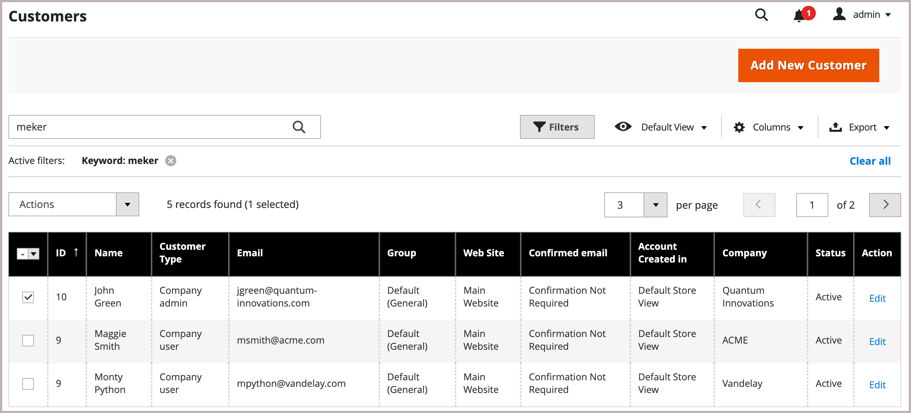
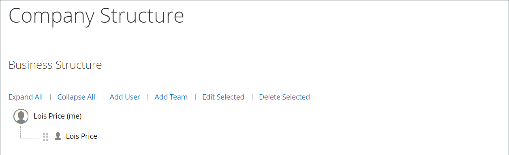

# 회사 계정

스토어에 B2B 회사 계정을 통합할 때, 회사에서 조직의 사용자 역할에 따라 유연한 권한으로 여러 하위 계정을 만들 수 있으므로 기업 쇼핑 경험을 단순화할 수 있습니다.

기업에 따라 매장 관리자는 판촉 행사 및 가격을 자신의 요구에 맞게 조정할 수 있으며, 쇼핑객의 요구에 맞는 고도로 맞춤화된 오퍼를 만들고 주문을 늘릴 수 있습니다.

표준 [개인](../customers/account-create.md)에 회사 계정 연결을 추가하면 고객은 회사에 대해 정의된 특정 구매 워크플로우를 사용할 수 있습니다.

회사 계정의 장점:

- 무제한 [회사 사용자](account-company-users.md)와 추가 계정 만들기를 제공하여 회사 구매를 간소화합니다.

- 주문 처리를 위해 [역할 및 권한이 다른 _smart_ 회사 계정 계층 구조에 대한 지원](account-company-roles-permissions.md)을 포함합니다.

- 결제 방법으로 [회사 스토어 크레딧](credit-company.md)을 제공하여 가맹점이 수입을 늘릴 수 있는 메커니즘을 제공합니다.

- 관리자가 모든 회사 계정의 [관리](account-company-manage.md)를 지원합니다.

## 회사 계정 보기

_회사_ 그리드는 상태 설정에 관계없이 모든 활성 회사 계정 및 보류 중인 요청을 나열합니다. 또한 [회사 계정을 생성](account-company-create.md) 및 [관리](account-company-manage.md)하는 데 사용할 수 있는 도구도 제공합니다. 표준 격자 컨트롤을 사용하여 목록을 필터링하고 열 레이아웃을 조정합니다. 열 설명 목록은 [회사 계정 관리](account-company-manage.md)의 _열 설명_ 섹션을 참조하십시오.

고객은 상점에서 회사 계정을 만들거나 상인은 관리에서 회사 계정을 만들 수 있습니다. 기본적으로 상점 첫 화면에서 회사 계정을 만들 수 있습니다. 구성에서 허용하는 경우 스토어 방문자는 회사 계정 열기를 요청할 수 있습니다. 회사 계정이 승인되면 회사 관리자는 회사 구조 및 사용자를 다양한 수준의 권한으로 설정할 수 있습니다.

_관리자_ 사이드바에서 **[!UICONTROL Customers]** > **[!UICONTROL Companies]**(으)로 이동합니다.

{width="700" zoomable="yes"}

[!UICONTROL Companies] 그리드는 상태와 관계없이 모든 회사를 나열합니다. 회사 목록은 회사가 [회사 계층](manage-company-hierarchy.md)과 연결되어 있는지 여부를 나타내며 회사, 회사 관리자 및 기타 정보에 대한 [자세한 정보](/help/b2b/account-company-manage.md#company-options-and-columns)를 제공합니다. [관리 눈금 컨트롤](../getting-started/admin-grid-controls.md)을(를) 사용하여 필터, 열 보기 옵션 등을 설정하여 보기를 사용자 지정합니다.

## 회사 관리자

다음 예제에서는 초기 회사 관리자 계정이 있는 _Customers_ 그리드를 보여 줍니다.

회사 관리자 계정이 있는 {width="700" zoomable="yes"}

각 회사에는 계정 이메일 주소와 관리자의 이름과 성으로 식별되는 단일 회사 관리자가 있습니다. 관리자는 다른 회사에 사용자로 할당될 수 있지만 한 회사에 대해서만 관리자가 될 수 있습니다.

계정을 만든 후 회사 관리자는 [팀](account-company-structure.md)의 회사 구조를 정의하고 [회사 사용자](account-company-users.md)를 설정하고 각각에 대해 [역할 및 권한](account-company-roles-permissions.md)을 설정합니다.

### 처음 로그인하기 전에 회사 관리자 암호 설정

1. 회사 관리자가 스토어에서 시작 이메일을 찾습니다.

   {width="500"}

   >[!NOTE]
   >
   >전자 메일 주소 대상 및 전자 메일의 내용은 [회사 전자 메일 옵션](email-company-configuration.md) 구성에 지정된 옵션에 따라 결정됩니다.

1. 지침에 따라 [!UICONTROL **링크**]&#x200B;를 클릭하여 암호를 설정합니다.

1. 계정에 대한 [!UICONTROL **새 암호**] 및 암호 확인을 입력합니다.

   암호에는 다음 문자 유형 중 최소 세 가지 이상이 포함되어야 합니다.

   - 소문자(abc...)
   - 대문자(ABC...)
   - 숫자(1234567890)
   - 특수 문자(!@#$...)

1. [!UICONTROL **새 암호 설정**]&#x200B;을 클릭합니다.

   {width="700" zoomable="yes"}

1. [!UICONTROL Customer Login] 페이지가 나타나면 고객이 [!UICONTROL **이메일**] 및 [!UICONTROL **암호**]&#x200B;를 입력합니다.

1. 계정 대시보드에 액세스하려면 [!UICONTROL **로그인**]&#x200B;을 클릭합니다.

   {width="700" zoomable="yes"}

## 회사 구조

비즈니스 구조를 반영하도록 회사 계정을 설정할 수 있습니다. 처음에는 회사 구조에 회사 관리자만 포함되지만 사용자 팀을 포함하도록 확장할 수 있습니다. 사용자는 팀과 연결되거나 회사 내 부서 및 하위 부서의 계층 구조로 구성될 수 있습니다. 이 구조는 회사 계정과 연결된 [구매 주문](purchase-order-flow.md)(PO)에 대한 [승인 규칙](account-dashboard-approval-rules.md)의 사용을 지원하도록 설계되었습니다.

{width="450"}

회사 관리자의 계정 대시보드에서 회사 구조는 트리로 표시되며 처음에는 회사 관리자로만 구성됩니다.

{width="600"}

계정이 만들어지면 회사 관리자는 회사 이메일 주소를 사용하거나 다른 이메일 주소를 할당할 수 있습니다.

다음 예에서는 초기 회사 구조에 회사 관리자와 회사 관리자 이름의 개별 사용자 계정이 포함됩니다. 그러나 회사 관리자 기능(예: 회사 구조 및 승인 규칙)은 회사 관리자로 지정된 사용자 계정에 로그인해야 사용할 수 있습니다.

{width="600"}
