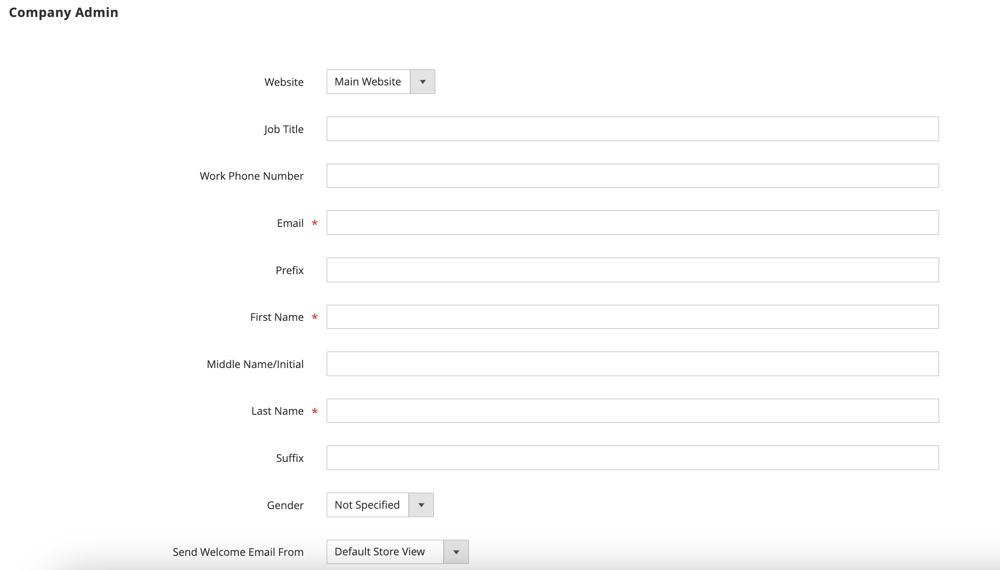

# 회사 관리자 할당

회사 관리자는 처음에 회사 계정이 처음 생성될 때 할당되며 관리자의 스토어 관리자만 수정할 수 있습니다.

- 각 회사에는 할당된 관리자가 한 명만 있을 수 있습니다.
- 회사 사용자는 한 회사의 관리자만 될 수 있습니다.
- 할당된 회사 관리자에 대한 변경 사항은 관리자의 스토어 관리자가 완료해야 합니다.

## 할당된 회사 관리자 변경

1. _관리자_ 사이드바에서 **[!UICONTROL Customers]** > **[!UICONTROL Companies]**(으)로 이동합니다.

   {width="700" zoomable="yes"}

1. 목록에서 회사를 찾은 다음 **[!UICONTROL Edit]**&#x200B;을(를) 클릭합니다.

1. **[!UICONTROL Company Admin]** 섹션에서 를 확장합니다.

   {width="700" zoomable="yes"}

1. 새 회사 관리자의 **[!UICONTROL Job Title]**&#x200B;을(를) 입력하십시오.

   이 작업을 수행하면 양식이 지워지고 필수 _[!UICONTROL First Name]_및_[!UICONTROL Last Name]_ 필드가 강조 표시됩니다.

1. 새 회사 관리자의 **[!UICONTROL Email]** 주소를 입력하십시오.

   데이터베이스에서 전자 메일 주소를 찾을 수 없으면 회사 관리자를 바꿀 것인지 확인하는 메시지가 표시됩니다.

   - 새 회사 관리자에 대한 사용자 계정이 없는 경우 `Company Admin` 유형의 계정이 만들어집니다.

   - 사용자 계정이 시스템에 있으면 회사 구조에서 회사 관리자 위치로 이동됩니다.

1. 새 회사 관리자에 적용할 수 있는 **[!UICONTROL First Name]**, **[!UICONTROL Last Name]** 및 기타 정보를 입력합니다.

1. 완료되면 **[!UICONTROL Save]**&#x200B;을(를) 클릭합니다.

   이전 회사 관리자의 개인 계정은 기본 사용자 역할에 할당된 활성 사용자 계정으로 시스템에 유지됩니다. 이 회사가 사용자 계정과 연결된 유일한 회사일 경우 계정 유형이 *[!UICONTROL Company user]*&#x200B;에서 *[!UICONTROL Individual user]*(으)로 변경됩니다.

   변경 사항에 대한 이메일 알림이 새 회사 관리자와 이전 회사 관리자에게 전송됩니다.

