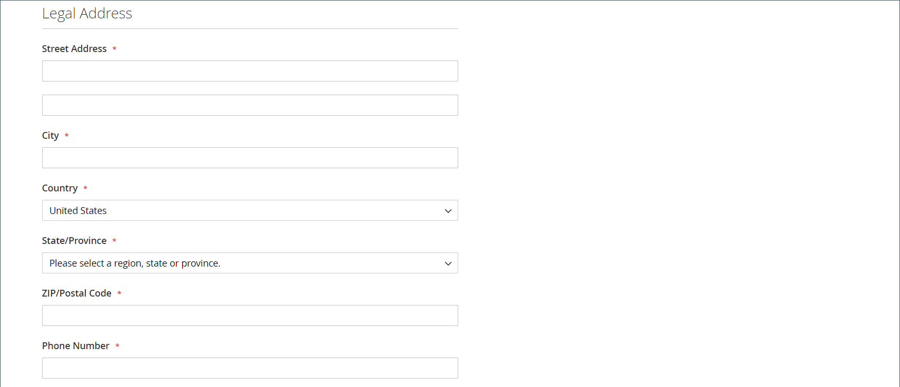
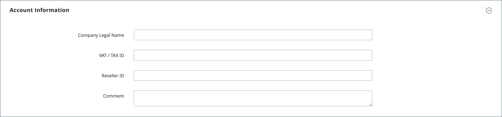
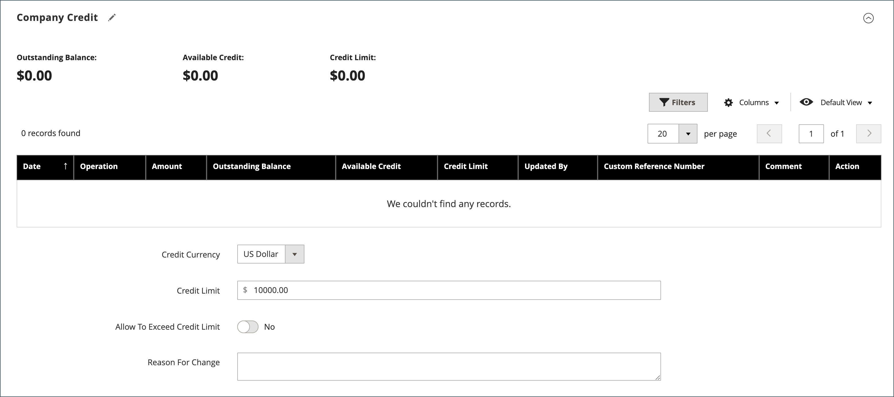

# 회사 계정 만들기

회사 계정은 고객이 상점 또는 관리자로부터 설정할 수 있습니다. 회사 계정을 만들기 위한 모든 요청은 계정이 활성화되기 전에 저장소 관리자의 승인을 받아야 합니다.

상점 첫 화면에서 회사 계정을 설정하는 사람에게 [회사 관리자](account-company-admin.md) 역할이 할당됩니다. 회사 계정 만들기 요청이 승인된 후 회사 관리자는 계정 암호를 설정하고 계정에 로그인할 수 있습니다.

## 방법 1: 고객이 상점 첫 화면에서 계정을 만듭니다.

>[!IMPORTANT]
>
>이 방법을 지원하려면(고객이 상점 앞에서 회사를 등록할 수 있도록 허용) [B2B 기능](enable-basic-features.md)이 사용하도록 설정되어 있는지 확인하십시오.

1. storefront 헤더의 오른쪽 상단 모서리에서 고객이 **[!UICONTROL Create an Account]**&#x200B;을(를) 클릭하고 **[!UICONTROL Create New Company Account]**&#x200B;을(를) 선택합니다.

   {width="700" zoomable="yes"}

   >[!NOTE]
   >
   >방문자가 등록된 사용자 계정에 로그인하면 _[!UICONTROL Customer Profile]_>**[!UICONTROL Company Structure]**>**[!UICONTROL Create a Company Account]**(으)로 이동하여 회사 계정을 만들 수 있습니다.

1. _[!UICONTROL Company Information]_섹션에서 고객은 다음을 수행합니다.

   - 필수 필드를 완료합니다.

      - **[!UICONTROL Company Name]**
      - **[!UICONTROL Company Email]**

   - 해당되는 경우 나머지 필드를 완료합니다.

      - **[!UICONTROL Company Legal Name]**
      - **[!UICONTROL VAT/TAX ID]**
      - **[!UICONTROL Reseller ID]**

   {width="700" zoomable="yes"}

1. 섹션의 필수 필드를 완료합니다 _[!UICONTROL Legal Address]_.

   - **[!UICONTROL Street Address]**
   - **[!UICONTROL City]**
   - **[!UICONTROL Country]**
   - **[!UICONTROL State/Province]**
   - **[!UICONTROL ZIP/Postal Code]**
   - **[!UICONTROL Phone Number]**

   {width="700" zoomable="yes"}

1. _[!UICONTROL Company Administrator]_섹션에서 다음을 수행합니다.

   - 회사 관리자의 **[!UICONTROL Email address]**&#x200B;을(를) 입력합니다.

     회사 관리자의 이메일 주소는 회사 이메일 주소와 동일하거나 다른 이메일 주소일 수 있습니다. 다른 이메일 주소를 입력하면 회사 관리자 계정 외에 회사 사용자 계정이 만들어집니다.

   - 회사 관리자의 **[!UICONTROL First Name]** 및 **[!UICONTROL Last Name]**&#x200B;을(를) 입력합니다.

   - 선택적으로 다음 필드를 완료합니다.

      - **[!UICONTROL Job Title]**
      - **[!UICONTROL Gender]**

   

1. 이 storefront 함수에 대해 reCAPTCHA가 활성화된 경우 유효성 검사를 완료합니다.

1. 정보가 완료되면 **[!UICONTROL Submit]**&#x200B;을(를) 선택합니다.

   판매자가 회사 계정 만들기 요청을 승인하면 회사 관리자에게 전자 메일 알림이 전송됩니다.

   {width="500"}

   암호 설정하면 회사 관리자가 계정 로그인할](../customers/customer-sign-in.md) 수 있습니다[.

## 방법 2: 판매자가 관리자로부터 계정 생성

관리자에서 회사를 만드는 프로세스는 기본적으로 상점에서 만드는 프로세스와 동일하지만 추가 필드가 있습니다.

{width="700" zoomable="yes"}

1. _관리자_ 사이드바에서 >**[!UICONTROL Companies]**&#x200B;로 이동합니다 **[!UICONTROL Customers]** .

1. **[!UICONTROL Add New Company]**&#x200B;을(를) 클릭하고 다음을 수행합니다.

   - 다음 필수 필드를 완료하십시오.

      - **[!UICONTROL Company Name]**
      - **[!UICONTROL Company Email]**

   - 계정을 활성화할 준비가 되지 않은 경우 **[!UICONTROL Status]**&#x200B;을(를) `Pending Approval`(으)로 설정하십시오. 기본적으로 `Active`(으)로 설정됩니다.

   - 해당하는 경우 계정을 관리할 **[!UICONTROL Sales Representative]**&#x200B;의 관리자 계정을 선택하십시오.

1. _[!UICONTROL Account Information]_섹션에서 다음을 수행합니다.

   - 해당되는 경우 다음 필드를 작성합니다.

      - **[!UICONTROL Company Legal Name]**
      - **[!UICONTROL VAT/TAX ID]**
      - **[!UICONTROL Reseller ID]**

   - **[!UICONTROL Comment]**&#x200B;의 경우 필요할 수 있는 고객에 대한 추가 정보를 입력하십시오.

     주석은 관리자만 볼 수 있습니다.

   {width="700" zoomable="yes"}

1. 초기 회사 생성 시 _[!UICONTROL Company Hierarchy]_그리드를 확장할 때 비어 있습니다. 회사를 저장한 후 회사 계층에 포함할 수 있습니다. [회사 관리](manage-companies.md)를 참조하세요.

1. _[!UICONTROL Legal Address]_섹션에서 다음 필수 필드를 작성합니다.

   - **[!UICONTROL Street Address]**
   - **[!UICONTROL City Country]**
   - **[!UICONTROL ZIP/Postal Code]**
   - **[!UICONTROL Phone Number]**

1. _[!UICONTROL Company Admin]_섹션에서 다음을 수행합니다.

   - 다음 필수 필드를 완료하십시오.

      - **[!UICONTROL Email]**
      - **[!UICONTROL First Name]**
      - **[!UICONTROL Last Name]**

   - 일부 고객 이름에 다른 고객보다 더 많이 적용할 수 있으며 재량에 따라 사용할 수 있는 이름의 다음 선택적 부분을 작성합니다.

      - **[!UICONTROL Prefix]**
      - **[!UICONTROL Middle Name/Initial]**
      - **[!UICONTROL Suffix]**

   - 정보를 사용할 수 있는 경우 회사 관리자를 설명하는 나머지 필드를 작성합니다.

      - **[!UICONTROL Website]**
      - **[!UICONTROL Job Title]**
      - **[!UICONTROL Gender]**
      - **[!UICONTROL Send Welcome Email From]**

   {width="700" zoomable="yes"}

1. 고객의 신용 활동에 대한 요약을 표시하는 _[!UICONTROL Company Credit]_섹션에서 섹션의 아래 부분에 있는 필드를 해당하는 수만큼 작성합니다.

   - **[!UICONTROL Credit Currency]**
   - **[!UICONTROL Credit Limit]**
   - **[!UICONTROL Allow to Exceed Credit Limit]**
   - **[!UICONTROL Reason for Change]**

   {width="700" zoomable="yes"}

1. _[!UICONTROL Advanced Settings]_섹션에서 다음을 수행합니다.

   >[!NOTE]
   >
   >고객 그룹 지정은 회사와 사원이 사용할 수 있는 공유 카탈로그를 결정합니다. 기본적으로 회사는 구성에서 기본값으로 설정된 고객 그룹에 할당됩니다.

   - 회사 및 해당 직원에 대한 **[!UICONTROL Customer Group]** 할당을 다른 공유 카탈로그에 액세스할 수 있는 그룹 또는 표준 고객 그룹으로 변경할 수 있습니다. 그룹을 변경하기 전에 확인하라는 메시지가 표시됩니다.

     {width="600"}

   - 회사 직원이 계정에서 견적을 생성하도록 허용하려면 **[!UICONTROL Allow Quotes]**&#x200B;을(를) `Yes`(으)로 설정하십시오.

   - 회사 직원이 해당 계정의 구매 주문을 만들고 사용할 수 있도록 하려면 **[!UICONTROL Enable Purchase Orders]**&#x200B;을(를) `Yes`(으)로 설정하십시오.

   - 회사에서 사용할 수 있는 **[!UICONTROL Applicable Payment Methods]**&#x200B;을(를) 변경하려면 **[!UICONTROL Use config settings]** 확인란의 선택을 취소하고 다음 중 하나를 선택하십시오.

     | 옵션 | 설명 |
     |-------------------------------|-----------------------------------------------------------------------------------------------------------------------------------------------------------------------------------------------------------------------------------------|
     | `B2B Payment Methods` | (기본값) B2B 주문에 대해 기본값으로 설정된 모든 [결제 방법](../configuration-reference/general/b2b-features.md#default-b2b-payment-methods)을 사용하도록 설정합니다. |
     | `All Enabled Payment Methods` | 회사 계정과 연결된 고객 계정에 대해 [활성화된 모든 결제 방법](../configuration-reference/sales/payment-methods.md)을 사용할 수 있도록 합니다. |
     | `Selected Payment Methods` | 회사 계정과 연계된 고객 계정에 사용할 수 있는 결제 방법을 선택할 수 있습니다. 여러 결제 방법을 선택하려면 Ctrl 키(PC) 또는 Command 키(Mac)를 누른 상태에서 각 옵션을 선택합니다. |

     {style="table-layout:auto"}

   - 회사에서 사용할 수 있는 **[!UICONTROL Applicable Shipping Methods]**&#x200B;을(를) 변경하려면 **[!UICONTROL Use config settings]** 확인란의 선택을 취소하고 다음 중 하나를 선택하십시오.

     | 옵션 | 설명 |
     |--------------------------------|----------------------------------------------------------------------------------------------------------------------------------------------------------------------------------------------------------------------------------------------------|
     | `B2B Shipping Methods` | (기본값) B2B 주문에 대해 기본값으로 설정된 모든 [배송 방법](../configuration-reference/general/b2b-features.md#default-b2b-shipping-methods)을 사용하도록 설정합니다. |
     | `All Enabled Shipping Methods` | 회사 계정과 연결된 고객 계정에 대해 [활성화된 모든 배송 방법](../configuration-reference/sales/delivery-methods.md)을 사용할 수 있도록 합니다. |
     | `Selected Shipping Methods` | 회사 계정과 연계된 고객 계정에 사용할 수 있는 배송 방법을 선택할 수 있습니다. 여러 배송 방법을 선택하려면 Ctrl 키(PC) 또는 Command 키(Mac)를 누른 상태에서 각 옵션을 선택합니다. |

     {style="table-layout:auto"}

1. 완료되면 **[!UICONTROL Save]**&#x200B;을(를) 선택합니다.

   판매자가 회사 계정 생성 요청을 승인하면 회사 관리자의 이메일 주소로 이메일 알림이 전송됩니다.

   암호 설정하면 회사 관리자가 계정 로그인할](../customers/customer-sign-in.md) 수 있습니다[.

## 버튼 막대

| 단추 | 설명 |
|---------------------------|------------------------------------------------------------------|
| [!UICONTROL Back] | 변경 사항을 저장하지 않고 회사 페이지로 돌아갑니다. |
| [!UICONTROL Reset] | 변경 내용이 저장되지 않은 모든 필드로 원래 값을 복원합니다. |
| [!UICONTROL Save] | 회사에 대한 변경 사항을 저장하고 프로필을 열어 둡니다. |
| [!UICONTROL Save & Close] | 회사에 대한 변경 사항을 저장하고 프로필을 닫습니다. |

{style="table-layout:auto"}

## 필드 설명

| 필드 | 설명 |
|-----------------------------------|---------------------------------------------------------------------------------------------------------------------------------------------------------------------------------------------------------------------------------------------------------------------------------------------------------------------------------------------------------------------------------------------------------------------------------------------------------------------------------------------------------------------------------------------------------------------------------------------------------------------------------------------------------------------------------------------------------------------------------------------------------------------------------------------------------------------------------------------------------------------------------------------------------------------------------|
| [!UICONTROL Company Name] | 회사 이름은 회사 계정을 처음 만들 때 입력되며, 전체 법적 이름의 약식 버전일 수 있습니다. |
| [!UICONTROL Status] | (관리자만) 회사 계정의 현재 상태를 나타냅니다. 옵션:  **[!UICONTROL Active]**- 스토어 관리자가 회사 계정을 승인했습니다. 회사 관리자 및 연결된 구성원은 상점에서 계정 로그인하여 구매할 수 있습니다. **[!UICONTROL Pending Approval]** - 회사 계정 개설 요청이 제출되었지만 아직 스토어 관리자가 승인하지 않았습니다.  **[!UICONTROL Rejected]**- 회사 계정 개설 요청이 제출되었지만 스토어 관리자가 승인하지 않았습니다. 요청을 제출하는 데 사용된 초기 로그인 자격 증명이 차단됩니다. **&#x200B;차단됨&#x200B;**- 회사 구성원은 로그인하여 카탈로그에 접근할 수 있지만 구매할 수 없습니다. 스토어 관리자가 양호한 상태가 아닌 회사 계정을 차단할 수 있습니다. 계정 차단은 스토어 관리자가 언제든지 제거할 수 있습니다. |
| [!UICONTROL Company Email] | 회사 계정과 연결된 이메일 계정. |
| [!UICONTROL Sales Representative] | (관리자만) 회사 계정의 기본 연락처인 관리 사용자. |

{style="table-layout:auto"}

### [!UICONTROL Account Information]

| 필드 | 설명 |
|---------------------------------|-----------------------------------------------------------------------------------------------------------------------------------------------------------------------------------------------------------------------------------------------------------------------------------------------------------------------------------------------------------------------------------------------------------------------------------------------------------------|
| [!UICONTROL Company Legal Name] | 회사의 전체 법적 이름. |
| [!UICONTROL VAT / TAX ID] | 세금 보고 목적으로 일부 관할 구역에서 회사에 할당된 [부가가치세](../stores-purchase/vat.md) 번호입니다. 상점 앞에 나타나도록 고객 VAT/세금 ID를 구성하려면 [새 계정 옵션 만들기](../configuration-reference/customers/customer-configuration.md)를 참조하십시오.   **_참고:_** 회사 관리자와 다른 회사 사용자는 고객 계정에 별도의 VAT/TAX ID 번호를 가지고 있지 않습니다. |
| [!UICONTROL Reseller ID] | 세금 보고 목적으로 회사에 지정된 재판매 번호. |
| [!UICONTROL Comment] | (관리자만) 회사 계정에 대한 이러한 참고는 참조용이며 관리자만 볼 수 있습니다. |

{style="table-layout:auto"}

### [!UICONTROL Company Hierarchy]

| 필드 | 설명 |
|-----------------------------------|------------------------------------------------------------------------------------------------------------------------------------------------------|
| [!UICONTROL Company ID] | 회사의 ID 번호입니다. |
| [!UICONTROL Company Name] | 회사의 전체 이름.  편집 중인 회사 라인에 A `current company indicator` 가 나타납니다. |
| [!UICONTROL Company Email] | 회사 계정과 연결된 이메일 계정. |
| [!UICONTROL Phone Number] | 회사의 기본 전화 번호입니다. |
| [!UICONTROL Country] | 사업을 수행하기 위해 회사가 등록된 국가입니다. |
| [!UICONTROL State/Province] | 사업을 수행하기 위해 회사가 등록된 주 또는 지방입니다. |
| [!UICONTROL City] | 비즈니스를 수행하기 위해 회사가 등록된 도시입니다. |
| [!UICONTROL Group/Shared Catalog] | (관리자만) 회사에 할당된 [고객 그룹](../customers/customer-groups.md) 또는 [공유 카탈로그](catalog-shared.md)를 나타냅니다. |
| [!UICONTROL Company Admin] | 회사 관리자의 전체 이름. |
| [!UICONTROL Action] | 해당 회사 라인에 대해 가능한 작업 목록입니다. |

{style="table-layout:auto"}

### [!UICONTROL Legal Address]

| 필드 | 설명 |
|------------------------------|-----------------------------------------------------------------------------|
| [!UICONTROL Street Address] | 회사가 사업을 하기 위해 등록한 거리 주소. |
| [!UICONTROL City] | 비즈니스를 수행하기 위해 회사가 등록된 도시입니다. |
| [!UICONTROL Country] | 회사를 등록하여 비즈니스를 수행하는 국가. |
| [!UICONTROL State/Province] | 회사가 등록되어 사업을 수행하는 주 또는 시/도입니다. |
| [!UICONTROL ZIP/Postal Code] | 회사가 등록되어 비즈니스를 수행하는 ZIP 또는 우편 번호입니다. |
| [!UICONTROL Phone Number] | 회사의 기본 전화번호. |

{style="table-layout:auto"}

### [!UICONTROL Company Admin]

| 필드 | 설명 |
|--------------------------------------|---------------------------------------------------------------------------------------------------------------------------------------------------------------------------------------------------------------------------------------------------|
| [!UICONTROL Website] | 회사 관리자가 속한 웹 사이트를 결정합니다. |
| [!UICONTROL Job Title] | 회사 계정을 관리하는 회사 관리자의 제목입니다. |
| [!UICONTROL Email] | 회사 관리자의 이메일 주소는 회사 이메일 주소와 같을 수 있습니다. 다른 이메일 주소를 입력하면 회사 계정 외에 회사 관리자의 개별 계정이 만들어집니다. |
| [!UICONTROL Prefix] | 해당하는 경우 회사 관리자의 이름과 연결된 접두사입니다(예: `Mr.`, `Ms.`, `Mrs.` 또는 `Dr.`). 구성에 따라 입력 필드는 텍스트 필드 또는 목록일 수 있습니다. |
| [!UICONTROL First Name] | 회사 관리자의 이름입니다. |
| [!UICONTROL Middle Name/Initial] | 회사 관리자의 중간 이름 또는 이니셜입니다. |
| [!UICONTROL Last Name] | 회사 관리자의 성. |
| [!UICONTROL Suffix] | 해당되는 경우 회사 관리자의 이름과 연결된 접미사(예: `Jr.`, `Sr.` 또는 `III.`)입니다. 구성에 따라 입력 필드는 텍스트 필드 또는 목록일 수 있습니다. |
| [!UICONTROL Gender] | 회사 관리자의 성별. 옵션: `Male` / `Female` / `Not Specified` |
| [!UICONTROL Send Welcome Email From] | 시작 이메일을 보낼 스토어 보기입니다. |

{style="table-layout:auto"}

### [!UICONTROL Company Credit]

| 밭 | 설명 |
|-------------------------------------------|-----------------------------------------------------------------------------------------------------------------------------------------------------------------------------------------|
| [!UICONTROL Credit Currency] | (관리자만) 회사 크레딧 구매에 대해 스토어에서 수락하는 통화입니다. |
| [!UICONTROL Credit Limit] | (관리자만) 회사 계정에 대한 크레딧 제한입니다. |
| [!UICONTROL Allow to Exceed Credit Limit] | (관리자만) 회사에 신용 한도를 초과할 권한이 있는지 여부를 나타냅니다. 옵션: `Yes` / `No` |
| [!UICONTROL Reason for Change] | (관리자만) 회사가 크레딧 제한을 초과할 수 없는 이유를 설명하는 참고 사항입니다. 이 필드는 크레딧 제한 초과 권한이 변경된 경우에만 활성화됩니다. |

{style="table-layout:auto"}

### [!UICONTROL Advanced Settings]

| 밭 | 설명 |
|------------------------------------------|--------------------------------------------------------------------------------------------------------------------------------------------------------------------------------------------------------------------------|
| [!UICONTROL Customer Group] | (관리자만) 회사에 할당된 [고객 그룹](../customers/customer-groups.md) 또는 [공유 카탈로그](catalog-shared.md)를 나타냅니다. |
| [!UICONTROL Allow Quotes] | (관리자만) 회사 구성원이 회사를 대신하여 협상 가능한 견적을 준비하고 제출할 수 있는지 여부를 결정합니다. |
| [!UICONTROL Enable Purchase Orders] | (관리자만) 회사 구성원이 회사를 대신하여 주문을 [구매 주문](account-dashboard-my-purchase-orders.md)(으)로 제출할 수 있는지 여부를 결정합니다. |
| 해당 결제 방법 | (관리자만) 회사 구매에 사용할 수 있는 결제 방법을 나타냅니다. 옵션: `B2B Payment Methods` / `All Enabled Payment Methods` / `Selected Payment Methods` |
| [!UICONTROL Payment Methods] | (관리자만) 특정 결제 방법이 활성화되면 활성화됩니다. 회사 계정에 여러 결제 방법을 사용할 수 있도록 하려면 Ctrl 키(PC) 또는 Command 키(Mac)를 누른 채 각 옵션을 선택합니다. |
| [!UICONTROL Applicable Shipping Methods] | (관리자만) 회사 구매에 사용할 수 있는 배송 방법을 나타냅니다. 옵션: `B2B Shipping Methods` / `All Enabled Shipping Methods` / `Selected Shipping Methods` |
| [!UICONTROL Shipping Methods] | (관리자만) 특정 배송 방법이 활성화된 경우 활성화됩니다. 회사 계정에서 여러 결제 수단을 사용할 수 있도록 하려면 Ctrl 키(PC) 또는 명령 키(Mac)를 누른 상태에서 각 옵션을 선택합니다. |

{style="table-layout:auto"}
