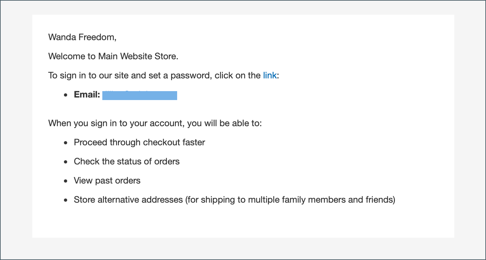

# 회사 계정 만들기

회사 계정은 고객이 상점 또는 관리자로부터 설정할 수 있습니다. 회사 계정을 만들기 위한 모든 요청은 계정이 활성화되기 전에 저장소 관리자의 승인을 받아야 합니다.

상점 첫 화면에서 회사 계정을 설정하는 사람에게 다음으로 역할이 할당됩니다. [회사 관리자](account-company-admin.md). 회사 계정 만들기 요청이 승인된 후 회사 관리자는 계정 암호를 설정하고 계정에 로그인할 수 있습니다.

## 방법 1: 고객이 상점 첫 화면에서 계정을 만듭니다.

>[!IMPORTANT]
>
>이 방법을 지원하려면(고객이 상점에서 회사를 등록할 수 있도록 허용) [B2B 기능](enable-basic-features.md) 이(가) **[!UICONTROL Allow Company Registration from the Storefront]** 이(가) (으)로 설정됨 `Yes`.

1. 상점 헤더의 오른쪽 상단 모서리에서 고객이 클릭합니다 **[!UICONTROL Create an Account]** 및 선택 **[!UICONTROL Create New Company Account]**.

   {width="700" zoomable="yes"}

   >[!NOTE]
   >
   >방문자가 등록된 사용자 계정에 로그인되어 있는 경우 로 이동하여 회사 계정을 만들 수 있습니다. _[!UICONTROL Customer Profile]_>**[!UICONTROL Company Structure]**>**[!UICONTROL Create a Company Account]**. 회사 계정이 생성되면 고객의 계정이 기본 연락처로 할당됩니다. 그렇지 않으면 고객이 비밀번호를 설정할 이메일을 수신하게 됩니다.

1. 다음에서 _[!UICONTROL Company Information]_섹션에서 고객은 다음을 수행합니다.

   - 필수 필드를 완료합니다.

      - **[!UICONTROL Company Name]**
      - **[!UICONTROL Company Email]**

   - 해당되는 경우 나머지 필드를 완료합니다.

      - **[!UICONTROL Company Legal Name]**
      - **[!UICONTROL VAT/TAX ID]**
      - **[!UICONTROL Re-seller ID]**

   {width="700" zoomable="yes"}

1. 의 필수 필드를 완료합니다. _[!UICONTROL Legal Address]_섹션.

   - **[!UICONTROL Street Address]**
   - **[!UICONTROL City]**
   - **[!UICONTROL Country]**
   - **[!UICONTROL State/Province]**
   - **[!UICONTROL ZIP/Postal Code]**
   - **[!UICONTROL Phone Number]**

   {width="700" zoomable="yes"}

1. 다음에서 _[!UICONTROL Company Administrator]_섹션에서 다음을 수행합니다.

   - 다음을 입력합니다. **[!UICONTROL Email address]** 회사 관리자용입니다.

     회사 관리자의 이메일 주소는 회사 이메일 주소와 동일하거나 다른 이메일 주소일 수 있습니다. 다른 이메일 주소를 입력하면 회사 관리자 계정 외에 회사 사용자 계정이 만들어집니다.

   - 다음을 입력합니다. **[!UICONTROL First Name]** 및 **[!UICONTROL Last Name]** 회사 관리자의 경우입니다.

   - 선택적으로 다음 필드를 완료합니다.

      - **[!UICONTROL Job Title]**
      - **[!UICONTROL Gender]**

   

1. 이 storefront 함수에 대해 reCAPTCHA가 활성화된 경우 유효성 검사를 완료합니다.

1. 정보가 완료되면 클릭 수 **[!UICONTROL Submit]**.

   판매자가 회사 계정 만들기 요청을 승인하면 회사 관리자에게 전자 메일 알림이 전송됩니다.

   {width="500"}

   암호를 설정하면 회사 관리자가 다음을 수행할 수 있습니다. [로그인](../customers/customer-sign-in.md) 계정에 연결합니다.

## 방법 2: 판매자가 관리자에서 계정을 만듭니다.

관리자로부터 회사를 만드는 프로세스는 기본적으로 상점 첫 방문과 동일하지만 추가 필드가 있습니다.

{width="700" zoomable="yes"}

1. 다음에서 _관리자_ 사이드바, 이동 **[!UICONTROL Customers]** > **[!UICONTROL Companies]**.

1. 클릭 **[!UICONTROL Add New Company]** 다음을 수행합니다.

   - 다음 필수 필드를 완료하십시오.

      - **[!UICONTROL Company Name]**
      - **[!UICONTROL Company Email]**

   - 계정을 활성화할 준비가 되지 않았다면 다음을 설정하십시오. **[!UICONTROL Status]** 끝 `Pending Approval`. (다음으로 설정) `Active` 기본적으로 입니다.)

   - 해당하는 경우 의 관리자 계정을 선택합니다. **[!UICONTROL Sales Representative]** 계정 관리 담당자입니다.

1. 다음에서 _[!UICONTROL Account Information]_섹션에서 다음을 수행합니다.

   - 해당되는 경우 다음 필드를 작성합니다.

      - **[!UICONTROL Company Legal Name]**
      - **[!UICONTROL VAT/TAX ID]**
      - **[!UICONTROL Reseller ID]**

   - 대상 **[!UICONTROL Comment]**&#x200B;필요한 고객에 대한 추가 정보를 입력합니다.

     주석은 관리자만 볼 수 있습니다.

   {width="700" zoomable="yes"}

1. 초기 회사 생성 시 _[!UICONTROL Company Hierarchy]_그리드를 확장할 때 그리드가 비어 있습니다. 회사를 저장한 후 회사 계층에 포함할 수 있습니다. 다음을 참조하십시오 [회사 관리](manage-companies.md).

1. 다음에서 _[!UICONTROL Legal Address]_섹션에서 다음 필수 필드를 작성합니다.

   - **[!UICONTROL Street Address]**
   - **[!UICONTROL City Country]**
   - **[!UICONTROL ZIP/Postal Code]**
   - **[!UICONTROL Phone Number]**

1. 다음에서 _[!UICONTROL Company Admin]_섹션에서 다음을 수행합니다.

   - 다음 필수 필드를 완료하십시오.

      - **[!UICONTROL Email]**
      - **[!UICONTROL First Name]**
      - **[!UICONTROL Last Name]**

   - 일부 고객 이름에 다른 고객보다 더 많이 적용할 수 있으며 재량에 따라 사용할 수 있는 이름의 다음 선택적 부분을 작성합니다.

      - **[!UICONTROL Prefix]**
      - **[!UICONTROL Middle Name/Initial]**
      - **[!UICONTROL Suffix]**

   - 정보를 사용할 수 있는 경우 회사 관리자를 설명하는 나머지 필드를 작성합니다.

      - **[!UICONTROL Website]**
      - **[!UICONTROL Job Title]**
      - **[!UICONTROL Gender]**
      - **[!UICONTROL Send Welcome Email From]**

   {width="700" zoomable="yes"}

1. 다음에서 _[!UICONTROL Company Credit]_섹션에 고객의 신용 활동 요약이 표시되며, 해당될 경우 섹션 하단에 있는 여러 필드를 작성합니다.

   - **[!UICONTROL Credit Currency]**
   - **[!UICONTROL Credit Limit]**
   - **[!UICONTROL Allow to Exceed Credit Limit]**
   - **[!UICONTROL Reason for Change]**

   {width="700" zoomable="yes"}

1. 다음에서 _[!UICONTROL Advanced Settings]_섹션에서 다음을 수행합니다.

   >[!NOTE]
   >
   >고객 그룹 지정은 회사와 사원이 사용할 수 있는 공유 카탈로그를 결정합니다. 기본적으로 회사는 구성에서 기본값으로 설정된 고객 그룹에 할당됩니다.

   - 다음을 변경할 수 있습니다. **[!UICONTROL Customer Group]** 다른 공유 카탈로그 또는 표준 고객 그룹에 액세스할 수 있는 그룹에 회사 및 해당 직원을 지정합니다. 그룹을 변경하기 전에 확인하라는 메시지가 표시됩니다.

     {width="600"}

   - 회사 직원이 해당 계정에서 견적을 생성하도록 허용하려면 다음을 설정합니다. **[!UICONTROL Allow Quotes]** 끝 `Yes`.

   - 회사 직원이 자신의 계정에서 구매 발주를 만들고 사용할 수 있도록 하려면 다음을 설정합니다. **[!UICONTROL Enable Purchase Orders]** 끝 `Yes`.

   - 을(를) 변경하려면 **[!UICONTROL Applicable Payment Methods]** 회사에서 사용할 수 있는 경우 **[!UICONTROL Use config settings]** 확인란을 선택하고 다음 중 하나를 선택합니다.

     | 옵션 | 설명 |
     | ------ | ----------- |
     | `B2B Payment Methods` | (기본값) 모두 사용 [기본값으로 설정된 결제 방법](../configuration-reference/general/b2b-features.md#default-b2b-payment-methods) B2B 주문의 경우. |
     | `All Enabled Payment Methods` | 모두 만들기 [활성화된 결제 방법](../configuration-reference/sales/payment-methods.md) 회사 계정과 연결된 고객 계정에서 사용할 수 있습니다. |
     | `Selected Payment Methods` | 회사 계정과 연계된 고객 계정에 사용할 수 있는 결제 방법을 선택할 수 있습니다. 여러 결제 방법을 선택하려면 Ctrl 키(PC) 또는 Command 키(Mac)를 누른 상태에서 각 옵션을 클릭합니다. |

     {style="table-layout:auto"}

   - 을(를) 변경하려면 **[!UICONTROL Applicable Shipping Methods]** 회사에서 사용할 수 있는 경우 **[!UICONTROL Use config settings]** 확인란을 선택하고 다음 중 하나를 선택합니다.

     | 옵션 | 설명 |
     | ------ | ----------- |
     | `B2B Shipping Methods` | (기본값) 모두 사용 [기본값으로 설정된 배송 방법](../configuration-reference/general/b2b-features.md#default-b2b-shipping-methods) B2B 주문의 경우. |
     | `All Enabled Shipping Methods` | 모두 만들기 [사용 가능한 배송 방법](../configuration-reference/sales/delivery-methods.md) 회사 계정과 연결된 고객 계정에서 사용할 수 있습니다. |
     | `Selected Shipping Methods` | 회사 계정과 연계된 고객 계정에 사용할 수 있는 배송 방법을 선택할 수 있습니다. 여러 배송 방법을 선택하려면 Ctrl 키(PC) 또는 Command 키(Mac)를 누른 상태에서 각 옵션을 클릭합니다. |

     {style="table-layout:auto"}

1. 완료되면 다음을 클릭하십시오. **[!UICONTROL Save]**.

   판매자가 회사 계정 생성 요청을 승인하면 회사 관리자의 이메일 주소로 이메일 알림이 전송됩니다.

   암호를 설정하면 회사 관리자가 다음을 수행할 수 있습니다. [로그인](../customers/customer-sign-in.md) 계정에 연결합니다.

## 단추 막대

| 단추 | 설명 |
|------- | ----------- |
| [!UICONTROL Back] | 변경 사항을 저장하지 않고 회사 페이지로 돌아갑니다. |
| [!UICONTROL Reset] | 변경 내용이 저장되지 않은 모든 필드로 원래 값을 복원합니다. |
| [!UICONTROL Save] | 회사에 대한 변경 사항을 저장하고 프로필을 열어 둡니다. |
| [!UICONTROL Save & Close] | 회사에 대한 변경 사항을 저장하고 프로필을 닫습니다. |

{style="table-layout:auto"}

## 필드 설명

| 필드 | 설명 |
|--- |--- |
| [!UICONTROL Company Name] | 회사 이름은 회사 계정을 처음 만들 때 입력되며, 전체 법적 이름의 약식 버전일 수 있습니다. |
| [!UICONTROL Status] | (관리자만) 회사 계정의 현재 상태를 나타냅니다. 옵션:  **[!UICONTROL Active]**- 스토어 관리자가 회사 계정을 승인합니다. 회사 관리자 및 관련 회원은 상점에서 계정에 로그인하여 구매할 수 있습니다. **[!UICONTROL Pending Approval]** - 회사 계정 열기 요청이 제출되었지만 아직 스토어 관리자의 승인을 받지 못했습니다.  **[!UICONTROL Rejected]**- 회사 계정 열기 요청이 제출되었지만 스토어 관리자가 승인하지 않았습니다. 요청을 제출하는 데 사용된 초기 로그인 자격 증명이 차단됩니다. **&#x200B;차단됨&#x200B;**- 회사 구성원은 로그인하여 카탈로그에 액세스할 수 있지만 구입할 수 없습니다. 스토어 관리자가 상태가 좋지 않은 회사 계정을 차단할 수 있습니다. 계정의 블록은 언제든지 저장소 관리자가 제거할 수 있습니다. |
| [!UICONTROL Company Email] | 회사 계정과 연결된 이메일 주소. |
| [!UICONTROL Sales Representative] | (관리자만) 회사 계정의 기본 연락처인 관리자 사용자입니다. |

{style="table-layout:auto"}

### [!UICONTROL Account Information]

| 필드 | 설명 |
|--- |--- |
| [!UICONTROL Company Legal Name] | 회사의 전체 법적 이름. |
| [!UICONTROL VAT / TAX ID] | 다음 [부가 가치세](../stores-purchase/vat.md) 세금 보고 목적으로 일부 관할권에서 회사에 할당한 번호. 고객 VAT/세금 ID가 상점 앞에 표시되도록 구성하려면 을 참조하십시오. [새 계정 만들기 옵션](../configuration-reference/customers/customer-configuration.md).   **_참고:_** 회사 관리자와 다른 회사 사용자는 고객 계정에 별도의 VAT/TAX ID 번호를 가지고 있지 않습니다. |
| [!UICONTROL Reseller ID] | 세금 보고 목적으로 회사에 지정된 재판매 번호. |
| [!UICONTROL Comment] | (관리자만) 회사 계정에 대한 이러한 참고는 참조용이며 관리자만 볼 수 있습니다. |

{style="table-layout:auto"}

### [!UICONTROL Company Hierarchy]

| 필드 | 설명 |
|--- |--- |
| [!UICONTROL Company ID] | 회사의 ID 번호입니다. |
| [!UICONTROL Company Name] | 회사의 전체 이름.  A `current company indicator` 편집 중인 회사 줄에 나타납니다. |
| [!UICONTROL Company Email] | 회사 계정과 연결된 이메일 주소. |
| [!UICONTROL Phone Number] | 회사의 기본 전화번호. |
| [!UICONTROL State/Province] | 회사가 등록되어 사업을 수행하는 주 또는 시/도입니다. |
| [!UICONTROL City] | 비즈니스를 수행하기 위해 회사가 등록된 도시입니다. |
| [!UICONTROL Customer Group] | (관리자만) 다음을 나타냅니다. [고객 그룹](../customers/customer-groups.md) 또는 [공유된 카탈로그](catalog-shared.md) 회사에 할당되었습니다. |
| [!UICONTROL Company Admin] | 회사 관리자의 전체 이름. |
| [!UICONTROL Action] | 해당 회사 라인에 대해 가능한 작업 목록입니다. |

{style="table-layout:auto"}

### [!UICONTROL Legal Address]

| 필드 | 설명 |
|--- |--- |
| [!UICONTROL Street Address] | 회사가 사업을 하기 위해 등록한 거리 주소. |
| [!UICONTROL City] | 비즈니스를 수행하기 위해 회사가 등록된 도시입니다. |
| [!UICONTROL Country] | 회사를 등록하여 비즈니스를 수행하는 국가. |
| [!UICONTROL State/Province] | 회사가 등록되어 사업을 수행하는 주 또는 시/도입니다. |
| [!UICONTROL ZIP/Postal Code] | 회사가 등록되어 비즈니스를 수행하는 ZIP 또는 우편 번호입니다. |
| [!UICONTROL Phone Number] | 회사의 기본 전화번호. |

{style="table-layout:auto"}

### [!UICONTROL Company Admin]

| 필드 | 설명 |
|--- |--- |
| [!UICONTROL Website] | 회사 관리자가 속한 웹 사이트를 결정합니다. |
| [!UICONTROL Job Title] | 회사 계정을 관리하는 회사 관리자의 제목입니다. |
| [!UICONTROL Email] | 회사 관리자의 이메일 주소는 회사 이메일 주소와 같을 수 있습니다. 다른 이메일 주소를 입력하면 회사 계정 외에 회사 관리자의 개별 계정이 만들어집니다. |
| [!UICONTROL Prefix] | 해당하는 경우 회사 관리자의 이름과 연결된 접두사(예: `Mr.`, `Ms.`, `Mrs.`, 또는 `Dr.`). 구성에 따라 입력 필드는 텍스트 필드 또는 목록일 수 있습니다. |
| [!UICONTROL First Name] | 회사 관리자의 이름입니다. |
| [!UICONTROL Middle Name/Initial] | 회사 관리자의 중간 이름 또는 이니셜입니다. |
| [!UICONTROL Last Name] | 회사 관리자의 성. |
| [!UICONTROL Suffix] | 해당되는 경우 회사 관리자의 이름과 연결된 접미사(예: `Jr.`, `Sr.`, 또는 `III.`). 구성에 따라 입력 필드는 텍스트 필드 또는 목록일 수 있습니다. |
| [!UICONTROL Gender] | 회사 관리자의 성별. 옵션: `Male` / `Female` / `Not Specified` |
| [!UICONTROL Send Welcome Email From] | 시작 이메일을 전송할 스토어 보기. |

{style="table-layout:auto"}

### [!UICONTROL Company Credit]

| 필드 | 설명 |
|--- |--- |
| [!UICONTROL Credit Currency] | (관리자만) 회사 크레딧 구매에 대해 스토어에서 수락하는 통화입니다. |
| [!UICONTROL Credit Limit] | (관리자만) 회사 계정에 대한 크레딧 제한입니다. |
| [!UICONTROL Allow to Exceed Credit Limit] | (관리자만) 회사에 신용 한도를 초과할 권한이 있는지 여부를 나타냅니다. 옵션: `Yes` / `No` |
| [!UICONTROL Reason for Change] | (관리자만) 회사가 크레딧 제한을 초과할 수 없는 이유를 설명하는 참고 사항입니다. 이 필드는 크레딧 제한 초과 권한이 변경된 경우에만 활성화됩니다. |

{style="table-layout:auto"}

### [!UICONTROL Advanced Settings]

| 필드 | 설명 |
|--- |--- |
| [!UICONTROL Customer Group] | (관리자만) 다음을 나타냅니다. [고객 그룹](../customers/customer-groups.md) 또는 [공유된 카탈로그](catalog-shared.md) 회사에 할당되었습니다. |
| [!UICONTROL Allow Quotes] | (관리자만) 회사 구성원이 회사를 대신하여 협상 가능한 견적을 준비하고 제출할 수 있는지 여부를 결정합니다. |
| [!UICONTROL Enable Purchase Orders] | (관리자만) 회사 구성원이 주문을 다음과 같이 제출할 수 있는지 여부를 결정합니다. [구매 주문](account-dashboard-my-purchase-orders.md) 회사를 대표해. |
| 해당 결제 방법 | (관리자만) 회사 구매에 사용할 수 있는 결제 방법을 나타냅니다. 옵션: `B2B Payment Methods` / `All Enabled Payment Methods` / `Selected Payment Methods` |
| [!UICONTROL Payment Methods] | (관리자만) 특정 결제 방법이 활성화되면 활성화됩니다. 회사 계정에 여러 결제 방법을 사용할 수 있도록 하려면 Ctrl 키(PC) 또는 Command 키(Mac)를 누른 채 각 옵션을 클릭합니다. |
| [!UICONTROL Applicable Shipping Methods] | (관리자만) 회사 구매에 사용할 수 있는 배송 방법을 나타냅니다. 옵션: `B2B Shipping Methods` / `All Enabled Shipping Methods` / `Selected Shipping Methods` |
| [!UICONTROL Shipping Methods] | (관리자만) 특정 배송 방법이 활성화되면 활성화됩니다. 회사 계정에 여러 결제 방법을 사용할 수 있도록 하려면 Ctrl 키(PC) 또는 Command 키(Mac)를 누른 채 각 옵션을 클릭합니다. |

{style="table-layout:auto"}
