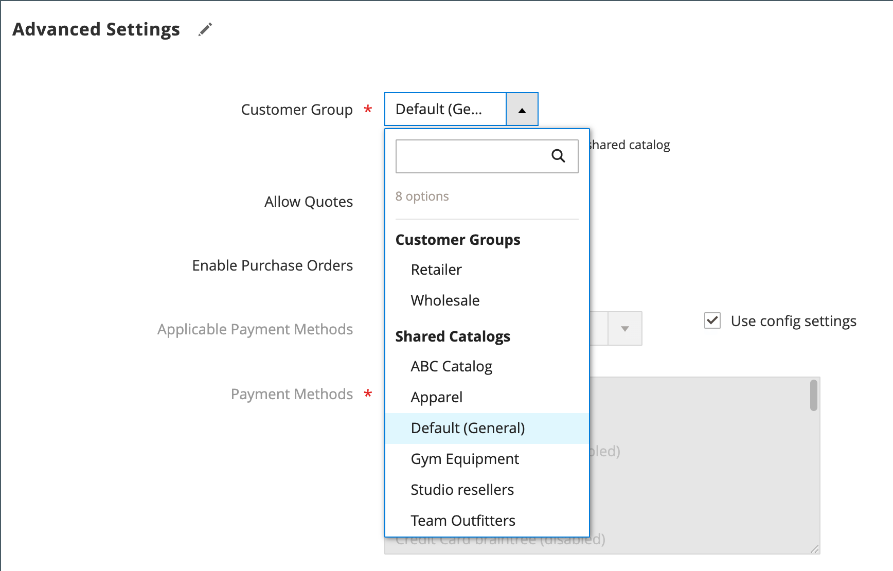

# 회사에 고객 그룹 할당

회사에 고객 그룹을 지정하는 것은 기본적으로 공유 카탈로그를 지정하는 것과 같습니다. 공유 카탈로그가 구성에서 [활성화되지 않은 경우](enable-basic-features.md)에는 공유 카탈로그가 아닌 고객 그룹이 회사에 할당됩니다.

- 한 번에 하나의 고객 그룹 또는 공유 카탈로그만 회사에 할당할 수 있습니다. 공유 카탈로그와 연결된 고객 그룹은 삭제할 수 없습니다.
- 회사에 할당된 고객 그룹을 변경하면 모든 회사 구성원의 프로필이 업데이트됩니다.
- 고객 그룹 할당이 공유 카탈로그에서 일반 고객 그룹으로 변경되면 회사 구성원은 공유 카탈로그에 액세스할 수 없게 되고 기본 카탈로그는 상점 전면에서 사용할 수 있게 됩니다.
- 회사 그룹을 변경한 후, 회사 사용자는 로그아웃하고 Storefront에 로그인하여 카탈로그에서 새로운 가격을 확인해야 합니다.

## 고객 그룹 변경

1. _관리자_ 사이드바에서 **[!UICONTROL Customers]** > **[!UICONTROL Companies]**(으)로 이동합니다.

1. 그리드에서 회사를 찾은 다음 _[!UICONTROL Action]_열에서&#x200B;**[!UICONTROL Edit]**을(를) 클릭합니다.

   {width="700" zoomable="yes"}

1. 회사 페이지에서 아래로 스크롤하여 **[!UICONTROL Advanced Settings]** 섹션에서 를 확장합니다.

1. 적절한 **[!UICONTROL Customer Group]**&#x200B;을(를) 설정합니다.

   구성에서 공유 카탈로그를 사용하지 않도록 설정한 경우에도 [!UICONTROL Customer Group] 목록에 기존의 모든 공유 카탈로그가 포함됩니다.

   {width="600"}

1. 확인 메시지가 표시되면 **[!UICONTROL Proceed]**&#x200B;을(를) 클릭합니다.

1. **[!UICONTROL Save]**&#x200B;을(를) 클릭합니다.
