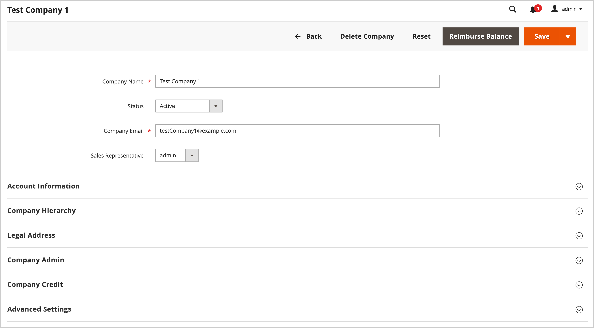

# 회사 계정 관리

다음 _[!UICONTROL Companies]_페이지에는 상태에 관계없이 모든 현재 회사 계정이 나열됩니다. 승인 보류 중인 요청이 목록 맨 위에 표시됩니다. 표준 [작업 공간 제어](../getting-started/admin-workspace.md) 목록을 필터링하는 데 사용할 수 있습니다. [열 레이아웃](../getting-started/admin-grid-controls.md), 보기를 저장하거나 데이터를 내보냅니다.

다음 _[!UICONTROL Actions]_그리드 위의 컨트롤을 사용하여 여러 회사 레코드에 작업을 적용할 수 있습니다. 예를 들어 각 개별 회사 요청을 승인하는 대신 여러 요청을 선택하고 한 번의 작업으로 계정을 활성화할 수 있습니다. 사용할 수 있는 작업은 다음에 따라 다릅니다. [권한](../systems/permissions.md) 관리자 계정에 할당된 역할의 경우.

사용 _[!UICONTROL Search]_에서 회사를 찾는 기능&#x200B;**회사**키워드별 그리드입니다. 검색 색인에서 키워드 검색&#x200B;**회사 이름**및&#x200B;**상위**열. 다음을 기준으로 필터링할 수 있습니다.**회사 유형**단일 기업만 표시하거나 모기업만 표시하거나 하위 기업만 표시합니다.

{width="700" zoomable="yes"}

## 회사 역할 리소스

다음 [역할 리소스](../systems/permissions-user-roles.md#role-resources) 설정은 다음과 같은 기능을 결정합니다.

- 회사 추가
- 회사 삭제
- 정산 환급 적용
- 회사 보기

이러한 역할 리소스는 다음에 대해 설정되어야 합니다. [사용자 역할](../systems/permissions-user-roles.md) 관리자 사용자 계정에 할당됩니다.

## 작업 적용

다음 작업은 단일 또는 여러 레코드에 적용할 수 있습니다.

1. 다음에서 _관리자_ 사이드바, 이동 **[!UICONTROL Customers]** > **[!UICONTROL Companies]**.

1. 그리드의 첫 번째 열에서 업데이트할 각 레코드의 확인란을 선택하고 적용할 작업에 대한 지침을 따릅니다.

### 회사 계정 활성화

1. 다음에서 **[!UICONTROL Actions]** 컨트롤, 선택 **[!UICONTROL Set Active]**.

1. 확인을 묻는 메시지가 나타나면 **[!UICONTROL OK]**.

### 활성/비활성 설정

비활성 계정이 있는 고객은 자신의 계정에서 로그인하거나 구매할 수 없습니다. 고객 계정을 활성 또는 비활성으로 설정하는 두 가지 방법이 있습니다.

방법 1: **고객 그리드에서**

1. 다음에서 _관리자_ 사이드바, 이동 [!UICONTROL **고객**] > [!UICONTROL **모든 고객**].

1. 다음에서 **[!UICONTROL Actions]** 메뉴에서 다음 중 하나를 선택합니다.

   - **[!UICONTROL Active]**
   - **[!UICONTROL Inactive]**

1. 메시지가 표시되면 다음을 선택합니다 **[!UICONTROL OK]** 을 눌러 변경 사항을 적용합니다.

방법 2: **계정 편집 페이지에서**

1. 다음에서 _관리자_ 사이드바, 이동 [!UICONTROL **고객**] > [!UICONTROL **모든 고객**].

1. 표에서 편집할 고객 레코드를 찾습니다.

1. 다음에서 _작업_ 맨 오른쪽에 있는 열에서 [!UICONTROL **편집**].

1. 다음 항목 선택 [!UICONTROL **계정 정보**] 탭.

1. 설정 [!UICONTROL **고객 활성**] 끝 `Yes` 또는 `No`.

1. 클릭 [!UICONTROL **고객 저장**].

### 회사 계정 차단

차단된 회사 계정과 연결된 사용자는 로그인하여 카탈로그에 액세스할 수 있지만 구입할 수는 없습니다. 상태가 좋지 않은 계정이 있는 회사는 문제가 해결될 때까지 일시적으로 차단될 수 있습니다.

1. 다음에서 **[!UICONTROL Actions]** 컨트롤, 선택 **[!UICONTROL Block]**.

1. 확인을 묻는 메시지가 나타나면 **[!UICONTROL OK]**.

### 회사 계정 삭제

삭제된 회사 계정은 복원할 수 없습니다. 회사와 연결된 사용자 계정의 상태가 (으)로 설정됩니다. `Inactive` 그리고 회사 ID는 사용자 계정의 프로필에서 제거됩니다. 회사 활동 및 거래에 대한 정보는 시스템에 유지됩니다.

1. 다음에서 **[!UICONTROL Actions]** 컨트롤, 선택 **[!UICONTROL Delete]**.

1. 확인을 묻는 메시지가 나타나면 **[!UICONTROL OK]**.

### 신용 통화 전환

선택된 회사의 계좌에 있는 대변은 선택된 통화의 현재 환율로 변환됩니다.

1. 다음에서 **[!UICONTROL Actions]** 컨트롤, 선택 **[!UICONTROL Convert Currency]**.

1. 확인을 묻는 메시지가 나타나면 **[!UICONTROL OK]**.

1. 다음을 선택합니다. **[!UICONTROL Credit Currency]** 선택한 회사 계정에 사용됩니다.

   현재 전환율(사용 가능한 경우)에 따라 금액이 다시 계산됩니다. 사용할 수 없는 경우 사용자 지정 전환율을 수동으로 입력할 수 있습니다. 선택한 회사에서 사용하는 신용 통화에 필요한 변환 계산을 표시합니다.

1. 클릭 **[!UICONTROL Proceed]** 변환 완료.

## 회사 계정 편집

방법 1: **빠른 편집**

1. 첫 번째 열에서 편집할 회사 계정의 확인란을 선택합니다.

1. 다음에서 **[!UICONTROL Actions]** 컨트롤, 선택 **[!UICONTROL Edit]**.

   업데이트할 수 있는 각 값이 텍스트 상자에 나타납니다.

   {width="700" zoomable="yes"}

1. 필요에 따라 다음 값 중 하나를 업데이트합니다.

   - **[!UICONTROL Company Name]**

   - **[!UICONTROL Company Email]**

   - **[!UICONTROL Phone Number]**

1. 클릭 **[!UICONTROL Save]**.

방법 2: **전체 편집**

1. 표에서 편집할 회사 레코드를 찾습니다.

1. 선택 **[!UICONTROL Edit]** 다음에서 _[!UICONTROL Action]_열.

1. 회사 정보에 필요한 사항을 변경합니다.

필드 설명은 을 참조하십시오. [회사 계정 만들기](account-company-create.md).

1. 완료되면 다음을 클릭하십시오. **[!UICONTROL Save]**.

## 영업 담당자 지정

영업 담당자는 [관리 사용자](../systems/permissions.md) 회사 계정의 연락처로 할당되고 모든 자동화를 받는 사람 [이메일 메시지](../b2b/enable-basic-features.md#configure-company-email-options) 회사와 관련이 있습니다. 회사 계정당 한 명의 영업 사원만 할당할 수 있지만, 한 명의 영업 사원이 여러 회사 계정을 관리할 수 있습니다. 다른 관리 사용자가 할당되지 않는 한 기본 관리 사용자 계정이 영업 담당자로 할당됩니다.

회사 계정 및 견적 페이지에서 할당된 영업 담당자의 이름과 이메일 주소가 회사 구성원에게 표시됩니다.

1. 다음에서 _관리자_ 사이드바, 이동 **[!UICONTROL Customers]** > **[!UICONTROL Companies]**.

1. 그리드에서 회사를 찾아 편집 모드로 엽니다.

1. 설정 **[!UICONTROL Sales Representative]** 을 회사의 연락처로 할당하려는 관리자 사용자에게 보냅니다.

1. 완료되면 다음을 클릭하십시오. **[!UICONTROL Save]**.

   할당된 영업 사원은 할당에 대한 이메일 알림을 받습니다.

## 회사 프로필 업데이트

회사 프로필은 회사 관리자가 상점 첫 화면에서 유지 관리할 수 있으며 스토어 관리자가 관리자도 유지 관리할 수 있습니다.

{width="700" zoomable="yes"}

1. 다음에서 _관리자_ 사이드바, 이동 **[!UICONTROL Customers]** > **[!UICONTROL Companies]**.

1. 그리드에서 회사를 찾고 다음을 클릭합니다. **[!UICONTROL Edit]** 다음에서 _[!UICONTROL Action]_열.

1. 참조용 필드 설명을 사용하여 필요에 따라 각 섹션의 필드 값을 업데이트합니다.

1. 완료되면 다음을 클릭하십시오. **[!UICONTROL Save]**.

## 회사 계정 데모

다음 비디오를 통해 회사 계정 관리에 대해 알아볼 수 있습니다.

>[!VIDEO](https://video.tv.adobe.com/v/344447?quality=12)

## 회사 경영

[!BADGE 1.5.0-베타]{type=Informative url="/help/b2b/release-notes.md" tooltip="Beta 프로그램 참가자만 사용 가능"}

회사가 만들어지면 적절한 권한이 있는 관리자는 다음을 사용할 수 있습니다. [!UICONTROL Company Hierarchy] 섹션을 통해 지정된 모회사를 편집하고 관련 회사를 할당하여 모회사 조직을 작성합니다.

회사가 계층에 추가된 경우 [!UICONTROL Company Hierarchy] 그리드에는 상위 회사와 지정된 모든 회사가 표시됩니다.

다음을 참조하십시오 [회사 계층 관리](assign-companies.md) 추가 정보.

## 회사 옵션 및 열

다음 섹션에서는 회사 계정 관리에 사용할 수 있는 작업, 옵션 및 표시된 정보에 대한 참조를 제공합니다.

### 작업 제어 옵션

| 옵션 | 설명 |
|-----------------------------|---------------------------------------------------------------------------------------------------------------------------------------------------------------------------------------------------------------------------------------------------------------------------------|
| [!UICONTROL Set Active] | 선택한 모든 회사 레코드의 상태를 다음으로 설정 `Active`. 회사 관리자는 상점에서 자신의 계정에 액세스하고 회사를 관리할 수 있도록 암호를 설정하는 지침을 받습니다. |
| [!UICONTROL Block] | 상태가 좋지 않은 회사 계정을 제한하고 계정을 보존합니다. 회사 구성원은 로그인하여 카탈로그에 액세스할 수 있지만 회사를 대신하여 주문을 할 수 없습니다. |
| [!UICONTROL Delete] | 선택한 회사 계정을 삭제합니다. 삭제된 회사와 연결된 사용자 계정의 상태가 (으)로 설정됩니다. `Inactive` 그리고 회사 ID는 사용자 계정의 프로필에서 제거됩니다. 회사 활동 및 거래에 대한 정보는 시스템에 유지됩니다. |
| [!UICONTROL Edit] | 선택한 회사 레코드의 일부 값을 그리드에서 편집할 수 있습니다. 기본적으로 회사 이름, 회사 이메일 및 전화번호 값은 빠른 편집에 사용할 수 있습니다. |
| [!UICONTROL Convert Credit] | 지정된 통화의 환율에 따라 선택한 회사의 계정에 대한 대변을 변환합니다. |

{style="table-layout:auto"}

### 열 설명

#### 기본 열 레이아웃

| 열 | 설명 |
|-----------------------------------|--------------------------------------------------------------------------------------------------------------------------------------------------------------------------------------------------------------------------------------------------------------------------------------------------------------------------------------------------------------------------------------------------------------------------------------------------------------------------|
| [!UICONTROL Select] | 작업의 주체가 될 회사 레코드를 선택하거나 열 헤더의 선택 컨트롤을 사용하여 모두를 선택/선택 해제하는 데 사용되는 확인란 |
| [!UICONTROL ID] | 회사 만들기 요청이 제출될 때 할당되는 고유 숫자 식별자입니다. |
| [!UICONTROL Company Name] | 회사 이름은 회사 계정을 처음 만들 때 입력되며, 전체 법적 이름의 약식 버전일 수 있습니다. |
| [!UICONTROL Company Type] | 유형 [회사](manage-companies.md). 옵션:  **[!UICONTROL Company]**- 기본적으로 새 회사는 단일 회사로 생성됩니다. **[!UICONTROL Parent]** - 회사는 다른 회사의 모회사입니다.  **[!UICONTROL Child]**- 이 회사는 모회사와 관련되어 있습니다. |
| [!UICONTROL Parent] | 이 특정 회사 라인의 상위 회사를 표시합니다. |
| [!UICONTROL Company Email] | 회사 계정과 연결된 이메일 주소. |
| [!UICONTROL Phone Number] | 회사의 기본 전화번호. |
| [!UICONTROL Country] | 회사를 등록하여 비즈니스를 수행하는 국가. |
| [!UICONTROL State Province] | 회사가 등록되어 사업을 수행하는 주 또는 시/도입니다. |
| [!UICONTROL City] | 비즈니스를 수행하기 위해 회사가 등록된 도시입니다. |
| [!UICONTROL Group/Shared Catalog] | 열 이름은 구성에서 공유 카탈로그를 활성화했는지 여부에 따라 달라집니다. 옵션:  **[!UICONTROL Customer Group]**- 공유 카탈로그가 구성에서 활성화되지 않은 경우 [고객 그룹](../customers/customer-groups.md) 회사가 속한 회사입니다. **[!UICONTROL Shared Catalog]** - 공유 카탈로그가 구성에서 활성화된 경우 고객에게 할당된 공유 카탈로그의 이름을 지정합니다. |
| [!UICONTROL Outstanding Balance] | 회사 계좌의 잔고. 회사에 신용 기록이 없고 신용 한도가 0인 경우 열이 비어 있습니다. |
| [!UICONTROL Company Admin] | 회사 관리자의 이름과 성입니다. |
| [!UICONTROL Job Title] | 회사 관리자의 직함입니다. |
| [!UICONTROL Email] | 회사 관리자의 이메일 주소입니다. |
| [!UICONTROL Action] | **[!UICONTROL Edit]** - 편집 모드로 회사 계정을 엽니다. |

{style="table-layout:auto"}

#### 추가 열

다음 열은 를 변경하여 사용할 수 있습니다. [열 레이아웃](../getting-started/admin-grid-controls.md) 그리드의

| 열 | 설명 |
|---------------------------------|--------------------------------------------------------------------------------------------------------------------------------------------------------------------------------------------------------------------------------------------------------------------------------------------------------------------------------------------------------------------------------------------------------------------------------------------------------------------------------------------------------------------------------------------------------------------------------------------------------------------------------------------------------------------------------------------------------------------------------------------------------------------------------------------------------------------------------------------------------------------------------------------------------------------------------------------------------|
| [!UICONTROL Company Legal Name] | 회사의 전체 법적 이름. |
| [!UICONTROL Street Address] | 회사가 사업을 하기 위해 등록한 거리 주소. |
| [!UICONTROL ZIP] | 회사가 등록되어 비즈니스를 수행하는 ZIP 또는 우편 번호입니다. |
| [!UICONTROL Reseller ID] | 세금 보고 목적으로 회사에 지정된 재판매 번호. |
| [!UICONTROL VAT/TAX ID] | 다음 [부가 가치세](../stores-purchase/vat.md) 세금 보고 목적으로 일부 관할권에서 회사에 할당한 번호. 고객 VAT/세금 ID가 상점 앞에 표시되도록 구성하려면 을 참조하십시오. [새 계정 만들기 옵션](../configuration-reference/customers/customer-configuration.md). |
| [!UICONTROL Credit Limit] | 회사 계정까지 연장된 크레딧 제한. |
| [!UICONTROL Credit Currency] | 회사 크레딧 구매에 대해 스토어에서 수락하는 통화입니다. |
| [!UICONTROL Status] | 다음을 나타냅니다. [상태](account-company-approve.md) 회사 계정. 옵션:  **[!UICONTROL Active]**- 스토어 관리자가 회사 계정을 승인합니다. 회사 관리자 및 관련 회원은 상점에서 계정에 로그인하여 구매할 수 있습니다. **[!UICONTROL Pending Approval]** - 회사 계정 열기 요청이 제출되었지만 아직 스토어 관리자의 승인을 받지 못했습니다.  **[!UICONTROL Rejected]**- 회사 계정 열기 요청이 제출되었지만 스토어 관리자가 승인하지 않았습니다. 요청을 제출하는 데 사용된 초기 로그인 자격 증명이 차단됩니다. **[!UICONTROL Blocked]** - 회사 구성원은 로그인하여 카탈로그에 액세스할 수 있지만 구입할 수 없습니다. 스토어 관리자가 상태가 좋지 않은 회사 계정을 차단할 수 있습니다. 계정의 블록은 언제든지 저장소 관리자가 제거할 수 있습니다. |
| [!UICONTROL Gender] | 회사 관리자의 성별. 옵션: 남성 / 여성 / 지정되지 않음 |
| [!UICONTROL Comment] | 참조를 위해 회사 계정에 대한 참고 사항이며 관리자만 볼 수 있습니다. |

{style="table-layout:auto"}

### 단추 막대

| 단추 | 설명 |
|--------------------------------|---------------------------------------------------------------------------------------------------------------------------------------------------------------------------------------------------------------------------------------------------------------------|
| [!UICONTROL Back] | 변경 사항을 저장하지 않고 회사 페이지로 돌아갑니다. |
| [!UICONTROL Login as Customer] | 관리자 사용자는 다음 작업을 수행할 수 있습니다. [상점에 고객으로 로그인](../customers/login-as-customer.md) 그리고 그들의 명령에 도움을 주세요. |
| [!DNL Delete Company] | 회사 계정을 삭제합니다. 회사와 연결된 사용자 계정의 상태가 (으)로 설정됩니다. `Inactive` 그리고 회사 ID는 사용자 계정의 프로필에서 제거됩니다. 회사 활동 및 거래에 대한 정보는 시스템에 유지됩니다. |
| [!DNL Reset] | 변경 내용이 저장되지 않은 모든 필드로 원래 값을 복원합니다. |
| [!DNL Reimburse Balance] | 관리자가 스토어 크레딧에서 PO 번호로 참조된 잔액을 상환할 수 있습니다. |
| [!DNL Save] | 회사에 대한 변경 사항을 저장하고 프로필을 열어 둡니다. |
| [!UICONTROL Save & Close] | 회사에 대한 변경 사항을 저장하고 프로필을 닫습니다. |

{style="table-layout:auto"}

### 필드 설명

| 필드 | 설명 |
|-----------------------------------|--------------------------------------------------------------------------------------------------------------------------------------------------------------------------------------------------------------------------------------------------------------------------------------------------------------------------------------------------------------------------------------------------------------------------------------------------------------------------------------------------------------------------------------------------------------------------------------------------------------------------------------------------------------------------------------------------------------------------------------------------------------------------------------------------------------------------------------------------------------------------------------------------------------------------------------------------------|
| [!UICONTROL Company Name] | 회사 이름은 회사 계정을 처음 만들 때 입력되며, 전체 법적 이름의 약식 버전일 수 있습니다. |
| [!UICONTROL Status] | 다음을 나타냅니다. [상태](account-company-approve.md) 회사 계정. 옵션:  **[!UICONTROL Active]**- 스토어 관리자가 회사 계정을 승인합니다. 회사 관리자 및 관련 회원은 상점에서 계정에 로그인하여 구매할 수 있습니다. **[!UICONTROL Pending Approval]** - 회사 계정 열기 요청이 제출되었지만 아직 스토어 관리자의 승인을 받지 못했습니다.  **[!UICONTROL Rejected]**- 회사 계정 열기 요청이 제출되었지만 스토어 관리자가 승인하지 않았습니다. 요청을 제출하는 데 사용된 초기 로그인 자격 증명이 차단됩니다. **[!UICONTROL Blocked]** - 회사 구성원은 로그인하여 카탈로그에 액세스할 수 있지만 구입할 수 없습니다. 스토어 관리자가 상태가 좋지 않은 회사 계정을 차단할 수 있습니다. 계정의 블록은 언제든지 저장소 관리자가 제거할 수 있습니다. |
| [!UICONTROL Company Email] | 회사 계정과 연결된 이메일 주소. |
| [!UICONTROL Sales Representative] | 회사 계정의 기본 담당자인 관리자 사용자입니다. |

{style="table-layout:auto"}

#### [!UICONTROL Account Information]

| 필드 | 설명 |
|---------------------------------|----------------------------------------------------------------------------------------------------------------------------|
| [!UICONTROL Company Legal Name] | 회사의 전체 법적 이름. |
| [!UICONTROL VAT / TAX ID] | 세금 또는 [부가 가치세](../stores-purchase/vat.md) 세금 보고 목적으로 회사에 지정된 번호입니다. |
| [!UICONTROL Reseller ID] | 세금 보고 목적으로 회사에 지정된 재판매 번호. |
| [!UICONTROL Comment] | 회사 계정에 대한 이러한 참고는 참조용이며 관리자만 볼 수 있습니다. |
| **[!UICONTROL Legal Address]** |                                                                                                                            |
| [!UICONTROL Street Address] | 회사가 사업을 하기 위해 등록한 거리 주소. |
| [!UICONTROL City] | 비즈니스를 수행하기 위해 회사가 등록된 도시입니다. |
| [!UICONTROL Country] | 회사를 등록하여 비즈니스를 수행하는 국가. |
| [!UICONTROL State/Province] | 회사가 등록되어 사업을 수행하는 주 또는 시/도입니다. |
| [!UICONTROL ZIP/Postal Code] | 회사가 등록되어 비즈니스를 수행하는 ZIP 또는 우편 번호입니다. |
| [!UICONTROL Phone Number] | 회사의 기본 전화번호. |

{style="table-layout:auto"}

#### [!UICONTROL Company Hierarchy]

[!BADGE 1.5.0-베타]{type=Informative url="/help/b2b/release-notes.md" tooltip="Beta 프로그램 참가자만 사용 가능"}

| 열 | 설명 |
|-----------------------------|------------------------------------------------------------------------------------------------------------------------------------------------------|
| [!UICONTROL Company ID] | 회사의 ID 번호입니다. |
| [!UICONTROL Company Name] | 회사의 전체 이름.  A `current company indicator` 편집 중인 회사 줄에 나타납니다. |
| [!UICONTROL Company Email] | 회사 계정과 연결된 이메일 주소. |
| [!UICONTROL Phone Number] | 회사의 기본 전화번호. |
| [!UICONTROL State/Province] | 회사가 등록되어 사업을 수행하는 주 또는 시/도입니다. |
| [!UICONTROL City] | 비즈니스를 수행하기 위해 회사가 등록된 도시입니다. |
| [!UICONTROL Customer Group] | (관리자만) 다음을 나타냅니다. [고객 그룹](../customers/customer-groups.md) 또는 [공유된 카탈로그](catalog-shared.md) 회사에 할당되었습니다. |
| [!UICONTROL Company Admin] | 회사 관리자의 전체 이름. |
| [!UICONTROL Action] | 해당 회사 라인에 대해 가능한 작업 목록입니다. |

{style="table-layout:auto"}

#### [!UICONTROL Company Admin]

| 필드 | 설명 |
|----------------------------------|--------------------------------------------------------------------------------------------------------------------------------------------------------------------------------------------------------------------------------------------------|
| [!UICONTROL Job Title] | 회사 계정을 관리하는 회사 관리자의 제목입니다. |
| [!UICONTROL Email] | 회사 관리자의 이메일 주소는 회사 이메일 주소와 같을 수 있습니다. 다른 이메일 주소를 입력하면 회사 계정 외에 회사 관리자를 위한 별도의 개인 계정이 만들어집니다. |
| [!UICONTROL Prefix] | 해당하는 경우 회사 관리자의 이름과 연결된 접두사(예: `Mr.`, `Ms.`, `Mrs.`, 또는 `Dr.`). 구성에 따라 입력 필드는 텍스트 필드 또는 목록일 수 있습니다. |
| [!UICONTROL First Name] | 회사 관리자의 이름입니다. |
| [!UICONTROL Middle Name/Initial] | 회사 관리자의 중간 이름 또는 이니셜입니다. |
| [!UICONTROL Last Name] | 회사 관리자의 성. |
| [!UICONTROL Suffix] | 해당되는 경우 회사 관리자의 이름과 연결된 접미사(예: `Jr.`, `Sr.`, 또는 `III`). 구성에 따라 입력 필드는 텍스트 필드 또는 목록일 수 있습니다. |
| [!UICONTROL Gender] | 회사 관리자의 성별. 옵션: `Male` / `Female` / `Not Specified` |

{style="table-layout:auto"}

#### [!UICONTROL Company Credit]

| 필드 | 설명 |
|-------------------------------------------|--------------------------------------------------------------------------------------------------------------------------------------------------------------------------------|
| [!UICONTROL Credit Currency] | 회사 크레딧 구매에 대해 스토어에서 수락하는 통화입니다. |
| [!UICONTROL Credit Limit] | 회사 계정까지 연장된 크레딧 제한. |
| [!UICONTROL Allow to Exceed Credit Limit] | 회사에 크레딧 한도를 초과할 권한이 있는지 보여 줍니다. 옵션: 예 / 아니요 |
| [!UICONTROL Reason for Change] | 회사가 신용 한도를 초과할 수 없거나 초과할 수 없는 상황을 설명하는 참고 사항. 이 필드는 크레딧 제한 초과 권한이 변경된 경우에만 활성화됩니다. |

{style="table-layout:auto"}

#### [!UICONTROL Advanced Settings]

| 필드 | 설명 |
|-----------------------------------------|------------------------------------------------------------------------------------------------------------------------------------------------------------------------------------------------------|
| [!UICONTROL Customer Group] | 다음을 나타냅니다. [고객 그룹](../customers/customer-groups.md) 또는 [공유된 카탈로그](catalog-shared.md) 회사에 할당되었습니다. |
| [!UICONTROL Allow Quotes] | 회사 구성원이 회사를 대신하여 협상 가능한 견적을 작성하고 제출할 수 있는지 여부를 결정합니다. |
| [!UICONTROL Enable Purchase Orders] | 회사에 대해 구매 발주가 허용되는지 여부를 결정합니다. 구매 발주가 회사 구성원 계정에 대해 작동하려면 회사 관리자가 상점 첫 화면에서 이 기능도 활성화해야 합니다. |
| [!UICONTROL Applicable Payment Methods] | 회사 구매에 사용할 수 있는 결제 방법을 보여 줍니다. 옵션: `B2B Payment Methods` / `All Enabled Payment Methods` / `Specific Payment Methods` |
| [!UICONTROL Payment Methods] | (관리자만) 특정 결제 방법이 지정된 경우 활성화됩니다. 여러 결제 방법을 선택하려면 Ctrl 키(PC) 또는 Command 키(Mac)를 누른 상태에서 각 옵션을 클릭합니다. |

{style="table-layout:auto"}
