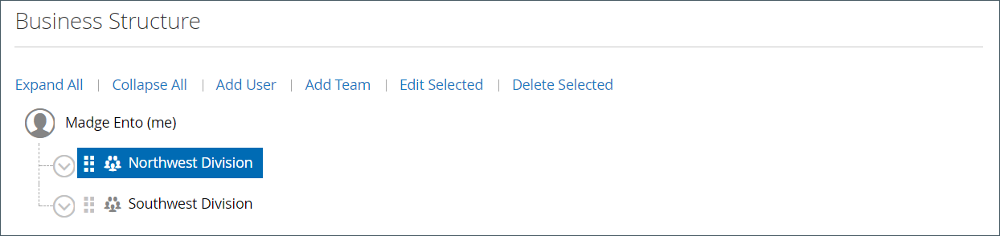
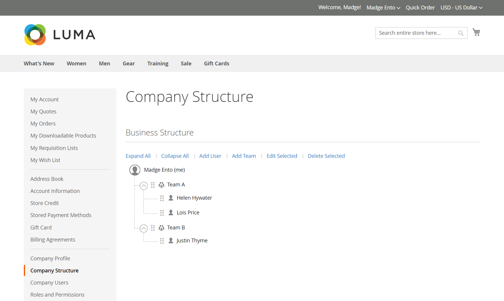

# 회사 계정 구조

비즈니스 구조를 반영하도록 회사 계정을 설정할 수 있습니다. 처음에는 회사 구조에 회사 관리자만 포함되지만 사용자 팀을 포함하도록 확장할 수 있습니다. 사용자는 팀과 연결되거나 회사 내 부서 및 하위 부서의 계층 구조로 구성될 수 있습니다.

{width="500"}

회사 관리자의 계정 대시보드에서 회사 구조는 트리로 표시되며 처음에는 회사 관리자로만 구성됩니다.

{width="600" zoomable="yes"}

계정을 만들고 승인하면 회사 관리자가 회사 이메일 주소를 사용하거나 다른 이메일 주소를 할당할 수 있습니다.

회사 관리자로서 역할을 수행하는 사람이 회사 내에서 여러 역할을 하게 될 가능성이 있다. 회사 관리자에 대해 별도의 이메일 주소를 입력하면 초기 회사 구조에 회사 관리자와 회사 관리자 이름에 개별 사용자 계정이 포함됩니다. 이러한 경우 회사 관리자는 회사 또는 개인 사용자로 계정에 로그인할 수 있습니다.

{width="600" zoomable="yes"}

상인의 경우 전체 회사 구조가 다음에 반영됩니다. _회사_ 및 _고객_ 관리자 내의 그리드. 회사 그리드는 상태에 관계없이 모든 회사를 나열합니다. 다음 예제는 두 회사에 대한 계정을 보여 줍니다. _ACME_ 회사 및 _Vendelay_ 회사.

{width="700" zoomable="yes"}

다음 예제는 [!UICONTROL Customers] 이러한 회사의 초기 회사 관리자 계정이 있는 그리드.

{width="700" zoomable="yes"}

계정을 만든 후 회사 관리자는 의 회사 구조를 정의해야 합니다. [팀](account-company-structure.md), 다음을 설정합니다. [회사 사용자](account-company-users.md), 및 설정 [역할 및 권한](account-company-roles-permissions.md) 각.

## 회사 구조 아이콘

| 아이콘 | 설명 |
| ---- | ----------------- |
|  | 회사 구조에서 회사 관리자를 나타냅니다. |
|  | 회사 구조에서 팀을 나타냅니다. |
|  | 회사 구조의 사용자를 나타냅니다. |
|  | 회사 구조에서 팀을 다른 위치로 이동합니다. |
|  | 회사 구조에서 팀을 확장합니다. |
|  | 회사 구조에서 팀을 축소합니다. |

{style="table-layout:auto"}

## 회사 팀 만들기

기업 계좌의 구조는 단순하고 평평하거나 기업의 하부 분할, 사업부별로 팀이 다른 복잡한 조직 등 구매 조직을 반영해야 한다.

저장소가 다음과 같은 경우 [구성됨](enable-basic-features.md) 회사가 자체 계정을 관리할 수 있도록 하려면 계정 승인 후 회사 관리자가 완료해야 하는 첫 번째 작업 중 하나가 회사 구조 설정입니다. 회사 계정에서 회사 구조는 회사 관리자가 맨 위에 있는 트리로 표현된다.

{width="450"}

1. 회사 관리자가 계정에 로그인합니다.

1. 왼쪽 패널에서 을 선택합니다 **[!UICONTROL Company Structure]**.

1. 아래 **[!UICONTROL Business Structure]**, 클릭 수 **[!UICONTROL Add Team]** 및 은 다음을 수행합니다.

   - 다음을 입력합니다. **[!UICONTROL Team Title]** 및 **[!UICONTROL Description]**.

     팀 제목 은 회사 내의 팀, 사무실 또는 사업부와 같이 회사의 구조를 나타내는 모든 것일 수 있습니다

     {width="700" zoomable="yes"}

   - 완료되면 클릭 수 **[!UICONTROL Save]**.

   - 필요한 만큼 팀을 만듭니다.

     {width="600" zoomable="yes"}

1. 팀 계층을 만들려면 다음을 수행합니다.

   - 상위 팀을 선택하고 **[!UICONTROL Add Team]**.

     {width="600" zoomable="yes"}

   - 다음을 입력합니다. **[!UICONTROL Team Title]** 및 **[!UICONTROL Description]**.

   - 클릭수 **[!UICONTROL Save]**.

1. 이러한 단계를 반복하여 팀이나 사업부 및 하위 사업부를 필요한 수만큼 만듭니다.

   {width="600" zoomable="yes"}

## 팀 이동

회사 관리자는 회사 구조를 사용하여 작업하므로 팀이나 사업부를 구조의 다른 위치로 드래그할 수 있습니다.

1. 회사 관리자가 이동할 팀을 찾습니다.

1. 을 클릭하고 팀을 회사 구조의 새 위치로 드래그합니다.

## 팀 삭제

>[!NOTE]
>
>팀을 삭제하기 전에 올바른 팀이 선택되었는지 확인하는 것이 좋습니다. 삭제된 팀은 복원할 수 없습니다.

1. 회사 관리자가 삭제할 팀을 선택합니다.

1. 클릭수 **[!UICONTROL Delete Selected]**.

1. 확인 메시지가 표시되면 **[!UICONTROL Delete]**.

## 팀 구조 확장 또는 축소

회사 관리자가 회사 구조를 사용하여 작업할 때 트리를 축소하거나 확장할 수 있습니다.

- 클릭수 **[!UICONTROL Collapse All]** 또는 **[!UICONTROL Expand All]**.

- 클릭수  팀을 축소하거나  팀을 확장합니다.

## 팀에 사용자 할당

팀 및 사용자를 다음에 처음 추가할 때 [회사 구조](account-company-structure.md), 회사 관리자 아래에 동일한 수준에 배치됩니다.

{width="700" zoomable="yes"}

| 제어 | 설명 |
|--- |--- |
| [!UICONTROL Collapse All / Expand All] | 비즈니스 구조 트리 축소 또는 확장 |
| [!UICONTROL Add User] | 현재 팀 아래에 사용자 만들기 |
| [!UICONTROL Add Team] | 팀 만들기 |
| [!UICONTROL Edit Selected / Delete Selected] | 비즈니스 트리에서 사용자를 편집하거나 제거합니다. |

{style="table-layout:auto"}

1. 왼쪽 패널에서 회사 관리자는 **[!UICONTROL Company Structure]**.

1. 기존 팀에 사용자를 할당하려면 을(를) 드래그합니다.) 적절한 팀 아래의 사용자입니다.

   {width="700" zoomable="yes"}
