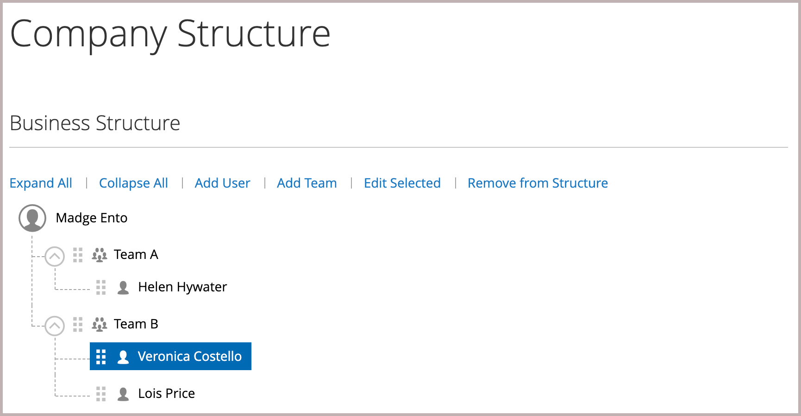
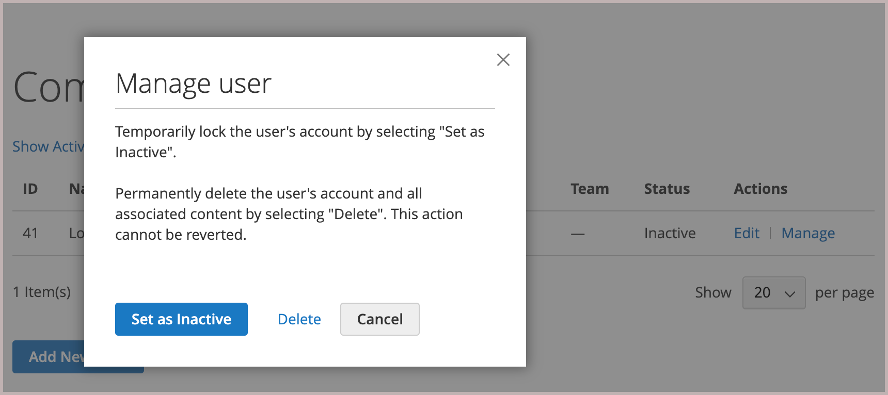

# 회사 사용자 계정 관리

상점 맨 앞에는 회사 관리자가 회사 사용자를 할당하며 _[!UICONTROL Company Users]_페이지에서 볼 수 있습니다. 이러한 개인들은 일반적으로 스토어 서비스 및 리소스에 액세스할 수 있는 다양한 수준의 권한을 가진 구매자입니다.

회사 관리자는 먼저 [회사 구조](account-company-structure.md)를 설정한 후 필요에 따라 다음 작업을 완료합니다.

- 회사 사용자 만들기 및 팀에 사용자 할당

- 역할 및 권한 정의 및 역할에 사용자 할당

회사 사용자는 회사 관리자만 추가, 편집, 비활성화 또는 삭제할 수 있습니다.

- 사용자가 제거되면 계정 상태가 *비활성*(으)로 변경되고 고객은 더 이상 회사에 로그인할 수 없습니다. 관리자는 여전히 사용자와 관련된 모든 콘텐츠에 액세스할 수 있습니다. 계정 관리자는 [!UICONTROL Company Users] 페이지에서 계정 상태를 *[!UICONTROL Active]*(으)로 변경하여 액세스 권한을 복원할 수 있습니다.

- 사용자 계정이 삭제되면 계정 및 연결된 모든 콘텐츠가 상점 첫 화면에서 삭제됩니다. 이 작업은 되돌릴 수 없습니다.

## 회사 사용자 추가

1. 상점에서 회사 관리자가 계정에 로그인합니다.

1. 왼쪽 패널에서 **[!UICONTROL Company Users]**&#x200B;을(를) 선택합니다.

   {width="700" zoomable="yes"}

1. **[!UICONTROL Add New User]**&#x200B;을(를) 클릭하고 다음을 수행합니다.

   - 새 사용자의 **[!UICONTROL Job Title]**&#x200B;을(를) 입력합니다.

   - 역할 및 권한이 정의된 경우 적절한 **[!UICONTROL User Role]**&#x200B;을(를) 선택합니다. 그렇지 않으면 나중에 돌아와서 역할을 할당할 수 있습니다.

     {width="700" zoomable="yes"}

   - 나머지 필드에 사용자 정보를 추가합니다.
      - **[!UICONTROL First Name]** 및 **[!UICONTROL Last Name]**
      - **[!UICONTROL Email]**
      - **[!UICONTROL Phone Number]**

   기본적으로 계정의 **[!UICONTROL Status]**&#x200B;은(는) `Active`입니다.

1. 완료되면 **[!UICONTROL Save]**&#x200B;을(를) 클릭합니다.

1. 필요한 만큼 회사 사용자를 만들려면 프로세스를 반복합니다.

   새 사용자가 회사 사용자 목록에 회사 관리자와 함께 표시됩니다.

첫 번째 주문에서 시간을 절약하기 위해 회사 관리자는 각 회사 사용자에게 [주소록](../customers/account-dashboard-address-book.md)에 기본 회사 청구 및 배송 주소를 추가하도록 알릴 수 있습니다.

## [!UICONTROL Company structure]에서 사용자 제거

회사 관리자는 [!UICONTROL Company Structure]에서 사용자를 제거할 수 있습니다.

계정이 제거되면 사용자 계정 상태가 *비활성*(으)로 변경되고 사용자가 더 이상 상점 앞에 로그인할 수 없습니다.
관리자는 회사 사용자 페이지에서 사용자 계정 정보를 편집하여 계정을 다시 활성화할 수 있습니다.

1. 상점에서 회사 관리자가 계정에 로그인합니다.

1. 왼쪽 패널에서 **[!UICONTROL Company Structure]**&#x200B;을(를) 선택합니다.

1. 회사 구조에서 회사 사용자를 선택합니다.

1. **[!UICONTROL Remove from Structure]**&#x200B;을(를) 클릭합니다.

   {width="600" zoomable="yes"}

1. 확인 메시지가 표시되면 **[!UICONTROL Remove]**&#x200B;을(를) 클릭합니다.

   관리에서 회사 사용자는 [Customers](../customers/customers-all.md) 그리드에 나열되어 있지만 `Inactive` 상태입니다.

## 회사 사용자 계정 보기 및 관리

회사 관리자는 [!UICONTROL Company Users] 페이지의 보기 필터를 사용하여 회사 사용자 계정을 보고 관리할 수 있습니다.

{width="700" zoomable="yes"}

- **[!UICONTROL Show Inactive Users]**&#x200B;을(를) 선택하여 비활성 사용자만 봅니다.
- **[!UICONTROL Show Active Users]**&#x200B;을(를) 선택하여 활성 사용자만 봅니다.
- **[!UICONTROL Show All Users]**&#x200B;을(를) 선택하여 모든 사용자를 봅니다.

회사 관리자는 *[!UICONTROL Actions]* 라인 항목을 사용하여 개별 계정을 관리하여 계정 정보를 편집하거나, 계정 상태를 관리하거나, 계정을 삭제할 수 있습니다.

### 회사 사용자 계정 정보 편집

회사 관리자는 사용자 계정 프로필 정보를 업데이트하고 계정 상태를 변경할 수 있습니다.

1. [!UICONTROL Company Users] 페이지에서 업데이트할 사용자 계정을 찾습니다. **[!UICONTROL Edit]**&#x200B;을(를) 클릭합니다.

1. 계정 상태 변경을 포함하여 사용자 계정 정보에 필요한 변경 작업을 수행합니다.

1. **[!UICONTROL Save]**&#x200B;을(를) 클릭하여 변경 내용을 적용합니다.

>[!NOTE]
>
>회사 사용자 계정을 편집하고 프로필에 직책 및 전화번호와 같은 필수 계정 정보가 없는 경우 Commerce 사이트 관리자가 계정을 추가했음을 나타냅니다. 상점 첫 화면에서 이러한 계정을 편집할 수 없습니다. 정보를 업데이트하거나 계정 상태를 변경하려면 사이트 관리자에게 문의하십시오.

### 활성 계정 비활성화 또는 삭제

1. [!UICONTROL Company Users] 페이지에서 업데이트할 사용자 계정을 찾습니다. **[!UICONTROL Manage]**&#x200B;을(를) 클릭합니다.

   {width="600" zoomable="yes"}

1. 메시지가 표시되면 필요에 따라 사용자 계정을 비활성화하거나 삭제합니다.

>[!IMPORTANT]
>
>회사 사용자 계정을 삭제하면 계정과 모든 관련 콘텐츠가 시스템에서 제거됩니다. 이 작업은 되돌릴 수 없습니다.

## 회사 사용자 계정 프로필 필드 설명

| 필드 | 설명 |
|--------------|---------------|
| [!UICONTROL Job Title] | 회사 사용자의 직함입니다. |
| [!UICONTROL User Role] | 회사 사용자에게 할당된 [역할](account-company-roles-permissions.md)입니다. 옵션: `Default User`/(기타 역할) |
| [!UICONTROL First Name] | 회사 사용자의 이름입니다. |
| [!UICONTROL Last Name] | 회사 사용자의 성. |
| [!UICONTROL Email] | 회사 사용자의 이메일 주소입니다. |
| [!UICONTROL Phone Number] | 회사 사용자의 전화번호. |
| [!UICONTROL Status] | 회사 사용자 계정의 상태입니다. 옵션: `Active` / `Inactive` |

{style="table-layout:auto"}
