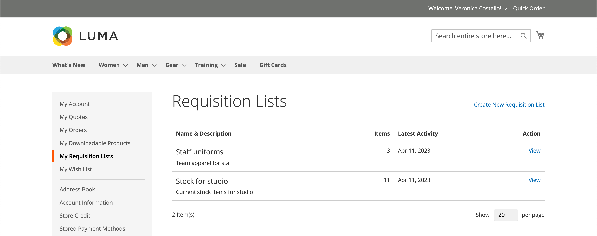
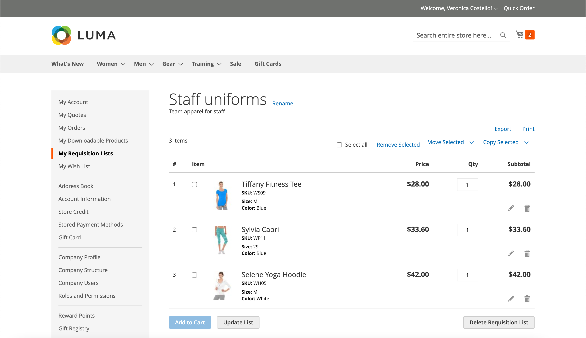

# [!UICONTROL My Requisition Lists]

구매요청 목록을 유지하는 주된 이유는 제품의 재주문을 쉽게 하기 위해서입니다. 승인된 고객은 구매 요청 목록에서 장바구니에 항목을 추가하여 쉽게 재주문하고 한 목록에서 다른 목록으로 항목을 이동하거나 복사할 수 있습니다.

{width="700" zoomable="yes"}

## 구매요청 목록 열기

1. 계정 대시보드에서 고객이 **[!UICONTROL My Requisition Lists]**&#x200B;을(를) 선택합니다.

1. 열려는 구매요청 목록을 찾아 **[!UICONTROL View]**&#x200B;을(를) 클릭하고 다음 중 하나를 수행합니다.

### 장바구니에 제품 추가

1. 고객은 다음 중 하나를 수행하여 추가할 제품을 선택합니다.

   - 각 항목의 확인란을 선택합니다.
   - **[!UICONTROL Select All]**&#x200B;을(를) 클릭합니다.

1. 장바구니에 추가할 **[!UICONTROL Qty]**&#x200B;을(를) 입력합니다.

1. 제품 옵션을 변경하려면 다음을 수행합니다.

   - 라인 항목에서 _편집_() 아이콘을 클릭합니다.
   - 필요한 모든 옵션을 변경합니다.
   - **[!UICONTROL Update Requisition List]**&#x200B;을(를) 클릭합니다.

1. **[!UICONTROL Add to Cart]**&#x200B;을(를) 클릭합니다.

   {width="700" zoomable="yes"}

### 다른 목록에 항목 복사

1. 고객은 이동할 각 항목의 확인란을 선택합니다.

1. **[!UICONTROL Copy Selected]**&#x200B;을(를) 클릭하고 다음 중 하나를 수행합니다.

   - 기존 구매요청 목록을 선택합니다.
   - **[!UICONTROL Create New Requisition List]**&#x200B;을(를) 클릭합니다.

### 목록 내보내기

1. 고객은 익스포트할 구매요청 목록을 엽니다.

1. **[!UICONTROL Export]** 링크를 클릭합니다.

Adobe Commerce은 `sku` 및 `qty` 값이 있는 CSV 목록을 생성하고 다운로드합니다.

### 항목을 다른 목록으로 이동

1. 고객은 이동할 각 항목의 확인란을 선택합니다.

1. **[!UICONTROL Move Selected]**&#x200B;을(를) 클릭하고 다음 중 하나를 수행합니다.

   - 기존 구매요청 목록을 선택합니다.
   - **[!UICONTROL Create New Requisition List]**&#x200B;을(를) 클릭합니다.

### 목록 인쇄

1. 목록의 오른쪽 상단 모서리에서 고객이 **[!UICONTROL Print]**&#x200B;을(를) 클릭합니다.

1. 출력 장치를 확인하고 **[!UICONTROL Print]**&#x200B;을(를) 클릭합니다.

   {width="500" zoomable="yes"}

### 제품 옵션 편집

목록에서 제품 옵션을 편집하려면 다음과 같이 하십시오.

1. _연필_() 아이콘을 클릭하여 제품 페이지를 엽니다.

1. 필요한 모든 옵션을 변경합니다.

1. **[!UICONTROL Update Requisition List]**&#x200B;을(를) 클릭합니다.

   {width="700" zoomable="yes"}

구매요청 목록의 제품은 다음과 같은 경우에 편집할 수 있습니다.

- 제품에 **[!UICONTROL all options set]**&#x200B;이(가) 있습니다(요청 목록에서 [구성된 제품](../catalog/product-create-configurable.md)인 경우).

  제품은 **[!UICONTROL added to this Requisition List]**&#x200B;입니다.

- 제품은 [옵션이 있는 간단한 제품입니다](../catalog/settings-advanced-custom-options.md)

- 제품 유형에 대해 편집이 허용됩니다.

### 항목 제거

1. 고객은 제거할 각 항목의 확인란을 선택합니다.

1. **[!UICONTROL Remove Selected]**&#x200B;을(를) 클릭합니다.

1. 확인 메시지가 표시되면 **[!UICONTROL Delete]**&#x200B;을(를) 클릭합니다.

### 목록 이름 바꾸기

1. 목록 제목 다음에 고객이 **[!UICONTROL Rename]**&#x200B;을(를) 클릭합니다.

1. 다른 **[!UICONTROL Requisition List Name]**&#x200B;을(를) 입력합니다.

1. **[!UICONTROL Save]**&#x200B;을(를) 클릭합니다.

   {width="300"}

### 구매요청 목록 제거

1. 고객이 삭제할 구매요청 목록을 엽니다.

1. **[!UICONTROL Delete Requisition List]**&#x200B;을(를) 클릭합니다.

1. 확인 메시지가 표시되면 **[!UICONTROL Delete]**&#x200B;을(를) 클릭합니다.

>[!NOTE]
>
>이 작업은 취소할 수 없습니다.

## 액션

| 액션 | 설명 |
|--- |--- |
| [!UICONTROL Rename] | 구매요청 목록의 이름을 바꾸고 설명을 갱신할 수 있습니다. |
| [!UICONTROL Export] | 구매요청 목록을 CSV 파일로 내보냅니다. |
| [!UICONTROL Print] | 현재 구매요청 목록을 인쇄합니다. |
| [!UICONTROL Select] | 작업의 주체가 될 항목 선택을 관리합니다.  **[!UICONTROL Select All]**- 요청 목록에서 모든 항목을 선택합니다. **[!UICONTROL Remove Selected]** - 선택한 모든 항목을 구매요청 목록에서 제거합니다.  **[!UICONTROL Copy Selected]**- 선택한 모든 항목을 다른 요청 목록에 복사합니다. |
| [!UICONTROL Add to Cart] | 선택한 항목을 장바구니에 추가합니다. |
| [!UICONTROL Update List] | 수량 변경을 반영하도록 소계를 다시 계산합니다. |
| [!UICONTROL Delete Requisition List] | 회사 사용자 계정에서 구매요청 목록을 삭제합니다. |

{style="table-layout:auto"}

## 페이지 매김 컨트롤

총 구매요청 목록 항목 수가 페이지당 선택한 항목을 초과할 경우 목록 하단에 페이지 매김 통제가 나타납니다.

{width="700" zoomable="yes"}

>[!NOTE]
>
> 주의가 필요한 제품(예: 품절 제품)이 페이지 매김 의 현재 페이지에 속하는 경우 목록 맨 위에 표시됩니다. 주의가 필요한 제품 수가 목록 위에 표시됩니다.
> {width="500"}

### Storefront 페이지 매김 컨트롤

| 제어 | 설명 |
|----------------------------------------------------------------|----------------------------------------------------------------------------------------------------------------------------------------------------------------------------------|
|  | [!UICONTROL Show Per Page] - 페이지당 표시되는 구매요청 목록 항목의 수를 결정합니다. 페이지에 표시할 20, 50, 100, 500 또는 1000 구매요청 목록 품목을 선택할 수 있습니다. |
|  | [!UICONTROL Pagination links] - 다른 페이지로 연결되는 탐색 링크를 제공합니다. |