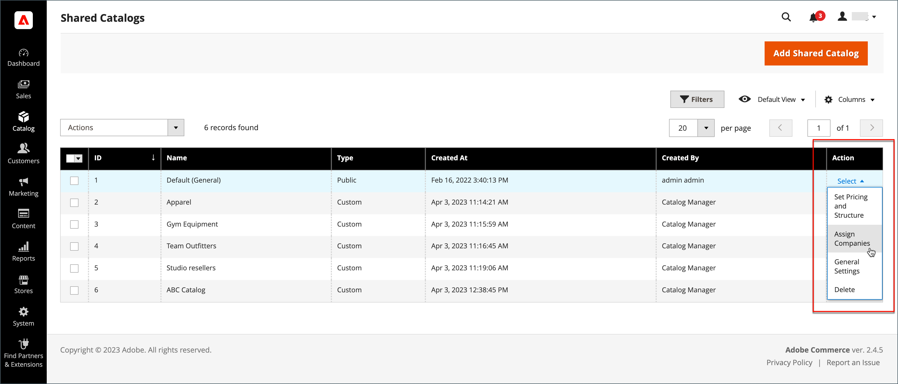

# 공유 카탈로그에 회사 할당

두 가지 방법으로 공유 카탈로그에 회사를 할당할 수 있습니다. 다음에서 할당할 수 있습니다. _[!UICONTROL Shared Catalogs]_고객 그룹을 선택하는 것처럼 회사를 그리드하거나 편집하고 공유 카탈로그를 할당하십시오.

{width="700" zoomable="yes"}

## 방법 1: 공유 카탈로그에서 회사 할당

1. 다음에서 _관리자_ 사이드바, 이동 **[!UICONTROL Catalog]** > **[!UICONTROL Shared Catalogs]**.

1. 회사를 할당하려는 그리드의 공유 카탈로그에 대해 **[!UICONTROL Action]** 열 및 선택 **[!UICONTROL Assign Companies]**.

   사용 가능한 회사 목록이 표에 나타납니다.

1. 공유 카탈로그에 지정할 회사를 선택하고 **[!UICONTROL Actions]** 메뉴 및 선택 **[!UICONTROL Assign Catalog]**.

   {width="700" zoomable="yes"}

   또는 다음을 클릭할 수 있습니다. **[!UICONTROL Assign]** 다음에서 **[!UICONTROL Action]** 카탈로그에 할당되지 않은 회사에 대한 열입니다.

1. 공유 카탈로그에 지정하려는 각 회사에 대해 이 작업을 반복합니다.

   회사가 공유 카탈로그에 할당됩니다.

1. 완료되면 다음을 클릭하십시오. **[!UICONTROL Save]**.

## 방법 2: 회사 편집

1. 다음에서 _관리자_ 사이드바, 이동 **[!UICONTROL Customers]** > **[!UICONTROL Companies]**.

1. 그리드에 표시되는 회사의 경우 **[!UICONTROL Action]** 열 및 클릭 **[!UICONTROL Edit]**.

   {width="700" zoomable="yes"}

1. 회사 페이지에서 아래로 스크롤하고 확장합니다.  다음 **[!UICONTROL Advanced Settings]** 섹션.

1. 설정 **[!UICONTROL Customer Group]** 을 적절한 공유 카탈로그로 변경합니다.

   공유 카탈로그 할당을 변경하면 모든 회사 구성원에 대한 고객 그룹 할당도 변경됩니다.

   {width="600"}

1. 확인을 묻는 메시지가 나타나면 **[!UICONTROL Proceed]** 그런 다음 **[!UICONTROL Save]**.
