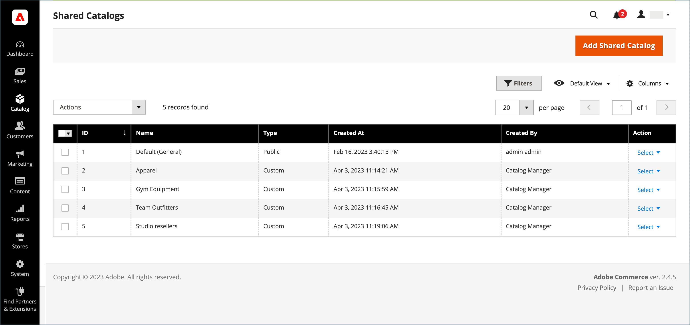
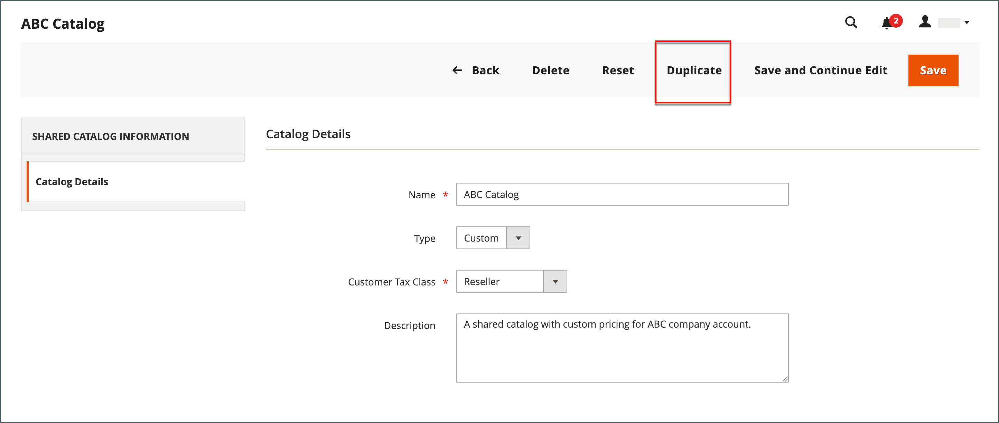

# 공유 카탈로그 만들기

[공유 카탈로그](catalog-shared.md)가 만들어지면 시스템에서 같은 이름으로 [고객 그룹](account-company-customer-group.md)을(를) 자동으로 만듭니다. 예를 들어 _ABC 카탈로그_&#x200B;라는 공유 카탈로그를 만드는 경우 해당 _ABC 카탈로그_ 고객 그룹도 만들어집니다. 공유 사용자 지정 카탈로그에 회사를 할당하는 것은 고객 그룹에 할당하는 것과 본질적으로 동일합니다.

새 공유 카탈로그에는 제품, 사용자 지정 가격 또는 회사 연결이 포함되지 않습니다. 공유 카탈로그가 활성화될 때 생성되는 기본 공유 카탈로그인 공개 카탈로그는 회사와 관련이 없는 게스트 및 고객에게 자동으로 할당됩니다.

{width="700" zoomable="yes"}

공유 카탈로그를 사용하려면 먼저 다음 측면을 설정해야 합니다.

- 카탈로그 범위
- 제품 선택
- 사용자 정의 가격
- 회사 할당

## 가격 범위

다중 사이트 설치가 있는 경우 공유 카탈로그를 만들기 전에 가격 범위를 구성해야 합니다. [가격 범위](../catalog/catalog-price-scope.md)은(는) `Global` 또는 `Website`(으)로 설정할 수 있습니다. 단, 설정 프로세스의 시작 부분에서만 설정할 수 있습니다. 웹 사이트 선택기는 [공유 카탈로그 설정](catalog-shared-pricing-structure.md)의 2단계 중에 표시됩니다.

{width="600" zoomable="yes"}

1. _관리자_ 사이드바에서 **[!UICONTROL Stores]** > _[!UICONTROL Settings]_>**[!UICONTROL Configuration]**(으)로 이동합니다.

1. 왼쪽 패널에서 **카탈로그**&#x200B;를 확장하고 아래의 **카탈로그**&#x200B;를 선택합니다.

1. **가격** 섹션에서 를 확장합니다.

1. **카탈로그 가격 범위**&#x200B;을(를) `Website`(으)로 설정합니다.

   {width="600" zoomable="yes"}

1. **[!UICONTROL Save Config]**&#x200B;을(를) 클릭합니다.

## 1단계: 공유 카탈로그 만들기

두 가지 방법으로 공유 카탈로그를 만들 수 있습니다. 두 유형 중 하나의 공유 카탈로그를 만들거나 기존 공유 카탈로그를 복제할 수 있습니다. 새 공유 카탈로그에 제품이 포함되어 있지 않고 아직 회사에 할당되지 않았습니다.

### 방법 1: 새 공유 카탈로그 추가

1. _관리자_ 사이드바에서 **[!UICONTROL Catalog]** > **[!UICONTROL Shared Catalogs]**(으)로 이동합니다.

1. 오른쪽 상단 모서리에서 **[!UICONTROL Add Shared Catalog]**&#x200B;을(를) 클릭하고 다음을 수행합니다.

   - 공유 카탈로그에 대한 **[!UICONTROL Name]**&#x200B;을(를) 입력하십시오.

     지정하는 이름은 해당하는 경우 공유 카탈로그를 참조하기 위해 관리 및 고객 대시보드 전체에 사용됩니다. 또한 해당 고객 그룹의 이름이 됩니다.

   - **[!UICONTROL Type]**: `Custom` 또는 `Public`을(를) 선택합니다.

   - 공유 카탈로그에서 수행한 구매에 적용되는 적절한 **[!UICONTROL Customer Tax Class]**&#x200B;을(를) 선택하십시오.

     세금 클래스 설정 및 정의에 대한 자세한 내용은 [세금 클래스](../stores-purchase/tax-class.md)를 참조하십시오.

     다음 예는 특정 도매 고객을 위한 새로운 사용자 정의 카탈로그를 보여 줍니다.

     {width="600" zoomable="yes"}

   - **[!UICONTROL Description]** 입력

1. 완료되면 **[!UICONTROL Save]**&#x200B;을(를) 클릭합니다.

   새 카탈로그가 _[!UICONTROL Shared Catalogs]_&#x200B;표에 나타납니다.

### 방법 2: 기존 공유 카탈로그 복제

중복 사용자 정의 카탈로그는 원본의 가격 책정 모델 및 구조를 유지하지만 회사 연결은 유지하지 않습니다. 해당 고객 그룹도 중복 카탈로그와 동일한 이름으로 만들어집니다. 기본적으로 중복 카탈로그의 이름은 _원본 카탈로그의 중복_&#x200B;입니다.

공용 공유 카탈로그가 중복되면 중복 카탈로그의 유형이 `custom`(으)로 변경됩니다.

1. _관리자_ 사이드바에서 **[!UICONTROL Catalog]** > **[!UICONTROL Shared Catalogs]**(으)로 이동합니다.

1. 복제할 그리드의 공유 카탈로그에 대해 **[!UICONTROL Action]** 열로 이동하여 **[!UICONTROL General Settings]**&#x200B;을(를) 선택합니다.

1. 페이지 상단의 옵션에서 **[!UICONTROL Duplicate]**&#x200B;을(를) 클릭합니다.

   {width="600" zoomable="yes"}

1. 새 카탈로그에 대한 다음 필드를 업데이트합니다.

   - **[!UICONTROL Name]**
   - **[!UICONTROL Type]**
   - **[!UICONTROL Customer Tax Class]**
   - **[!UICONTROL Description]**

1. 완료되면 **[!UICONTROL Save]**&#x200B;을(를) 클릭합니다.

   _[!UICONTROL Shared Catalogs]_&#x200B;표에 고유한 ID와 함께 중복 항목이 나타납니다.

## 2단계: 설정 완료

새 공유 카탈로그를 만든 후 적절한 제품 선택, [회사 할당](catalog-shared-assign-companies.md) 및 [범주 권한](../catalog/category-permissions.md)으로 구성해야 합니다. 계속하려면 [가격 및 구조 설정](catalog-shared-pricing-structure.md)을 참조하세요.

>[!NOTE]
>
>**[B2B 릴리스 1.3.0](release-notes.md#b2b-v130) 이상** — 공유 카탈로그를 만들 때 카탈로그 권한 설정에서 이 액세스 권한이 할당된 고객 그룹에 대해 카탈로그에 대한 각 [범주 권한](../catalog/category-permissions.md)이 _[!UICONTROL Allow for the Display Product Prices]_&#x200B;및_[!UICONTROL Add to Cart]_(으)로 설정됩니다. 이전에는 카탈로그 권한이 `Allow`(으)로 설정되어 있어도 이 설정이 `Deny`(으)로 자동 설정되었습니다.

## 공유된 카탈로그 데모

공유 카탈로그 관리에 대한 데모를 보려면 다음 비디오를 시청하십시오.

>[!VIDEO](https://video.tv.adobe.com/v/3410756?quality=12&learn=on&captions=kor)

## 공유 카탈로그 페이지 참조

### 단추 막대

| 단추 | 설명 |
|--- |--- |
| [!UICONTROL Back] | 새 공유 카탈로그를 저장하지 않고 공유 카탈로그 페이지로 돌아갑니다. |
| [!UICONTROL Reset] | 저장하지 않은 변경 내용의 양식을 지우고 원래 카탈로그 세부 정보를 복원합니다. |
| [!UICONTROL Save and Continue Edit] | 모든 변경 사항을 저장하고 편집 모드에서 양식을 열어 둡니다. |
| [!UICONTROL Save] | 변경 사항을 저장하고, 양식을 닫은 다음 공유 카탈로그 페이지로 돌아갑니다. |

{style="table-layout:auto"}

### 카탈로그 세부 정보

| 필드 | 설명 |
|--- |--- |
| [!UICONTROL Name] | 관리자 전체와 사용 가능한 고객 계정에서 공유 카탈로그를 식별합니다. 카탈로그 이름은 설명적이어야 하며 길이는 32자 이하여야 합니다. 이름이 같은 두 개의 공유 카탈로그를 가질 수 없습니다. 최대 문자 수: 32 |
| [!UICONTROL Type] | **[!UICONTROL Custom]** - 지정된 특정 회사에서만 사용할 수 있는 사용자 지정 가격 카탈로그를 식별합니다. **[!UICONTROL Public]**- 모든 게스트 방문자 및 회사와 연결되어 있지 않은 로그인 고객에게 사용할 수 있는 공유 카탈로그를 식별합니다. [!DNL Adobe Commerce B2B]을(를) 설치할 때 기본 공용 공유 카탈로그가 만들어지지만 저장소 관리자가 구성해야 합니다. 공개 공유 카탈로그는 한 번에 하나만 존재할 수 있습니다. |
| [!UICONTROL Customer Tax Class] | 카탈로그에서 구매한 항목에 사용할 세금 분류를 결정합니다. 옵션에는 사용 가능한 모든 세금 분류가 포함됩니다. |
| [!UICONTROL Description] | 카탈로그 사용 방법에 대한 간단한 설명. |

{style="table-layout:auto"}

### 그리드 열

| 필드 | 설명 |
|--- |--- |
| [!UICONTROL ID] | 공유 카탈로그 엔티티에 할당된 고유 숫자 식별자입니다. |
| [!UICONTROL Name] | 공유 카탈로그의 이름입니다. |
| [!UICONTROL Type] | 공유 카탈로그의 유형을 나타냅니다. `Public` 또는 `Custom`일 수 있습니다. |
| [!UICONTROL Created At] | 시스템에서 공유 카탈로그를 만든 날짜입니다. |
| [!UICONTROL Created By] | 공유 카탈로그를 만든 관리자 사용자의 이름입니다. |
| [!UICONTROL Action] | 작업 목록입니다. 옵션: `Set Pricing and Structure`, `Assign Companies`, `General Settings`, `Delete`. |

{style="table-layout:auto"}
