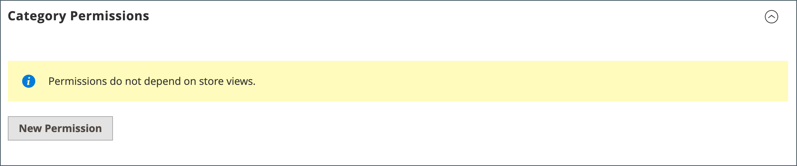

# 공유 카탈로그 관리

다음 _[!UICONTROL Shared Catalogs]_페이지는 공유 카탈로그 관리에 필요한 도구에 대한 액세스를 제공합니다. 이 페이지는 필터 및 작업 컨트롤이 있는 표준 관리 작업 영역과 유사합니다. 그리드는 기본 공개 공유 카탈로그를 비롯한 모든 공유 카탈로그와 설정한 사용자 지정 카탈로그를 나열합니다.

## 제품 선택 업데이트

모든 공유 카탈로그의 제품 선택은 _[!UICONTROL Action]_공유 카탈로그 그리드의 열입니다. 변경한 내용은 연결된 회사 계정의 구성원에게 표시됩니다. 이 프로세스는 기본적으로 새 제품에 대한 제품을 선택하는 것과 같습니다 [카탈로그 구조](catalog-shared-pricing-structure.md), 단, 구성 범위는 변경할 수 없습니다.

1. 다음에서 _관리자_ 사이드바, 이동 **[!UICONTROL Catalog]** > **[!UICONTROL Shared Catalogs]**.

1. 그리드에 있는 공유 카탈로그의 경우 **[!UICONTROL Action]** 열 및 선택 **[!UICONTROL Set Pricing and Structure]**.

   {width="700" zoomable="yes"}

1. 의 지침을 따르십시오. [2단계: 제품 선택](catalog-shared-pricing-structure.md#step-2-choose-the-products).

   공유 카탈로그가 처음 저장된 후에는 범위를 변경할 수 없으므로 첫 번째 항목을 건너뛸 수 있습니다.

특정 제품을 사용하여 작업하는 경우 _[!UICONTROL Products In Shared Catalog]_섹션에는 제품을 사용할 수 있는 각 공유 카탈로그가 나열됩니다. 자세한 내용은 다음을 참조하십시오. [공유 카탈로그에 제품 추가](catalog-shared-product-add.md).

{width="600" zoomable="yes"}

## 사용자 정의 가격 업데이트

공유 카탈로그의 제품에 대한 사용자 지정 가격 책정은 공유 카탈로그 그리드의 작업 열에서 쉽게 업데이트할 수 있습니다. 변경한 사항이 연결된 회사 또는 고객 그룹의 구성원에게 상점 맨 앞에 표시됩니다. 이 프로세스는 기본적으로 새 프로젝트에 대해 사용자 정의 가격을 설정하는 것과 같습니다 [공유된 카탈로그](catalog-shared-pricing-structure.md), 단, 구성 범위는 변경할 수 없습니다.

1. 다음에서 _관리자_ 사이드바, 이동 **[!UICONTROL Catalog]** > **[!UICONTROL Shared Catalogs]**.

1. 업데이트하려는 그리드의 공유 카탈로그에 대해 **[!UICONTROL Action]** 열 및 선택 **[!UICONTROL Set Pricing and Structure]**.

1. 다음에서 _[!UICONTROL Catalog Structure]_페이지, 클릭&#x200B;**[!UICONTROL Configure]**다음 중 하나를 수행합니다.

   - 페이지 상단의 진행 표시기에서 을 클릭합니다. **[!UICONTROL Pricing]**.
   - 오른쪽 위 모서리에서 을(를) 클릭합니다. **[!UICONTROL Next]**.

1. 의 지침을 따르십시오. [3단계: 사용자 정의 가격 설정](catalog-shared-pricing-structure.md#step-3-set-custom-prices).

## 범주 권한 업데이트

[범주 권한](../catalog/category-permissions.md) 자동으로 다음으로 설정됨 `Allow` 범주 트리에서 공유 카탈로그로 추가된 제품의 경우 필요에 따라 나중에 권한을 조정하거나 추가 규칙을 만들 수 있습니다.

>[!NOTE]
>
>**[B2B 릴리스 1.3.0](release-notes.md#b2b-v130) 및 나중에** — 공유 카탈로그를 만들 때 각각 [범주 권한](../catalog/category-permissions.md) 카탈로그가 다음으로 설정됨: `Allow` 대상: _[!UICONTROL Display Product Prices]_및_[!UICONTROL Add to Cart]_ 카탈로그 권한 설정에서 이 액세스 권한이 할당된 고객 그룹의 경우. 이전에는 이러한 설정이 자동으로 로 설정되었습니다. `Deny` 카탈로그 권한이 다음으로 설정된 경우에도 `Allow`.

>[!IMPORTANT]
>
>모든 기존 항목 [그룹 권한 설정](../configuration-reference/catalog/catalog.md#category-permissions) 은(는) 다음을 무시합니다. **_모두_** 카탈로그에 있는 범주 **_[!UICONTROL Shared Catalog]_** 기능이 활성화되었습니다. [!UICONTROL Shared Catalog] 카탈로그가 활성화되면 카탈로그의 모든 범주 권한을 완전히 제어합니다.

1. 다음에서 _관리자_ 사이드바, 이동 **[!UICONTROL Catalog]** > **[!UICONTROL Categories]**.

1. 범주 트리에서 갱신할 제품의 범주를 선택합니다.

   모든 제품을 포함하려면 트리에서 최상위 카테고리를 선택합니다.

1. 아래로 스크롤하고 확장합니다.  다음 **[!UICONTROL Category Permissions]** 섹션.

1. 클릭 **[!UICONTROL New Permission]** 다음을 수행합니다.

   {width="600" zoomable="yes"}

   - 다음을 선택합니다. **[!UICONTROL Customer Group]** 공유 카탈로그에 해당하는 권한 설정을 필요에 따라 변경합니다.

     {width="600" zoomable="yes"}

   - 다른 고객 그룹에 대한 권한 규칙을 만들려면 **[!UICONTROL New Permissions]** 이 과정을 반복합니다.

   - 권한 규칙을 삭제하려면 _삭제_  아이콘.

1. 완료되면 다음을 클릭: **[!UICONTROL Save]**.

## 카탈로그 세부 정보 업데이트

공유 카탈로그의 세부 정보는 공유 카탈로그 그리드의 작업 열에서 쉽게 업데이트할 수 있습니다. 변경한 내용은 연결된 회사 계정에 반영됩니다.

{width="700" zoomable="yes"}

1. 다음에서 _관리자_ 사이드바, 이동 **[!UICONTROL Catalog]** > **[!UICONTROL Shared Catalogs]**.

1. 업데이트할 공유 카탈로그의 **[!UICONTROL Action]** 열 및 선택 **[!UICONTROL General Settings]**.

   {width="600" zoomable="yes"}

1. 필요에 따라 카탈로그 세부 정보를 업데이트합니다.

   - 공유 카탈로그의 이름을 변경하면 해당 고객 그룹의 이름도 변경됩니다.
   - 카탈로그 유형 변경 `Custom` 끝 `Public` 기존 공개 카탈로그를 사용자 지정 카탈로그로 변환합니다. 원래 공개 카탈로그와 연관된 모든 회사는 대체 회사로 재지정됩니다. 공개 카탈로그를 사용자 지정 카탈로그로 변환할 수 없습니다.

1. 완료되면 다음을 클릭: **[!UICONTROL Save]**.

## 공유 카탈로그 페이지 참조

### 단추 막대

| 단추 | 설명 |
|--- |--- |
| [!UICONTROL Back] | 새 공유 카탈로그를 저장하지 않고 공유 카탈로그 페이지로 돌아갑니다. |
| [!UICONTROL Delete] | 카탈로그를 삭제하고 모든 관련 회사와 해당 구성원을 공개 공유 카탈로그에 재할당합니다. |
| [!UICONTROL Reset] | 저장하지 않은 변경 내용의 양식을 지우고 원래 카탈로그 세부 정보를 복원합니다. |
| [!UICONTROL Duplicate] | 를 만듭니다. [카탈로그 복제본](catalog-shared-create.md). 사용자 지정 카탈로그의 경우, 회사 연결이 없는 원본의 가격 책정 모델 및 구조입니다. 공개 공유 카탈로그가 중복되면 중복 카탈로그의 유형은 다음과 같이 변경됩니다. `custom`. 해당 고객 그룹도 중복 카탈로그와 동일한 이름으로 만들어집니다. 기본적으로 중복 카탈로그에 이름이 지정됩니다 _중복_ 원본 카탈로그. |
| [!UICONTROL Save and Continue Edit] | 모든 변경 사항을 저장하고 편집 모드에서 양식을 열어 둡니다. |
| [!UICONTROL Save] | 변경 사항을 저장하고, 양식을 닫은 다음 공유 카탈로그 페이지로 돌아갑니다. |

{style="table-layout:auto"}

### 카탈로그 세부 정보

| 필드 | 설명 |
|--- |--- |
| [!UICONTROL Name] | 관리자 전체와 사용 가능한 고객 계정에서 공유 카탈로그를 식별합니다. 카탈로그 이름은 설명적이어야 하며 길이는 32자 이하여야 합니다. 이름이 같은 두 개의 공유 카탈로그를 가질 수 없습니다. 최대 문자 수: 32 |
| [!UICONTROL Type] | **[!UICONTROL Custom]** - 지정된 특정 회사에만 사용할 수 있는 사용자 지정 가격 책정 카탈로그를 식별합니다. **[!UICONTROL Public]**- 모든 게스트 방문자 및 회사와 연관되지 않은 로그인 고객에게 사용할 수 있는 공유 카탈로그를 식별합니다. Adobe Commerce용 B2B가 설치되면 &quot;기본&quot; 공용 공유 카탈로그가 생성되지만 관리자가 구성해야 합니다. 공개 공유 카탈로그는 한 번에 하나만 존재할 수 있습니다. |
| [!UICONTROL Customer Tax Class] | 카탈로그에서 구매한 항목에 사용할 세금 분류를 결정합니다. 옵션에는 사용 가능한 모든 세금 분류가 포함됩니다. |
| [!UICONTROL Description] | 카탈로그 사용 방법에 대한 간단한 설명. |

{style="table-layout:auto"}
