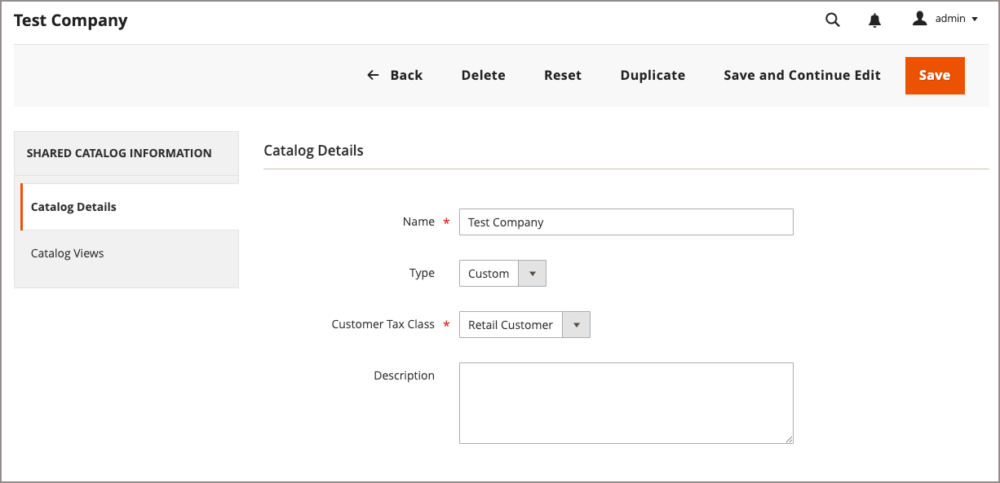

# 공유 카탈로그 관리

_[!UICONTROL Shared Catalogs]_페이지에서는 제품 선택, 사용자 지정 가격, 범주 권한 및 카탈로그 세부 정보를 포함하여 공유 카탈로그를 관리하는 데 필요한 도구에 액세스할 수 있습니다. 이 페이지는 필터 및 작업 컨트롤이 있는 표준 관리 작업 영역과 유사합니다. 그리드는 기본 공개 공유 카탈로그를 비롯한 모든 공유 카탈로그와 설정한 사용자 지정 카탈로그를 나열합니다.

[!DNL Adobe Commerce Optimizer Connector for B2B] 확장이 설치되어 있는 경우, 각 공유 카탈로그의 데이터를 [!DNL Adobe Commerce Optimizer]&#x200B;(으)로 동기화할 때 만들어진 [!DNL Adobe Commerce Optimizer] 카탈로그 보기와 B2B 상점 환경의 카탈로그 보기를 보호하는 제한된 액세스 키에도 액세스할 수 있습니다.

## 제품 선택 업데이트

공유 카탈로그 그리드의 _[!UICONTROL Action]_열에서 공유 카탈로그의 제품 선택을 쉽게 업데이트할 수 있습니다. 변경한 내용은 연결된 회사 계정의 구성원에게 표시됩니다. 이 프로세스는 구성 범위를 변경할 수 없다는 점을 제외하고 새 [카탈로그 구조](catalog-shared-pricing-structure.md)에 대한 제품을 선택하는 것과 같습니다.

1. _관리자_ 사이드바에서 **[!UICONTROL Catalog]** > **[!UICONTROL Shared Catalogs]**(으)로 이동합니다.

1. 격자에 있는 공유 카탈로그의 경우 **[!UICONTROL Action]** 열로 이동하여 **[!UICONTROL Set Pricing and Structure]**&#x200B;을(를) 선택합니다.

   {width="700" zoomable="yes"}

1. [2단계: 제품 선택](catalog-shared-pricing-structure.md#step-2-choose-the-products)의 지침을 따릅니다.

   공유 카탈로그가 처음 저장된 후에는 범위를 변경할 수 없으므로 첫 번째 항목을 건너뛸 수 있습니다.

특정 제품을 사용하여 작업하는 경우 _[!UICONTROL Products In Shared Catalog]_섹션에는 제품을 사용할 수 있는 각 공유 카탈로그가 나열됩니다. 자세한 내용은 [공유 카탈로그에 제품 추가](catalog-shared-product-add.md)를 참조하세요.

공유 카탈로그의 {width="600" zoomable="yes"}

## 사용자 정의 가격 업데이트

공유 카탈로그의 제품에 대한 사용자 지정 가격 책정은 공유 카탈로그 그리드의 작업 열에서 쉽게 업데이트할 수 있습니다. 변경한 사항이 연결된 회사 또는 고객 그룹의 구성원에게 상점 맨 앞에 표시됩니다. 이 프로세스는 구성 범위를 변경할 수 없다는 점을 제외하고 새 [공유 카탈로그](catalog-shared-pricing-structure.md)에 대한 사용자 지정 가격 설정과 동일합니다.

1. _관리자_ 사이드바에서 **[!UICONTROL Catalog]** > **[!UICONTROL Shared Catalogs]**(으)로 이동합니다.

1. 업데이트할 그리드의 공유 카탈로그에 대해 **[!UICONTROL Action]** 열로 이동하여 **[!UICONTROL Set Pricing and Structure]**&#x200B;을(를) 선택합니다.

1. _[!UICONTROL Catalog Structure]_페이지에서&#x200B;**[!UICONTROL Configure]**을(를) 클릭하고 다음 중 하나를 수행합니다.

   - 페이지 상단의 진행 표시기에서 **[!UICONTROL Pricing]**&#x200B;을(를) 클릭합니다.
   - 오른쪽 상단에서 **[!UICONTROL Next]**&#x200B;을(를) 클릭합니다.

1. [3단계: 사용자 지정 가격 설정](catalog-shared-pricing-structure.md#step-3-set-custom-prices)의 지침을 따르십시오.

## 범주 권한 업데이트

범주 트리에서 공유 카탈로그에 추가된 제품에 대해 [범주 권한](../catalog/category-permissions.md)이 `Allow`(으)로 자동 설정됩니다. 필요에 따라 나중에 권한을 조정하거나 추가 규칙을 만들 수 있습니다.

>[!NOTE]
>
>**[B2B 릴리스 1.3.0](release-notes.md#b2b-v130) 이상** — 공유 카탈로그를 만들 때 각 [범주 권한](../catalog/category-permissions.md)은(는) _[!UICONTROL Display Product Prices]_에 대해 `Allow`, 할당된 고객 그룹에 대해_[!UICONTROL Add to Cart]_&#x200B;로 설정됩니다. 이전에는 카탈로그 권한이 `Allow`(으)로 설정되어 있어도 이 설정이 `Deny`(으)로 자동 설정되었습니다.

>[!IMPORTANT]
>
>**_[!UICONTROL Shared Catalog]_**&#x200B;은(는) 활성화되면 카탈로그의 **_모두_** 범주에 대한 기존의 모든 [그룹 권한 설정](../configuration-reference/catalog/catalog.md#category-permissions)을 대체합니다. [!UICONTROL Shared Catalog]은(는) 카탈로그가 활성화되면 카탈로그의 모든 범주 권한을 완전히 제어합니다.

1. _관리자_ 사이드바에서 **[!UICONTROL Catalog]** > **[!UICONTROL Categories]**(으)로 이동합니다.

1. 범주 트리에서 갱신할 제품의 범주를 선택합니다.

   모든 제품을 포함하려면 트리에서 최상위 카테고리를 선택합니다.

1. 아래로 스크롤하여 **[!UICONTROL Category Permissions]** 섹션에서 를 확장합니다.

1. **[!UICONTROL New Permission]**&#x200B;을(를) 클릭하고 다음을 수행합니다.

   {width="600" zoomable="yes"}

   - 공유 카탈로그에 해당하는 **[!UICONTROL Customer Group]**&#x200B;을(를) 선택하고 필요에 따라 권한 설정을 변경합니다.

     {width="600" zoomable="yes"}

   - 다른 고객 그룹에 대한 권한 규칙을 만들려면 **[!UICONTROL New Permissions]**&#x200B;을(를) 클릭하고 이 과정을 반복합니다.

   - 권한 규칙을 삭제하려면 _삭제_  아이콘을 클릭합니다.

1. 완료되면 **[!UICONTROL Save]**&#x200B;을(를) 클릭합니다.

## 카탈로그 세부 정보 업데이트

공유 카탈로그의 세부 정보는 공유 카탈로그 그리드의 작업 열에서 쉽게 업데이트할 수 있습니다. 변경한 내용은 연결된 회사 계정에 반영됩니다.

{width="700" zoomable="yes"}

1. _관리자_ 사이드바에서 **[!UICONTROL Catalog]** > **[!UICONTROL Shared Catalogs]**(으)로 이동합니다.

1. 업데이트할 공유 카탈로그의 경우 **[!UICONTROL Action]** 열로 이동하여 **[!UICONTROL General Settings]**&#x200B;을(를) 선택하십시오.

   {width="600" zoomable="yes"}

1. 필요에 따라 카탈로그 세부 정보를 업데이트합니다.

   - 공유 카탈로그의 이름을 변경하면 해당 고객 그룹의 이름도 변경됩니다.
   - 카탈로그 유형을 `Custom`에서 `Public`(으)로 변경하면 기존 공개 카탈로그가 사용자 지정 카탈로그로 변환됩니다. 원래 공개 카탈로그와 연관된 모든 회사는 대체 회사로 재지정됩니다. 공개 카탈로그를 사용자 지정 카탈로그로 변환할 수 없습니다.
   - 공유 카탈로그를 통해 구매한 항목에 적용되는 세금 분류를 식별하려면 [!UICONTROL Customer Tax Class]을(를) 선택합니다.

1. 완료되면 **[!UICONTROL Save]**&#x200B;을(를) 클릭합니다.

## 카탈로그 보기 구성 관리

[!DNL Adobe Commerce Optimizer Connector for B2B] 확장이 설치되어 있는 공유 카탈로그의 _[!UICONTROL Catalog Views]_섹션에는 공유 카탈로그에서 예상된 [!DNL Adobe Commerce Optimizer] 카탈로그 보기가 나열되며 이를 보호하는 제한된 액세스 키를 관리할 수 있습니다.

1. _관리자_ 사이드바에서 **[!UICONTROL Catalog]** > **[!UICONTROL Shared Catalogs]**(으)로 이동합니다.

1. 검토할 공유 카탈로그의 경우 **[!UICONTROL Action]** 열로 이동하여 **[!UICONTROL General Settings]**&#x200B;을(를) 선택하십시오.

1. _[!UICONTROL Shared Catalog Information]_패널에서&#x200B;**[!UICONTROL Catalog Views]**을(를) 선택합니다.

카탈로그 보기 및 제한된 액세스 키 편집에 대한 자세한 내용은 [카탈로그 보기 구성 관리](catalog-views-manage.md)를 참조하세요.

## 공유 카탈로그 페이지 참조

### 단추 막대

| 단추 | 설명 |
| --- | --- |
| [!UICONTROL Back] | 새 공유 카탈로그를 저장하지 않고 공유 카탈로그 페이지로 돌아갑니다. |
| [!UICONTROL Delete] | 카탈로그를 삭제하고 모든 관련 회사와 해당 구성원을 공개 공유 카탈로그에 재할당합니다. |
| [!UICONTROL Reset] | 저장하지 않은 변경 내용의 양식을 지우고 원래 카탈로그 세부 정보를 복원합니다. |
| [!UICONTROL Duplicate] | [카탈로그의 중복 복사본을 만듭니다](catalog-shared-create.md). 사용자 지정 카탈로그의 경우, 회사 연결이 없는 원본의 가격 책정 모델 및 구조입니다. 공용 공유 카탈로그가 중복되면 중복 카탈로그의 유형이 `custom`(으)로 변경됩니다. 해당 고객 그룹도 중복 카탈로그와 동일한 이름으로 만들어집니다. 기본적으로 중복 카탈로그의 이름은 _원본 카탈로그의 중복_&#x200B;입니다. |
| [!UICONTROL Save and Continue Edit] | 모든 변경 사항을 저장하고 편집 모드에서 양식을 열어 둡니다. |
| [!UICONTROL Save] | 변경 사항을 저장하고, 양식을 닫은 다음 공유 카탈로그 페이지로 돌아갑니다. |

{style="table-layout:auto"}

### 카탈로그 세부 정보

| 필드 | 설명 |
| --- | --- |
| [!UICONTROL Name] | 관리자 전체와 사용 가능한 고객 계정에서 공유 카탈로그를 식별합니다. 카탈로그 이름은 설명적이어야 하며 길이는 32자 이하여야 합니다. 이름이 같은 두 개의 공유 카탈로그를 가질 수 없습니다. 최대 문자 수: 32 |
| [!UICONTROL Type] | **[!UICONTROL Custom]** - 지정된 특정 회사에서만 사용할 수 있는 사용자 지정 가격 카탈로그를 식별합니다. **[!UICONTROL Public]**- 모든 게스트 방문자 및 회사와 연관되지 않은 로그인 고객에게 사용할 수 있는 공유 카탈로그를 식별합니다. Adobe Commerce B2B 설치 시 &quot;기본&quot; 공용 공유 카탈로그가 생성되지만 관리자가 구성해야 합니다. 공개 공유 카탈로그는 한 번에 하나만 존재할 수 있습니다. |
| [!UICONTROL Customer Tax Class] | 카탈로그에서 구매한 항목에 사용할 세금 분류를 결정합니다. 옵션에는 사용 가능한 모든 세금 분류가 포함됩니다. 세금 분류는 공유 카탈로그에 생성되거나 사용되는 고객 그룹과 연관됩니다. [세금 클래스](../stores-purchase/tax-class.md)를 참조하세요. |
| [!UICONTROL Description] | 카탈로그 사용 방법에 대한 간단한 설명. |

{style="table-layout:auto"}

### 카탈로그 보기

{{$include /help/_includes/catalog-views-reference-table.md}}
