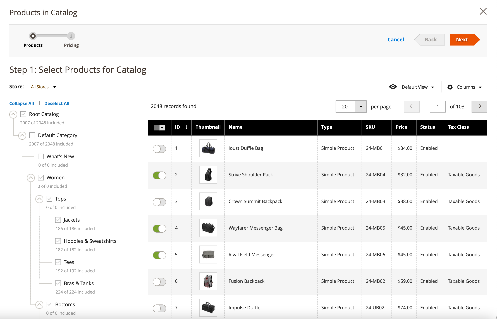
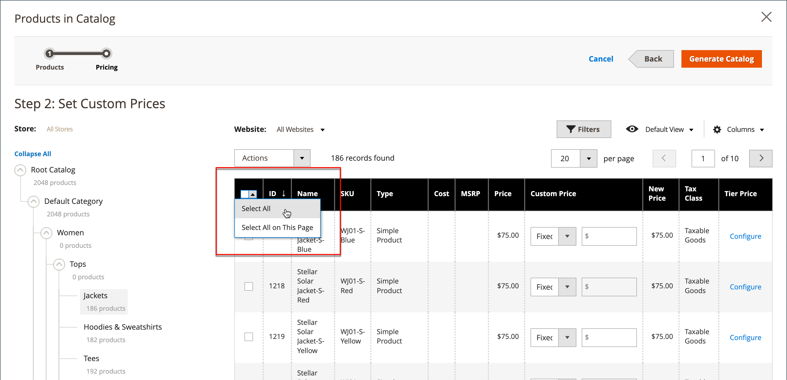
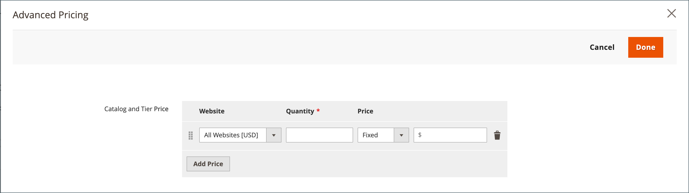
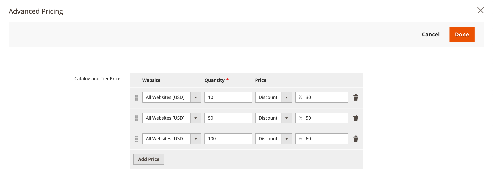

# 공유 카탈로그 가격 및 구조 설정

공유 카탈로그의 가격 및 구조를 설정하는 작업은 두 단계로 진행됩니다. 프로세스의 현재 위치는 페이지 상단의 진행률 표시줄에 숫자가 강조 표시됩니다. 진행률 표시줄을 클릭하여 언제든지 프로세스의 다른 단계를 볼 수 있습니다. 예를 들어 사용자 지정 가격 책정 작업을 수행하는 경우 제품 선택 페이지로 돌아가 참조할 수 있습니다. 간단히 클릭 **[!UICONTROL Products]** 페이지 상단의 진행률 표시줄에서 을 클릭한 다음 을 클릭합니다. **[!UICONTROL Pricing]** 을 클릭하여 사용자 지정 가격 페이지로 돌아갑니다. 이 과정에서 귀하의 작업은 손실되지 않습니다.

{width="700" zoomable="yes"}

표준 범주 트리에서 루트 범주는 최상위 컨테이너이며 다음과 같이 합니다. _기본 범주_ 샘플 데이터. 그러나 공유 카탈로그가 활성화되면 카테고리 트리에는 라는 외부 컨테이너가 있습니다 _루트 카탈로그_. 루트 카탈로그는 시스템에 존재하는 다른 모든 범주 구조를 포함합니다. 자세한 내용은 [카탈로그 범위](../catalog/introduction.md#catalog-scope).

## 1단계: 공유 카탈로그 가격 책정 및 구조 구성을 엽니다.

1. 다음에서 _관리자_ 사이드바, 이동 **[!UICONTROL Catalog]** > **[!UICONTROL Shared Catalogs]**

1. 그리드에 있는 공유 카탈로그의 경우 _[!UICONTROL Action]_열 및 클릭&#x200B;**[!UICONTROL Set Pricing and Structure]**.

   {width="700" zoomable="yes"}

1. 공유 카탈로그가 처음 구성된 경우 **[!UICONTROL Configure]** 을 클릭하여 다음 단계를 계속하십시오.

## 2단계: 제품 선택

프로세스의 첫 번째 단계는 공유 카탈로그에 포함할 제품을 선택하는 것입니다. 제품 선택 페이지에는 다음 기능이 있습니다. [범주 트리](../catalog/category-create.md) 왼쪽에는 동기화된 제품 격자가 있고, 오른쪽에는 동기화된 제품 격자가 있습니다. 트리에서 카테고리를 클릭하면 카테고리의 제품이 그리드에 나타납니다.

선택한 제품이 있는 카테고리만 [위쪽 탐색](../catalog/navigation-top.md) 공유 카탈로그를 상점 전면에서 볼 때. 기본적으로 상점 탐색에는 처음 세 가지 카테고리 수준만 포함되며 루트 카테고리는 포함되지 않습니다.

1. 사용 **저장** 설정할 선택기 [범위](../catalog/introduction.md#product-scope) 을 참조하십시오.

   공유 카탈로그를 처음 저장하기 전에만 구성 범위를 설정할 수 있습니다. 나중에 제품 선택을 편집하면 스토어 선택기를 사용할 수 없습니다.

   {width="600" zoomable="yes"}

1. 범주 트리에서 다음 중 하나를 수행합니다.

   - 모든 제품을 포함하려면 **[!UICONTROL Select all]** 또는 상위 카테고리의 확인란을 선택합니다.
   - 특정 제품 카테고리를 포함하려면 포함하려는 각 카테고리의 확인란을 선택합니다.
   - 개별 제품을 포함하거나 제외하려면 제품 확인란을 선택하거나 선택 취소합니다.

   트리의 각 카테고리 아래에 있는 표기법에는 현재 공유 카탈로그에 포함된 카테고리의 제품 수가 표시됩니다. 아래 표기법 [루트 범주](../catalog/category-root.md) 공유 카탈로그에 대해 현재 선택된 모든 범주의 총 제품 수를 표시합니다.

1. 그리드에서 카테고리 제품을 보려면 트리에서 카테고리 이름을 클릭합니다. 카테고리를 선택하면 다음 상황이 발생합니다.

   - 그리드의 첫 번째 열에 있는 토글이 녹색으로 설정됩니다 _날짜_ 선택한 각 제품에 대한 위치.
   - 제품이 여러 범주에 할당되고 이 중 하나에서 선택되지 않은 경우 다른 범주를 통해 사용할 수 있으며 을 사용할 때도 사용할 수 있습니다 [카탈로그 검색](../catalog/search.md).
   - 시스템에서 자동으로 [범주 권한](../catalog/category-permissions.md) 끝 `Allow` 을 참조하십시오.

1. 필요한 경우 필터 및 기타 격자 컨트롤을 사용하여 공유 카탈로그에 포함할 제품을 찾습니다.

   첫 번째 열에서 전환을 클릭하여 개별 제품을 개별적으로 선택하거나 생략할 수 있습니다.

   제품이 없지만 CMS 콘텐츠 또는 외부 링크에 연결된 카테고리를 선택하면 상점 첫 화면의 위쪽 탐색에 표시됩니다.

   만든 범주 설정은 구성이 저장될 때까지 데이터베이스에 영구적으로 기록되지 않습니다. 단, 구조 및 가격 작업을 수행할 때 일시적으로 저장됩니다.

1. 클릭 **[!UICONTROL Next]**.

   {width="600" zoomable="yes"}

## 3단계: 사용자 정의 가격 설정

각 제품에 대해 개별적으로 사용자 정의 가격을 설정하거나 _[!UICONTROL Action]_다수의 제품 레코드에 대해 사용자 정의 가격을 고정 금액 또는 백분율로 설정할 수 있습니다.

- **[!UICONTROL Fixed]**: 최종 제품 가격을 지정합니다. 예를 들어 고정 가격 $10.00를 입력하면 해당 회사의 상점 가격은 $10.00입니다.

  >[!NOTE]
  >
  >기준 가격과 입력된 고정 값 사이의 최소값이 최종 제품 가격으로 사용됩니다.

  >[!NOTE]
  >
  >**_고정 가격_** 사용자 정의 가능한 제품 옵션 _아님_ 그룹 가격, 계층 가격, 특별 가격 또는 카탈로그 가격 규칙의 영향을 받습니다.

- **[!UICONTROL Percentage]**: 할인 백분율을 기반으로 하여 사용자 지정 가격을 결정합니다. 예를 들어 10% 할인을 제공하려면 사용자 지정 가격 유형을 로 설정합니다. `Percentage` 및 입력 `10`. 할인된 맞춤 가격은 원래 제품 가격의 90%입니다.

다음 제품 유형에 대해 할인을 고정 금액 또는 백분율로 설정하려면 _[!UICONTROL Custom Price]_표의 열:

- [단순](../catalog/product-create-simple.md) (구성 가능한 제품 변형 포함)
- [번들](../catalog/product-create-bundle.md)
- [다운로드 가능](../catalog/product-create-downloadable.md)
- [가상](../catalog/product-create-virtual.md)

다음에 대한 사용자 정의 가격 열이 비어 있습니다. [구성 가능](../catalog/product-create-configurable.md) 및 [그룹화](../catalog/product-create-grouped.md) 제품 유형 및 대상 [기프트 카드](../catalog/product-gift-card-create.md).

그리드에서 제품 선택을 변경할 수 없습니다 _사용자 정의 가격_ 페이지를 가리키도록 업데이트하는 중입니다. 그러나 페이지 상단의 진행률 표시기를 사용하여 이전 단계로 돌아가서 제품 선택을 변경할 수 있습니다.

{width="600" zoomable="yes"}

### 사용자 정의 가격 적용

1. 다중 사이트 설치의 경우 다음을 설정합니다. **[!UICONTROL Website]** 사용자 지정 가격이 적용되는 웹 사이트로 이동합니다.

   {width="600" zoomable="yes"}

1. 다음 방법 중 하나를 사용하여 사용자 정의 가격을 적용할 제품을 선택합니다.

   - 카테고리 트리를 사용하여 특정 카테고리의 모든 제품을 선택합니다.
   - 설정 _[!UICONTROL Mass Actions]_헤더에서 다음으로 제어 `Select All`.
   - 개별 제품의 확인란을 선택합니다.

   표에는 현재 선택한 범주에 있는 제품이 표시되며 표준 컨트롤을 사용하여 제품을 찾고 목록을 필터링할 수 있습니다.

   {width="600" zoomable="yes"}

1. 설정 **[!UICONTROL Actions]** 다음 중 하나를 수행합니다.

   - `Set Discount` - 선택한 모든 제품에 할인율을 적용합니다. 영향을 받는 각 제품 가격은 **_할인됨_** 가격.
   - `Adjust Fixed Price` - 선택한 모든 제품에 고정 가격 할인 퍼센트를 적용합니다. 영향을 받는 각 제품 가격은 **_조정 고정_** 가격.

   {width="600" zoomable="yes"}

1. 메시지가 표시되면 할인 또는 가격 조정을 입력하고 를 클릭합니다 **[!UICONTROL Apply]**.

   {width="400"} 

   {width="400"}

   선택한 모든 제품에 할인이 적용되며 _사용자 정의 가격_ 열은 적용되는 할인 및 금액의 유형을 반영합니다.

   {width="600" zoomable="yes"}

### 계층 가격 적용

[계층 가격](../catalog/product-price-tier.md) 공유 카탈로그의 제품에 대해 수량 할인을 제공할 수 있습니다. 다음 _계층 가격_ 그리드의 열에는 _고급 가격 책정_ 공유 카탈로그에 특별히 적용되는 옵션입니다. 제품에 이미 계층 가격이 포함되어 있는 경우 링크 뒤에 기존 계층의 수가 괄호 안에 표시됩니다.

다음 지침은 단일 제품에 계층 가격을 적용하는 방법을 보여 줍니다. 여러 제품에 계층 가격을 적용하려면 다음을 참조하십시오 [계층 가격 가져오기](../systems/data-import-price-tier.md).

1. 표에 있는 제품에 대해 _계층 가격_ 열 및 클릭 **[!UICONTROL Configure]**.

   {width="600" zoomable="yes"}

1. 다음에서 _고급 가격 책정_ 페이지, 클릭 **[!UICONTROL Add Price]** 다음을 수행합니다.

   {width="600" zoomable="yes"}

   - 설정 **[!UICONTROL Website]** 계층 가격이 적용되는 웹 사이트에 적용됩니다.
   - 할인을 받기 위해 구매해야 하는 제품의 수량을 입력합니다.
   - 설정 **[!UICONTROL Price]** 다음 할인 유형 중 하나로
      - `Fixed`
      - `Discount`
   - 할인 금액을 입력합니다.
   - 다른 계층을 입력하려면 **가격 추가** 프로세스를 반복하여 다음 계층을 정의합니다.

   {width="600" zoomable="yes"}

1. 완료되면 다음을 클릭하십시오. **[!UICONTROL Done]**.

   그리드에서 계층의 수는 의 괄호 안에 표시됩니다. _[!UICONTROL Tier Price]_열.

   {width="600" zoomable="yes"}

## 구조 및 가격 책정 저장

사용자 정의 가격이 완료되면 다음을 클릭하십시오. **[!UICONTROL Generate Catalog]** 그러면 **[!UICONTROL Save]**.

이제 공유 카탈로그가 데이터베이스에 저장됩니다. 이 이름은 _[!UICONTROL Shared Catalog]_열_[!UICONTROL Products]_ 그리드. 다음 단계는 [공유 카탈로그를 회사에 할당하십시오.](./catalog-shared-assign-companies.md).
