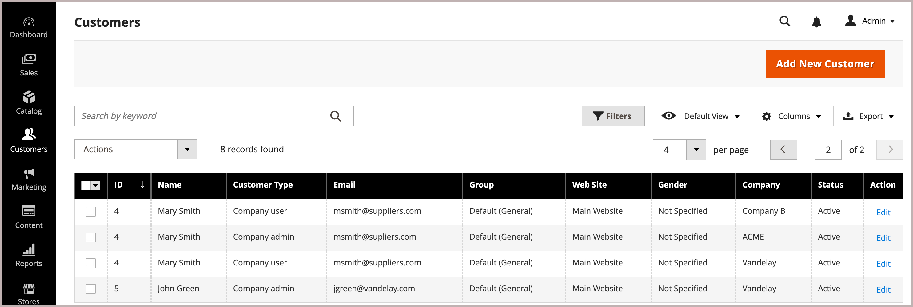

# 회사 계정에 사용자 추가

구성에서 활성화하면 회사 관리자가 상점 첫 화면에서 회사 사용자를 추가하고 관리합니다. 그러나 회사 사용자 계정은 관리자로부터 추가하고 관리할 수도 있습니다.

필요한 경우 사용자를 두 개 이상의 회사에 할당할 수 있습니다. 예를 들어 B2B 구매자가 여러 회사를 지원하는 경우 거래하는 모든 회사에 사용자 계정을 추가할 수 있습니다. 상점 맨 앞에서는 여러 회사에 할당된 구매자가 *[!UICONTROL Company]* 메뉴에서 사용 가능한 회사를 선택하여 회사 계정 간에 전환할 수 있습니다.

{width="700"}

>[!NOTE]
>
>개인 사용자가 이미 스토어에 개인 계정이 있고 나중에 회사에 출근하는 경우 개인 계정을 회사에 할당하지 마십시오. 대신 회사 이메일 주소가 있는 사용자에 대한 회사 사용자 계정을 만듭니다.

## 회사 사용자 추가

회사 사용자를 추가할 때 사용자 계정과 처음 연결된 회사가 기본 회사입니다.

1. 관리자 사이드바에서 **[!UICONTROL Customers > All Customers]**(으)로 이동합니다.

1. **[!UICONTROL Add new customer]**&#x200B;을(를) 클릭합니다.

1. 새 계정을 구성합니다.

   1. **[!UICONTROL Customer Active]** 전환을 설정하여 초기 계정 상태를 지정하십시오.

      계정을 즉시 활성화하려면 켜고, 비활성 계정을 만들려면 비활성화하십시오.

   1. **[!UICONTROL Associate to Website]** 목록에서 웹 사이트 범위를 선택하십시오.

   1. 사용 가능한 회사를 보려면 **[!UICONTROL Associate to Company]**&#x200B;을(를) 클릭하십시오.

      {width="675"}

      필요한 경우 입력란에 회사 이름의 처음 몇 글자를 입력하여 목록을 필터링합니다.

   1. 목록에서 고객을 할당할 회사를 하나 이상 선택하고 **[!UICONTROL Done]**&#x200B;을(를) 클릭합니다.

      회사 사용자는 계정과 연결된 각 회사의 고객 그룹(또는 [공유 카탈로그](catalog-shared.md))에 자동으로 추가됩니다.

   1. 필요한 사용자 계정 정보 **[!UICONTROL First Name]**, **[!UICONTROL Last Name]** 및 **[!UICONTROL Email]**&#x200B;을(를) 입력하십시오.

   1. **[!UICONTROL Allow remote shopping assistance]**&#x200B;을(를) 활성화하여 영업 담당자가 고객을 대신하여 상점 앞에 로그인할 수 있도록 허용합니다.

   1. **[!UICONTROL Save Customer]**&#x200B;을(를) 클릭하여 변경 내용을 적용합니다.

      {width="675"}

[!UICONTROL Customers grid]에는 사용자가 할당된 각 회사에 대해 별도의 행이 표시됩니다. 다음 열이 업데이트됩니다.

- _[!UICONTROL Customer Type]_열이 업데이트되어 사용자에게 할당된 역할을 표시합니다.

  고객을 처음으로 회사에 할당한 경우 _[!UICONTROL Customer Type]_열이_[!UICONTROL Individual user]_&#x200B;에서 _[!UICONTROL Company User]_(으)로 업데이트됩니다.

- _[!UICONTROL Group]_열이 회사에 할당된 고객 그룹(또는 공유 카탈로그)의 이름으로 변경됩니다.

- _[!UICONTROL Company]_열에는 현재 고객 프로필과 연결된 회사의 이름이 표시됩니다.

## 하나 이상의 회사 계정에 사용자 할당

새 사용자를 할당할 때 사용자 계정과 처음 연결하는 회사가 기본 회사입니다.

1. _관리자_ 사이드바에서 **[!UICONTROL Customers]** > **[!UICONTROL All Customers]**(으)로 이동합니다.

1. 그리드에서 고객을 찾고 _[!UICONTROL Action]_열에서&#x200B;**[!UICONTROL Edit]**을(를) 클릭합니다.

1. 왼쪽 패널에서 **[!UICONTROL Account Information]**&#x200B;을(를) 선택합니다.

1. **[!UICONTROL Associate to Company]** 목록에서 회사 사용자에게 할당할 회사를 하나 이상 선택하고 **[!UICONTROL Done]**&#x200B;을(를) 클릭합니다.

1. **[!UICONTROL Save Customer]**&#x200B;을(를) 클릭하여 변경 내용을 적용합니다.

## 사용자 계정에서 회사 할당 제거

사용자 프로필에서 회사를 제거하면 해당 회사에 대한 사용자 액세스가 취소됩니다. 사용자 데이터는 관리에서 계속 액세스할 수 있습니다. 모든 회사 할당을 제거하면 _[!UICONTROL Customer Type]_이(가)*[!UICONTROL Individual user]*(으)로 변경되어 계정에 대한 B2B 기능을 사용할 수 없게 됩니다.

1. 관리자의 고객 그리드에서 업데이트할 고객 프로필을 편집합니다.

1. *[!UICONTROL Account Information] 섹션에서 회사 이름 레이블의 **[!UICONTROL X]**&#x200B;을(를) 클릭하여 **[!UICONTROL Associate to Company]** 필드에서 할당된 회사를 제거합니다.

1. **[!UICONTROL Save Customer]**&#x200B;을(를) 클릭하여 변경 내용을 적용합니다.

>[!NOTE]
>
>회사 사용자가 회사 관리자로 할당된 경우 회사 계정을 업데이트하여 새 회사 관리자를 할당할 때까지 이 사용자로부터 회사 연결을 수행할 수 없습니다.
