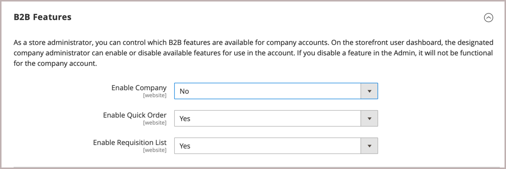
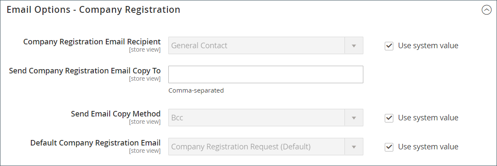

# B2B 기능 활성화

기본적으로 모든 B2B 기능은 비활성화되어 있습니다. 스토어 관리자는 Commerce 스토어에 필요한 경우 B2B 기능을 활성화하거나 비활성화할 수 있습니다. B2B 구성 설정의 전체 목록을 보려면 [B2B 기능 구성 참조](../configuration-reference/general/b2b-features.md)를 참조하십시오.

고객 회사에 대한 지원을 활성화하면 추가 B2B 기능이 자동으로 활성화됩니다.

- [!DNL Shared Catalog]

  다양한 회사에 대한 사용자 지정 가격 구성을 지원하며 모든 스토어에 대해 카테고리 권한을 활성화합니다.

- [!DNL Enable Shared Catalog direct products price assigning]

  공유 카탈로그에 지정된 제품만 가격 인덱스에 저장하여 사이트 성능을 개선합니다. 이 기능을 활성화하는 것은 여러 공유 카탈로그가 있는 판매자가 다른 회사에 대한 사용자 지정 가격을 관리하는 모범 사례입니다.

- [!DNL B2B Quotes]

  판매자와 회사 구매자가 가격을 협상할 수 있는 기능을 제공합니다.

- [!DNL B2B default payment and shipping methods]

  상점에서 B2B 구매자가 사용할 수 있는 결제 및 배송 옵션의 선택을 결정합니다.

이러한 기능에 대한 구성 설정은 [!DNL Enable Company]이(가) `Yes`(으)로 설정된 경우에만 표시됩니다.

B2B [!DNL Quick Order] 및 [!DNL Requisition List] 기능은 독립적으로 활성화 및 비활성화할 수 있습니다.

## B2B 기능 구성

1. _관리자_ 사이드바에서 **[!UICONTROL Stores]** > _[!UICONTROL Settings]_>**[!UICONTROL Configuration]**(으)로 이동합니다.

   다중 사이트를 설치한 경우 왼쪽 상단의 **[!UICONTROL Store View]** 컨트롤을 구성이 적용되는 웹 사이트로 설정합니다.

1. _[!UICONTROL General]_아래의 왼쪽 패널에서&#x200B;**[!UICONTROL B2B Features]**을(를) 선택합니다.

   {width="600"}

   - 고객이 자신의 회사 계정을 관리하고 **[!UICONTROL Enable Company]**&#x200B;을(를) `Yes`(으)로 설정하여 추가 B2B 기능에 대한 지원을 사용하도록 허용합니다.

     회사 지원을 활성화하면 공유 카탈로그, B2B 견적, B2B 결제 방법 및 B2B 운송 방법이 자동으로 활성화됩니다.

   - 고객과 게스트가 SKU 또는 제품 이름을 기반으로 빠르게 주문하도록 하려면 **[!UICONTROL Enable Quick Order]**&#x200B;을(를) `Yes`(으)로 설정합니다.

   - 고객이 계정 대시보드에서 구매요청 목록을 만들고 관리할 수 있도록 하려면 **[!UICONTROL Enable Requisition List]**&#x200B;을(를) `Yes`(으)로 설정하십시오.

     고객이 계정에 보유할 수 있는 최대 목록 수를 [구성](configure-requisition-lists.md)할 수도 있습니다.

1. 완료되면 **[!UICONTROL Save Config]**&#x200B;을(를) 클릭합니다.

## 기본 B2B 결제 및 배송 방법 구성

1. **[!UICONTROL Default B2B Payment Methods]** 섹션에서 를 확장합니다.

1. B2B 주문에 대한 기본 결제 방법을 설정하려면 **[!UICONTROL Applicable Payment Methods]**&#x200B;을(를) 다음 중 하나로 설정하십시오.

   - `All Payment Methods`

   - `Selected Payment Methods`

     특정 옵션의 경우 Ctrl 키(PC) 또는 Command 키(Mac)를 누른 채 각 옵션을 클릭하여 고객이 사용할 수 있도록 하려는 **[!UICONTROL Payment Methods]**&#x200B;을(를) 선택합니다.

   [결제 방법](../configuration-reference/sales/payment-methods.md) 목록에 스토어에서 현재 사용 또는 사용 안 함으로 설정된 옵션이 표시됩니다. 이 목록에는 표준 결제 방법 외에도 다음 항목도 포함됩니다.

   - 결제 정보는 필요하지 않습니다
   - [계정입금](#configure-payment-on-account)
   - 저장된 계정
   - 저장된 카드

   {width="600"}

1. **[!UICONTROL Default B2B Shipping Methods]** 섹션에서 를 확장합니다.

1. B2B 주문에 대한 기본 배송 방법을 지정하려면 **[!UICONTROL Applicable Shipping Methods]**&#x200B;을(를) 다음 중 하나로 설정하십시오.

   - `All Shipping Methods`
   - `Selected Shipping Methods`

     특정 옵션의 경우 Ctrl 키(PC) 또는 Command 키(Mac)를 누른 채 각 옵션을 클릭하여 고객이 사용할 수 있도록 하려는 **[!UICONTROL Shipping Methods]**&#x200B;을(를) 선택합니다.

     배송 방법 목록에 현재 [사용 또는 사용 안 함](../configuration-reference/sales/delivery-methods.md)이 표시됩니다.

   {width="600"}

1. 완료되면 **[!UICONTROL Save Config]**&#x200B;을(를) 클릭합니다.

## 회사 이메일 옵션 구성

회사에 대한 기본 연락처로 할당된 [영업 담당자](account-company-manage.md#assign-a-sales-representative)은(는) 회사에 보낸 많은 자동 전자 메일 메시지를 보낸 사람으로 기본적으로 구성됩니다.

1. _관리자_ 사이드바에서 **[!UICONTROL Stores]** > _[!UICONTROL Settings]_>**[!UICONTROL Configuration]**(으)로 이동합니다.

1. 왼쪽 패널에서 **[!UICONTROL Customers]**&#x200B;을(를) 확장하고 **[!UICONTROL Company Configuration]**&#x200B;을(를) 선택합니다.

1. 필요한 경우 **[!UICONTROL Store View]**&#x200B;을(를) 저장소 보기로 설정하여 구성의 [범위](../getting-started/websites-stores-views.md#scope-settings)을(를) 정의합니다.

1. **[!UICONTROL Company Registration]** 섹션을 완료합니다.

   >[!NOTE]
   >
   >필드를 편집할 수 있도록 하려면 **[!UICONTROL Use system value]** 확인란의 선택을 취소하십시오.

   - 새 회사 등록 요청을 받으면 알림을 받을 [스토어 연락처](../getting-started/store-details.md#store-email-addresses)로 **[!UICONTROL Company Registration Email Recipient]**&#x200B;을(를) 설정합니다.

   - **[!UICONTROL Send Company Registration Email Copy To]**&#x200B;의 경우 등록 알림 복사본을 받을 각 사용자의 전자 메일 주소를 입력하십시오. 여러 이메일 주소는 쉼표로 구분합니다.

   - 알림 복사본을 보내는 방법을 결정하려면 **전자 메일 복사본 보내기 메서드**&#x200B;를 다음 중 하나로 설정하십시오.

      - `Bcc` - 고객에게 보내는 것과 동일한 전자 메일의 헤더에 받는 사람을 포함하여 _무료 사본_&#x200B;을 보냅니다. BCC 수신자는 고객에게 표시되지 않습니다.
      - `Separate Email` - 복사본을 별도의 전자 메일로 보냅니다.

   - 기본값 대신 사용할 전자 메일 템플릿을 준비한 경우 **[!UICONTROL Default Company Registration Email]**&#x200B;을(를) 템플릿 이름으로 설정합니다. 기본적으로 `Company Registration Request` 템플릿이 사용됩니다.

     {width="600"}

1. **[!UICONTROL Customer-Related Emails]** 섹션을 완료합니다.

   기본값 대신 사용할 대체 전자 메일 템플릿을 준비한 경우 다음 각 항목에 사용할 템플릿을 선택합니다.

   - **[!UICONTROL Default 'Sales Rep Assigned' Email]**
   - **[!UICONTROL Default 'Assign Company to Customer' Email]**
   - **[!UICONTROL Default 'Assign Company Admin' Email]**
   - **[!UICONTROL Default 'Company Admin Inactive' Email]**
   - **[!UICONTROL Default 'Company Admin Changed to Member' Email]**
   - **[!UICONTROL Default 'Customer Status Active' Email]**
   - **[!UICONTROL Default 'Customer Status Inactive' Email]**

   {width="600"}

1. **[!UICONTROL Company Status Change]** 섹션을 완료합니다.

   - **[!UICONTROL Send Company Status Change Email Copy To]**&#x200B;의 경우 상태 변경 알림의 복사본을 받을 각 사용자의 전자 메일 주소를 입력하십시오. 여러 이메일 주소는 쉼표로 구분합니다.

   - 알림 복사본을 보내는 방법을 결정하려면 **전자 메일 복사본 보내기 메서드**&#x200B;를 다음 중 하나로 설정하십시오.

      - `Bcc` - 고객에게 보내는 것과 동일한 전자 메일의 헤더에 받는 사람을 포함하여 _무료 사본_&#x200B;을 보냅니다. BCC 수신자는 고객에게 표시되지 않습니다.
      - `Separate Email` - 복사본을 별도의 전자 메일로 보냅니다.

   - 회사 상태가 `Pending Approval`에서 `Active`(으)로 변경될 때 사용할 전자 메일 템플릿을 준비한 경우 **[!UICONTROL Default 'Company Status Change to Active 1' Email]**&#x200B;을(를) 템플릿 이름으로 설정합니다. 기본적으로 `Company Status Active 1` 템플릿이 사용됩니다.

   - 회사 상태가 `Rejected` 또는 `Blocked`에서 `Active`(으)로 변경될 때 사용할 전자 메일 템플릿을 준비한 경우 **[!UICONTROL Default 'Company Status Change to Active 2' Email]**&#x200B;을(를) 템플릿 이름으로 설정합니다. 기본적으로 `Company Status Active 2` 템플릿이 사용됩니다.

   - 회사 상태가 `Rejected`(으)로 변경될 때 사용할 전자 메일 템플릿을 준비한 경우 **[!UICONTROL Default 'Company Status Change to Rejected' Email]**&#x200B;을(를) 템플릿 이름으로 설정합니다. 기본적으로 `Company Status Rejected` 템플릿이 사용됩니다.

   - 회사 상태가 `Blocked`(으)로 변경될 때 사용할 전자 메일 템플릿을 준비한 경우 **[!UICONTROL Default 'Company Status Change to Blocked' Email]**&#x200B;을(를) 템플릿 이름으로 설정합니다. 기본적으로 `Company Status Blocked` 템플릿이 사용됩니다.

   - 회사 상태가 `Pending Approval`(으)로 변경될 때 사용할 전자 메일 템플릿을 준비한 경우 **[!UICONTROL Default 'Company Status Change to Pending Approval' Email]**&#x200B;을(를) 템플릿 이름으로 설정합니다. 기본적으로 `Company Status Pending Approval` 템플릿이 사용됩니다.

   {width="600"}

1. **[!UICONTROL Company Credit Emails]** 섹션을 완료합니다.

   - 회사에 할당된 크레딧 한도가 변경되면 알림을 받을 [스토어 연락처](../getting-started/store-details.md#store-email-addresses)로 **[!UICONTROL Company Credit Change Email Sender]**&#x200B;을(를) 설정합니다. 기본적으로 알림은 _영업 담당자_&#x200B;에게 전송됩니다.

   - **[!UICONTROL Send Company Credit Change Email Copy To]**&#x200B;의 경우 신용 변경 알림의 복사본을 받을 각 사용자의 전자 메일 주소를 입력하십시오. 여러 이메일 주소는 쉼표로 구분합니다.

   - 알림 복사본을 보내는 방법을 결정하려면 **전자 메일 복사본 보내기 메서드**&#x200B;를 다음 중 하나로 설정하십시오.

      - `Bcc` - 고객에게 보내는 것과 동일한 전자 메일의 헤더에 받는 사람을 포함하여 _무료 사본_&#x200B;을 보냅니다. BCC 수신자는 고객에게 표시되지 않습니다.
      - `Separate Email` - 복사본을 별도의 전자 메일로 보냅니다.

   - 기본값 대신 사용할 이메일 템플릿을 준비한 경우 회사 관리자에게 전송되는 다음 각 알림에 대한 템플릿을 선택합니다.

      - **[!UICONTROL Allocated Email Template]**
      - **[!UICONTROL Updated Email Template]**
      - **[!UICONTROL Reimbursed Email Template]**
      - **[!UICONTROL Refunded Email Template]**
      - **[!UICONTROL Reverted Email Template]**

   {width="600"}

1. 완료되면 **[!UICONTROL Save Config]**&#x200B;을(를) 클릭합니다.

## 주문 승인 구성

주문 처리 및 구매 발주를 추적할 수 있으므로 회사 관리자는 회사 구매자의 작업을 제어할 수 있습니다. 주문 승인 기능은 스토어 관리자가 구매 주문 기능을 활성화한 경우 사용할 수 있습니다.

1. _관리자_ 사이드바에서 **[!UICONTROL Stores]** > _[!UICONTROL Settings]_>**[!UICONTROL Configuration]**(으)로 이동합니다.

1. 왼쪽 패널에서 **[!UICONTROL General]**&#x200B;을(를) 확장하고 **[!UICONTROL B2B Features]**&#x200B;을(를) 선택합니다.

1. **[!UICONTROL Order Approval Configuration]** 섹션에서 를 확장합니다.

   {width="600"}

1. 회사가 자체 구매 주문을 만들 수 있도록 하려면 **[!UICONTROL Enable Purchase Orders]**&#x200B;을(를) `Yes`(으)로 설정하십시오.

1. 완료되면 **[!UICONTROL Save Config]**&#x200B;을(를) 클릭합니다.

   구매 주문 기능은 웹 사이트 수준에서 활성화됩니다. 회사에 대해 이 유형의 주문을 사용하려면 각 [회사 프로필](account-company-manage.md)의 적절한 설정과 동일한 작업을 수행합니다.

## 구매 주문 구성

1. _관리자_ 사이드바에서 **[!UICONTROL Customers]** > **[!UICONTROL Companies]**(으)로 이동합니다.

1. 목록에서 회사를 찾은 다음 **[!UICONTROL Edit]**&#x200B;을(를) 클릭합니다.

1. **[!UICONTROL Advanced Settings]** 섹션에서 를 확장합니다.

1. **[!UICONTROL Enable Purchase Orders]**&#x200B;을(를) `Yes`(으)로 설정합니다.

1. 완료되면 **[!UICONTROL Save]**&#x200B;을(를) 클릭합니다.

활성화한 후 회사 관리자의 상점 [계정 대시보드](../customers/account-dashboard.md)에 **[!UICONTROL Approval Rules]** 섹션이 표시됩니다.

>[!NOTE]
>
>[회사 사용자 역할 권한](account-company-roles-permissions.md)을(를) 기반으로 회사 관리자가 상점 첫 구매에 대한 액세스 권한을 부여해야 합니다.

## 계정에서 결제 구성

계정입금은 기업이 프로필에 지정된 신용 한도까지 구매를 할 수 있는 오프라인 결제 방식이다. 계정에서 지불은 전 세계적으로 또는 회사별로 활성화할 수 있으며 활성화된 경우에만 체크아웃 중에 표시됩니다. _계정 결제_&#x200B;를 결제 방법으로 사용하면 주문 맨 위에 계정 상태를 나타내는 메시지가 나타납니다. 특정 회사에 대해 이 결제 방법을 구성하려면 [회사 계정 관리](account-company-manage.md)를 참조하십시오.

>[!NOTE]
>
>계정 결제는 [여러 배송 주소](../stores-purchase/shipping-settings.md#multiple-addresses)를 가진 주문에 대해 지원되지 않으며 이러한 주문에 대한 결제 옵션 사이에 나타나지 않습니다.

스토어에 대해 계정입금을 사용하려면

1. _관리자_ 사이드바에서 **[!UICONTROL Stores]** > _[!UICONTROL Settings]_>**[!UICONTROL Configuration]**(으)로 이동합니다.

1. 왼쪽 패널에서 **[!UICONTROL Sales]**&#x200B;을(를) 확장하고 **[!UICONTROL Payment Methods]**&#x200B;을(를) 선택합니다.

1. **[!UICONTROL Payment on Account]** 섹션에서 를 확장합니다.

   {width="600"}

   >[!NOTE]
   >
   >필요한 경우 먼저 **[!UICONTROL Use system value]** 확인란의 선택을 취소하여 이러한 설정을 변경합니다.

1. 계정에서 결제를 허용하려면 **[!UICONTROL Enabled]**&#x200B;을(를) `Yes`(으)로 설정하십시오.

1. 체크아웃 중에 결제 방법을 식별하는 **[!UICONTROL Title]**&#x200B;을(를) 입력하거나 `Payment on Account` 기본 제목을 수락할 수 있습니다.

1. 일반적으로 주문이 승인 대기 중인 경우 승인될 때까지 기본 **[!UICONTROL New Order Status]**&#x200B;을(를) `Pending`(으)로 수락합니다.

   원하는 경우 이 결제 방법을 사용하여 새 주문에 대해 `Processing` 또는 `Suspected Fraud` 상태를 사용할 수 있습니다.

1. **[!UICONTROL Payment from Applicable Countries]**&#x200B;을(를) 다음 중 하나로 설정합니다.

   - `All Allowed Countries` - 스토어 구성에 지정된 모든 [국가](../getting-started/store-details.md#country-options)의 고객이 이 결제 방법을 사용할 수 있습니다.
   - `Specific Countries` - 이 옵션을 선택하면 _[!UICONTROL Payment from Specific Countries]_목록이 나타납니다. 여러 국가를 선택하려면 Ctrl 키(PC) 또는 Command 키(Mac)를 누른 채 각 옵션을 클릭합니다.

1. 이 결제 방법을 사용하는 데 필요한 주문 금액으로 **[!UICONTROL Minimum Order Total]** 및 **[!UICONTROL Maximum Order Total]**&#x200B;을(를) 설정합니다.

   >[!NOTE]
   >
   >합계가 최소 또는 최대 합계 값 사이에 속하거나 정확히 일치하는 경우 주문이 적합합니다.

1. 체크아웃 중에 표시되는 결제 방법 목록에 이 항목의 위치를 설정하는 **[!UICONTROL Sort Order]** 번호를 입력하십시오.

   값은 다른 결제 방법과 관련이 있습니다. (`0` = 첫 번째, `1` = 두 번째, `2` = 세 번째 등)

1. 완료되면 **[!UICONTROL Save Config]**&#x200B;을(를) 클릭합니다.
