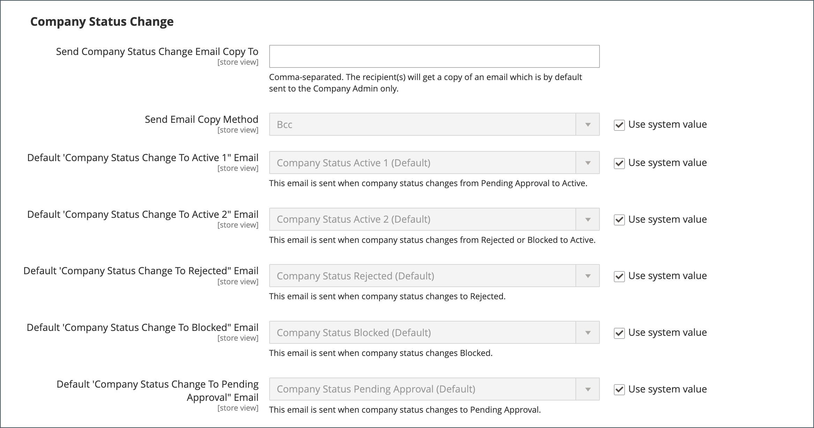

# B2B 기능 활성화

기본적으로 모든 B2B 기능은 비활성화되어 있습니다. 스토어 관리자는 상거래 스토어에 필요한 경우 B2B 기능을 활성화하거나 비활성화할 수 있습니다. B2B 구성 설정의 전체 목록은 다음을 참조하십시오. [B2B 기능 구성 참조](../configuration-reference/general/b2b-features.md).

고객 회사에 대한 지원을 활성화하면 추가 B2B 기능이 자동으로 활성화됩니다.

- [!DNL Shared Catalog]

  다양한 회사에 대한 사용자 지정 가격 구성을 지원하며 모든 스토어에 대해 카테고리 권한을 활성화합니다.

- [!DNL Enable Shared Catalog direct products price assigning]

  공유 카탈로그에 지정된 제품만 가격 인덱스에 저장하여 사이트 성능을 개선합니다. 이 기능을 활성화하는 것은 여러 공유 카탈로그가 있는 판매자가 다른 회사에 대한 사용자 지정 가격을 관리하는 모범 사례입니다.

- [!DNL B2B Quotes]

  판매자와 회사 구매자가 가격을 협상할 수 있는 기능을 제공합니다.

- [!DNL B2B default payment and shipping methods]

  상점에서 B2B 구매자가 사용할 수 있는 결제 및 배송 옵션의 선택을 결정합니다.

이러한 기능에 대한 구성 설정은 다음과 같은 경우에만 표시됩니다 [!DNL Enable Company] 이(가) (으)로 설정됨 `Yes`.

B2B [!DNL Quick Order] 및 [!DNL Requisition List] 기능은 독립적으로 활성화 및 비활성화될 수 있습니다.

## B2B 기능 구성

1. 다음에서 _관리자_ 사이드바, 이동 **[!UICONTROL Stores]** > _[!UICONTROL Settings]_>**[!UICONTROL Configuration]**.

   다중 사이트 설치가 있는 경우 **[!UICONTROL Store View]** 구성이 적용되는 웹 사이트의 왼쪽 상단 모서리에서 을 제어합니다.

1. 아래의 왼쪽 패널에서 _[!UICONTROL General]_, 선택&#x200B;**[!UICONTROL B2B Features]**:

   {width="600"}

   - 을(를) 통해 고객이 자신의 회사 계정을 관리하고 추가 B2B 기능에 대한 지원을 활성화할 수 있습니다. **[!UICONTROL Enable Company]**  끝 `Yes`.

     회사 지원을 활성화하면 공유 카탈로그, B2B 견적, B2B 결제 방법 및 B2B 운송 방법이 자동으로 활성화됩니다.

   - 고객 및 게스트가 SKU 또는 제품 이름을 기반으로 신속하게 주문할 수 있도록 하려면 을 설정합니다. **[!UICONTROL Enable Quick Order]** 끝 `Yes`.

   - 고객이 계정 대시보드에서 구매요청 목록을 생성하고 관리할 수 있도록 하려면 다음을 설정합니다. **[!UICONTROL Enable Requisition List]** 끝 `Yes`.

     다음을 수행할 수도 있습니다. [최대 목록 수 구성](configure-requisition-lists.md) 고객은 자신의 계정에 대해 가질 수 있습니다.

1. 완료되면 다음을 클릭하십시오. **[!UICONTROL Save Config]**.

## 기본 B2B 결제 및 배송 방법 구성

1. 확장  다음 **[!UICONTROL Default B2B Payment Methods]** 섹션.

1. B2B 주문에 대한 기본 결제 방법을 설정하려면 다음을 설정합니다 **[!UICONTROL Applicable Payment Methods]** 다음 중 하나를 수행합니다.

   - `All Payment Methods`

   - `Selected Payment Methods`

     특정 옵션에 대해 다음을 선택합니다. **[!UICONTROL Payment Methods]** 각 옵션을 클릭할 때 Ctrl 키(PC) 또는 Command 키(Mac)를 눌러 고객에게 제공할 수 있습니다.

   의 목록 [결제 방법](../configuration-reference/sales/payment-methods.md) 스토어에서 현재 활성화 또는 비활성화되어 있는 옵션을 표시합니다. 이 목록에는 표준 결제 방법 외에도 다음 항목도 포함됩니다.

   - 결제 정보는 필요하지 않습니다
   - [계정입금](#configure-payment-on-account)
   - 저장된 계정
   - 저장된 카드

   {width="600"}

1. 확장  다음 **[!UICONTROL Default B2B Shipping Methods]** 섹션.

1. B2B 주문에 대한 기본 운송 방법을 지정하려면 다음을 설정합니다. **[!UICONTROL Applicable Shipping Methods]** 다음 중 하나를 수행합니다.

   - `All Shipping Methods`
   - `Selected Shipping Methods`

     특정 옵션에 대해 다음을 선택합니다. **[!UICONTROL Shipping Methods]** 각 옵션을 클릭할 때 Ctrl 키(PC) 또는 Command 키(Mac)를 눌러 고객에게 제공할 수 있습니다.

     배송 방법 목록에 현재 항목이 표시됩니다. [활성화 또는 비활성화](../configuration-reference/sales/delivery-methods.md).

   {width="600"}

1. 완료되면 다음을 클릭하십시오. **[!UICONTROL Save Config]**.

## 회사 이메일 옵션 구성

다음 [영업 담당자](account-company-manage.md#assign-a-sales-representative) 회사에 대한 기본 연락처로 할당된 은 회사에 전송된 많은 자동화된 이메일 메시지를 보낸 사람으로 기본적으로 구성됩니다.

1. 다음에서 _관리자_ 사이드바, 이동 **[!UICONTROL Stores]** > _[!UICONTROL Settings]_>**[!UICONTROL Configuration]**.

1. 왼쪽 패널에서 를 확장합니다. **[!UICONTROL Customers]** 및 선택 **[!UICONTROL Company Configuration]**.

1. 필요한 경우 다음을 설정합니다. **[!UICONTROL Store View]** 을(를) 저장소 보기에 추가하여 [범위](../getting-started/websites-stores-views.md#scope-settings) 을 참조하십시오.

1. 다음을 완료합니다. **[!UICONTROL Company Registration]** 섹션:

   >[!NOTE]
   >
   >지우기 **[!UICONTROL Use system value]** 필드를 편집할 수 있도록 하는 확인란입니다.

   - 설정 **[!UICONTROL Company Registration Email Recipient]** (으)로 [저장소 연락처](../getting-started/store-details.md#store-email-addresses) 새 회사 등록 요청이 접수되면 알림을 받을 사람.

   - 대상 **[!UICONTROL Send Company Registration Email Copy To]**&#x200B;등록 알림 사본을 받을 각 사용자의 이메일 주소를 입력합니다. 여러 이메일 주소는 쉼표로 구분합니다.

   - 알림 사본이 전송되는 방법을 결정하려면 을(를) 설정합니다 **이메일 복사 전송 방법** 다음 중 하나를 수행합니다.

      - `Bcc` - 을(를) 보냅니다. _무차별적 복사_ 고객에게 전송된 동일한 이메일의 헤더에 수신자를 포함하여. BCC 수신자는 고객에게 표시되지 않습니다.
      - `Separate Email` - 사본을 별도의 이메일로 전송합니다.

   - 기본값 대신 사용할 이메일 템플릿을 준비한 경우 을(를) 설정합니다 **[!UICONTROL Default Company Registration Email]** 를 사용하여 템플릿 이름을 변경할 수 있습니다. 기본적으로 `Company Registration Request` 템플릿이 사용됩니다.

     {width="600"}

1. 다음을 완료합니다. **[!UICONTROL Customer-Related Emails]** 섹션:

   기본값 대신 사용할 대체 전자 메일 템플릿을 준비한 경우 다음 각 항목에 사용할 템플릿을 선택합니다.

   - **[!UICONTROL Default 'Sales Rep Assigned' Email]**
   - **[!UICONTROL Default 'Assign Company to Customer' Email]**
   - **[!UICONTROL Default 'Assign Company Admin' Email]**
   - **[!UICONTROL Default 'Company Admin Inactive' Email]**
   - **[!UICONTROL Default 'Company Admin Changed to Member' Email]**
   - **[!UICONTROL Default 'Customer Status Active' Email]**
   - **[!UICONTROL Default 'Customer Status Inactive' Email]**

   {width="600"}

1. 다음을 완료합니다. **[!UICONTROL Company Status Change]** 섹션:

   - 대상 **[!UICONTROL Send Company Status Change Email Copy To]**&#x200B;상태 변경 알림의 사본을 받을 각 사용자의 이메일 주소를 입력합니다. 여러 이메일 주소는 쉼표로 구분합니다.

   - 알림 사본이 전송되는 방법을 결정하려면 을(를) 설정합니다 **이메일 복사 전송 방법** 다음 중 하나를 수행합니다.

      - `Bcc` - 을(를) 보냅니다. _무차별적 복사_ 고객에게 전송된 동일한 이메일의 헤더에 수신자를 포함하여. BCC 수신자는 고객에게 표시되지 않습니다.
      - `Separate Email` - 사본을 별도의 이메일로 전송합니다.

   - 회사 상태가에서 변경될 때 사용할 이메일 템플릿을 준비한 경우 `Pending Approval` 끝 `Active`, 설정됨 **[!UICONTROL Default 'Company Status Change to Active 1' Email]** 를 사용하여 템플릿 이름을 변경할 수 있습니다. 기본적으로 `Company Status Active 1` 템플릿이 사용됩니다.

   - 회사 상태가에서 변경될 때 사용할 이메일 템플릿을 준비한 경우 `Rejected` 또는 `Blocked` 끝 `Active`, 설정됨 **[!UICONTROL Default 'Company Status Change to Active 2' Email]** 를 사용하여 템플릿 이름을 변경할 수 있습니다. 기본적으로 `Company Status Active 2` 템플릿이 사용됩니다.

   - 회사 상태가 (으)로 변경될 때 사용할 이메일 템플릿을 준비한 경우 `Rejected`, 설정됨 **[!UICONTROL Default 'Company Status Change to Rejected' Email]** 를 사용하여 템플릿 이름을 변경할 수 있습니다. 기본적으로 `Company Status Rejected` 템플릿이 사용됩니다.

   - 회사 상태가 (으)로 변경될 때 사용할 이메일 템플릿을 준비한 경우 `Blocked`, 설정됨 **[!UICONTROL Default 'Company Status Change to Blocked' Email]** 를 사용하여 템플릿 이름을 변경할 수 있습니다. 기본적으로 `Company Status Blocked` 템플릿이 사용됩니다.

   - 회사 상태가 (으)로 변경될 때 사용할 이메일 템플릿을 준비한 경우 `Pending Approval`, 설정됨 **[!UICONTROL Default 'Company Status Change to Pending Approval' Email]** 를 사용하여 템플릿 이름을 변경할 수 있습니다. 기본적으로 `Company Status Pending Approval` 템플릿이 사용됩니다.

   {width="600"}

1. 다음을 완료합니다. **[!UICONTROL Company Credit Emails]** 섹션:

   - 설정 **[!UICONTROL Company Credit Change Email Sender]** (으)로 [저장소 연락처](../getting-started/store-details.md#store-email-addresses) 회사에 할당된 크레딧 한도가 변경되면 알림을 받을 사용자. 기본적으로 알림이 (으)로 전송됩니다. _영업 담당자_.

   - 대상 **[!UICONTROL Send Company Credit Change Email Copy To]**&#x200B;에서 신용 변경 통지 사본을 받을 각 개인의 이메일 주소를 입력합니다. 여러 이메일 주소는 쉼표로 구분합니다.

   - 알림 사본이 전송되는 방법을 결정하려면 을(를) 설정합니다 **이메일 복사 전송 방법** 다음 중 하나를 수행합니다.

      - `Bcc` - 을(를) 보냅니다. _무차별적 복사_ 고객에게 전송된 동일한 이메일의 헤더에 수신자를 포함하여. BCC 수신자는 고객에게 표시되지 않습니다.
      - `Separate Email` - 사본을 별도의 이메일로 전송합니다.

   - 기본값 대신 사용할 이메일 템플릿을 준비한 경우 회사 관리자에게 전송되는 다음 각 알림에 대한 템플릿을 선택합니다.

      - **[!UICONTROL Allocated Email Template]**
      - **[!UICONTROL Updated Email Template]**
      - **[!UICONTROL Reimbursed Email Template]**
      - **[!UICONTROL Refunded Email Template]**
      - **[!UICONTROL Reverted Email Template]**

   {width="600"}

1. 완료되면 다음을 클릭하십시오. **[!UICONTROL Save Config]**.

## 주문 승인 구성

주문 처리 및 구매 발주를 추적할 수 있으므로 회사 관리자는 회사 구매자의 작업을 제어할 수 있습니다. 주문 승인 기능은 스토어 관리자가 구매 주문 기능을 활성화한 경우 사용할 수 있습니다.

1. 다음에서 _관리자_ 사이드바, 이동 **[!UICONTROL Stores]** > _[!UICONTROL Settings]_>**[!UICONTROL Configuration]**.

1. 왼쪽 패널에서 를 확장합니다. **[!UICONTROL General]** 및 선택 **[!UICONTROL B2B Features]**.

1. 확장  다음 **[!UICONTROL Order Approval Configuration]** 섹션.

   {width="600"}

1. 회사가 자체 구매 발주를 생성할 수 있도록 하려면 다음을 설정합니다. **[!UICONTROL Enable Purchase Orders]** 끝 `Yes`.

1. 완료되면 다음을 클릭하십시오. **[!UICONTROL Save Config]**.

   구매 주문 기능은 웹 사이트 수준에서 활성화됩니다. 회사에 대해 이러한 유형의 주문을 활성화하려면 각 주문의 적절한 설정과 동일한 작업을 수행합니다 [회사 프로필](account-company-manage.md).

## 구매 주문 구성

1. 다음에서 _관리자_ 사이드바, 이동 **[!UICONTROL Customers]** > **[!UICONTROL Companies]**.

1. 목록에서 회사를 찾은 다음 **[!UICONTROL Edit]**.

1. 확장  다음 **[!UICONTROL Advanced Settings]** 섹션.

1. 설정 **[!UICONTROL Enable Purchase Orders]** 끝 `Yes`.

1. 완료되면 다음을 클릭: **[!UICONTROL Save]**.

활성화 후 **[!UICONTROL Approval Rules]** 섹션은 상점 앞에 표시됩니다. [계정 대시보드](../customers/account-dashboard.md) 회사 관리자용.

>[!NOTE]
>
>상점에서의 구매 발주 액세스는 다음을 기반으로 회사 관리자가 부여해야 합니다. [회사 사용자 역할 권한](account-company-roles-permissions.md).

## 계정에서 결제 구성

계정입금은 기업이 프로필에 지정된 신용 한도까지 구매를 할 수 있는 오프라인 결제 방식이다. 계정에서 지불은 전 세계적으로 또는 회사별로 활성화할 수 있으며 활성화된 경우에만 체크아웃 중에 표시됩니다. 날짜 _계정입금_ 결제 수단으로 사용되는 경우 주문 맨 위에 계정 상태를 나타내는 메시지가 나타납니다. 특정 회사에 대해 이 결제 방법을 구성하려면 [회사 계정 관리](account-company-manage.md).

>[!NOTE]
>
>다음 주문의 경우 계정입금이 지원되지 않음: [여러 배송 주소](../stores-purchase/shipping-settings.md#multiple-addresses) 및 은 이러한 주문에 대한 결제 옵션에 나타나지 않습니다.

스토어에 대해 계정입금을 사용하려면

1. 다음에서 _관리자_ 사이드바, 이동 **[!UICONTROL Stores]** > _[!UICONTROL Settings]_>**[!UICONTROL Configuration]**.

1. 왼쪽 패널에서 를 확장합니다. **[!UICONTROL Sales]** 및 선택 **[!UICONTROL Payment Methods]**.

1. 확장  다음 **[!UICONTROL Payment on Account]** 섹션.

   {width="600"}

   >[!NOTE]
   >
   >필요한 경우 먼저 을(를) 선택 해제합니다. **[!UICONTROL Use system value]** 확인란을 선택하여 이 설정을 변경할 수 있습니다.

1. 계정에서 결제를 허용하려면 다음을 설정하십시오. **[!UICONTROL Enabled]** 끝 `Yes`.

1. 입력 **[!UICONTROL Title]** 체크아웃하는 동안 결제 방법을 식별하거나 `Payment on Account` 기본 제목.

1. 일반적으로 주문이 승인 대기 중인 경우 기본값을 수락합니다. **[!UICONTROL New Order Status]** 다음으로: `Pending` 승인될 때까지.

   원하는 경우 `Processing` 또는 `Suspected Fraud` 해당 결제 방법을 사용한 신규 주문 상태.

1. 설정 **[!UICONTROL Payment from Applicable Countries]** 다음 중 하나를 수행합니다.

   - `All Allowed Countries` - 모든 고객의 고객 [국가](../getting-started/store-details.md#country-options) 스토어 구성에 지정된 경우 이 결제 방법을 사용할 수 있습니다.
   - `Specific Countries` - 이 옵션을 선택하면 _[!UICONTROL Payment from Specific Countries]_목록이 나타납니다. 여러 국가를 선택하려면 Ctrl 키(PC) 또는 Command 키(Mac)를 누른 채 각 옵션을 클릭합니다.

1. 설정 **[!UICONTROL Minimum Order Total]** 및 **[!UICONTROL Maximum Order Total]** 이 결제 방법에 해당하는 데 필요한 주문 금액으로 표시합니다.

   >[!NOTE]
   >
   >합계가 최소 또는 최대 합계 값 사이에 속하거나 정확히 일치하는 경우 주문이 적합합니다.

1. 입력 **[!UICONTROL Sort Order]** 체크아웃 중에 표시되는 결제 방법 목록에서 이 항목의 위치를 설정하는 번호입니다.

   값은 다른 결제 방법과 관련이 있습니다. (`0` = 첫 번째, `1` = 초, `2` = 세 번째 등입니다.)

1. 완료되면 다음을 클릭하십시오. **[!UICONTROL Save Config]**.
