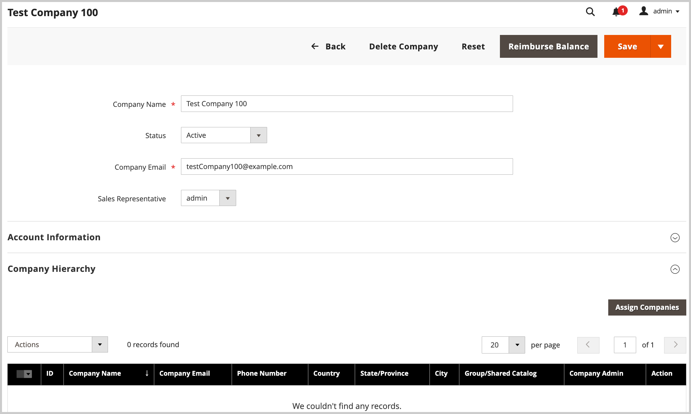

# [!UICONTROL Company Hierarchy] 관리

관리자는 지정된 상위 회사(조직 계층 구조의 맨 위에 있는 회사)에 관련 회사를 할당하여 [!UICONTROL Company Hierarchy]을(를) 만들 수 있습니다.

관리자로부터 개별 회사(`[!UICONTROL Company Type] = Company`)를 편집하고 [!UICONTROL Company Hierarchy] 구성에서 관련 회사를 할당하여 상위 회사를 만듭니다.

{width="700"}

>[!NOTE]
>
>[!UICONTROL Company Hierarchy] 표에 대한 자세한 내용은 [회사 계층 구조](account-company-create.md#company-hierarchy) 필드 설명을 참조하십시오.

상위 회사를 편집하고 *[!UICONTROL Company Hierarchy]* 그리드를 사용하여 회사를 추가하거나 제거하여 회사 할당을 관리합니다. *[!UICONTROL Actions]* 컨트롤을 사용하여 조직의 회사에 대한 [고급 설정 구성](#change-company-settings)을 관리하십시오.

## 상위 회사에 회사 할당

1. _관리자_ 사이드바에서 **[!UICONTROL Customers]** > **[!UICONTROL Companies]**(으)로 이동합니다.

   {width="700" zoomable="yes"}

1. [!UICONTROL Companies] 그리드에서 회사 세부 정보 페이지를 열어 할당을 만듭니다.

   - 기존 상위 회사에 추가 회사를 할당하려면 상위 회사에 대해 **[!UICONTROL Edit]** 작업을 선택하십시오.
   - 상위 회사를 만들려면 상위로 지정된 회사에 대해 **[!UICONTROL Edit]** 작업을 선택하십시오.

     기존 상위 또는 하위 회사에서는 새 상위 회사를 만들 수 없습니다.

1. 회사 세부 정보 페이지에서 **[!UICONTROL Company Hierarchy]**&#x200B;을(를) 확장한 다음 **[!UICONTROL Assign Companies]**&#x200B;을(를) 선택합니다.

   {width="675" zoomable="yes"}

1. 사용 가능한 회사 목록에서 할당할 회사를 선택한 다음 **[!UICONTROL Assign Selected Companies]**&#x200B;을(를) 선택합니다.

   {width="675" zoomable="yes"}

1. 메시지가 표시되면 **[!UICONTROL Assign]**&#x200B;을(를) 선택하여 회사 할당을 완료하십시오.

## 상위 회사에서 회사 할당 해제

1. 회사 페이지에서 **[!UICONTROL Edit]** 작업을 선택하여 상위 회사에 대한 회사 세부 정보 페이지를 엽니다.

   {width="700" zoomable="yes"}

1. **[!UICONTROL Company Hierarchy]**&#x200B;을(를) 확장하여 할당된 회사 목록을 봅니다.

1. 조직에서 회사를 제거합니다.

   - 회사가 제거할 [!UICONTROL Action] 열에서 **[!UICONTROL Select]** > **[!UICONTROL Unassign from parent]**&#x200B;을(를) 클릭합니다.

     {width="640" zoomable="yes"}

   - 메시지가 표시되면 **[!UICONTROL Unassign]**&#x200B;을(를) 선택하여 계층에서 할당된 회사를 제거합니다.

## 조직에 대한 회사 설정 관리

조직의 [고급 설정](account-company-create.md#advanced-settings) 구성을 업데이트하여 모든 하위 회사에 상위 구성을 적용하거나 조직의 선택된 회사에 동일한 설정을 적용합니다.

업데이트 프로세스 중에 초기 구성 값은 기본적으로 모회사에 대해 구성된 현재 값으로 설정됩니다. 선택한 회사에 대한 구성을 업데이트하려면 적어도 하나의 설정을 변경해야 합니다.

**여러 회사에 대한 고급 설정 구성 변경**

1. _관리자_ 사이드바에서 **[!UICONTROL Customers]** > **[!UICONTROL Companies]**(으)로 이동합니다.

1. [!UICONTROL Companies] 그리드에서 **[!UICONTROL Action]** 열에서 **[!UICONTROL Edit]**&#x200B;을(를) 선택하여 상위 회사를 편집합니다.

1. 상위 회사 세부 정보 페이지에서 **[!UICONTROL Company Hierarchy]** 섹션을 확장하여 조직에 포함된 회사를 봅니다.

1. 구성할 회사를 선택합니다.

   {width="675" zoomable="yes"}

1. 표 위의 **[!UICONTROL Actions]** 컨트롤에서 **[!UICONTROL Change company settings]**&#x200B;을(를) 선택합니다.

   {width="675" zoomable="yes"}

1. 설정 구성을 변경합니다.

   - [!UICONTROL Change company settings] 페이지에서 수정할 구성 설정을 찾습니다.

   - 설정을 사용하려면 **[!UICONTROL Change]** 확인란을 선택하십시오.

   - 필요에 따라 값을 업데이트합니다.

     {width="575" zoomable="yes"}

1. 구성을 업데이트한 후 **[!UICONTROL Apply Changes]**&#x200B;을(를) 선택합니다.

1. 메시지가 표시되면 **[!UICONTROL Change settings]**&#x200B;을(를) 선택하여 선택한 회사에 대한 구성을 업데이트합니다.

>[!TIP]
>
>회사 라인 항목을 편집하여 단일 회사에 대한 고급 설정 구성을 관리합니다.
