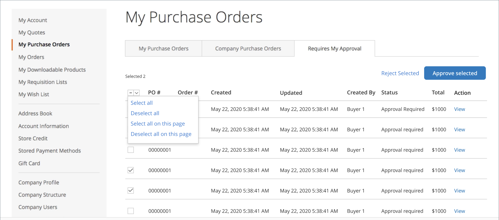

# 회사의 구매 주문

구매 주문 (PO)은 기업이 지출을 추적하고 제어하는 일반적인 방법입니다. [구매 주문](../stores-purchase/purchase-order.md)은(는) Adobe Commerce 및 Magento Open Source에서 지원되는 표준 오프라인 결제 방법 중 하나입니다. Adobe Commerce의 B2B가 설치되고 회사 계정에 대해 [_구매 주문 사용_](account-company-manage.md#advanced-settings)&#x200B;이 활성화되면 모든 주문은 자동으로 PO(구매 주문)로 만들어집니다. 필요한 [권한](account-company-roles-permissions.md)을(를) 가진 회사 사용자는 자신이 만든 PO와 하위 사용자가 만든 PO를 만들고 편집하고 삭제할 수 있습니다.

## 구매 주문 플로우

역할과 순서에 따라 회사 사용자는 몇 가지 승인 규칙이 적용될 수 있습니다. 그리고 온라인이나 오프라인 결제수단을 이용하느냐에 따라 그 흐름이 조금씩 다르다. 회사 관리자는 승인 규칙을 무시하고 자동으로 주문을 생성할 수 있습니다. 승인 프로세스 중 온라인 결제 세부 정보를 저장하는 것은 보안 위험이므로 이러한 세부 정보는 승인 후 추가된 다음 구매 발주가 실제 주문으로 전환됩니다.

{width="600" zoomable="yes"}

>[!NOTE]
>
>구매 주문의 하나 이상의 제품이 현재 비활성화되어 있거나 재고가 없는 경우 주문을 할 수 없습니다.

회사에 대한 구매 주문 워크플로우는 다음 몇 가지 방법으로 달라질 수 있습니다.

- 승인 규칙을 설정하지 않으면 구매 발주를 하고 주문을 직접 완료할 수 있습니다.

  >[!NOTE]
  >
  >기본적으로 `Purchase order has been submitted for approval` 메시지는 승인 규칙이 설정되지 않은 경우에도 회사 사용자에게 항상 표시됩니다. 승인 프로세스가 필요하지 않으면 회사 사용자는 자동으로 주문이 생성 및 승인되었음을 알리는 이메일을 수신합니다.

- 회사 관리자가 승인 규칙을 정의한 경우 사용자는 승인 프로세스를 거칩니다.
- 구매 발주에 여러 승인 규칙이 적용되는 경우 고유한 필수 승인자가 모두 승인해야 합니다.
- 구매 발주를 생성할 때 오프라인 결제 세부 정보를 입력합니다.
- 온라인 결제 세부 사항은 구매 발주가 승인된 후에 입력됩니다.

>[!NOTE]
>
>구매 주문은 주문이 생성된 시점의 품목 가격, 할인 및 배송료의 _스냅숏_&#x200B;을 만듭니다. PO가 생성된 후 품목 가격이 변경되면 최초 가격이 사용됩니다.

### 기본 워크플로우 예

회사는 구매 발주를 사용하여 사원이 회사를 대신하여 구매할 수 있는 품목을 통제하고 회사 지침을 시행하기 위해 승인 규칙을 설정하는 경우가 많습니다. 승인 규칙에 따라 여러 사람이 주문을 승인해야 할 수 있습니다.

1. 사용자는 $25,000 상당의 제품에 대한 구매 주문을 생성합니다.
1. 관리자가 승인해야 합니다.
1. 주문이 10,000달러 이상이기 때문에, VIP도 승인을 받아야 한다.
1. 결제 방법에 따라 승인 후 구매 발주가 자동으로 주문으로 전환되거나 사용자가 돌아가서 결제 세부 정보를 입력합니다.

### 승인 규칙

승인 규칙은 회사 지침에 따라 지출을 통제하는 데 사용됩니다. 승인 규칙의 예는 다음과 같습니다.

- 100달러 이상의 주문은 관리자의 승인이 필요합니다.
- 1,000달러 이상의 주문은 관리자와 회사 관리자의 승인이 필요합니다.
- 고유 SKU가 30개 이상인 주문은 회사 관리자의 승인이 필요합니다.

회사에 대해 이러한 규칙이 적용되면, 회사 사용자는 주문이 $100 미만일 때 즉시 주문을 완료할 수 있습니다. 승인 규칙 정의에 대해 알아보려면 [승인 규칙](account-dashboard-approval-rules.md)을 참조하세요.

### 스토어 사용자 유형

구매 발주 워크플로우는 구매를 수행하는 사람에 따라 다를 수도 있습니다.

- 정규 직원은 모든 승인 규칙을 따를 수 있습니다
- 관리자는 더 많은 구매력을 가질 수 있으며 다른 승인 규칙을 가질 수 있습니다
- 회사 관리자는 모든 승인 규칙을 무시하고 구매 발주를 자동으로 완료할 수 있습니다.

이 모든 요소들은 정확한 체크아웃 프로세스에 영향을 줄 수 있습니다.

## [!UICONTROL My Purchase Orders]

회사에 대해 구매 발주를 사용하도록 설정하면 회사 사용자 계정에 로그인한 고객의 왼쪽 패널에 **[!UICONTROL My Purchase Orders]** 항목이 표시됩니다. 서로 다른 구매 주문 목록과 기능을 제공하는 세 가지 탭이 있습니다.

- **[!UICONTROL My Purchase Orders]**: 고객이 만든 PO입니다.
- **[!UICONTROL Company Purchase Orders]**: 회사 내 하위 사용자가 만든 PO(회사 구조 및 역할에 따라 다름).
- **[!UICONTROL Requires My Approval]**: (지정된 승인자에 대해 표시) 고객의 승인을 기다리는 PO입니다. 카운터는 승인 대기 중인 주문 수를 보여 줍니다.

{width="700" zoomable="yes"}

상점에서 회사 사용자가 사용할 수 있는 지원되는 구매 주문 기능에 대한 자세한 내용은 [내 구매 주문](account-dashboard-my-purchase-orders.md)을 참조하세요.

## 오프라인 및 온라인 결제 방법

결제 방법에 따라 워크플로가 달라질 수 있습니다. Adobe Commerce 결제 방법에 대한 자세한 내용은 _판매 및 구매 경험 안내서_&#x200B;에서 [결제 방법](../stores-purchase/payments.md)을 참조하세요.

>[!IMPORTANT]
>
>구매 주문에서는 _컨텍스트 내_ 체크아웃 경험을 사용해야 합니다. _컨텍스트 밖_ 체크 아웃은 일반적인 체크 아웃 흐름을 무시하므로 지원되지 않습니다. 일반적으로 _컨텍스트 내_&#x200B;은(는) 고객이 프로세스를 완료하기 위해 상거래 사이트에 머무르는 것을 의미합니다. _컨텍스트 밖_&#x200B;은(는) 구매를 완료하기 위해 고객이 다른 사이트로 이동하는 경우입니다.

### 온라인 결제

보안상의 이유로 온라인 스토어는 일반적으로 승인 프로세스가 완료되기를 기다리는 동안 스토어 신용 카드 세부 사항을 수집하지 않습니다. 따라서 온라인 결제 옵션을 선택하면 구매 발주 작성자가 승인 후 매장으로 돌아가 결제 내역을 입력하고 주문을 완료한다. 온라인 결제의 예는 다음과 같습니다.

- 신용/직불 카드
- PayPal
- Braintree

>[!IMPORTANT]
>
>온라인 결제 방식으로 구매주문 시 기프트 카드, 스토어 크레딧, 보상 포인트 등을 사용할 수 없다. 온라인 결제로 이러한 기능을 활성화하면 예기치 않은 동작이 발생할 수 있습니다. 구매 발주에 대해 온라인 결제가 활성화된 경우 기프트 카드, 스토어 신용 및 보상 포인트를 비활성화하는 것이 좋습니다.

### 오프라인 결제

온라인 주문 등 오프라인 결제 수단이 홈페이지 외부에서 처리돼 안전하다. 오프라인 결제가 있는 구매 발주는 승인 프로세스 후에 자동으로 처리될 수 있습니다.

오프라인 결제의 예는 다음과 같습니다.

- 수표/우편환
- 계정입금
- 배달 현금
- 은행 송금
- 스토어 크레딧
