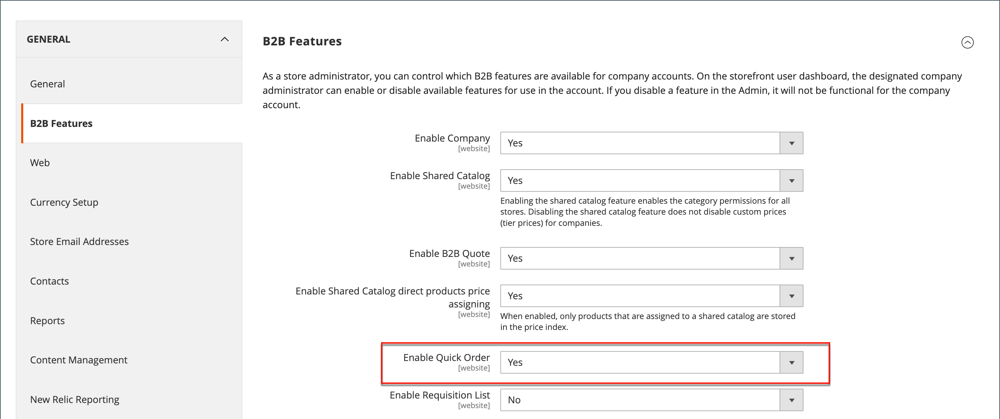

# 빠른 주문

_빠른 주문_ 기능은 주문하려는 제품의 제품 이름 또는 SKU를 알고 있는 고객의 주문 프로세스를 몇 번의 클릭으로 줄입니다. 여러 SKU가 있는 주문은 수동으로 입력하거나 빠른 주문 양식으로 가져올 수 있습니다. 빠른 주문은 계정에 로그인한 고객 및 게스트가 사용할 수 있습니다. 활성화하면 _빠른 주문_ 링크가 고객 이름 옆에 페이지 맨 위에 나타납니다.

{width="700" zoomable="yes"}

## 스토어에 대한 빠른 주문 활성화

1. _관리자_ 사이드바에서 **[!UICONTROL Stores]** > _[!UICONTROL Settings]_>**[!UICONTROL Configuration]**(으)로 이동합니다.

1. 왼쪽 패널의 _[!UICONTROL General]_섹션에서&#x200B;**[!UICONTROL B2B Features]**을(를) 선택합니다.

1. **[!UICONTROL Enable Quick Order]**&#x200B;을(를) `Yes`(으)로 설정합니다.

   {width="600" zoomable="yes"}

1. **[!UICONTROL Save Config]**&#x200B;을(를) 클릭합니다.

1. 메시지가 표시되면 [캐시 관리](../systems/cache-management.md)를 클릭하고 잘못된 캐시를 새로 고치십시오.

## 빠른 주문 워크플로우

고객은 다음 방법 중 하나를 사용하여 빠른 주문에 대한 제품을 지정할 수 있습니다.

### 방법 1: 개별 제품 입력

1. 고객이 **[!UICONTROL Quick Order]** 링크를 클릭합니다.

1. SKU 또는 제품 이름으로 제품을 선택합니다.

   **SKU별 빠른 주문**&#x200B;을 넣기 위해 고객은 다음을 수행합니다.

   - **[!UICONTROL SKU]**&#x200B;을(를) 입력합니다.

   - **[!UICONTROL Add to List]**&#x200B;을(를) 클릭합니다.

     입력 줄에 SKU가 표시되며, 아래에 제품 세부 정보가 표시됩니다.

     {width="600" zoomable="yes"}

   **제품 이름으로 빠른 주문**&#x200B;을 하기 위해 고객은 다음을 수행합니다.

   - **[!UICONTROL Product Name]**&#x200B;의 처음 몇 문자를 입력합니다.

     >[!NOTE]
     >
     >_Enter_ 키를 사용하여 제품 이름을 선택하지 마십시오.

   - 가능한 일치 목록이 나타나면 고객이 주문할 제품을 클릭합니다.

     {width="700" zoomable="yes"}

1. **[!UICONTROL Qty]**&#x200B;을(를) 입력합니다.

1. 다음 입력 라인을 사용하여 필요한 횟수만큼 이 프로세스를 반복합니다.

1. **[!UICONTROL Add to Cart]**&#x200B;을(를) 클릭합니다.

### 방법 2: 여러 제품 입력

1. **[!UICONTROL Enter Multiple SKUs]** 상자에서 고객은 다음 중 하나를 수행합니다.

   - 라인당 하나의 SKU를 입력합니다.

   - 쉼표로 구분하고 공백 없이 같은 줄에 모든 SKU를 입력합니다.

     {width="600" zoomable="yes"}

1. 목록에 제품을 추가하려면 **[!UICONTROL Add to List]**&#x200B;을(를) 클릭합니다.

1. 목록의 각 항목에 대해 주문할 **[!UICONTROL Qty]**&#x200B;을(를) 입력합니다.

   {width="600" zoomable="yes"}

   >[!NOTE]
   >
   >제품에 필요한 옵션이 있으면 옵션을 선택하라는 메시지가 표시됩니다. 장바구니에 도달하여 제품 옵션을 추가할 때까지 기다릴 수 있습니다.

   {width="600" zoomable="yes"}

### 방법 3: 제품 목록 업로드

1. _[!UICONTROL Add from File]_섹션에서&#x200B;**[!UICONTROL Download Sample]**을(를) 클릭하여 주문 템플릿을 다운로드합니다.

   {width="600" zoomable="yes"}

1. 다운로드한 파일을 엽니다.

1. 템플릿을 사용하여 빠른 주문 목록에 업로드할 제품 SKU를 추가합니다.

1. 완료되면 **[!UICONTROL Save]**&#x200B;을(를) 클릭합니다.

   {width="400" zoomable="yes"}

1. 파일을 업로드하려면 **[!UICONTROL Choose]**&#x200B;을(를) 클릭하고 해당 시스템에서 파일을 선택합니다.

   항목이 빠른 주문 목록에 추가됩니다.

1. 준비가 되면 **[!UICONTROL Add to Cart]**&#x200B;을(를) 클릭합니다.

고객이 빠른 주문을 만든 후 평소대로 체크아웃을 진행할 수 있습니다.

{width="700" zoomable="yes"}
