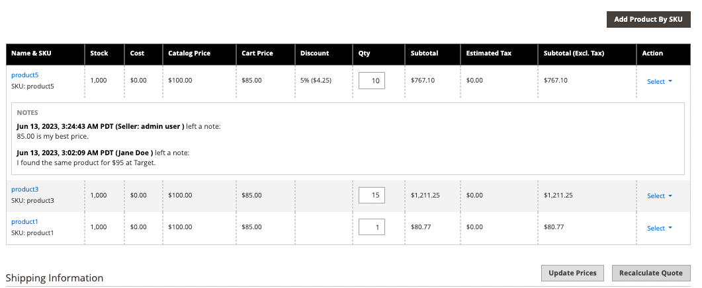
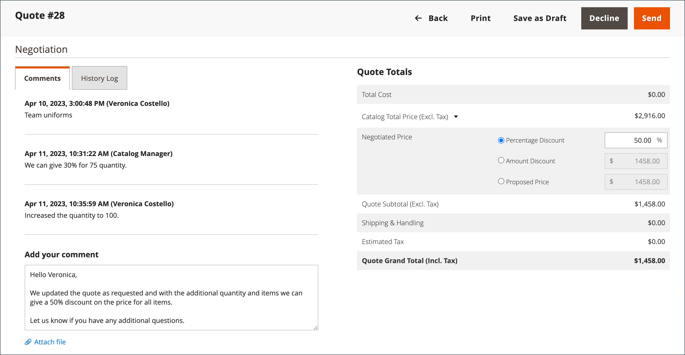

# 견적 협상

구성에서 [B2B 견적이 활성화](configure-quotes.md)된 경우, 가격 협상은 회사의 승인된 구매자 또는 영업 사원이 시작할 수 있습니다.

구매자는 장바구니에서 [견적을 요청](quote-request.md)하여 가격 협상 프로세스를 시작합니다. 영업 사원은 [구매자에 대한 초안 견적을 만들고](sales-rep-initiates-quote.md)초기 주문 품목 및 가격책정을 통해 견적을 업데이트하여 구매자에게 보내면서 협상을 시작할 수 있습니다.

가격 협상이 시작되면 견적이 [견적](quotes.md) 그리드에 나열됩니다. 구매자와 판매자 간의 모든 협상은 전자 메일로 이루어지며 견적의 상세 보기에서 시작 및 추적됩니다.

협상 프로세스 중에 판매자는 관리자로부터 다음 작업을 수행할 수 있습니다.

- 제품 추가 또는 제거
- 수량 변경
- 라인 품목 또는 전체 견적에 할인 적용
- 배송 방법 추가 또는 변경
- 댓글 추가
- 업데이트된 견적을 구매자에게 보내거나 초안으로 저장

구매자는 [[!UICONTROL My Quotes]](account-dashboard-my-quotes.md)을(를) 사용하여 상점에서 견적 협상 프로세스를 관리합니다. 검토를 위해 견적이 열려 있는 동안 구매자 계정에서 견적의 상태가 `Pending`(으)로 설정되어 있습니다. 구매자는 견적이 거부되었거나 만료된 경우에도 견적을 변경하고 재실행할 수 있습니다.

## 1단계: 요청 보기

1. 관리 사이드바에서 **[!UICONTROL Sales]** > **[!UICONTROL Quotes]**(으)로 이동합니다.

   새 요청이 _[!UICONTROL Quotes]_&#x200B;표에 나타납니다.

1. _작업_ 열에서 **[!UICONTROL View]**&#x200B;을(를) 클릭합니다.

   {width="700" zoomable="yes"}

## 2단계: 견적 수정

1. _[!UICONTROL Quote & Account Information]_&#x200B;에서_&#x200B;달력&#x200B;_() 아이콘을 클릭합니다.

   {width="575" zoomable="yes"}

1. 견적에 대해 **[!UICONTROL Expiration Date]**&#x200B;을(를) 선택하십시오.

1. _[!UICONTROL Quote Totals]_&#x200B;섹션까지 아래로 스크롤하고 필요에 따라&#x200B;**[!UICONTROL Negotiated Price]**&#x200B;을(를) 업데이트합니다.

   {width="600" zoomable="yes"}

   구매자가 견적의 품목 수량을 변경하면 견적의 상단에 품목 목록이 변경되었음을 나타내는 통지가 표시되며 협상된 가격을 갱신해야 합니다.

   {width="600" zoomable="yes"}

### 견적에 새 제품 추가

1. **[!UICONTROL Add Products by SKU]**&#x200B;을(를) 클릭합니다.

1. 추가할 **[!UICONTROL SKU]** 및 **[!UICONTROL Qty]**&#x200B;을(를) 입력하십시오.

   {width="600" zoomable="yes"}

### 라인 항목 업데이트 적용

필요한 경우 _[!UICONTROL Items Quoted]_&#x200B;섹션에서 라인 항목 변경 내용을 적용합니다.

{width="600" zoomable="yes"}

- 제안된 가격으로 구매해야 하는 **[!UICONTROL Quantity]**&#x200B;을(를) 변경합니다.

- **[!UICONTROL Configure]**&#x200B;을(를) 선택하고 제품 옵션을 변경합니다.

  [!UICONTROL Configure] 옵션은 구성 가능한 제품의 라인 항목에서만 사용할 수 있습니다.

- **[!UICONTROL Action]** 메뉴에서 항목을 업데이트할 동작을 선택하십시오.
   - **할인 항목**(백분율, 고정 금액 또는 기본 가격)로 할인을 적용합니다.
선택적으로 추가 할인을 방지하기 위해 할인 금액을 잠글 수 있습니다. 할인이 잠겨있지 않으면,
라인 품목 할인과 견적 레벨 할인은 모두 제품 가격에 적용됩니다.
   - **구매자에게 메모를 남기기** 구매자에게 항목에 대한 추가 정보를 제공하기 위해
   - 견적에 있는 항목을 제거하려면 **제거**&#x200B;하십시오.

### 변경 사항 적용 및 업데이트

- 변경 내용을 적용하려면 **[!UICONTROL Add to Quote]**&#x200B;을(를) 클릭합니다.

- 견적을 업데이트하려면 **[!UICONTROL Recalculate the Quote]**&#x200B;을(를) 클릭합니다.

- 변경 사항을 적용하고 견적을 공유 카탈로그 및 가격 규칙에 업데이트하려면 **[!UICONTROL Update Prices]**&#x200B;을(를) 클릭한 다음 **[!UICONTROL Proceed]**&#x200B;을(를) 클릭하여 업데이트를 확인합니다.

  {width="600" zoomable="yes"}

### 배송 정보 업데이트

1. 구매자가 견적에 _배송처_ 주소를 포함하는 경우 **[!UICONTROL Get shipping methods and rates]**&#x200B;을(를) 클릭합니다.

1. 사용 가능한 옵션에서 배송 방법을 선택합니다.

1. **[!UICONTROL Proposed Shipping Price]** 입력.

   제안된 배송 가격을 반영하도록 _[!UICONTROL Quote Totals]_&#x200B;이(가) 업데이트됩니다.

### 지원 문서 첨부

1. _댓글 추가_ 상자에서 **[!UICONTROL Attach file]**&#x200B;을(를) 클릭합니다.

   기본적으로 [첨부된 파일](../configuration-reference/sales/quotes.md)은(는) DOC, DOCX, XLS, XLSX, PDF, TXT, JPG 또는 JPEG, PNG 파일 형식 중 최대 2MB일 수 있습니다.

1. 디렉토리에서 파일을 선택합니다.

## 3단계: 견적 수준 정보 업데이트 및 회신 보내기

1. _[!UICONTROL Comments]_&#x200B;탭의&#x200B;_[!UICONTROL Negotiation]_ 섹션에서 **[!UICONTROL Add your comment]** 섹션에 회신을 입력합니다.

1. 지원 문서를 포함하려면 **[!UICONTROL Attach file]**&#x200B;을(를) 클릭하고 디렉터리에서 파일을 선택하십시오.

   첨부 파일에 허용되는 최대 파일 크기는 2MB입니다.

1. 견적에 할인을 적용하려면

   - _[!UICONTROL Negotiated Price]_&#x200B;섹션의&#x200B;_[!UICONTROL Quote Totals]_&#x200B;에서 다음 할인 유형 중 하나를 선택하십시오.

      - `Percentage Discount`: 할인율을 적용하면 원래 가격이 특정 비율로 줄어듭니다.
      - `Amount Discount`: 금액 할인은 고정 가격 인하를 적용합니다.
      - `Proposed Price`: 제안된 가격 할인은 원래 가격과 관계없이 최종 가격을 특정 금액으로 설정합니다.

   - 퍼센트 또는 고정 가격으로 금액을 입력합니다.

     {width="600" zoomable="yes"}

   - 각 라인 품목 또는 견적에 대해 전체적으로 할인을 적용할 수 있습니다.

      - **라인 항목 할인**: 라인 항목 할인은 장바구니의 개별 항목에 적용됩니다. 할인은 `percentage`, 특정 `amount` 또는 `proposed price`일 수 있습니다.
      - **장바구니 수준 할인**: 장바구니 수준 할인이 전체 장바구니에 적용됩니다. 할인은 `percentage` 또는 특정 `amount`일 수 있으며 총 장바구니 값에 적용됩니다.
      - **장바구니와 라인 항목 할인의 조합**: 경우에 따라 장바구니와 라인 항목 수준 모두에서 할인이 적용될 수 있습니다. 라인 항목 할인이 먼저 적용된 다음 나머지 합계에 대한 장바구니 수준 할인이 적용됩니다.

1. 견적을 보내거나 저장합니다.

   - 견적을 구매자에게 다시 보낼 준비가 되면 **[!UICONTROL Send]**&#x200B;을(를) 클릭합니다.

   - 나중에 견적을 계속 작업하려면 **[!UICONTROL Save as Draft]**&#x200B;을(를) 클릭합니다.

>[!NOTE]
>
> 견적 협상 중에 추가 변경을 방지하기 위해 할인을 잠글 수 있습니다. 견적이 잠기면 먼저 견적의 잠금을 해제하지 않고 할인 유형이나 금액을 변경할 수 없습니다. 이러한 잠금 메커니즘은 영업 사원과 구매자 사이의 합의된 조건을 보존하도록 보장합니다.

## 4단계: 견적 후속 작업

견적을 보내면, 시스템은 구매자와 회사 계정을 관리하는 영업 담당자에게 모두 알립니다. 이메일에는 구매자 계정의 견적서와 견적서의 만료일에 대한 링크가 포함되어 있습니다. 협상의 어느 시점에서 구매자는 다음 중 하나를 수행할 수 있습니다.

- 협상된 견적을 수락하고 구매를 완료합니다.
- 카운터 오퍼로 회신을 보내고 협상을 계속합니다.
- 협상을 종료합니다.

워크플로우에서 해당 위치를 모니터링하려면 이메일과 그리드에서 견적 상태를 확인합니다. 필요한 경우 협상 프로세스를 계속할 수 있습니다.

## 단추 막대

| 단추 | 설명 |
|----------------------------|---------------------------------------------------------------------------------------------------------------------------------------------------------------------------------------------------------------------------------------------------------------------------------------------------------------------------------------------------------------|
| [!UICONTROL Back] | 변경 내용을 저장하지 않고 _[!UICONTROL Quotes]_&#x200B;페이지로 돌아갑니다. |
| [!UICONTROL Print] | 견적을 프린터로 보내거나 PDF 파일로 저장합니다. |
| [!UICONTROL Create Copy] | 원래 이름에 `(copy)`이(가) 추가된 현재 견적의 복사본을 만들고 엽니다. [!UICONTROL Name] 필드를 편집하여 새 견적의 이름을 바꾸십시오. 새 견적을 초안으로 저장하거나 고객에게 전송하여 처리합니다. |
| 템플릿 만들기 | 현재 견적을 기반으로 견적 템플리트를 생성합니다. 견적 템플리트는 구매자와 판매자가 여러 견적에 적용할 수 있는 계약 및 가격 조건에 동의할 수 있도록 함으로써 견적 협상을 간소화합니다. . 계약 시 구매자는 견적 요청(RFQ) 프로세스를 다시 시작하는 대신 후속 주문에 대해 템플릿에서 사전 승인된 연결 견적을 생성할 수 있습니다. |
| [!UICONTROL Save as Draft] | 견적에 대한 변경 사항을 저장하되 구매자에게 다시 보내지 않습니다. |
| [!UICONTROL Decline] | 가격 협상 요청은 초기 문의 시 또는 진행 중인 협상 중에 거부됩니다. 견적이 거절되었을 때, 판매자는 결정을 설명하기 위해 주석을 추가해야 한다. 견적이 거부되면 모든 협상된 가격이 원래 값으로 재설정됩니다. 판매자가 구매자의 답변을 기다리는 동안에는 이 버튼이 비활성화됩니다. |
| [!UICONTROL Send] | 구매자의 문의에 대한 회신으로 업데이트된 견적을 보냅니다. 판매자가 구매자의 회신을 기다리는 경우 이 버튼이 비활성화됩니다. |

{style="table-layout:auto"}

## 필드 설명

관리자의 견적 정보 및 기능은 다음 섹션으로 구성됩니다.

### [!UICONTROL Quote & Account Information]

| 필드 | 설명 |
|-------------------------------------------------|------------------------------------------------------------------------------------------------------------------------------------------------------------------------------------------------------------------------------------------------------------------------------------------------------------------------------------------------------------------------------------------------------------------------------------------------------------------------------------------------------------------------------------------------------------------------------------------------------------------------------------------------------------------------------------------------------------------------------------------------------------------------------------------------------------------------------------------------------------------------------------------------------------------------------------------------------------------------------------------------------------------------------------------------------------------------------------------------------------|
| [!UICONTROL Name] | [구매자](account-company-roles-permissions.md)가 견적 요청에 할당한 이름. |
| [!UICONTROL Status] | 견적의 현재 상태를 나타냅니다. 견적의 상태는 구매자 또는 판매자 측의 조치에 의해서만 변경될 수 있습니다. 관리자와 [구매자 계정](account-dashboard-my-quotes.md)에서 [상태 설정](quotes.md)도 확인하세요. |
| [!UICONTROL Created] | 구매자가 견적에 대한 요청을 처음 제출한 날짜와 시간. |
| [!UICONTROL Created By] | 견적에 대한 요청을 제출한 회사 구매자의 이름과 성. |
| [!UICONTROL Expiration Date] | 현재 견적이 유효한 마지막 날을 나타냅니다. 기본 만료 일자는 구매자가 견적에 대한 요청을 제출한 후 30일로 구성에서 설정됩니다.   판매자가 다른 날짜(MMM DD YYYY )를 입력하거나 달력에서 날짜를 선택하여 기본 만료 날짜를 재정의할 수 있습니다. 필드를 비워 두면 견적이 만료되지 않습니다.   공개 견적의 경우 판매자는 견적이 만료되도록 예약되기 48시간 전에 [이메일 알림](../systems/email-templates.md)을 받습니다. 구매자는 만료일 24시간 전에 알림을 받습니다.   견적의 상태가 _만료됨_(으)로 변경되며 구매자는 견적을 더 이상 변경할 수 없습니다. 견적에서 제안된 가격은 카탈로그의 원래 값으로 되돌아갑니다.   견적이 만료되도록 설정되어 있을 때 판매자가 검토할 수 있도록 견적이 열려 있으면 구성에 설정된 범위에 따라 만료 날짜가 재설정됩니다.   만료 날짜는 _견적 및 계정_ 섹션에서 검토 프로세스 중에 편집할 수 있는 유일한 필드입니다. |
| [!UICONTROL Company] | 구매자가 나타내는 [회사](account-companies.md)의 법적 이름. |
| [!UICONTROL Company Admin Email] | [회사 관리자](account-company-admin.md)의 전자 메일 주소입니다. |
| [!UICONTROL Sales Rep] | 판매자에서 근무하며 회사 계정에 할당된 기본 연락처인 [영업 담당자](account-company-manage.md). |
| [!UICONTROL Shared Catalog (or Customer Group)] | 회사가 할당된 [공유 카탈로그](catalog-shared.md) 또는 [고객 그룹](account-company-customer-group.md). 견적에는 회사에 할당된 공유 카탈로그의 사용자 지정 가격이 포함될 수 있습니다. |

{style="table-layout:auto"}

### [!UICONTROL Add to Quote by SKU]

| 필드 | 설명 |
|---------------------------|-----------------------------------------------------------|
| [!UICONTROL Enter SKU] | 견적에 추가될 제품의 SKU입니다. |
| [!UICONTROL Qty] | 견적에 추가할 이 SKU의 항목 수. |
| [!UICONTROL Add to Quote] | 지정된 제품의 수량을 견적에 추가합니다. |

{style="table-layout:auto"}

### [!UICONTROL Items Quoted]

| 필드 | 설명 |
|-----------------------------------------|---------------------------------------------------------------------------------------------------------------------------------------------------------------------------------------------------------------------------|
| [!UICONTROL Name & SKU] | 연결된 제품 이름 및 SKU(Stock Keeping Unit). |
| [!UICONTROL Stock] | 현재 판매 가능한 이 SKU의 제품 수. |
| [!UICONTROL Cost] | 판매자가 제품을 구매하기 위해 지불한 금액입니다. |
| [!UICONTROL Catalog Price] | 구매자의 회사에 지정된 고객 그룹 또는 공유 카탈로그를 기반으로 한 구매자의 카탈로그에 있는 제품의 가격. |
| [!UICONTROL Cart Price] | 장바구니에 있는 항목의 원래 가격에서 장바구니에서 적용되는 할인을 차감합니다. 구매자의 고객 그룹에 적용되는 할인 또는 장바구니 규칙이 있는 경우 장바구니 가격은 카탈로그 가격과 다를 수 있습니다. |
| [!UICONTROL Discount] | 항목에 적용된 라인 항목 할인입니다. 값은 백분율, 고정 금액 또는 제안된 가격일 수 있습니다. |
| [!UICONTROL Qty] | 견적 가격의 기준이 되는 이 SKU의 단위 수. 0보다 큰 양수만 입력할 수 있습니다. 수량을 0으로 변경하려면 견적에서 라인 품목을 삭제합니다. |
| [!UICONTROL Subtotal] | 제안된 가격에 주문 품목 수량을 곱한 값입니다. |
| [!UICONTROL Estimated Tax] | 구성에 따라 이 라인 항목에 대해 예상되는 세액입니다. 세금 계산 설정에 따라 예상 세금은 다음 중 하나를 기준으로 할 수 있습니다. 단가 / 행 합계 / 합계 |
| [!UICONTROL Subtotal (Incl./Excl. Tax)] | 구성에 따라 이 열에 예상 세금이 있거나 없는 소계가 표시될 수 있습니다. |
| [!UICONTROL Action] | 라인 항목에 적용할 수 있는 작업의 선택 메뉴:<ul><li>**[!UICONTROL Discount item]**</li><li>**[!UICONTROL Leave a note to Buyer]**</li><li>**[!UICONTROL Remove an item from the quote]**</li></ul>. |
| [!UICONTROL Configure] | 구성 가능한 제품에 대한 제품 옵션을 변경할 수 있습니다. |
| [!UICONTROL Update Prices] | 공유 카탈로그 및 가격 규칙의 최신 변경 내용으로 견적을 업데이트합니다. |
| [!UICONTROL Recalculate Quote] | 견적에 대한 변경 사항을 반영하도록 모든 견적 가격, 장바구니 가격 규칙 및 세금을 재계산합니다. |

{style="table-layout:auto"}

### [!UICONTROL Shipping Information]

| 필드 | 설명 |
|--------------------------------------|------------------------------------------------------------------------------------------------------------------------------------------------------------------------------|
| [!UICONTROL Shipping Address] | 구매자 계정에 지정된 배송 주소를 표시합니다. 구매자가 요청을 실행하기 전에 주소를 지정하지 않은 경우 배송 주소는 비어 있습니다. |
| [!UICONTROL Shipping Method & Price] | 구매자가 견적에 _배송처_ 주소를 포함하는 경우 배송 방법 및 요금 가져오기 링크가 나타납니다. |

{style="table-layout:auto"}

### [!UICONTROL Negotiation]

| 필드 | 설명 |
|--------------------------|----------------------------------------------------------------------------------------------------------------------------------------------------------------------------------------------------------------------------------------------------------------------------------------------------------------------------------------------------------------------------------------------------------------------------------------------------------------------------------------------------------------------------------------------------------------------------------------------------------------------------------------------------------|
| [!UICONTROL Comments] | 협상 섹션의 주석 탭은 구매자에게 견적에 대한 메시지를 입력하는 데 사용됩니다.  **[!UICONTROL Add your comment]**- 댓글은 협상 프로세스 중에 구매자와 통신하는 데 사용됩니다. Quote에서 제공되는 할인 또는 Quote Request 가 거부되는 이유를 설명하려면 Comments 를 사용합니다. **[!UICONTROL Attach file]** - [첨부 파일](configure-quotes.md)에 대한 최대 파일 크기 및 지원되는 파일 형식은 구성에 따라 결정됩니다. 기본적으로 첨부된 파일은 최대 2MB이며 DOC, DOCX, XLS, XLSX, PDF, TXT, JPG 또는 JPEG, PNG 파일 형식 중 하나가 될 수 있습니다. |
| [!UICONTROL History Log] | 이 탭에는 날짜, 견적 상태 및 의견이 포함된 견적의 전체 내역이 표시됩니다. |

{style="table-layout:auto"}

### [!UICONTROL Quote Totals]

| 필드 | 설명 |
|-----------------------------------------------------|-----------------------------------------------------------------------------------------------------------------------------------------------------------------------------------------------------------------------------------------------------------------------------------------------------------------------------------------------------------------------------------------------------------------------------------------------------------------------------------------------------------------------------------------------------------------------------------------------------------------------------------------------------------------------|
| [!UICONTROL Total Cost] | 견적에 포함된 품목의 판매자에 대한 총 비용. |
| [!UICONTROL Catalog Total Price  (Incl./Excl. Tax)] | 견적의 기준으로 사용되는 공유된 카탈로그 또는 기본 카탈로그의 가격에 따른 견적에 포함된 품목의 총 가격(세금 미포함). 구성의 [하위 합계 표시](../configuration-reference/sales/tax.md) 설정에 따라 계산에 사용된 값을 표시하려면 섹션을 확장합니다. 옵션:  **[!UICONTROL Subtotal (Excl. Tax)]**- 예상 세금을 제외한 카탈로그 총 가격. **[!UICONTROL Subtotal (Incl. Tax)]** - 예상 세금이 없는 카탈로그 총 가격.  **[!UICONTROL Estimated Tax]**- 카탈로그 총 가격에 적용될 것으로 예상되는 세액. |
| 협상 가격 | 구매자에게 제공되는 할인은 다음 중 하나를 기반으로 할 수 있습니다.  **[!UICONTROL Percentage Discount]**- 할인율(백분율). **[!UICONTROL Amount Discount]** - 고정 금액으로서의 할인.  **[!UICONTROL Proposed Price]**- 판매자가 제안한 가격.
견적의 모든 항목에 잠긴 항목 할인이 있는 경우 추가 할인을 적용할 수 없으므로 [!UICONTROL Negotiated Price] 섹션이 비활성화됩니다.

제품에 잠기지 않은 라인 품목 할인이 있는 경우 라인 품목 할인과 견적 레벨 할인이 모두 제품 가격에 적용됩니다.
 |
| [!UICONTROL Quote Subtotal (Incl./Excl. Tax)] | 구성의 [세금 계산](../configuration-reference/sales/tax.md) 설정에 따라 세금이 부과되거나 부과되지 않은 견적의 각 라인 항목에 대한 총 제안 가격. |
| [!UICONTROL Shipping & Handling] | 견적의 운송 정보 섹션에 있는 제안된 운송 가격 필드에 판매자가 입력한 금액. 해당 필드가 비어 있는 경우 금액은 선택한 배송 방법을 기반으로 합니다. |
| [!UICONTROL Estimated Tax] | [디스플레이 설정](../configuration-reference/sales/tax.md) 구성에 지정된 대로 납부해야 할 것으로 예상되는 세액입니다. |
| [!UICONTROL Quote Grand Total (Incl. Tax)] | 견적 하단에 협상 가격, 예상 세금 및 제안된 배송 및 처리가 포함된 최종 합계입니다. |

{style="table-layout:auto"}
