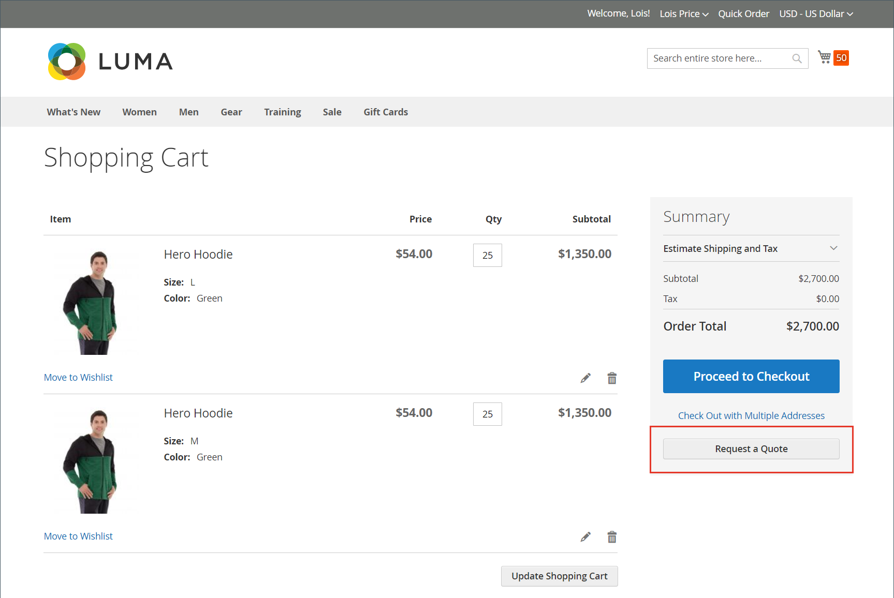

# 견적 요청

[판매 기능 구성](configure-quotes.md)에서 견적이 활성화된 경우 회사의 승인된 구매자는 장바구니에서 견적을 요청하여 가격 협상 프로세스를 시작할 수 있습니다. 구매자가 협상을 위해 견적을 실행할 준비가 되지 않은 경우 초안으로 저장할 수 있습니다.

>[!NOTE]
>
>견적 요청에는 할인 코드 또는 기프트 카드가 포함될 수 없습니다.

## 고객 견적 요청 경험

1. 고객은 견적을 요청하기 위해 [권한](account-company-roles-permissions.md)을 사용하여 구매자로 사용자 계정에 로그인합니다.

1. 견적에 포함할 제품을 장바구니에 추가합니다.

   >[!TIP]
   > 
   >고객은 [빠른 주문](quick-order.md)을 사용하여 제품 SKU 목록을 장바구니에 더 빠르게 추가할 수 있습니다.

1. **[!UICONTROL Request a Quote]**&#x200B;을(를) 선택합니다.

   {width="700" zoomable="yes"}

1. **[!UICONTROL Add your comment]** 상자에 고객이 요청을 설명하는 간단한 메모를 입력합니다.

1. **[!UICONTROL Quote Name]**&#x200B;을(를) 입력합니다.

   {width="400" zoomable="yes"}

1. 필요한 경우 지원 문서 또는 이미지를 견적에 첨부합니다.

   - **[!UICONTROL Attach file]**&#x200B;을(를) 선택합니다.
   - 시스템에서 파일을 선택합니다.

   기본적으로 [첨부된 파일](configure-quotes.md)은(는) DOC, DOCX, XLS, XLSX, PDF, TXT, JPG 또는 JPEG, PNG 파일 형식 중 하나로 최대 2MB입니다.

1. 견적을 생성하고 처리합니다.

   - **[!UICONTROL Request a Quote]**&#x200B;을(를) 선택하여 판매자에게 견적을 보냅니다.
   - **[!UICONTROL Save as Draft]**&#x200B;을(를) 선택하여 견적을 초안으로 저장합니다.

     구매자가 견적을 초안으로 저장하면 `Draft` 상태의 [!UICONTROL My Quotes]에서 견적을 사용할 수 있습니다. 초안 견적은 구매자가 검토를 위해 보낼 때까지 판매자에게 표시되지 않습니다.
