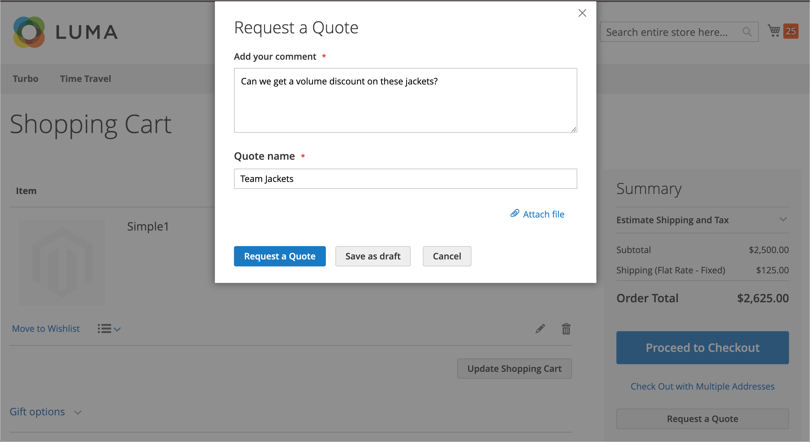
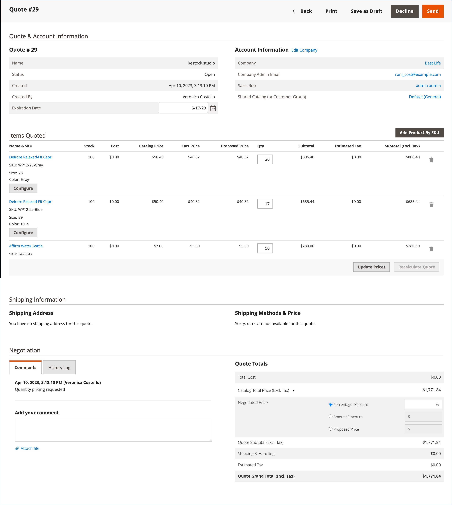

# 협상 가능한 견적

구매자와 판매자는 견적을 사용하여 계약에 도달할 때까지 주문 추가 품목, 수량 갱신, 할인 요청 및 적용 등에 대한 협상 프로세스를 관리합니다. 견적 협상 프로세스는 승인된 회사 구매자 또는 회사 영업 사원이 시작할 수 있습니다.

견적은 승인된 회사 구매자 또는 영업 사원이 시작할 수 있습니다. 견적이 생성되면 구매자나 판매자가 검토를 위해 견적을 제출할 때 협상 프로세스가 시작됩니다. 다음 _따옴표_ 수신한 각 견적을 나열하고 구매자와 판매자 간의 통신 내역을 유지하는 그리드. 표준 사용 [작업 공간 제어](../getting-started/admin-workspace.md) 목록을 필터링하려면 열 레이아웃을 변경하고 보기를 저장하고 데이터를 내보냅니다.

- 상점에서 구매자는 견적을 다음으로 제출합니다. [협상 요청](quote-price-negotiation.md) 장바구니에서 나온 가격. 견적 요청을 생성할 때 구매자는 견적을 초안으로 저장하거나 판매자에게 직접 제출할 수 있습니다.

- 관리에서 영업 담당자는 회사 구매자를 대신하여 견적을 작성할 수 있습니다. 견적을 생성할 때 판매자는 견적을 초안으로 저장하거나 구매자에게 직접 실행하여 협상 프로세스를 시작할 수 있습니다.

협상 프로세스 중에 추가 협상을 위해 조건을 검토하고 제안하는 사람만 견적을 갱신할 수 있습니다.

## 전제 조건

협상 가능한 견적은 Adobe Commerce에 다음 구성 설정이 있는 경우에만 사용할 수 있습니다.

- [Adobe Commerce용 B2B 확장이 설치되었습니다](install.md)
- [구성된 B2B 기능](enable-basic-features.md)
   - 회사 계정 활성화
   - B2B 견적 활성화

## 견적 워크플로우

견적은 구매자나 판매자가 시작할 수 있습니다.

**1단계: 견적 작성**

- **구매자가 견적 요청** - 구매자 [견적 요청](quote-request.md) 장바구니에서. 요청이 다음 위치에 나타납니다. _내 견적_ 구매자의 계정 대시보드에 있는 목록과 이메일 알림이 회사 계정에 할당된 영업 담당자에게 전송됩니다. 관리자에서 요청이 _따옴표_ 그리드, 상태 `New`. 견적 요청은 판매자가 오픈하기 전까지 구매자가 수정할 수 있습니다.

  {width="700" zoomable="yes"}

- **영업 담당자** — 영업 담당자가 다음을 수행할 수 있습니다. [견적 작성](sales-rep-initiates-quote.md) 특정 회사 구매자를 대신하여 책임자로부터. Sales Rep 는 Quote 를 업데이트하여 구매자에게 제품 및 할인 및 Notes 와 같은 기타 정보를 추가해야 합니다. Sales Rep 는 Quote 를 `draft` 또는 구매자에게 보내서 협상을 시작합니다. 초안 상태에서 견적은 판매자에게만 표시됩니다. 견적이 전송되면 상태는 다음과 같습니다. `Submitted`. 구매자가 반송하기 전까지는 판매자가 수정할 수 없습니다.

  {width="700" zoomable="yes"}

**2단계: 견적 검토 및 협상**

**판매자가 요청을 보고 응답을 보냅니다.** - 관리자에서 판매자가 견적에 대한 요청을 확인합니다. 견적의 상태가 다음으로 변경됨: `Pending`, 구매자는 어떠한 변경도 할 수 없습니다. 다음 [판매자의 응답](quote-price-negotiation.md) 견적의 제품에 대해 할인된 가격을 제시하여 주석을 입력하고 견적을 다시 구매자에게 보냅니다. 구매자와 영업 사원은 판매자가 응답한 것을 이메일로 통보받는다.

**구매자가 판매자의 견적을 보고 응답을 보냅니다.** - 구매자가 이메일 알림의 링크를 클릭하여 견적을 열거나 _내 견적_ 계정 대시보드의 페이지입니다. 구매자는 라인 품목이나 견적 레벨에서 판매자에게 메모를 남기고 품목을 제거할 수 있습니다.

구매자와 판매자는 합의에 도달하거나 판매자가 견적을 거부하기 전까지 협상 프로세스를 계속할 수 있습니다. 구매자가 견적을 변경할 경우(제품 추가 또는 제거 또는 제품 수량 변경), 견적을 판매자에게 반환하여 검토해야 합니다.

**4단계: 구매자가 견적 수락** - 구매자가 제시한 가격을 수락하고 체크아웃을 계속합니다. 협상된 견적에 추가 할인을 추가할 수 없습니다.

## 스토어 견적에 대한 B2B 역할 리소스

견적에 대한 구성 옵션은 [역할 리소스](../systems/permissions-user-roles.md#role-resources). 이러한 역할 리소스는 저장소 관리자에게 할당된 관리자 역할에 대해 설정해야 합니다.

관리자의 견적 기능에 대한 액세스 권한을 부여하려면 **[!UICONTROL System]** > _[!UICONTROL Permissions]_>**[!UICONTROL User Roles]**, 역할을 선택하고 다음 위치로 이동합니다. [!UICONTROL Sales] > [!UICONTROL Operations] > [!UICONTROL Quotes] 다음에서_&#x200B;역할 리소스&#x200B;_트리.

## 작업 적용

관리에서 B2B 관리자 및 판매자는 다음을 사용하여 견적 그리드에서 견적을 관리할 수 있습니다. [!UICONTROL Actions] 메뉴 아래의 제품에서 사용할 수 있습니다.

{width="700" zoomable="yes"}

1. 다음에서 _관리자_ 사이드바, 이동 **[!UICONTROL Sales]** > **[!UICONTROL Quotes]**.

1. 그리드의 첫 번째 열에서 작업을 적용할 각 레코드에 대한 확인란을 선택합니다.

1. 다음에서 **[!UICONTROL Actions]** 적용할 작업을 선택합니다.

### 견적 보기

1. 다음에서 **[!UICONTROL Actions]** 레코드에 대한 열에서 **[!UICONTROL View]**.

1. 고객 요청에 응답하려면 지침에 따라 다음을 시작합니다. [가격 협상](quote-price-negotiation.md) 프로세스.

### 견적 활동 보기

다음 위치에서 협상 타임라인, 커뮤니케이션 및 기타 견적 활동 보기 [!UICONTROL Comments] 및 [!UICONTROL History Log]—상태 변경, 고객 및 배송 정보 업데이트, 품목 및 가격 업데이트, 기타 중요한 정보가 포함됩니다.

1. 견적을 엽니다.

1. 스크롤하여 견적 협상 주석 및 내역 보기 **[!UICONTROL Negotiation]**, 및 선택 **[!UICONTROL Comments]** 및 **[!UICONTROL History Log]**.

   {width="400"}

1. 내역은 라인 항목 레벨에서도 추적됩니다.

   {width="400"}

### 견적 요청 거부

이(가) 있는 견적 요청만 `Open` 상태를 거부할 수 있습니다.

1. 거부할 각 개설 견적 요청을 선택합니다.

1. 설정 _[!UICONTROL Actions]_제어 대상 `Declined`.

1. 견적이 거부된 이유를 입력하라는 메시지가 표시되면 을 클릭합니다. **[!UICONTROL Confirm]**.

   {width="400"}

## 열 설명

| 열 | 설명 |
|---------------------------------------|------------------------------------------------------------------------------------------------------------------------------------------------------------------------------------------------------------------------------------------------------------------------------------------------------------------------------------------------------------------------------------------------------------------------------------------------------------------------------------------------------------------------------------------------------------------------------------------------------------------------------------------------------------------------------------------------------------------------------------------------------------------------------------------------------------------------------------------------------------------------------------------------------------------------------------------------------------------------------------------------------------------------------------------------------------------------------------------------------------------------------------------------------------------------------------------------------------------------------------------------------------------------------------------------------------------------------------------------------------------------------------------------------------------------------------------------------------------------------------------------------------------------------------------------------------------------------------------------------------------------------------------------------------------------------------------------------------------------------------|
| [!UICONTROL Select] | 작업의 대상이 될 견적을 선택하려면 확인란을 선택하거나 열 머리글에서 선택 컨트롤을 사용합니다. 옵션: 모두 선택 / 모두 선택 해제 |
| [!UICONTROL ID] | 구매자의 장바구니에서 견적 요청이 제출될 때 할당되는 고유 숫자 식별자입니다. 견적 세부 정보를 볼 때 견적 이름 대신 페이지 상단에 ID가 표시됩니다. |
| [!UICONTROL Name] | 구매자가 견적 요청에 지정한 이름. |
| [!UICONTROL Created Date] | 구매자가 견적에 대한 요청을 처음 제출한 날짜와 시간. |
| [!UICONTROL Company] | 구매자가 견적 요청을 대신 제출하는 회사의 이름. |
| [!UICONTROL Submitted By] | 견적에 대한 요청을 실행하는 회사 구매자의 이름과 성. |
| [!UICONTROL Last Updated] | 견적서와 관련하여 구매자와 판매자 간의 마지막 연락 날짜 및 시간. |
| [!UICONTROL Sales Rep] | 구매자의 계정을 관리하는 영업 사원의 이름과 성. |
| [!UICONTROL Quote Total (Base)] | 원래 견적을 기준으로 구매할 제품의 총 가격. 총 금액은 웹 사이트의 기본 통화 및 상점 통화로 표시됩니다. |
| [!UICONTROL Quote Total (Negotiated)] | 협상된 견적을 기반으로 한 구매될 제품의 총 가격. 이 합계는 시스템에서 자동으로 계산되며 판매자가 적용하는 라인 품목 또는 견적 레벨 할인을 포함합니다. 총 금액은 웹 사이트의 기본 통화 및 상점 통화로 표시됩니다. |
| [!UICONTROL Status] | 견적 요청의 현재 상태를 나타냅니다. 견적의 상태는 구매자 또는 판매자 측의 조치에 의해서만 변경될 수 있습니다. 다음에서 상태 설정 을 참조하십시오. [구매자 계정](account-dashboard-my-quotes.md).<ul><li>**[!UICONTROL New]** - 구매자가 견적 요청을 제출했지만 판매자가 이를 조회하지 않았습니다. 해당 요청은 판매자가 오픈하기 전까지 구매자가 업데이트할 수 있습니다.</li><li>**[!UICONTROL Draft]** - 판매자가 구매자를 위한 초안 견적을 생성합니다. 판매자가 오퍼 세부 사항(품목, 수량, 할인 등)을 추가하여 구매자에게 견적을 제출할 때까지 구매자에게 견적이 표시되지 않습니다.</li> <li>**[!UICONTROL Open]** - 판매자가 열람한 후 답변서 작성 중입니다. </li><li>**[!UICONTROL Submitted]** - 판매자가 구매자에게 답변을 보냈어요. 협상 프로세스 중에는 견적 레코드를 편집할 수 없습니다.</li><li>**[!UICONTROL Client Reviewed]** - 구매자가 판매자의 답변을 보고 답장을 작성 중입니다.</li><li>**[!UICONTROL Updated]** - 구매자가 답변을 제출했지만 판매자의 열람이 이루어지지 않았습니다.</li><li>**[!UICONTROL Ordered]** - 구매자가 협상된 견적을 기반으로 주문을 제출했습니다.</li><li>**[!UICONTROL Closed]** - 구매자가 견적 요청을 취소했습니다.</li><li>**[!UICONTROL Declined]** - 판매자가 견적 요청을 거부했습니다. 사용자 정의 가격은 견적에서 제거되며 기록은 이후 편집 시 잠깁니다.</li><li>**[!UICONTROL Expired]** - 구매자는 지정된 기간 내에 판매자의 회신에 응답하지 않았으며 견적은 더 이상 유효하지 않습니다.</li></ul> |
| [!UICONTROL Actions] | **[!UICONTROL View]** - 견적에 대한 요청을 열고 구매자와 판매자 간의 협상 레코드를 유지 관리합니다. |

{style="table-layout:auto"}

## 단추 막대

| 단추 | 설명 |
|----------------------------|----------------------------------------------------------------------------------------------------------------------------------------------------------------------------------------------------------------------------------------------------------------------------------------------------------------------------------------------------------------------------------------------------|
| [!UICONTROL Send] | 구매자의 문의에 대한 회신으로 업데이트된 견적을 보냅니다. 판매자가 구매자의 회신을 기다리는 경우 이 버튼이 비활성화됩니다. |
| [!UICONTROL Back] | 로 돌아갑니다. _따옴표_ 변경 사항을 저장하지 않은 페이지입니다. |
| [!UICONTROL Create Copy] | [!BADGE 1.5.0 베타 기능]{type=Informative url="/help/b2b/release-notes.md" tooltip="Beta 프로그램 참가자만 사용 가능"}`<original quote name> (copy)`. 에서 값을 편집하여 이름 변경 [!UICONTROL Name] 필드를 지정하고 견적을 초안으로 저장합니다. |
| [!UICONTROL Print] | 견적을 프린터로 보내거나 PDF 파일로 저장합니다. |
| [!UICONTROL Create a copy] | (이)라는 이름의 견적의 사본을 만듭니다. `<original quote name> (copy)` 열고, 새 견적을 초안으로 저장하거나 구매자에게 보내기 전에 필요에 따라 이름을 변경하고 갱신합니다. |
| [!UICONTROL Save as Draft] | 견적에 대한 변경 사항을 저장하지만 구매자에게 다시 보내지 않습니다. |
| [!UICONTROL Decline] | 가격 협상 요청은 초기 문의 시 또는 진행 중인 협상 중에 거부됩니다. 견적이 거절되었을 때, 판매자는 결정을 설명하기 위해 주석을 추가해야 한다. 견적이 거부되면 모든 협상된 가격이 원래 값으로 재설정됩니다. 판매자가 구매자의 답변을 기다리는 동안에는 이 버튼이 비활성화됩니다. |

{style="table-layout:auto"}

## 인용 예

다음 그림은 일부 설정이 구성된 Admin 의 Quote 세부 정보 보기 예를 보여줍니다.

{width="700" zoomable="yes"}

>[!NOTE]
>
>[!BADGE 1.5.0 베타 기능]{type=Informative url="/help/b2b/release-notes.md" tooltip="Beta 프로그램 참가자만 사용 가능"}
