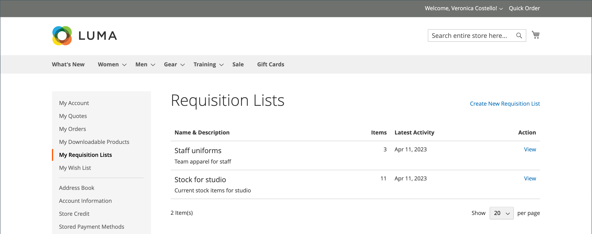
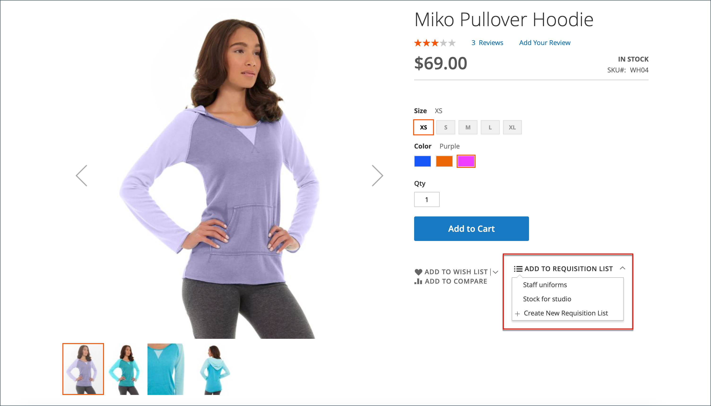
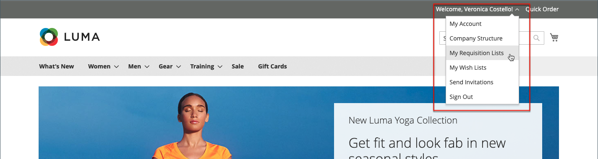

# 구매요청 목록

구매 요청 목록을 사용하면 목록에서 바로 장바구니에 품목이 추가되므로 자주 주문하는 제품을 구매할 때 시간이 절약됩니다. 고객은 다양한 공급업체, 구매자, 팀, 캠페인 또는 워크플로를 간소화하는 기타 모든 제품의 제품에 중점을 두는 여러 목록을 유지 관리할 수 있습니다. 로그인한 사용자와 게스트 모두가 사용할 수 있습니다.

>[!NOTE]
>
>스토어에 대한 구매요청 목록을 사용하려면 [B2B 기능 사용](enable-basic-features.md)을 참조하십시오. [구성](configure-requisition-lists.md)에 따라 각 고객 계정에 대해 최대 999개의 요청 목록을 유지할 수 있습니다.

구매요청 목록 기능은 위시리스트와 유사하며 다음과 같은 차이점이 있습니다.

- 장바구니에 품목을 보낸 후 구매요청 목록이 지워지지 않습니다. 여러 번 사용할 수 있습니다.
- 구매요청 목록의 사용자 인터페이스는 콤팩트 뷰를 사용하여 많은 품목을 표시합니다.

{width="600" zoomable="yes"}

## 계정 대시보드에서 구매요청 목록 생성

회사 계정과 연계된 로그인 고객은 계정 대시보드에서 구매요청 목록을 생성할 수 있습니다.

1. 계정의 사이드바에서 **[!UICONTROL My Requisition Lists]**&#x200B;을(를) 선택합니다.

1. _[!UICONTROL Requisition Lists]_페이지에서&#x200B;**[!UICONTROL Create New Requisition List]**을(를) 클릭합니다.

1. **[!UICONTROL Requisition List Name]** 및 **[!UICONTROL Description]**&#x200B;을(를) 입력합니다.

   {width="300"}

1. 완료되면 **[!UICONTROL Save]**&#x200B;을(를) 클릭합니다.

## 제품 페이지에서 구매요청 목록 생성

회사 계정과 연결된 로그인한 고객은 제품 페이지에서 구매요청 목록을 생성할 수 있습니다. 이 방법을 사용하면 목록을 만들고 제품을 추가하는 간단한 단축키를 사용할 수 있습니다.

1. 제품 세부 정보 페이지에서 고객이 **[!UICONTROL Add to Requisition List]**&#x200B;을(를) 클릭합니다.

1. **[!UICONTROL Create New Requisition List]**&#x200B;을(를) 클릭합니다.

1. **[!UICONTROL Requisition List Name]** 및 **[!UICONTROL Description]**&#x200B;을(를) 입력합니다.

1. 완료되면 **[!UICONTROL Save]**&#x200B;을(를) 클릭합니다.

## 구매요청 목록에 제품 추가

고객은 다음 방법으로 구매요청 목록에 제품을 추가할 수 있습니다.

- 제품 페이지
- 카탈로그 페이지
- 장바구니
- 기존 주문

### 제품 세부 사항 페이지에서

1. 고객이 상점 첫 화면에서 구매요청 목록에 추가될 제품의 상세내역 페이지로 이동합니다.

1. **[!UICONTROL Add to Requisition List]**&#x200B;을(를) 클릭하고 다음 중 하나를 수행합니다.

   - 기존 구매요청 목록을 선택합니다.
   - 구매요청 목록을 생성합니다.

   {width="700" zoomable="yes"}

### 카탈로그 페이지에서

1. 상점 첫 화면에서 고객은 구매요청 목록에 추가될 제품이 포함된 카탈로그 페이지로 이동합니다.

1. 제품 위로 마우스를 가져갑니다.

1. **[!UICONTROL Add to Requisition List]**&#x200B;을(를) 클릭하고 다음 중 하나를 수행합니다.

   - 기존 구매요청 목록을 선택합니다.
   - 구매요청 목록을 생성합니다.

   {width="700" zoomable="yes"}

### 기존 주문에서

1. 계정 대시보드의 사이드바에서 고객이 **[!UICONTROL My Orders]**&#x200B;을(를) 선택합니다.

1. 순서 맨 위에서 **[!UICONTROL Add to Requisition List]**&#x200B;을(를) 클릭하고 다음 중 하나를 수행합니다.

   - 기존 구매요청 목록을 선택합니다.
   - 구매요청 목록을 생성합니다.

   {width="700" zoomable="yes"}

### 카트에서

1. 항목 아래에서 고객이 **[!UICONTROL Add to Requisition List]** 메뉴를 클릭하고 다음 중 하나를 수행합니다.

   - 기존 구매요청 목록을 선택합니다.
   - 구매요청 목록을 생성합니다.

   {width="700" zoomable="yes"}

## 업데이트된 구매요청 목록 보기

고객이 계정에 로그인하면 다음 방법 중 하나를 사용하여 구매요청 목록을 조회할 수 있습니다.

{width="700" zoomable="yes"}

### 계정 대시보드에서

1. 계정 대시보드의 사이드바에서 **[!UICONTROL My Requisition Lists]**&#x200B;을(를) 선택합니다.

1. 구매요청 목록 목록에서 _작업_ 열의 **[!UICONTROL View]**&#x200B;을(를) 클릭합니다.

### 모든 storefront 페이지에서

1. 페이지 상단의 빠른 링크 모음에서 해당 사용자 이름을 클릭합니다.

1. 메뉴에서 **[!UICONTROL My Requisition Lists]**&#x200B;을(를) 선택합니다.
