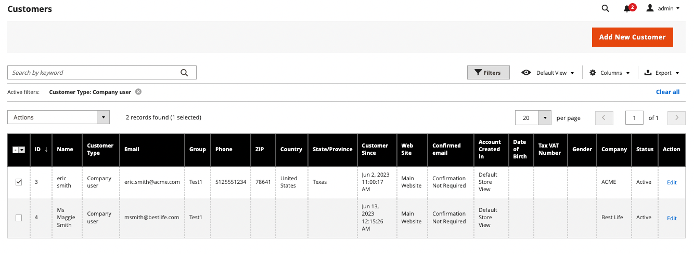

# 구매자에 대한 견적 시작

[영업 기능 구성](configure-quotes.md)에서 견적이 활성화된 경우 영업 사원은 관리자로부터 견적을 만들어 회사 구매자와 협상 프로세스를 시작할 수 있습니다.

- 초안 견적은 판매자에게만 표시됩니다.
- 구매자를 위한 초기 오퍼를 생성할 수 있도록 영업 담당자가 품목, 관련 할인 및 메모를 추가할 때까지 초안 견적을 제출할 수 없습니다.
- 판매자는 Quotes 또는 Customer Grid에서 Quote 를 생성할 수 있습니다.

영업 사원은 구매자에게 견적을 전송하여 협상 프로세스를 시작합니다. 견적[&#128279;](quote-price-negotiation.md) 협상을 참조하십시오.

## 영업 담당자 견적 작성 경험

영업 담당자는 견적 또는 고객 그리드에서 견적을 작성할 수 있습니다.

>[!NOTE]
>
>판매자가 구매자[를 위해 견적을 작성하는 비디오 데모는 상거래 비디오 및 자습서&#x200B;_에서 영업 담당자가 견적을](https://experienceleague.adobe.com/docs/commerce-learn/tutorials/b2b/b2b-quote/sales-rep-initiates-quote.html?lang=ko)_&#x200B;시작합니다.

### 견적 표에서 견적 만들기

1. 영업 담당자는 견적을 관리 할 수있는 영업 운영 권한이[&#128279;](../systems/permissions.md) 있는 관리자로 관리자에 로그인합니다.

1. 관리에서 **[!UICONTROL Sales]**&#x200B;을(를) 선택하여 [!UICONTROL Quotes] 그리드로 이동한 다음 **[!UICONTROL Quotes]**&#x200B;을(를) 선택합니다.

1. 구매자를 위한 견적을 생성합니다.

   - 따옴표 그리드에서 **[!UICONTROL Create New Quote]**&#x200B;을(를) 선택합니다.

     {width="700" zoomable="yes"}

   - [!UICONTROL Create New Quote] 페이지 에서 고객(회사 구매자)을 선택하여 견적을 생성합니다.

     {width="700" zoomable="yes"}

     새 견적이 `Draft` 상태로 표시됩니다.

     {width="700" zoomable="yes"}

   - 견적명을 업데이트하고 필요에 따라 만료 날짜를 수정합니다.

   - 견적을 초안으로 저장합니다.

## 구매자를 위한 견적 준비

초안 견적을 작성한 후 견적에 주석 및 관련 파일을 추가하여 제품 품목을 추가하고 할인을 적용하고 구매자와 소통합니다. 그런 다음 구매자에게 견적을 보내 검토하거나 초안으로 저장합니다.

1. **[!UICONTROL Add Product By SKU]**&#x200B;을(를) 선택하여 견적에 항목을 추가합니다. SKU 번호와 수량을 입력한 다음 **[!UICONTROL Add Product]**&#x200B;을(를) 선택합니다.

   {width="675" zoomable="yes"}

1. 필요에 따라 제품에 라인 항목 할인을 적용합니다.

   - [작업] [!UICONTROL Select] 메뉴에서 을 선택합니다 **[!UICONTROL Discount Item]**.

   - 양식에서 [!UICONTROL Discount Line item] 을 선택합니다 **[!UICONTROL Discount Type]**.

     {width="675" zoomable="yes"}

   - [!UICONTROL Discount] 필드에 할인 유형 값을 입력합니다. 예를 들어 할인율을 선택한 경우 10을 입력하면 라인 항목 10% 할인이 적용됩니다.

   - 선택적으로, 제품 가격이 견적 수준에서 적용된 할인에 의해 더 이상 감소하지 않도록 라인 항목 할인 값을 잠급니다.

     변경을 확인한 후 제품 격자의 라인 항목 속성이 업데이트되어 적용된 할인 금액이 표시됩니다. 할인이 잠기면 잠금 아이콘이 표시됩니다.

   영업 사원은 견적의 특정 라인 항목에서 할인을 요청할 수 있습니다.

   >[!NOTE]
   >
   >라인 항목 할인의 작동 방식에 대한 비디오 데모는 _Commerce 비디오 및 Tutorials_&#x200B;의 [영업 담당자가 견적 라인 항목에 할인을 적용합니다](https://experienceleague.adobe.com/docs/commerce-learn/tutorials/b2b/b2b-quote/quote-line-item-discount.html?lang=ko)를 참조하십시오.

1. 필요에 따라 견적 수준 할인 적용:

   - [!UICONTROL Quote Totals - Negotiated Price] 섹션에서 할인 유형을 선택한 다음 적용할 값을 입력합니다.

     {width="700" zoomable="yes"}

   제품 격자가 업데이트되어 할인이 표시됩니다.

1. 구매자를 위한 추가 정보를 추가합니다.

   **[!UICONTROL Negotiation - Comments]** 탭에서 메모를 추가하고 구매자에게 필요한 지원 파일을 첨부합니다.

   {width="700" zoomable="yes"}

   기본적으로 [첨부된 파일](configure-quotes.md)은(는) DOC, DOCX, XLS, XLSX, PDF, TXT, JPG 또는 JPEG, PNG 파일 형식 중 하나로 최대 2MB입니다.

1. 협상 중에 배송 주소를 추가하십시오.

   영업 담당자는 구매자가 견적에 배송 주소를 추가한 후 배송 및 배송을 선택할 수 있습니다.

   배송 옵션은 결제 시 잠겨 있습니다.

   자세한 내용은 내 견적을[&#128279;](account-dashboard-my-quotes.md#adding-a-shipping-address) 참조하세요.

1. 견적을 처리합니다.

   견적을 초안으로 저장하거나 구매자에게 전송합니다.

   - 견적을 초안으로 저장하면 상태가 `Draft`(으)로 업데이트되고 확인 메시지가 표시됩니다.

   - 구매자에게 견적을 보내면 상태가 `Submitted`(으)로 변경됩니다. 구매자는 견적을 검토하기 위해 이메일 알림을 받습니다. 구매자가 추가 협상을 위해 견적을 반환할 때까지 견적이 잠깁니다. 판매자는 Quote 표 또는 Customer 표에서 Quote 를 볼 수 있습니다.

## 고객 그리드에서 견적 조회 및 생성

1. 관리에서 **[!UICONTROL Customers]**&#x200B;을(를) 선택하여 [!UICONTROL Customer] 그리드로 이동한 다음 **[!UICONTROL All Customers]**&#x200B;을(를) 선택합니다.

1. 회사 구매자의 고객 ID를 선택합니다.

   {width="700" zoomable="yes"}

1. 고객 정보를 보려면 **[!UICONTROL Edit]**&#x200B;을(를) 선택하십시오.

1. **[!UICONTROL Create Quote]**&#x200B;을(를) 선택하고 프로세스에 따라 초안 견적을 업데이트하여 고객에게 보내어 고객에 대한 견적을 만드십시오.

1. **[!UICONTROL Quotes]**&#x200B;을(를) 선택하여 고객의 기존 견적을 봅니다.

   {width="700" zoomable="yes"}

1. **[!UICONTROL View]**&#x200B;을(를) 선택하여 견적을 엽니다.

견적 협상 프로세스 관리에 대한 자세한 내용은 [견적 협상](quote-price-negotiation.md)을 참조하십시오.
