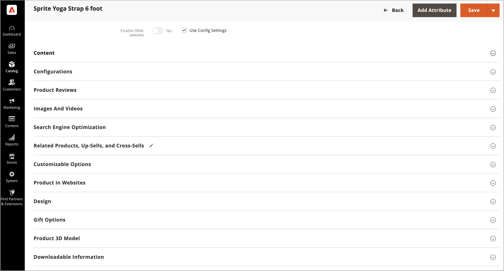

# Adobe Commerce용 [!DNL AR Viewer]을(를) 사용하여 제품 3D 모델 관리

각 제품에 대해 제품 목록에서 AR 및 3D 모델을 사용할 수 있도록 허용하는 `.USDZ` 파일을 업로드할 수 있습니다.

[!DNL AR Viewer]은(는) `.USDZ`개의 파일만 지원합니다.

## 확장 설치

[!DNL AR Viewer]이(가) [Adobe Commerce 마켓플레이스](https://commercemarketplace.adobe.com/magento-module-arviewer.html){target=_blank}에서 확장으로 설치되었습니다.

확장 설치 프로세스에 대한 자세한 내용은 [_설치 안내서_](https://experienceleague.adobe.com/docs/commerce-operations/installation-guide/tutorials/extensions.html?lang=ko)를 참조하십시오.

[!DNL AR Viewer] 확장이 설치 및 구성된 후 관리자는 3D 모델을 포함하도록 제품 목록을 설정, 사용자 지정 및 관리할 수 있습니다.

## 3D 모델 추가

1. 제품을 편집 모드로 엽니다.

1. 특정 스토어 보기로 작업하려면 **[!UICONTROL Store View]** 선택기를 해당 보기로 설정하십시오.

   >[!NOTE]
   >
   >`All Store Views` 범위가 업로드에 사용되지 않는 경우에도 새 제품 3D 모델이 _항상_&#x200B;업로드되어 _모두_ 스토어 보기에 표시됩니다.   특정 스토어 보기에서 제품 3D 모델을 숨기려면 해당 스토어 보기로 전환하고 3D 모델에 대한 **[!UICONTROL Hide from Product Page]** 확인란을 선택한 다음 **[!UICONTROL Save]**&#x200B;을(를) 클릭합니다.

1. 아래로 스크롤하여 _[!UICONTROL Product 3D Model]_&#x200B;섹션을 확장합니다.

   {width="700" zoomable="yes"}

1. 제품의 3D 모델(`.USDZ` 파일)을 추가합니다.

1. **[!UICONTROL Save]**&#x200B;을(를) 클릭합니다.

### 3D 모델 삭제

제품 세부 사항에서 3D 모델을 제거하려면 다음 작업을 수행하십시오.

1. **[!UICONTROL Delete]**&#x200B;을(를) 클릭합니다.

1. **[!UICONTROL Save]**&#x200B;을(를) 클릭합니다.

## 제품 3D 모델 보기

제품 세부 사항이 3D 모델로 업데이트되는 경우:

1. [!DNL AR Viewer]은(는) AR 파일을 인코딩하는 제품 설명에 QR 코드를 생성합니다.

1. 고객은 제품 페이지에서 이 QR 코드를 볼 수 있습니다.

1. 고객이 모바일 장치로 QR 코드를 스캔하면 AR 경험이 모바일 장치에서 렌더링됩니다.

>[!NOTE]
>
> 사용자가 제품에 3d 모델을 추가하는 일련의 데모 비디오를 보려면 _Commerce 비디오 및 Tutorials_&#x200B;의 [Adobe Commerce용 AR 뷰어](https://experienceleague.adobe.com/docs/commerce-learn/tutorials/catalog/augmented-reality.html?lang=ko) 페이지를 참조하십시오.
