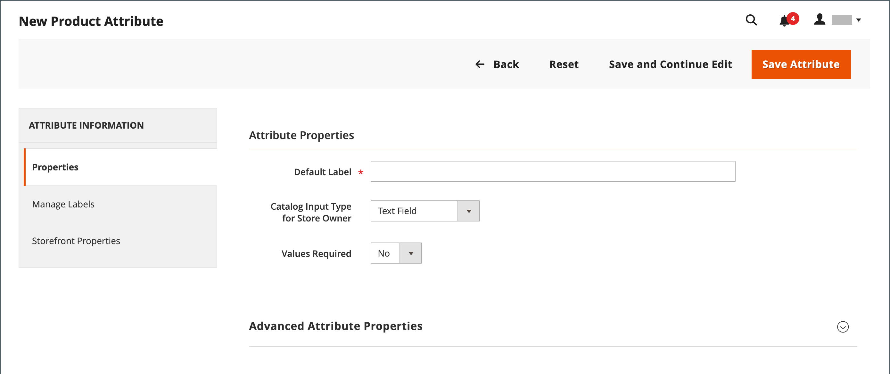
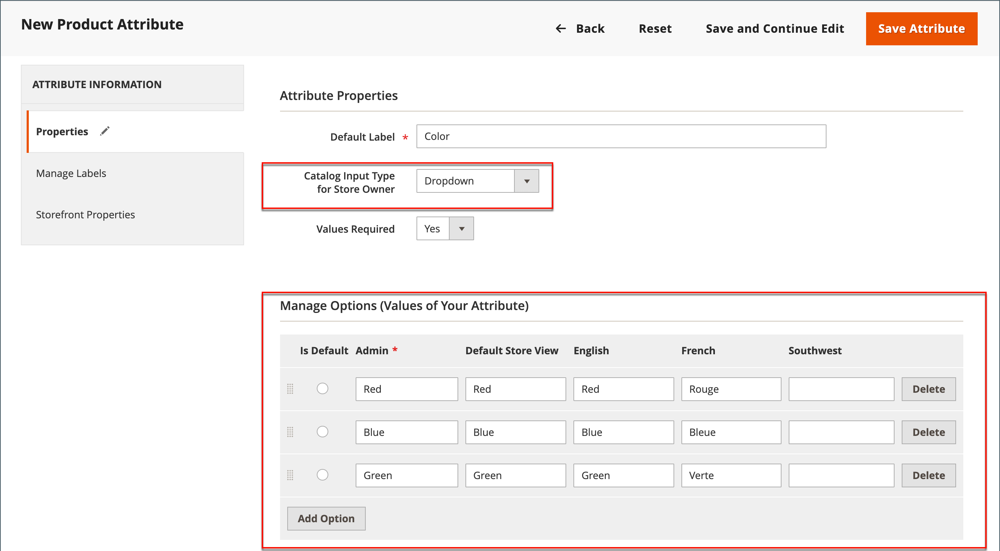
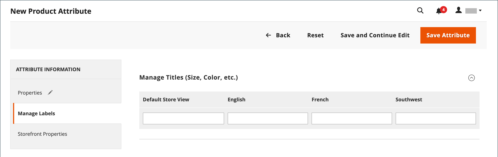
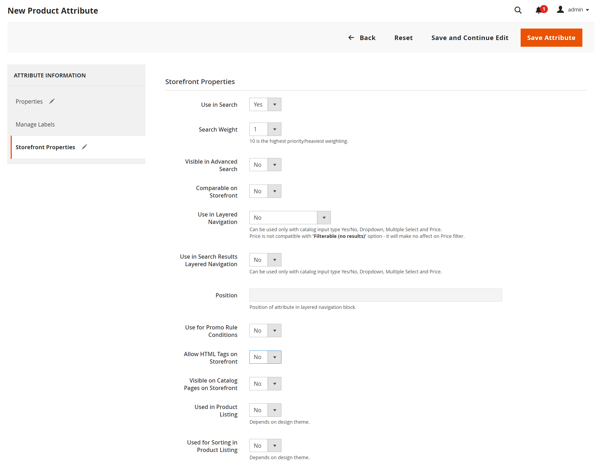

# 제품 속성 만들기 및 삭제

제품이나 _[!UICONTROL Product Attributes]_&#x200B;페이지에서 작업하는 동안 특성을 만들 수 있습니다. 다음 단계에서는&#x200B;_[!UICONTROL Stores]_ 메뉴에서 특성을 만드는 방법을 보여 줍니다.

## 1단계: 기본 속성 속성 설명

1. _관리자_ 사이드바에서 **[!UICONTROL Stores]** > _[!UICONTROL Attributes]_>**[!UICONTROL Product]**(으)로 이동합니다.

1. **[!UICONTROL Add New Attribute]**&#x200B;을(를) 클릭합니다.

   {width="600" zoomable="yes"}

1. **[!UICONTROL Default Label]**&#x200B;에 대해 특성을 식별하는 레이블을 입력하십시오.

1. 데이터 입력에 사용되는 입력 컨트롤의 형식을 확인하려면 **[!UICONTROL Catalog Input Type for Store Owner]**&#x200B;을(를) 다음 중 하나로 설정하십시오.

   | 속성 | 설명 |
   |--- |--- |
   | `Text Field` | 텍스트를 위한 한 줄 입력 필드입니다. |
   | `Text Area` | 제품 설명과 같은 텍스트 단락을 입력하기 위한 여러 줄 입력 필드입니다. WYSIWYG 편집기 를 사용하여 HTML 태그로 텍스트 서식을 지정하거나 텍스트에 태그를 직접 입력할 수 있습니다. |
   | `Text Editor` | 속성 위치에서 완전히 작동하는 텍스트 편집기입니다. |
   | 날짜 | [기본 설정 형식](attributes-input-types.md#date-and-time-options) 및 [시간대](../getting-started/store-details.md#locale-options)로 날짜 값을 표시합니다. 날짜 값은 목록 또는 달력()에서 선택할 수 있습니다.   **_참고:_** 시스템 구성에 따라 _관리자_ 사용자는 필드에 날짜를 직접 입력하거나 달력 또는 목록에서 날짜를 선택할 수 있습니다. 날짜 및 시간 값 지정에 대한 자세한 내용은 [날짜 및 시간 옵션](attributes-input-types.md#date-and-time-options)을 참조하세요. |
   | `Yes/No` | `Yes` 및 `No`의 사전 정의된 옵션이 있는 드롭다운 목록을 표시합니다. |
   | `Dropdown` | 단일 선택 항목만 허용하는 값의 드롭다운 목록을 표시합니다. 드롭다운 입력 유형은 [구성 가능한 제품](product-create-configurable.md)의 주요 구성 요소입니다. |
   | `Multiple Select` | 다중 선택을 허용하는 값의 드롭다운 목록을 표시합니다. |
   | `Price` | 이 입력 유형은 사전 정의된 속성(가격, 특별 가격, 계층 가격 및 비용)에 추가되는 가격 필드를 생성하는 데 사용됩니다. 사용되는 통화는 시스템 구성에 따라 결정됩니다. |
   | `Media Image` | 제품 로고, 관리 지침 또는 식품 라벨의 재료와 같은 추가 이미지를 제품과 연결합니다. 미디어 이미지 속성을 제품의 속성 세트에 추가하면 기본, 작은 이미지 및 썸네일과 함께 추가 이미지 유형이 됩니다. 미디어 이미지 특성은 [storefront 미디어 브라우저](catalog-images-video.md#storefront-media-browser)에서 제외할 수 있습니다. |
   | `Fixed Product Tax` | 로케일의 요구 사항에 따라 [FPT 비율](../stores-purchase/fixed-product-tax.md)을 정의할 수 있습니다. |
   | `Visual Swatch` | 구성 가능한 제품의 색상, 질감 또는 패턴을 나타내는 견본을 표시합니다. [시각적 견본](swatches.md)을(를) 16진수 색상 값으로 채우거나 옵션의 색상, 재질, 질감 또는 패턴을 나타내는 업로드된 이미지를 표시할 수 있습니다. |
   | `Text Swatch` | 크기에 자주 사용되는 구성 가능한 제품 옵션의 텍스트 기반 표현입니다. [텍스트 견본](swatches.md#text-based-swatches)에 16진수 색상 값도 포함할 수 있습니다. |
   | `Page Builder` | 제품 페이지에 매력적인 콘텐츠를 쉽게 추가할 수 있도록 특성 위치에 완전히 기능하는 [Page Builder](../page-builder/introduction.md) 작업 영역입니다. |

   {style="table-layout:auto"}

1. 고객이 제품을 구매하기 전에 옵션을 선택하려면 **[!UICONTROL Values Required]**&#x200B;을(를) `Yes`(으)로 설정하십시오.

1. [!UICONTROL Dropdown] 및 [!UICONTROL Multiple Select] 입력 유형에 대해 다음을 수행합니다.

   - _[!UICONTROL Manage Options]_&#x200B;에서&#x200B;**[!UICONTROL Add Option]**&#x200B;을(를) 클릭합니다.

   - 목록에 표시할 첫 번째 값을 입력합니다.

     관리자에 대한 값을 하나 입력하고 각 스토어 보기에 대한 값의 번역을 입력할 수 있습니다. 스토어 보기가 한 개만 있는 경우 관리 값만 입력할 수 있으며 이 값은 상점 간에도 사용됩니다.

   - **[!UICONTROL Add Option]**&#x200B;을(를) 클릭하고 목록에 포함할 각 옵션에 대해 이전 단계를 반복합니다.

   - 옵션을 기본값으로 사용하려면 **[!UICONTROL Is Default]**&#x200B;을(를) 선택하십시오.

   {width="600" zoomable="yes"}

## 2단계: 고급 속성 설명(필요한 경우)

1. 고유한 **[!UICONTROL Attribute Code]**&#x200B;을(를) 소문자 및 공백 없이 입력하십시오.

   >[!NOTE]
   >
   >`type` 필드의 [!UICONTROL Attribute Code] 값은 사용하지 않는 것이 좋습니다. `type` 값이 시스템 용도로 예약되어 있기 때문에 오류가 발생할 수 있습니다.

   {width="600" zoomable="yes"}

   사용 가능한 옵션은 _[!UICONTROL Catalog Input Type for Store Owner]_&#x200B;설정에 따라 다릅니다.

1. **[!UICONTROL Scope]**&#x200B;스토어 계층 구조[에서 특성을 사용할 수 있는 위치를 나타내려면 &#x200B;](../getting-started/websites-stores-views.md)을(를) 설정하십시오.

1. 중복 값 항목을 방지하려면 **[!UICONTROL Unique Value]**&#x200B;을(를) `Yes`(으)로 설정하십시오.

1. 값을 입력한 입력 형식의 경우 필드에 포함해야 하는 데이터 형식으로 **[!UICONTROL Input Validation for Store Owner]**&#x200B;을(를) 설정하여 텍스트 필드에 입력한 데이터의 유효성 검사를 실행하십시오.

   값이 선택된 입력 유형에는 이 필드를 사용할 수 없습니다. 테스트에서는 다음 중 하나를 확인할 수 있습니다.

   - `Decimal Number`
   - `Integer Number`
   - `Email`
   - `URL`
   - `Letters`
   - `Letters (a-z, A-Z) or Numbers (0-9)`

   {width="400"}

1. 이 특성을 [제품 목록](products-list.md)에 추가하려면 다음 옵션을 `Yes`(으)로 설정하십시오.

   - **열 옵션에 추가** - 특성을 _[!UICONTROL Products]_&#x200B;목록에 열로 포함합니다.
   - **필터 옵션에서 사용** - _[!UICONTROL Products]_&#x200B;목록의 열 헤더에 필터 컨트롤을 추가합니다.

## 3단계: 필드 레이블 입력

1. 왼쪽 탐색에서 **[!UICONTROL Manage Labels]**&#x200B;을(를) 선택합니다.

1. 필드의 레이블로 사용할 **[!UICONTROL Title]**&#x200B;을(를) 입력하십시오.

   스토어를 다른 언어로 사용할 수 있는 경우 각 보기에 대해 번역된 제목을 입력할 수 있습니다.

   {width="600" zoomable="yes"}

   >[!NOTE]
   >
   > 라이브 검색에서 이 속성을 패싯으로 사용하려면 저장소별 레이블을 지정해야 합니다. 없으면 Facet 구성 페이지에 속성 이름이 올바르게 표시되지 않을 수 있습니다. 구성을 업데이트하려면 [Live Search 안내서](https://experienceleague.adobe.com/en/docs/commerce/live-search/live-search-admin/facets/facets-add#step-2-edit-facet-properties-optional)의 Live Search 환경 설정 목록&#x200B;_에서_&#x200B;편집 옵션을 사용하여 레이블을 수동으로 편집하십시오.

## 4단계: 상점 속성 설명

1. 왼쪽 탐색에서 **[!UICONTROL Storefront Properties]**&#x200B;을(를) 선택합니다.

   {width="600" zoomable="yes"}

   사용 가능한 옵션은 _[!UICONTROL Catalog Input Type for Store Owner]_&#x200B;설정에 따라 다릅니다.

1. 특성을 검색할 수 있게 하려면 **[!UICONTROL Use in Search]**&#x200B;을(를) `Yes`(으)로 설정합니다.

   - **[!UICONTROL Search Weight]** 값을 설정하여 항목이 검색 결과에 표시되는 위치를 제어합니다. 1(최저 가중치)을 10(최고 가중치)으로 설정합니다.

   - 필요에 따라 **[!UICONTROL Visible in Advanced Search]**&#x200B;을(를) 설정합니다. [고급 검색](search.md#advanced-search)에서 자세히 알아보세요.

1. 제품 비교에 특성을 포함하려면 **[!UICONTROL Comparable on Storefront]**&#x200B;을(를) `Yes`(으)로 설정하십시오.

1. 드롭다운, 다중 선택 및 가격 필드의 경우 다음을 수행합니다.

   - 계층화된 탐색에서 특성을 필터로 사용하려면 **[!UICONTROL Use in Layered Navigation]**&#x200B;을(를) `Yes`(으)로 설정하십시오.

   - 검색 결과 페이지의 계층화된 탐색에서 특성을 사용하려면 **[!UICONTROL Use in Search Results Layered Navigation]**&#x200B;을(를) `Yes`(으)로 설정하십시오.

   - **[!UICONTROL Position]**&#x200B;의 경우 계층 탐색 블록에서 특성의 상대 위치를 나타내는 숫자를 입력합니다.

1. 가격 규칙에서 특성을 사용하려면 **[!UICONTROL Use for Promo Rule Conditions]**&#x200B;을(를) `Yes`(으)로 설정하십시오.

1. 텍스트 서식을 HTML으로 지정하려면 **[!UICONTROL Allow HTML Tags on Frontend]**&#x200B;을(를) `Yes`(으)로 설정합니다.

   이 설정을 사용하면 필드에 WYSIWYG 편집기를 사용할 수 있습니다.

1. 제품 페이지에 특성을 포함하려면 **[!UICONTROL Visible on Catalog Pages on Storefront]**&#x200B;을(를) `Yes`(으)로 설정합니다.

1. 테마에서 지원하는 경우 다음 설정을 완료합니다.

   - 제품 목록에 특성을 포함하려면 **[!UICONTROL Used in Product Listing]**&#x200B;을(를) `Yes`(으)로 설정하십시오.

   - 특성을 제품 목록의 정렬 매개 변수로 사용하려면 **[!UICONTROL Used for Sorting in Product Listing]**&#x200B;을(를) `Yes`(으)로 설정하십시오.

1. 완료되면 **[!UICONTROL Save Attribute]**&#x200B;을(를) 클릭합니다.

## 5단계: 작성된 속성을 속성 세트에 지정

제품 작성 페이지에 표시할 속성을 특정 속성 집합에 추가합니다.

1. 이전 단계를 완료한 후 **[!UICONTROL Stores]** > _[!UICONTROL Attributes]_>**[!UICONTROL Attribute Set]**(으)로 이동합니다.

1. 목록에서 필요한 속성 세트를 선택하고 편집 모드로 엽니다.

1. 만든 특성을 **[!UICONTROL Unassigned Attributes]** 목록에서 **그룹** 열의 적절한 폴더로 드래그합니다.

1. 완료되면 **[!UICONTROL Save]**&#x200B;을(를) 클릭합니다.

## 구성 가능한 제품의 속성

[구성 가능한 제품](product-create-configurable.md)에 대한 옵션 드롭다운 목록으로 사용되는 모든 속성에는 다음 속성이 있어야 합니다.

| 속성 | 값 |
|----------|------ |
| 저장소 소유자에 대한 카탈로그 입력 유형 | 드롭다운 |
| 범위 | 글로벌 |

{style="table-layout:auto"}

## 속성 삭제

속성이 삭제되면 관련 제품 및 속성 세트에서 제거됩니다. 시스템 속성은 저장소의 핵심 기능에 속하며 삭제할 수 없습니다.

속성을 삭제하기 전에 현재 카탈로그의 제품에서 이 속성을 사용하고 있지 않은지 확인하십시오. 특성을 사용 중인지 확인하는 쉬운 방법은 [내보내기](../systems/data-export.md) 도구를 사용하여 제품 엔터티 특성 목록을 확인하는 것입니다. 속성이 목록에 포함되지 않으면 카탈로그의 제품에서 사용되지 않습니다.

특성을 삭제하려면 **_To:_**

1. _관리자_ 사이드바에서 **[!UICONTROL Stores]** > _[!UICONTROL Attributes]_>**[!UICONTROL Product]**(으)로 이동합니다.

1. 목록에서 속성을 찾아 편집 모드로 엽니다.

1. **[!UICONTROL Delete Attribute]**&#x200B;을(를) 클릭합니다.

   {width="600" zoomable="yes"}

1. 확인 메시지가 표시되면 **[!UICONTROL OK]**&#x200B;을(를) 클릭합니다.
