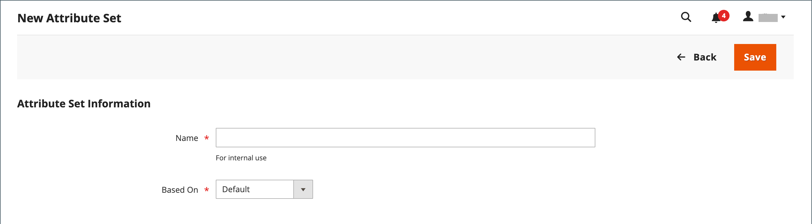

# 속성 집합

제품을 만들 때 첫 번째 단계 중 하나는 제품 레코드의 템플릿으로 사용되는 속성 세트를 선택하는 것입니다. 속성 세트는 데이터 입력 중에 사용할 수 있는 필드와 고객에게 표시되는 값을 결정합니다.

속성은 제품 레코드에서 표시되는 위치를 결정하는 그룹으로 구성됩니다. 스토어에는 초기 속성 세트(라고 함)가 제공됩니다. _기본값_&#x200B;일반적으로 사용되는 속성 세트를 포함하는 . 일부 속성만 추가하려면 이 기본 속성 집합에 추가할 수 있습니다. 특정 유형의 정보가 필요한 제품을 판매하는 경우 제품에 필요한 특정 속성이 포함된 전용 속성 세트를 만드는 것이 좋습니다.

{width="700" zoomable="yes"}

## 속성 집합 만들기

1. 다음에서 _관리자_ 사이드바, 이동 **[!UICONTROL Stores]** > _[!UICONTROL Attributes]_>**[!UICONTROL Attribute Set]**.

1. 클릭 **[!UICONTROL Add New Set]**.

   {width="600" zoomable="yes"}

1. 입력 **[!UICONTROL Name]** 속성 세트에 대해 사용됩니다.

1. 설정 **[!UICONTROL Based On]** 템플릿으로 사용할 기존 속성 집합에 대한 유효성 검사 결과를 반환합니다.

1. 클릭 **[!UICONTROL Save]**.

   다음 페이지에는 다음이 표시됩니다.

   - 왼쪽 열에는 속성 세트의 이름이 표시됩니다. 이름은 내부 참조용이며 필요에 따라 변경할 수 있습니다.
   - 페이지의 중앙에는 현재 선택된 속성 그룹이 나열됩니다.
   - 오른쪽 열에는 현재 속성 집합에 할당되지 않은 속성 선택 항목이 나열됩니다.

1. 집합에 속성을 추가하려면 **[!UICONTROL Unassigned Attributes]** 의 적절한 폴더에 나열합니다. **[!UICONTROL Groups]** 열.

   >[!NOTE]
   >
   >시스템 속성은 점으로 표시되어 에서 제거할 수 없습니다. _[!UICONTROL Groups]_목록을 표시합니다. 그러나 속성 세트의 다른 그룹으로 드래그할 수 있습니다.

1. 완료되면 다음을 클릭하십시오. **[!UICONTROL Save]**.

{width="600" zoomable="yes"}

## 속성 그룹 만들기

1. 다음에서 _[!UICONTROL Groups]_속성 집합에 열을 지정하고&#x200B;**[!UICONTROL Add New]**.

1. 입력 **[!UICONTROL Name]** 을 클릭하여 새 그룹을 만들고 **[!UICONTROL OK]**.

1. 다음 중 하나를 수행합니다.

   - 드래그 **[!UICONTROL Unassigned Attributes]** 새 그룹에 추가합니다.
   - 다른 그룹의 속성을 새 그룹으로 드래그합니다.

   새 그룹은 속성 세트를 기반으로 하는 모든 제품에서 속성의 섹션이 됩니다.

## 속성 집합 삭제

1. 다음에서 _관리자_ 사이드바, 이동 **[!UICONTROL Stores]** > _[!UICONTROL Attributes]_>**[!UICONTROL Attribute Set]**.

1. 목록에서 속성 세트를 선택하고 편집 모드로 엽니다.

1. 클릭 **[!UICONTROL Delete]**.

1. 확인을 묻는 메시지가 나타나면 **[!UICONTROL OK]**.
