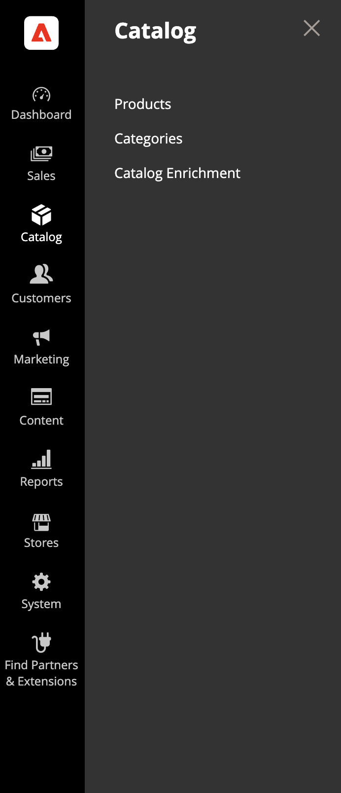

# 카탈로그 강화

카탈로그 보강은 기본 [!DNL Adobe Commerce] 기능으로, 쇼핑객이 제품 조사 및 검색을 위해 LLM 및 AI 도우미를 사용할 때 카탈로그가 더 정확하게 표시되도록 제품 이름과 긴 설명을 개선하는 데 도움이 됩니다.

>[!NOTE]
>
>카탈로그 보강은 백그라운드에서 [!DNL Commerce Catalog Agent] 및 [!DNL Adobe LLM Optimizer]에 의해 제공됩니다. 데이터 보강 기능을 Commerce 카탈로그 워크플로의 일부로 사용합니다. 승인된 이름 및 설명 업데이트를 적용하기 위해 별도의 LLM Optimizer 통합을 관리하지 않습니다. Commerce 외부에서 보다 광범위한 LLM 모니터링 및 최적화를 보려면 [LLM Optimizer 제품 설명서](https://experienceleague.adobe.com/ko/docs/llm-optimizer/using/home)를 참조하세요.

## 작동 방식 {#how-it-works}

[!DNL Adobe Commerce] 제품 카탈로그는 이름, 설명, 특성, 가격 및 인벤토리와 같은 제품 데이터의 기록 시스템입니다. [!DNL Adobe Commerce] Storefront MCP(모델 컨텍스트 프로토콜)는 라이브 카탈로그 데이터를 Adobe AI 경험에 연결합니다. 여기에서 카탈로그 에이전트는 제품 이름과 긴 설명의 차이를 식별하고, 개선 사항을 제안하고, 승인된 변경 사항을 Commerce에 다시 작성하여 Commerce 관리자에서 검토할 수 있습니다.

카탈로그 강화를 통해 다음과 같은 작업을 수행할 수 있습니다.

- LLM이 제품을 해석하는 방식에 영향을 주는 제품 이름과 긴 설명의 간격 및 불일치를 식별합니다.
- 타당성, 전후 비교 등 제안된 개선 사항을 지원 컨텍스트로 검토합니다.
- 승인된 업데이트를 Commerce 카탈로그에 직접 적용하여 관리자, 상점 및 해당 필드를 읽는 기타 채널이 맞게 정렬되도록 합니다.

제품 이름과 긴 설명은 Commerce에 있으므로 한 번 사본을 개선하면 해당 제품 데이터를 사용하는 모든 채널에 도움이 될 수 있습니다. 이 이점은 시스템을 새로 고치는 방법과 시기에 따라 다릅니다.

| 방향 | 목적 |
| --- | --- |
| Commerce 카탈로그 -> 분석 | 카탈로그 및 URL은 피드 보강 제안을 나타냅니다. |
| 데이터 보강 -> Commerce 카탈로그 | 업데이트를 승인하면 제품 이름 및 설명에 대한 변경 사항이 Commerce 카탈로그에 저장되므로 관리자 및 상점 첫 화면의 최적화된 값이 반영됩니다. |

## 이 대상이 누구입니까 {#who-this-is-for}

- LLM 기반 답변에서 제품 데이터가 정확하고 일관되기를 원하는 디지털 마케터 및 머천다이저.
- 대규모로 카탈로그 사본을 개선하기 위해 통제된 방법이 필요한 디지털 마케터 및 머천다이저.
- 제품 속성을 제공하는 카탈로그 무결성, 관리 프로세스 및 통합(API, CSV, PIM)을 소유한 Commerce 관리자.

## 사전 요구 사항 {#prerequisites}

카탈로그 보강에 액세스할 수 있는 경우 다음 사전 요구 사항이 적용됩니다.

- LLM 중심의 크롤링과 크롤링 중심의 봇을 통해 을 이용할 수 있습니다. 카탈로그 추천 기능에 대한 인식이 필요합니다.
- 필수 Commerce 서비스 및 카탈로그 연결이 활성화되었으며 정상입니다. 자세한 내용은 [카탈로그 데이터 보강 사용](#enable-catalog-enrichment)을 참조하세요.
- [IMS가 구성되었습니다](https://experienceleague.adobe.com/ko/docs/core-services/interface/administration/organizations).
- [Adobe Admin Console](https://helpx.adobe.com/kr/business/enterprise/plan-your-deployment/basic-concepts/admin-console.html)에 액세스할 수 있습니다.
- 조직은 기본 AI 서비스에 대해 GenAI 라이더에 서명하거나 명시적으로 옵트아웃했습니다.

>[!NOTE]
>
>설정의 일부로, Commerce은 귀사에서 카탈로그 강화 기반 AI 서비스를 다루는 GenAI 라이더에 서명했는지 여부를 확인합니다. 아직 라이더에 서명하지 않았거나 옵트아웃하지 않은 경우 카탈로그 강화를 사용하기 전에 라이더에 서명하거나 업데이트하라는 메시지가 표시됩니다.

## 카탈로그 보강 활성화 {#enable-catalog-enrichment}

제안을 검토하거나 적용하기 전에 Commerce 관리자 또는 구현 파트너와 협력하여 다음을 확인하십시오.

### 카탈로그 보강 및 카탈로그 서비스 확장 설치

1. 다음 명령을 실행하여 Commerce 인스턴스에 카탈로그 보강 확장을 설치합니다.

   ```bash
   composer require magento/module-catalog-enrichment --no-update
   composer update magento/module-catalog-enrichment
   ```

1. 카탈로그 서비스를 아직 설치하지 않은 경우 [그렇게 합니다](https://experienceleague.adobe.com/ko/docs/commerce/catalog-service/installation#install-the-catalog-service-extension).

   이제 Commerce 인스턴스에서 **[!UICONTROL Catalog enrichment]**&#x200B;을(를) 사용할 수 있습니다.

### 카탈로그 강화 액세스

카탈로그 보강 및 카탈로그 서비스 확장을 설치하면 **[!UICONTROL Catalog]** > **[!UICONTROL Catalog Enrichment]** 아래의 관리자에서 카탈로그 보강 기능을 사용할 수 있습니다.



### 카탈로그 보강 구성

[!DNL Commerce Catalog Agent]이(가) [!DNL Adobe Commerce] 환경에 연결하여 Commerce 관리자에서 제안을 표시할 수 있도록 **[!UICONTROL Settings]** 탭에서 카탈로그 강화를 구성합니다.

1. 관리자에서 **[!UICONTROL Catalog]** > **[!UICONTROL Catalog Enrichment]**(으)로 이동합니다.
1. 페이지 상단의 **[!UICONTROL Scope]** 목록에서 구성할 저장소 보기를 선택하거나 **[!UICONTROL All Store Views]**&#x200B;을(를) 떠나 저장소 보기 간 설정을 관리합니다.
1. **[!UICONTROL Settings]** 탭을 엽니다.
1. **[!UICONTROL Commerce Configuration]**&#x200B;에서 해당 URL로 레이블이 지정된 저장소 보기 패널을 확장합니다.

   카탈로그 LLM Optimizer 서비스 및 감사 워크플로우를 사용하려면 [!DNL Adobe Commerce] 환경 세부 정보를 제공하십시오.

   카탈로그 데이터 보강 설정 탭의 

1. 저장소 보기에 필요한 연결 세부 정보를 입력합니다.

   - **[!UICONTROL Store View URL]**: 스토어 보기에 해당하는 URL(예: `https://brand.example.com/fr/`).
   - **[!UICONTROL Environment ID]**: 연결에 액세스하는 [!DNL Adobe Commerce] 환경에 대한 고유 식별자입니다.
   - **[!UICONTROL Website Code]**, **[!UICONTROL Store Code]** 및 **[!UICONTROL Store View Code]**: Commerce 웹 사이트의 웹 사이트, 스토어 및 스토어 보기 코드. 이러한 값은 Commerce 관리자의 코드와 일치해야 합니다.
   - **[!UICONTROL Host Name]**: [!DNL Adobe Commerce] 인스턴스의 호스트 이름입니다.

1. **[!UICONTROL Save]**&#x200B;을(를) 클릭합니다.

저장한 후 해당 저장소 보기에 대한 카탈로그 또는 감사 결과에 의존하기 전에 초기 동기화 또는 유효성 검사 작업이 완료될 때까지 기다리십시오. 제품 제안이 **[!UICONTROL Catalog Enrichment]** 페이지에 표시되는 데 최대 24시간이 걸릴 수 있습니다.

저장소 보기 구성을 제거하려면 해당 항목을 확장하고 **[!UICONTROL Delete]**&#x200B;을(를) 클릭합니다.

#### 필드 설명 {#commerce-connection-fields}

필수 필드는 **[!UICONTROL Commerce Configuration]** 양식에 별표(*)로 표시됩니다.

| 필드 | 필수 | 설명 |
| --- | --- | --- |
| 보기 URL 저장 | 예 | 스토어 보기에 해당하는 URL(예: `https://brand.example.com/fr/`). |
| 환경 ID | 예 | 연결에 액세스하는 [!DNL Adobe Commerce] 환경에 대한 고유 식별자입니다. |
| 웹 사이트 코드 | 예 | Commerce 웹 사이트의 웹 사이트 코드. |
| 코드 저장 | 예 | Commerce 웹 사이트의 스토어 코드. |
| 보기 코드 저장 | 예 | Commerce 웹 사이트의 스토어 보기. |
| 호스트 이름 | 예 | [!DNL Adobe Commerce] 인스턴스의 호스트 이름입니다. |

### 카탈로그 보강 검토 및 적용 {#review-and-apply}

카탈로그 보강이 사용 및 구성된 후 제품 제안이 **[!UICONTROL Agentic Opportunities]** 탭에 표시됩니다. 여기에서 제안을 검토하고 승인된 업데이트를 Commerce 카탈로그의 제품 이름 및 긴 설명에 적용할 수 있습니다.

카탈로그 보강에서는 다음 워크플로우 보기를 사용합니다.

- **[!UICONTROL Current Suggestions]**: 검토할 새 항목 또는 활성 항목입니다.
- **[!UICONTROL Fixed Suggestions]**: 이미 적용했거나 해결한 항목입니다.
- **[!UICONTROL Ignored Suggestions]**: 작업에서 의도적으로 제외한 항목입니다.


### 승인된 제안 배포 {#review-deploy-catalog}

승인된 제안을 배포하려면:

1. **[!UICONTROL Current Suggestions]**&#x200B;을(를) 선택합니다.
1. URL 또는 SKU 행에 대한 확장 컨트롤을 클릭하여 제안된 제품 이름 및 제품 설명 업데이트를 표시합니다.
1. 제안을 검토하고 머천다이징 및 SEO 전략과 일치하는지 확인하십시오.

제안 내용을 배포하기 전에 편집하거나 전략과 일치하지 않는 경우 **[!UICONTROL Ignored Suggestions]**(으)로 이동할 수 있습니다.

1. 업데이트할 URL 또는 SKU의 행을 선택합니다.
1. **[!UICONTROL Deploy optimizations]**&#x200B;을(를) 클릭하고 확인합니다.

승인된 이름 및 설명 변경 내용은 다른 제품 업데이트처럼 [!DNL Adobe Commerce] 카탈로그에 저장됩니다.

>[!IMPORTANT]
>
>적용된 각 업데이트를 프로덕션 카탈로그 변경으로 처리합니다. 일반적인 변경 제어, 스테이징 및 QA 사례를 사용합니다. 머천다이징 및 SEO 이해 당사자가 최종 사본에 동의한 후에만 업데이트를 적용합니다.

업데이트를 적용하면 **고정된 상태로 표시** 상태의 **[!UICONTROL Fixed Suggestions]**(으)로 제안이 이동합니다.

## 관리자에서 데이터 보강 확인 {#verify-in-admin}

**적용된 카탈로그 데이터 보강 확인:**

1. Commerce 관리자의 **[!UICONTROL Catalog]** > **[!UICONTROL Products]**(으)로 이동합니다.
1. 필요에 따라 필터 및 **[!UICONTROL Store View]** 선택기를 사용합니다(예: **[!UICONTROL Default Store View]**).
1. SKU를 검색합니다.
1. 제품을 편집 모드로 엽니다.

   제품 양식에는 보강된 제품 이름 및/또는 설명이 표시됩니다.

   

1. 선택 사항: 대신 수동으로 입력한 이름을 유지하려면 **[!UICONTROL Override Catalog Agent provided Product Name]**&#x200B;을(를) 선택하십시오.

   수동 재정의는 제안이 카탈로그와 계속 동기화되는 방식에 영향을 줍니다. 자세한 내용은 [관리자의 수동 재정의](#manual-override-in-the-admin)를 참조하십시오.

1. **[!UICONTROL Content]** 섹션을 확장하고 설명 필드를 찾습니다.

   설명 변경을 적용하면 보강된 설명이 나타납니다.

   

1. 선택 사항: 수동으로 입력한 설명을 대신 유지하려면 **[!UICONTROL Override Catalog Agent provided Description]**&#x200B;을(를) 선택합니다.

수동 재정의는 제안이 카탈로그와 계속 동기화되는 방식에 영향을 줍니다. 자세한 내용은 [관리자의 수동 재정의](#manual-override-in-the-admin)를 참조하십시오.

## 상점 첫 화면에서 데이터 보강 확인 {#verify-storefront}

**Storefront에서 데이터 보강 확인:**

1. 상점에서 SKU를 검색합니다.
1. 제품 페이지를 엽니다.
1. 제품 이름 및 설명이 승인한 내용과 일치하는지 확인합니다.

   상점에 풍요로움이 나타나려면 시간이 좀 걸릴 수 있습니다.

1. 긴 설명을 표시하는 지역이 승인한 지역과 일치하는지 확인합니다.
1. 선택 사항: 롤아웃과 관련이 있는 경우 동일한 카탈로그 속성을 사용하는 다운스트림 채널을 확인합니다.

## 재정의, 수집 및 오래된 제안 {#overrides-ingestion}

카탈로그 보강으로 제품의 이름이나 설명이 업데이트되면 다른 수집 시스템에서 동일한 필드를 변경할 수 있습니다. 예로는 REST API 호출, CSV 가져오기 및 PIM 피드가 있습니다.

### 원래 값 다시 수집됨 {#original-value-reingested}

외부 프로세스가 원래 이름 또는 설명(보강이 적용되기 전의 값)을 작성하는 경우 Commerce은 카탈로그 보강 규칙에 따라 해당 필드에 대해 보강된 값을 계속 적용합니다. 해당 수집만으로는 제안을 자동으로 되돌릴 수 없습니다.

### 새 값 다시 수집됨 {#new-value-reingested}

외부 프로세스가 데이터 보강 전 텍스트 반복이 아닌 새 값을 전송하는 경우 Commerce은 새 카탈로그 값을 적용합니다. 예를 들어 &quot;Red Shoes&quot;에서 &quot;Iconic Red Shoes&quot;로 이름을 바꾸면 보강된 값이 바뀝니다. 라이브 카탈로그가 제안 컨텍스트와 더 이상 일치하지 않으므로 관련 데이터 보강 제안은 일반적으로 *오래됨*(으)로 표시됩니다.

### 관리자의 수동 재정의 {#manual-override-in-the-admin}

[!DNL Adobe Commerce] 관리자의 제품 이름 또는 설명을 수동으로 편집하는 경우:

- 관리자 값은 해당 수동 변경에 대한 레코드 시스템으로 성공합니다.
- 데이터 보강 제안이 *오래됨*(으)로 표시되어 있습니다.
- 제안 워크플로우는 해당 항목의 원래 상태로 되돌아가므로 분석을 다시 실행할 경우 기준을 다시 지정하거나 새 제안을 수락할 수 있습니다.

이러한 규칙은 여러 채널이 동일한 SKU를 터치할 때 카탈로그 보강, 수집 피드 또는 관리자 편집 중 어느 것이 신뢰할 수 있는지 아는 데 도움이 됩니다.

## 제한 및 고려 사항 {#limits}

- 데이터 보강은 제품 이름과 긴 설명에만 적용됩니다. PDP 레이아웃, 위젯 또는 기타 페이지 수준 상점 컨텐츠가 변경되지 않습니다.
- 큰 카탈로그와 높은 URL 수는 분석이 완료되는 속도와 한 번에 표시되는 제안 수에 영향을 줄 수 있습니다.
- 의미 있는 제안은 LLM 관련 보트가 관심 있는 제품 URL에 액세스할 수 있다고 가정합니다. 로봇 규칙, 인증, 지리 차단 및 과도한 개인화를 통해 적용 범위를 줄일 수 있습니다.

## 우수 사례 {#best-practices}

- PIM 또는 피드 작업이 실수로 카탈로그 보강과 충돌하지 않도록 제품 이름 및 설명에 대한 시스템 소유권을 문서화합니다.
- 제목 또는 설명을 일괄 적용하기 전에 SEO 및 브랜드 팀과 조정합니다.
- 주요 카탈로그 가져오기 후 제안을 현재 카탈로그 상태에 반영하도록 다시 동기화하거나 다시 분석합니다.

## 예

다음 예는 카탈로그 보강으로 원시 기술 특성이 쇼핑객 중심의 서사적 제품 사본으로 바뀌는 방식을 보여 줍니다. LLM은 이를 사용하여 쇼핑 질문에 답변할 수 있습니다.

### 예: 기술적 속성이 있는 커피 제품

커피 retailer의 카탈로그에는 중간 크기의 로스트 커피 원두 제품에 대한 기술 사양이 저장되는데, 원두 종류, 원산지 지역, 가공 방법, 로스트 레벨 및 고도 범위가 있습니다. 이들 분야는 제품에 대해 설명하지만 그 가치를 쇼핑객에게 전달하지 않기 때문에 AI 비서는 &quot;어떤 커피가 부드럽고 저산성 향이 나는가?&quot;와 같은 질문에 답할 때 함께 할 일이 거의 없다.

카탈로그 보강은 쇼핑객 관련 특성을 추론하기 위해 상호 작용하는 방법을 통해 기술적 특성과 이유를 읽습니다.

| 기술 속성 | 특성 유추 | 추론 |
| --- | --- | --- |
| 허니 프로세스, Medium 로스트 | 낮은 산도 | 꿀을 가공하는 과정에서 콩에 남겨진 과일 점액질이 산성을 억제하고, 미디엄 로스트는 잔류 산성 화합물을 분해한다. |
| 꿀 가공, 아라비카, Medium 로스트 | 헤이즐넛 맛 | 점액에서 나오는 과일당은 중간 굽기에서 증폭되는 아라비카의 천연 견과류와 결합합니다. |
| 아라비카 벌꿀법 | 풍부하고 부드러운 입 냄새 | 건조 시 점액에서 흡수된 기름은 점성과 신체를 더해준다. |
| 꿀 공정, 고도 900-1200m | 캐러멜 함축 | 고랭지 콩의 밀도가 높을수록 더 복잡한 당분이 생기며, 꿀 가공으로 더 깊어집니다. |

카탈로그 보강은 제품 사본에 다음과 같이 추론된 특성을 적용합니다.

- **이전**: &quot;Medium 커피 원두 로스팅 - 아라비카, 브라질 미나스 제라이스, 허니 프로세스, 900-1200m&quot;
- **후**: &quot;브라질의 미나스 제라이스에서 900-1200m에서 재배된 아라비카 콩, 꿀 가공 및 중간 배소, 독특한 헤이즐넛 특성, 캐러멜 색조 및 낮은 산도를 가진 자연적으로 달콤하고 크리미 있는 입 맛을 냅니다. 일관되고 접근 가능한 스페셜티 커피는 쏟아지는 것을 통해 가장 잘 경험합니다.&quot;

업데이트된 이름과 설명은 Commerce 카탈로그에 직접 저장되므로 상점, LLM 피드 및 이러한 필드를 읽는 기타 채널은 모두 동일한 보강된 사본을 반영합니다.

### 예: 모듈식 가구 구성

가구 retailer은 모듈형 단면 소파를 판매하며 제품 설명에 구성 코드와 패브릭 이름(예: `6 Standard Seats + 6 Standard Sides in Sapphire Navy Corded Velvet`)만 나열되어 있습니다. 이 속기는 재방문 고객이 이해할 수 있지만 AI 어시스턴트에게 제품의 작동 방식 또는 내구성이 뛰어나고 편안한 면에 대한 컨텍스트를 거의 주지 않습니다.

카탈로그 강화를 통해 구성 및 패브릭 속성을 각 구성 요소의 기능과 쇼핑객에게 중요한 이유에 대해 설명하는 설명 형식으로 확장합니다.

- **이전**: &quot;표준 좌석 6개 + 사파이어 네이비 코드 벨벳 표준 좌석 6개&quot;
- **After**: &quot;이 구성에는 6개의 표준 시트 삽입 세트와 6개의 표준 사이드 인서트가 포함되어 있습니다. 이 인서트는 팔이나 등과 같은 기능을 하며 레이아웃의 모듈식 구성 요소를 형성합니다. 각 시트에는 상승도와 처짐을 방지하기 위해 설계된 3개의 고밀도 레이어가 있는 표준 폼이 있습니다. 사파이어 네이비 코디드 벨벳 커버는 고급스러운 만큼 내구성이 강하며 은은한 광택과 부드럽고 플러시 느낌을 주는 질감의 코드가 특징이다. 커버는 정밀하고 맞춤화된 룩을 위해 손으로 꿰매어져 있으며 기계 세척이 가능하고 변경 가능하기 때문에 귀하의 공간에 따라 단면화가 가능합니다.&quot;

보강된 설명이 카탈로그에 다시 기록되므로 AI는 쇼핑객이 페이지에서 볼 수 있는 레이아웃이나 디자인을 변경하지 않고도 제품의 카탈로그 데이터를 소비하는 다운스트림 채널 또는 피드뿐만 아니라 Commerce의 제품 세부 사항 페이지에서도 사용할 수 있습니다.
