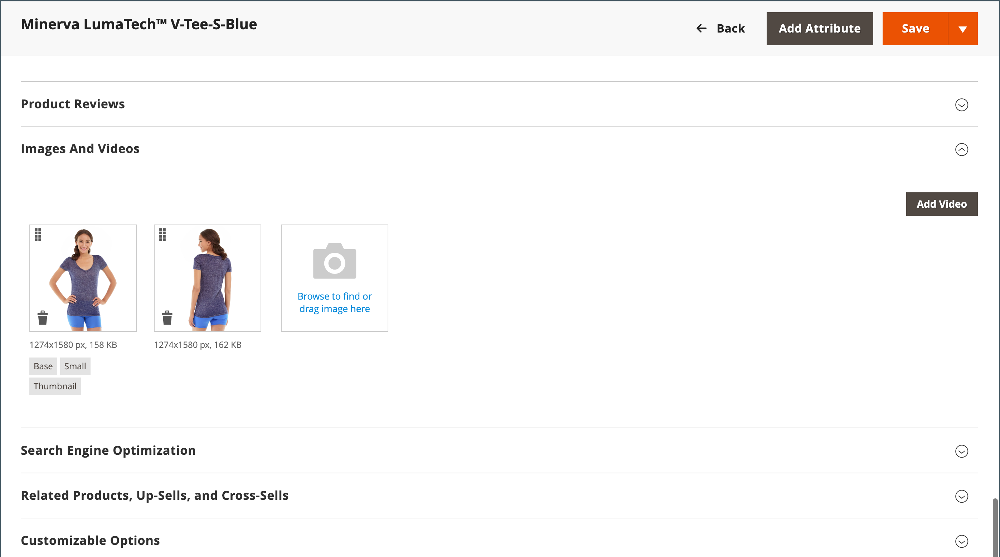

# 카탈로그 이미지 및 비디오

일관된 비율의 고품질 이미지를 사용하면 상업적 매력과 함께 전문적인 모습을 카탈로그에 제공합니다. 제품당 여러 개의 이미지가 포함된 대형 카탈로그가 있는 경우 관리할 제품 이미지가 수천 개가 아니더라도 수백 개를 쉽게 가질 수 있습니다. 시작하기 전에 이미지 파일에 대한 이름 지정 규칙을 설정하고 원본이 필요한 경우 찾을 수 있도록 구성합니다.

{width="600" zoomable="yes"}

단일 제품 이미지는 카탈로그 전체에서 다양한 크기로 렌더링됩니다. 페이지에 있는 이미지 컨테이너의 표시 크기는 테마의 스타일시트에서 정의됩니다. 그러나 이미지가 스토어에서 나타나는 위치는 이미지에 할당된 역할에 의해 결정됩니다. 기본 제품 이미지 또는 _기본_ 이미지 - 확대/축소에 필요한 배율을 생성할 수 있을 만큼 커야 합니다. 기본 이미지 외에도 제품 목록에 더 작은 버전의 동일한 이미지가 나타나거나 장바구니에서 썸네일로 표시될 수 있습니다. 필요한 가장 큰 크기의 이미지를 업로드하거나 [Adobe Stock](../content-design/adobe-stock.md) 이미지를 가져온 다음, Commerce에서 각 사용에 필요한 크기를 렌더링하도록 합니다. 모든 역할에 동일한 이미지를 사용하거나 각 역할에 다른 이미지를 할당할 수 있습니다. 기본적으로 업로드되는 첫 번째 이미지는 세 가지 역할에 모두 할당됩니다.

## Storefront 미디어 브라우저

제품 페이지의 미디어 브라우저에는 제품과 관련된 여러 이미지, 비디오 또는 견본이 표시됩니다. 각 썸네일은 제품의 다른 보기 또는 변형을 표시할 수 있습니다. 구매자는 썸네일을 클릭하여 미디어 에셋을 검색할 수 있습니다. 미디어 브라우저의 위치는 테마별로 다르지만 기본 위치는 제품 페이지의 기본 이미지 바로 아래에 있습니다. 액세스 가능성 컨트롤의 경우 [탐색 접근성](../getting-started/navigation-accessibility.md).

{width="700" zoomable="yes"}

### 이미지 확대/축소

다음과 같은 경우 [기본 이미지](product-image.md) 는 확대/축소 효과를 만들 수 있을 만큼 충분히 커서 마우스오버에서 이미지의 확대된 부분을 볼 수 있습니다. 확대/축소가 활성화되면 고객은 기본 이미지를 클릭하고 커서를 이동하여 이미지의 여러 부분을 확대할 수 있습니다. 확대된 선택 영역이 이미지의 오른쪽에 나타납니다.

{width="700" zoomable="yes"}

### 라이트박스 및 슬라이더&lt;slider>

제품 이미지의 프레젠테이션을 향상시키는 데 사용할 수 있는 많은 타사 라이트 박스와 슬라이더가 있습니다. 에서 확장을 찾습니다. [Commerce Marketplace](../getting-started/commerce-marketplace.md).

## 리소스 문제 해결

이미지 및 비디오 문제를 해결하는 데 대한 도움말을 보려면 다음 Commerce 지원 기술 자료 문서를 참조하십시오.

- [설치 후 이미지와 스타일 시트는 로드되지 않고 텍스트만 표시되고 그래픽은 표시되지 않습니다](https://experienceleague.adobe.com/docs/commerce-knowledge-base/kb/troubleshooting/storefront/after-installing-images-and-stylesheets-do-not-load-only-text-displays-no-graphics.html)
- [REST API를 통한 제품 이미지 관리 문제](https://experienceleague.adobe.com/docs/commerce-knowledge-base/kb/support-tools/patches/v1-0-5/mdva-28763-magento-patch-issues-with-managing-product-images-via-rest-api.html)
- [제품 가져오기 .csv 이미지 복제됨](https://experienceleague.adobe.com/docs/commerce-knowledge-base/kb/support-tools/patches/v1-0-14/mdva-31969-magento-patch-import-products-.csv-images-duplicated.html)
- [제품 편집 이미지 역할에도 불구하고 제품 이미지가 표시되지 않음](https://experienceleague.adobe.com/docs/commerce-knowledge-base/kb/troubleshooting/storefront/product-images-do-not-display-despite-product-edit-image-roles.html)
- [배포 후 표시되지 않는 이미지 저장](https://experienceleague.adobe.com/docs/commerce-knowledge-base/kb/troubleshooting/storefront/store-images-not-displayed-after-deployment.html)
