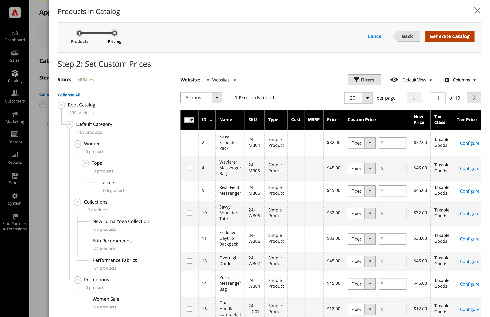

# [!UICONTROL Catalog] 메뉴

다음 [!UICONTROL Catalog] 메뉴를 통해 제품 생성, 범주 및 재고 관리 도구, 사용자 정의 가격 책정을 위한 공유 카탈로그에 쉽게 액세스할 수 있습니다. [B2B 스토어](https://experienceleague.adobe.com/docs/commerce-admin/b2b/introduction.html).

{width="300" zoomable="yes"}

다음에서 _관리자_ 사이드바, 클릭 **[!UICONTROL Catalog]**.

## [!UICONTROL Products]

만들기 [products](products-list.md) 모든 유형의 사용자를 대상으로 하며 인벤토리를 관리합니다.

{width="700" zoomable="yes"}

## [!UICONTROL Categories]

만들기 [범주](categories.md) 스토어 탐색의 기반이 되는 구조.

{width="700" zoomable="yes"}

## [!UICONTROL Shared Catalogs]

Adobe Commerce B2B가 설치되고 활성화된 스토어의 경우 [공유 카탈로그](https://experienceleague.adobe.com/docs/commerce-admin/b2b/shared-catalogs/catalog-shared.html) 다른 회사에서 사용자 정의 가격을 사용할 수 있도록 하는 기능을 제공합니다.

{width="700" zoomable="yes"}
