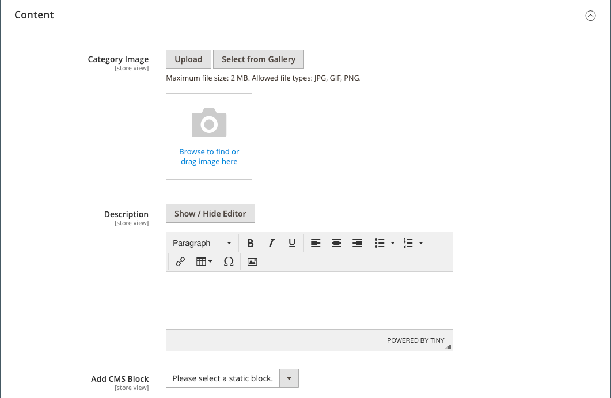

# 범주 - 콘텐츠 설정

다음 _[!UICONTROL Content]_설정은 카테고리 페이지에 표시되는 추가 콘텐츠를 결정합니다. 카테고리 제품 목록 외에도 페이지에 이미지, 설명 및 CMS 블록이 포함될 수 있습니다. 다음을 사용할 수 있습니다. [[!DNL Page Builder]](../page-builder/introduction.md) 카테고리 설명을 정의하는 콘텐츠 도구입니다.

## 에서 카테고리 설명 추가 [!DNL Page Builder]

1. 편집 모드에서 범주를 엽니다.

1. 아래로 스크롤하고 확장합니다.  다음 **[!UICONTROL Content]** 섹션.

   {width="600" zoomable="yes"}

1. 의 오른쪽 상단에 **[!UICONTROL Description]** 영역, 클릭 **[!UICONTROL Edit with Page Builder]**.

1. 사용 [[!DNL Page Builder]](../page-builder/introduction.md) 콘텐츠 도구 [기존 텍스트 편집](../page-builder/text.md) 다른 컨텐츠를 추가합니다(필요한 경우).

## [!DNL Page Builder] 미리보기

를 확장할 때 _콘텐츠_ 섹션으로 생성된 콘텐츠가 있는 기존 카테고리에 대한 [!DNL Page Builder], 의 미리보기가 표시됩니다. **[!UICONTROL Description]** 카테고리 페이지에 표시되는 컨텐츠 콘텐츠 영역을 클릭하면 [!DNL Page Builder] 필요한 업데이트를 수행할 수 있는 작업 영역입니다.

{width="500" zoomable="yes"}

이 콘텐츠 미리보기는 기본적으로 제품 및 카테고리 양식에 대해 활성화됩니다. 미리보기 로드로 인해 성능이 저하되는 경우 [콘텐츠 관리 구성](../configuration-reference/general/content-management.md#advanced-content-tools) 설정.

## 편집기에서 카테고리 설명 추가

텍스트 상자에 일반 ASCII 문자만 입력합니다. 워드 프로세서에서 텍스트를 붙여넣는 경우, 먼저 일반 .TXT 파일로 저장하여 보이지 않는 제어 문자를 제거합니다.

자세한 내용은 [WYSIWYG 편집기](../content-design/editor.md).

1. 편집 모드에서 범주를 엽니다.

1. 아래로 스크롤하고 확장합니다.  다음 **[!UICONTROL Content]** 섹션.

   {width="500" zoomable="yes"}

1. 범주 입력 **[!UICONTROL Description]** 및 사용 [편집기 도구 모음](../content-design/editor.md) 필요한 경우 형식을 지정합니다.

   오른쪽 아래 모서리를 드래그하여 텍스트 상자의 높이를 변경할 수 있습니다.

## 범주 페이지에 CMS 블록 추가

1. 다음에서 _관리자_ 사이드바, 이동 **[!UICONTROL Catalog]** > **[!UICONTROL Categories]**.

1. 범주 트리에서 편집할 범주를 선택합니다.

1. 확장  다음 **[!UICONTROL Content]** 섹션.

1. 대상 **[!UICONTROL Add the CMS block]**&#x200B;을(를) 추가하고 싶은 블록을 선택합니다.

1. 확장  다음 **[!UICONTROL Display Settings]** 섹션.

1. 설정 **[!UICONTROL Display Mode]** 다음 중 하나를 수행합니다.

   - `Static block only`
   - `Static block and products`

1. 완료되면 다음을 클릭하십시오. **[!UICONTROL Save]** 그리고 storefront의 블록 표시를 검토합니다(캐시 새로 고침 필요).

## 콘텐츠 설정 참조

| 설정 | [범위](../getting-started/websites-stores-views.md#scope-settings) | 설명 |
|--- |--- |--- |
| [!UICONTROL Category Image] | 스토어 뷰 | 카테고리 페이지의 맨 위에 대한 이미지를 지정합니다. 방법:   **[!UICONTROL Upload]**- 로컬 컴퓨터에서 갤러리로 이미지 파일을 업로드하고 카테고리 이미지로 사용합니다.  **[!UICONTROL Select from Gallery]** - 갤러리에서 기존 이미지를 선택하라는 메시지를 표시합니다.    - 이미지 파일을 카메라 타일로 드래그하거나 이미지를 찾아 로컬 파일 시스템에서 선택합니다. |
| [!UICONTROL Description] | 스토어 뷰 | 범주 페이지에 나타나는 설명을 지정합니다.   **[!UICONTROL Edit with Page Builder]**- 를 엽니다. [[!DNL Page Builder] 작업 영역](../page-builder/workspace.md), 설명을 편집할 수 있습니다.  **[!UICONTROL Show / Hide Editor]** - WYSIWYG 편집기와 HTML 모드 간 표시를 전환합니다. |
| [!UICONTROL Add CMS Block] | 스토어 뷰 | 기존 항목 추가 [CMS 차단](../content-design/blocks.md) 카테고리 페이지로 이동합니다. |

{style="table-layout:auto"}
