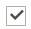

# 범주 제품 할당

범주의 경우 _[!UICONTROL Products in Category]_&#x200B;섹션을 사용하여 현재 범주에 할당된 제품을 검토하십시오. 각 열의 맨 위에 있는 검색 필터는 카테고리에서 제품을 추가하거나 제거하는 데 사용됩니다. 조건 집합이 충족될 때 [카테고리 규칙](../merchandising-promotions/category-product-rules.md)( Adobe Commerce만 해당)을 사용하여 제품 선택을 동적으로 변경할 수도 있습니다. 자세한 내용은 [시각적 머천다이저](../merchandising-promotions/visual-merchandiser.md))를 참조하십시오.

>[!TIP]
>
>범주 규칙을 설정하는 동안 이 범주가 저장될 때 해당 규칙에 따라 제품이 _정렬됨_, _일치됨_, _할당됨_ 및 _할당되지 않음_&#x200B;됩니다&#x200B;**_전용_**. 새 제품을 카탈로그에 추가할 때 규칙에 따라 할당되도록 하려면 **규칙별로 제품과 일치하도록 설정된 각 범주를 다시 저장해야 합니다**. 또한 제품 재고 상태가 `In Stock` 또는 `Out of Stock`(으)로 변경되고 _자동 정렬_ 규칙에 따라 범주의 제품이 **정렬됨**&#x200B;인 경우 **[!UICONTROL Save Category]**&#x200B;을(를) 클릭해야 합니다.

{width="600" zoomable="yes"}

>[!NOTE]
>
>_재고_ 열에는 _&#x200B;**선택한 범주 범위**&#x200B;_&#x200B;에 대해서만 사용 가능한 제품 수량이 표시됩니다. 제품에 대해 여러 주식을 관리하는 경우 해당 범위 간에 전환하여 _Category Products_ 그리드에 다른 _Stock_ 열 값을 표시해야 합니다.

## 범주 규칙 적용

{{ee-feature}}

1. **[!UICONTROL Match products by rule]**&#x200B;을(를) `Yes`(으)로 설정합니다.

   자동 정렬 및 조건 옵션이 나타납니다.

   {width="600" zoomable="yes"}

1. **[!UICONTROL Automatic Sorting]** 순서를 설정합니다.

   이 자동 정렬은 현재 상태를 기반으로 합니다.

   - `Stock level` - 위쪽 또는 아래쪽으로 이동합니다.
   - `Special price` - 위쪽 또는 아래쪽으로 이동합니다.
   - `New Products` - 최신 제품을 먼저 나열합니다.
   - `Color` - 색상별로 알파벳순으로 정렬합니다.
   - `Name` - 이름별로 오름차순 또는 내림차순으로 정렬합니다.
   - `SKU` - SKU별로 오름차순 또는 내림차순으로 정렬
   - `Price` - 가격 기준으로 오름차순 또는 내림차순으로 정렬합니다.

1. **[!UICONTROL Add Condition]**&#x200B;을(를) 클릭하고 다음을 수행합니다.

   - 조건의 기반이 되는 **[!UICONTROL Attribute]**&#x200B;을(를) 선택하십시오.
   - 식을 만드는 데 필요한 **[!UICONTROL Operator]**&#x200B;을(를) 선택하십시오.
   - 일치시킬 **[!UICONTROL Value]**&#x200B;을(를) 입력하십시오.

   {width="600" zoomable="yes"}

   충족될 조건을 설명하는 데 사용할 각 속성에 대해 이 프로세스를 반복합니다. 예를 들어 7일에서 30일 전에 만든 제품을 일치시키려면 다음을 수행합니다.

   - **[!UICONTROL Date Created]**&#x200B;을(를) `Less than 30`(으)로 설정합니다.
   - **[!UICONTROL Logic]**&#x200B;을(를) `AND`(으)로 설정합니다.
   - **[!UICONTROL Date Modified]**&#x200B;을(를) `Greater than 7`(으)로 설정합니다.

1. 완료되면 **[!UICONTROL Save Category]**&#x200B;을(를) 클릭합니다.

### 페이지 옵션

| 옵션 | 설명 |
|--- |--- |
| [!UICONTROL Match products by rule] | 카테고리의 제품 목록이 카테고리 규칙에 의해 동적으로 생성되는지 여부를 결정합니다. 옵션: `Yes` / `No` |
| [!UICONTROL Automatic Sorting] | 범주 제품 목록에 정렬 순서를 자동으로 적용합니다. 옵션:  `None` `Move low stock to top` `Move low stock to bottom` `Special price to top` `Special price to bottom` `Newest products first` `Sort by color` `Name: A - Z` `Name: Z - A` `SKU: Ascending` `SKU: Descending` `Price: High to Low` `Price: Low to High` |
| [!UICONTROL Add Condition] | 규칙에 다른 조건을 추가합니다. |

{style="table-layout:auto"}

### 페이지 조건

| 옵션 | 설명 |
|--- |--- |
| [!UICONTROL Attribute] | 조건의 기반으로 사용되는 속성을 결정합니다. 옵션:  **[!UICONTROL Clone Category ID(s)]**- Category ID를 기준으로 여러 범주에서 제품을 정렬 및 순서 없이 동적으로 복제합니다. **[!UICONTROL Color]** - 색상을 기준으로 제품을 포함합니다.  **[!UICONTROL Date Created (days ago)]**- 제품이 카탈로그에 추가된 이후 일 수를 기준으로 제품을 포함합니다. **[!UICONTROL Date Modified (days ago)]** - 제품을 마지막으로 수정한 이후 일 수를 기준으로 제품을 포함합니다.  **[!UICONTROL Name]**- 제품 이름을 기반으로 제품을 포함합니다. **[!UICONTROL Price]** - 가격에 따라 제품을 포함합니다.  **[!UICONTROL Quantity]**- 재고 수량에 따라 제품을 포함합니다. **&#x200B; SKU &#x200B;**- SKU를 기반으로 하는 제품을 포함합니다. |
| [!UICONTROL Operator] | 조건을 충족하기 위해 속성 값에 적용되는 연산자를 지정합니다. 연산자를 지정하지 않으면 `Equal`이(가) 기본값으로 사용됩니다. 옵션: `Equal` / `Not equal` / `Greater than` / `Greater than or equal to` / `Less than` / `Less than or equal to` / `Contains` |
| [!UICONTROL Value] | 조건을 충족하기 위해 특성이 가져야 하는 값을 지정합니다. |
| [!UICONTROL Logic] | 여러 조건을 정의하는 데 사용되며 다른 조건이 추가될 때만 나타납니다. 옵션: `OR` / `AND` |

{style="table-layout:auto"}

>[!NOTE]
>
>하위 옵션이 있는 구성 가능한 제품의 수량은 모든 하위 제품 수량을 결합하여 계산됩니다. 자주색, 빨간색 및 노란색 색상 옵션과 각각의 수량이 다른 구성 가능한 제품 _지구력 피트니스 탱크_&#x200B;의 예를 생각해 보십시오. 이 시나리오에서 상위 제품 수량은 자주색, 빨간색 및 노란색 색상 하위 제품의 결합 수량입니다.

## 컨트롤

## 페이지 컨트롤

{{ee-feature}}

| 제어 | 설명 |
|----------|--------------|
|  | 목록으로 보기 |
|  | 타일로 보기 |
|  전환 | 규칙별 일치 - 아니요 |
|  | 규칙별 일치 - 예 |
|  | 드래그 앤 드롭 컨트롤을 사용하면 제품을 가져와서 그리드의 현재 페이지에서 다른 위치로 이동할 수 있습니다. 자세한 내용은 [시각적 머천다이저](../merchandising-promotions/visual-merchandiser.md)를 참조하세요. |
|  | 목록에서 제품의 위치를 결정합니다. |

{style="table-layout:auto"}

## 페이지 컨트롤

{{ce-feature}}

| 제어 | 설명 |
|----------|--------------|
|  | 모든 제품을 선택하거나 모든 선택 항목을 지우려면 첫 번째 열의 헤더에 있는 확인란을 사용합니다. 첫 번째 행의 컨트롤은 검색 유형을 결정하며 모든 레코드를 포함하거나 범주에 할당되거나 할당되지 않은 레코드만 포함하도록 설정할 수 있습니다. 각 행의 첫 번째 열에 있는 확인란은 범주에 추가될 제품을 식별합니다. 옵션: `Yes` / `No` / `Any` |
| [!UICONTROL Search Filters] | 각 열의 맨 위에 있는 필터 컨트롤은 모두 선택 설정에 따라 목록에서 포함하거나 생략하려는 특정 값을 입력하는 데 사용할 수 있습니다. |
| [!UICONTROL Reset Filter] | 모든 검색 필터를 지웁니다. |
| [!UICONTROL Search] | 필터 조건을 기반으로 카탈로그를 검색하고 결과를 표시합니다. |

{style="table-layout:auto"}
