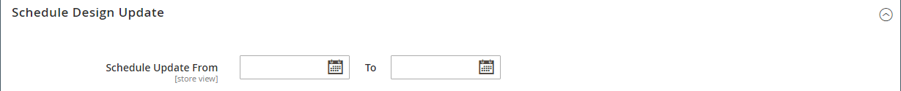

# 범주 만들기

카탈로그의 범주 구조는 루트가 맨 위에 있는 거꾸로 된 트리와 같습니다. 트리의 각 섹션은 확장 및 축소할 수 있습니다. 비활성화되거나 숨겨진 모든 카테고리가 회색으로 표시됩니다. 첫 번째 수준([루트](category-root.md) 아래)의 범주는 일반적으로 [기본 메뉴](navigation-top.md)에 옵션으로 나타납니다. 구성에 설정된 최대 메뉴 깊이에 따라 필요한 만큼 추가 하위 범주를 만들 수 있습니다. 범주를 트리의 다른 위치로 드래그하여 놓을 수 있습니다. 페이지 상단에 있는 카테고리 이름 뒤에 카테고리 ID 번호가 괄호 안에 표시됩니다.

여러 [스토어](../stores-purchase/stores.md#add-stores)가 있는 웹 사이트의 경우 [상위 탐색](navigation-top.md)에 사용되는 범주 집합을 정의하는 각 스토어에 대해 다른 루트 범주를 만들 수 있습니다.

{width="700" zoomable="yes"}

## 우수 사례

범주를 계획하고 만들 때 이러한 모범 사례를 사용하십시오.

### 범주 구조

메인 메뉴의 카테고리 구조는 고객 경험과 성능에 영향을 줄 수 있습니다. 가장 좋은 방법은 하나 이상의 가장 중요한 최상위 카테고리를 식별하고, 동일한 이름의 다른 카테고리가 있는 것을 피하는 것입니다. 예를 들어, `Clothing/Kids`, `Shoes/Kids`, `Accessories/Kids`과(와) 같은 서로 다른 부서에 &quot;아이들&quot;에 대한 여러 범주가 구성되어 있지 않습니다. 최상위 수준의 상위 범주 `Kids`을(를) 만든 다음 필요에 따라 하위 범주를 만드는 것이 더 효율적일 수 있습니다. 카테고리 구조와 일관되도록 하고 카탈로그의 모든 제품 유형에 동일한 접근 방식을 사용하십시오.

### 비즈니스 규칙 및 자동화

비즈니스 논리를 사용하여 카탈로그 페이지에 유사한 항목을 표시하거나 개인화된 프로모션, 자동화된 프로세스 또는 검색 기준을 설정할 때에는 카테고리 구조 및 사용 가능한 속성 값을 고려하십시오. 예를 들어 &quot;polo&quot;를 상위 카테고리로 지정하는 경우 성별과 연령이 적절하지 않은 혼합 제품이 결과에 포함될 수 있습니다. 다만 폴로 셔츠의 특정 하위 범주와 일치하면 결과가 더 좁아 특정 고객에게 어필할 가능성이 높다. 특정 고객을 타깃팅하는 다른 속성 값과 결합할 때 결과가 더욱 구체적일 수 있습니다. 특정 카테고리 경로를 참조할 때 필터링 및 검색해야 하는 제품의 수를 고려하십시오. 결과의 차이는 극적일 수 있다. 다음 카테고리 경로에서 반환하는 다른 결과를 고려하십시오.

- `[Category:  All Products/Shirts/Father's Day/Polos/Sale]`
- `[Category Path: Men/Shirts/Polos]`
- `[Child Category: Polos]`

다음과 같은 범주형 관계를 명확하게 정의하는 것이 중요합니다.

- 상위 범주
- 하위 범주
- 범주 경로

또한 다음과 같은 관련 키워드 및 속성을 정의합니다.

- 사용 가능
- 판매 가격
- 브랜드
- 크기
- 색상

## 1단계: 범주 만들기

1. _관리자_ 사이드바에서 **[!UICONTROL Catalog]** > **[!UICONTROL Categories]**(으)로 이동합니다.

1. 새 범주를 사용할 수 있는 위치를 확인하려면 **[!UICONTROL Store View]**&#x200B;을(를) 설정하십시오.

1. 범주 트리에서 새 범주의 상위 범주를 선택합니다.

   상위 범주가 새 범주 위에 한 수준 있습니다.

   데이터 없이 처음부터 시작하는 경우 목록에 루트인 _기본 범주_&#x200B;와 _예제 범주_&#x200B;의 두 가지 범주만 있을 수 있습니다.

1. **[!UICONTROL Add Subcategory]**&#x200B;을(를) 클릭합니다.

## 2단계: 기본 정보 작성

1. 스토어에서 즉시 범주를 사용하려면 **[!UICONTROL Enable Category]**&#x200B;을(를) `Yes`(으)로 설정하십시오.

1. [위쪽 탐색](navigation-top.md)에 범주를 포함하려면 **[!UICONTROL Include in Menu]**&#x200B;을(를) `Yes`(으)로 설정하십시오.

1. **[!UICONTROL Category Name]** 입력.

   {width="500" zoomable="yes"}

1. **[!UICONTROL Save]**&#x200B;을(를) 클릭하고 계속합니다.

## 3단계: 범주 콘텐츠 완료

1. **[!UICONTROL Content]** 섹션에서 를 확장합니다.

   {width="600" zoomable="yes"}

1. 페이지 맨 위에 **[!UICONTROL Category Image]**&#x200B;을(를) 표시하려면 자신의 이미지를 업로드하거나 [미디어 저장소](../content-design/media-storage.md)에 있는 이미지를 사용할 수 있습니다.

   - 자신의 이미지를 업로드하려면 **[!UICONTROL Upload]**&#x200B;을(를) 클릭하고 범주를 나타낼 이미지를 선택하십시오.

   - 미디어 저장소의 이미지를 사용하려면 **[!UICONTROL Select from Gallery]**&#x200B;을(를) 클릭하고 범주를 나타낼 이미지를 선택하십시오.

   미디어 갤러리 내에서 **[!UICONTROL Search Adobe Stock]**&#x200B;을(를) 클릭하여 [Adobe Stock 통합](../content-design/adobe-stock.md)을(를) 사용하여 적절한 이미지를 찾을 수도 있습니다.

   >[!NOTE]
   >
   > AEM Assets을 활성화한 경우 자세한 내용은 [범주 관리](../content-design/aem-assets-manage.md)를 참조하십시오.

1. **[!UICONTROL Description]**&#x200B;의 경우 범주 랜딩 페이지에 표시할 텍스트나 다른 내용을 입력하십시오.

   자세한 내용은 [범주 콘텐츠](categories-content-settings.md)를 참조하십시오.

1. 범주 랜딩 페이지에 콘텐츠 블록을 포함하려면 표시할 **[!UICONTROL CMS Block]**&#x200B;을(를) 선택하십시오.

1. **[!UICONTROL Save]**&#x200B;을(를) 클릭하고 계속합니다.

## 4단계: 디스플레이 설정 완료

1. **[!UICONTROL Display Setting]** 섹션에서 를 확장합니다.

   {width="600" zoomable="yes"}

   이러한 옵션에 대한 자세한 내용은 [디스플레이 설정](categories-display-settings.md)을 참조하십시오.

1. **[!UICONTROL Display Mode]**&#x200B;을(를) 다음 중 하나로 설정합니다.

   - `Products Only`
   - `Static Block Only`
   - `Static Block and Products`

1. 범주 페이지에 계층화된 탐색의 _`Filter by Attribute`_섹션을 포함하려면&#x200B;**[!UICONTROL Anchor]**을(를) `Yes`(으)로 설정하십시오.

1. **[!UICONTROL Available Product Listing Sort By]** 옵션의 경우 고객이 목록을 정렬할 수 있도록 사용할 수 있는 값 중 하나 이상을 선택하십시오. 이 설정은 [!DNL Live Search] [제품 목록 페이지 위젯](https://experienceleague.adobe.com/en/docs/commerce/live-search/live-search-storefront/plp-styling)에 적용되지 않습니다.

   기본적으로 사용 가능한 모든 값이 포함됩니다. 선택 내용을 변경하려면 **[!UICONTROL Use All]** 확인란의 선택을 취소하십시오. 예를 들어, 값은 다음을 포함할 수 있습니다.

   - `Position`
   - `Product Name`
   - `Price`

1. 범주의 기본 정렬 순서를 설정하려면 **[!UICONTROL Default Product Listing Sort By]** 값을 선택하십시오. 이 설정은 [!DNL Live Search] [제품 목록 페이지 위젯](https://experienceleague.adobe.com/en/docs/commerce/live-search/live-search-storefront/plp-styling)에 적용되지 않습니다.

1. 기본 계층화된 탐색 [가격 단계](navigation-layered.md#configure-price-navigation) 설정을 변경하려면 다음을 수행하십시오.

   - **[!UICONTROL Use Config Settings]** 확인란의 선택을 취소합니다.

   - 계층화된 탐색에 대한 증분 가격 단계로 사용할 값을 입력합니다.

1. **[!UICONTROL Save]**&#x200B;을(를) 클릭하고 계속합니다.

## 5단계: 검색 엔진 최적화 설정 완료

1. **[!UICONTROL Search Engine Optimization Settings]** 섹션에서 를 확장합니다.

   {width="600" zoomable="yes"}

   이러한 옵션에 대한 자세한 내용은 [검색 엔진 최적화](categories-search-engine-optimization.md)를 참조하십시오.

1. 범주에 대해 다음 [메타데이터](../merchandising-promotions/meta-data.md)를 완료합니다.

   - [!UICONTROL Meta Title]
   - [!UICONTROL Meta Keywords]
   - [!UICONTROL Meta Description]

1. **[!UICONTROL Save]**&#x200B;을(를) 클릭하고 계속합니다.

## 단계 6: 범주의 제품 선택

1. **[!UICONTROL Products in Category]** 섹션에서 를 확장합니다.

   범주의 {width="600" zoomable="yes"}

   이러한 옵션에 대한 자세한 내용은 [범주의 제품](categories-product-assignments.md)을 참조하세요.

1. 필요한 경우 [필터](../getting-started/admin-grid-controls.md)를 사용하여 제품을 찾으십시오.

   아직 범주에 포함되지 않은 모든 레코드를 표시하려면 첫 번째 열의 레코드 선택기를 `No`(으)로 설정하고 **[!UICONTROL Search]**&#x200B;을(를) 클릭합니다.

1. 첫 번째 열에서 카테고리에 포함할 각 제품에 대한 확인란을 선택합니다.

1. **[!UICONTROL Save]**&#x200B;을(를) 클릭하고 계속합니다.

## 7단계: 범주 권한 설정

{{ee-feature}}

1. **[!UICONTROL Category Permissions]** 섹션에서 를 확장합니다.

1. 다중 사이트 설치의 경우 범주 권한이 적용되는 **[!UICONTROL Website]**&#x200B;을(를) 선택하십시오.

1. 범주 권한이 적용되는 **[!UICONTROL Customer Group]**&#x200B;을(를) 선택하십시오.

   ([Adobe Commerce B2B](../b2b/introduction.md)만 해당) 필요한 경우 대신 **[!UICONTROL Shared Catalog]**&#x200B;을(를) 선택할 수 있습니다.

1. 필요에 따라 다음 권한을 설정합니다.

   - [!UICONTROL Browsing Category]
   - [!UICONTROL Display Product Prices]
   - [!UICONTROL Add to Cart]

1. 다른 권한 규칙을 추가하려면 **[!UICONTROL New Permission]**&#x200B;을(를) 클릭하고 이 과정을 반복합니다.

   {width="600" zoomable="yes"}

## 8단계: 디자인 설정 완료

1. **[!UICONTROL Design]** 섹션에서 를 확장합니다.

1. 필요에 따라 디자인 설정을 지정합니다.

   - ([Adobe Commerce B2B](../b2b/introduction.md)만 해당) 상위 범주 디자인 설정을 이 범주에 적용하려면 **[!UICONTROL Use Parent Category Settings]**&#x200B;을(를) `Yes`(으)로 설정합니다.

   - 범주 페이지의 디자인을 변경하려면 적용할 **[!UICONTROL Theme]**&#x200B;을(를) 선택하십시오.

   - 범주 페이지의 열 레이아웃을 변경하려면 적용할 **[!UICONTROL Layout]**&#x200B;을(를) 선택하십시오.

   - 사용자 지정 코드를 입력하려면 **[!UICONTROL Layout Update XML]** 상자에 올바른 XML 코드를 입력하십시오.

   - 제품 페이지에 동일한 디자인을 사용하려면 **[!UICONTROL Apply Design to Products]**&#x200B;을(를) `Yes`(으)로 설정하십시오.

   {width="600" zoomable="yes"}

1. (Magento Open Source만 해당) 특정 기간에 디자인 업데이트를 예약하려면 다음을 수행하십시오.

   - _[!UICONTROL Schedule Design Update]_섹션을 확장합니다.

   - 일정()을 사용하여 일정 업데이트 **[!UICONTROL from]** 및 **[!UICONTROL to]** 날짜를 선택하십시오.

   {width="600" zoomable="yes"}

1. 완료되면 **[!UICONTROL Save]**&#x200B;을(를) 클릭합니다.
