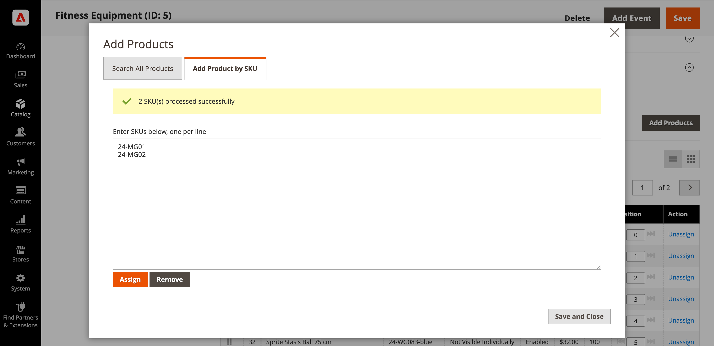

# 범주 제품 추가 및 제거

다음에서 [범주 내 제품](categories-product-assignments.md) 섹션에서 스토어 관리자는 카테고리에 제품을 추가할 수 있습니다. 이 섹션에는 범주에 지정된 모든 제품이 나열되고 표시됩니다 **[!UICONTROL Add Product]** 조건 **[!UICONTROL Match products by rule]** 이(가) (으)로 설정됨 `No`.

{width="600" zoomable="yes"}

## 추가할 제품 검색

1. 다음에서 _관리자_ 사이드바, 이동 **[!UICONTROL Catalog]** > **[!UICONTROL Categories]**.

1. 왼쪽의 카테고리 트리에서 제품을 추가할 카테고리를 선택합니다.

1. 확장  다음 _범주 내 제품_ 섹션.

1. 클릭 **[!UICONTROL Add Products]**.

1. 사용 _키워드로 검색_ 또는 필터를 사용하여 추가할 제품을 찾을 수 있습니다.

   {width="700" zoomable="yes"}

1. 다음에서 _[!UICONTROL Assign]_열, 옵션을 다음으로 전환 `Yes` 추가할 각 제품에 대해.

   표시된 모든 제품을 포함하려면 열 머리글에서 메뉴 화살표를 클릭하고 를 선택할 수 있습니다 **[!UICONTROL Select All]**.

1. 변경 사항을 적용하려면 **[!UICONTROL Save and Close]**.

### 작업

| 작업 | 설명 |
|--- |--- |
| [!UICONTROL Select All] | 목록에 있는 모든 레코드의 확인란을 선택합니다. |
| [!UICONTROL Unselect All] | 목록의 모든 레코드 확인란을 선택 취소합니다. |
| [!UICONTROL Select All on This Page] | 현재 페이지의 레코드 확인란을 선택합니다. |
| [!UICONTROL Deselect All on This Page] | 현재 페이지의 레코드 확인란을 선택 취소합니다. |

{style="table-layout:auto"}

## SKU별 제품 추가

1. 클릭 **[!UICONTROL Add Products]**

1. 다음 항목 선택 **[!UICONTROL Add Products by SKU]** 탭.

1. SKU(한 줄에 하나씩)를 입력하고 **[!UICONTROL Assign]**.

   변경 내용을 취소하려면 **[!UICONTROL Remove]**.

   {width="700" zoomable="yes"}

1. 변경 사항을 적용하려면 **[!UICONTROL Save and Close]**.

## 범주에서 제품 제거

1. 다음에서 _관리자_ 사이드바, 이동 **[!UICONTROL Catalog]** > **[!UICONTROL Categories]**.

1. 왼쪽의 범주 트리에서 편집할 범주를 선택합니다.

1. 확장  다음 _[!UICONTROL Products in Category]_섹션.

1. 제거할 제품을 찾습니다.

1. 다음에서 _[!UICONTROL Actions]_열, 클릭&#x200B;**[!UICONTROL Unassign]**.

1. 변경 사항을 적용하려면 **[!UICONTROL Save]**.
