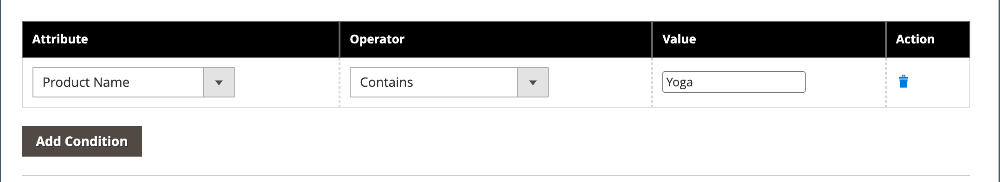

# 범주 제품 정렬

{{ee-feature}}

제품을 위치로 끌어다 놓거나 사전 정의된 정렬 순서를 적용하여 범주의 제품 위치를 수동으로 지정할 수 있습니다. 기본적으로 제품은 재고 수준, 연령, 색상, 이름, SKU 및 가격으로 정렬할 수 있습니다. 자동 정렬은 현재 정렬 순서를 무시하고 수동으로 설정된 모든 드래그 앤 드롭 위치를 재설정합니다. [Visual Merchandiser](../configuration-reference/catalog/visual-merchandiser.md) 구성에서 목록에 포함될 제품에 필요한 색상 정렬 순서 및 최소 재고 수준을 설정합니다.

각 [스토어 보기](../stores-purchase/stores.md#add-stores)에 대해 별도로 카테고리 옵션을 설정하여 제품 선택, 목록에서의 상대 위치 및 카테고리 규칙에 사용할 수 있는 특성을 결정할 수 있습니다. 그러나 카탈로그에는 단일 **_글로벌_** 정렬 순서 및 제품 위치가 있으며 모든 [스토어 보기](../stores-purchase/store-views.md), 스토어 및 웹 사이트에서 공유됩니다.

## 1단계: 구성 범위 설정

1. _관리자_ 사이드바에서 **[!UICONTROL Catalog]** > **[!UICONTROL Categories]**(으)로 이동합니다.

1. 필요한 경우 설정이 적용되는 **[!UICONTROL Store View]**&#x200B;을(를) 선택하십시오.

   다중 스토어 설치의 경우 _[!UICONTROL Store View]_&#x200B;설정은 스토어 내에서 사용 가능한 모든 보기에 정렬 순서를 적용합니다.

1. 왼쪽의 범주 트리에서 편집할 범주를 선택합니다.

   {width="700" zoomable="yes"}

## 2단계: 제품 정렬

>[!NOTE]
>
>제품 특성으로 범주를 정렬하면 속성 값이 같은 제품도 _[!UICONTROL Product ID]_&#x200B;을(를) 기준으로 오름차순으로 정렬됩니다.

_[!UICONTROL Products in Category]_&#x200B;섹션에서 타일( ) 아이콘을 클릭하여 제품 타일을 격자로 표시합니다. 제품을 정렬하려면 수동 또는 자동 방법을 사용합니다.

{width="600" zoomable="yes"}

### 방법 1: 수동 정렬

1. **[!UICONTROL Sort Order]**&#x200B;을(를) 기본 설정으로 설정합니다.

   {width="600" zoomable="yes"}

1. 새 정렬 순서를 적용하려면 **[!UICONTROL Sort]**&#x200B;을(를) 클릭합니다.

1. 정렬 순서를 저장하려면 **[!UICONTROL Save Category]**&#x200B;을(를) 클릭합니다.

1. 메시지가 표시되면 잘못된 인덱서를 업데이트합니다.

### 방법 2: 자동 정렬

1. **[!UICONTROL Match products by rule]**()을(를) `Yes`(으)로 설정합니다.

1. **[!UICONTROL Automatic Sorting]**&#x200B;을(를) 기본 설정으로 설정합니다.

1. 카테고리 규칙을 만들려면 다음 단계의 지침을 따릅니다.

## 3단계: 범주 규칙 만들기

1. **[!UICONTROL Match products by rule]**()을(를) `Yes`(으)로 설정합니다.

1. **[!UICONTROL Add Condition]**&#x200B;을(를) 클릭합니다.

1. 조건의 기반이 되는 **[!UICONTROL Attribute]**&#x200B;을(를) 선택하십시오.

1. **[!UICONTROL Operator]**&#x200B;을(를) 다음 중 하나로 설정합니다.

   - `Equal`
   - `Not equal`
   - `Greater than`
   - `Greater than or equal to`
   - `Less than`
   - `Less than or equal to`
   - `Contains`

1. 적절한 **[!UICONTROL Value]**&#x200B;을(를) 입력하십시오.

   {width="600" zoomable="yes"}

1. 다른 조건을 추가하려면 **[!UICONTROL Add Condition]**&#x200B;을(를) 클릭하고 프로세스를 반복합니다.

## 4단계: 저장, 새로 고침 및 확인

1. 완료되면 **[!UICONTROL Save Category]**&#x200B;을(를) 클릭합니다.

1. 캐시를 새로 고치라는 메시지가 표시되면 **[!UICONTROL Cache Management]**&#x200B;을(를) 클릭하고 각각의 잘못된 캐시를 새로 고치십시오.

1. 상점 첫 화면에서 제품 선택, 정렬 및 카테고리 규칙이 올바르게 작동하는지 확인합니다.

   조정해야 하는 경우 설정을 변경하고 다시 시도하십시오.
