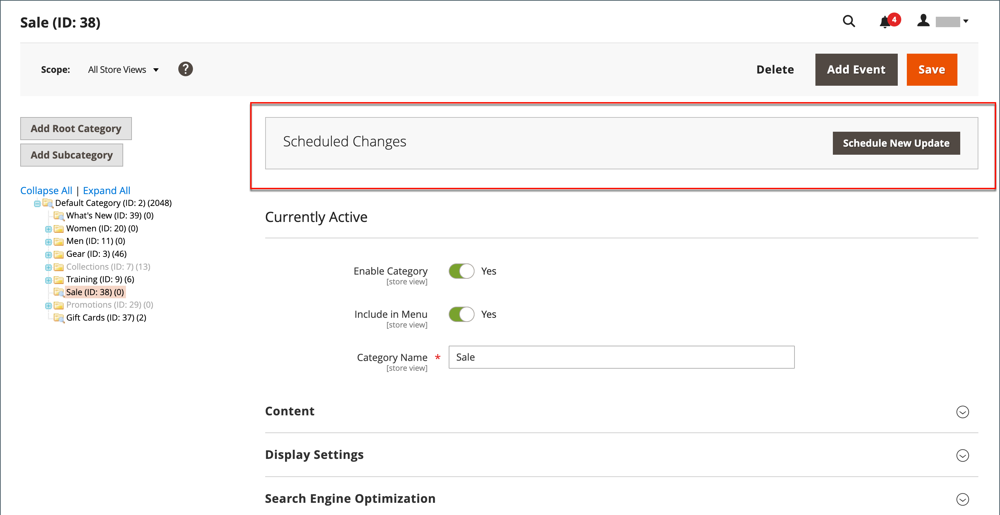

# 범주에 대해 예약된 변경 사항

{{ee-feature}}

범주 업데이트는 일정에 따라 적용하고 다른 콘텐츠 변경 사항과 그룹화할 수 있습니다. 범주에 대한 예약된 변경 사항을 기반으로 캠페인을 생성하거나 기존 캠페인에 변경 사항을 적용할 수 있습니다. 자세한 내용은 다음을 참조하십시오. [컨텐츠 스테이징](../content-design/content-staging.md).

>[!NOTE]
>
>다음 [!UICONTROL Schedule Design Update] 탭에서 제거됨  Adobe Commerce 및 는 카테고리에서 바로 수정할 수 없습니다. 이러한 활성화를 위해 예약된 업데이트를 만들어야 합니다.

>[!NOTE]
>
>모든 예약된 업데이트가 연속적으로 적용되므로 모든 엔티티에 한 번에 하나의 예약된 업데이트만 있을 수 있습니다. 모든 예약된 업데이트는 해당 시간대 내의 모든 스토어 보기에 적용됩니다. 따라서 엔티티는 서로 다른 스토어 보기에 대해 동시에 여러 개의 예약된 업데이트를 가질 수 없습니다. 현재 예약된 업데이트의 영향을 받지 않는 모든 스토어 뷰 내의 모든 엔티티 속성 값은 이전 예약된 업데이트가 아닌 기본값에서 가져옵니다.

## 범주로 업데이트 예약

1. 다음에서 _관리자_ 사이드바, 이동 **[!UICONTROL Catalog]** > **[!UICONTROL Categories]**.

1. 왼쪽의 범주 트리에서 수정할 범주를 선택합니다.

1. 다음에서 _예약된 변경 사항_ 페이지 상단의 상자에서 **[!UICONTROL Schedule New Update]**.

   {width="600" zoomable="yes"}

1. 포함 **[!UICONTROL Save as a New Update]** 옵션을 선택한 경우 업데이트에 대한 기본 매개 변수를 설정합니다.

   - 대상 **[!UICONTROL Update Name]**, 새 콘텐츠 스테이징 캠페인의 이름을 입력합니다.

   - 개요 입력 **[!UICONTROL Description]** 업데이트 및 사용 방법

   - 달력(  ) 도구: **[!UICONTROL Start Date]** 및 **[!UICONTROL End Date]** 캠페인을 위한 것입니다.

   >[!IMPORTANT]
   >
   >캠페인 **[!UICONTROL Start Date]** 및 **[!UICONTROL End Date]** 다음을 사용하여 정의해야 합니다. **_기본값_** 관리 시간대로, 각 웹 사이트의 로컬 시간대에서 변환됩니다. 예를 들어 미국 시간대를 기준으로 캠페인을 시작하려는 시간대가 다른 여러 웹 사이트의 경우 각 현지 시간대에 대해 별도의 업데이트를 예약해야 합니다. 을(를) 설정합니다. **[!UICONTROL Start Date]** 및 **[!UICONTROL End Date]** 로컬 웹 사이트 시간대에서 기본 관리 시간대로 변환되는 각 시간대에 대해.

   {width="600" zoomable="yes"}

1. 예약된 업데이트에 필요한 변경 작업을 수행합니다.

1. 변경 내용을 미리 보려면 **[!UICONTROL Preview]** 을 클릭합니다.

1. 완료되면 다음을 클릭하십시오. **[!UICONTROL Save]**.

## 기존 업데이트에 할당

1. 다음에서 _관리자_ 사이드바, 이동 **[!UICONTROL Catalog]** > **[!UICONTROL Categories]**.

1. 왼쪽의 범주 트리에서 수정할 범주를 선택합니다.

1. 다음에서 _예약된 변경 사항_ 페이지 상단의 상자에서 **[!UICONTROL Schedule New Update]**.

1. 선택 **[!UICONTROL Assign to Existing Campaign]**.

1. 목록에서 필요한 캠페인을 찾아 클릭합니다. **[!UICONTROL Select]**.

1. 예약된 업데이트에 필요한 사항을 변경합니다.

1. 완료되면 다음을 클릭하십시오. **[!UICONTROL Save]**.
