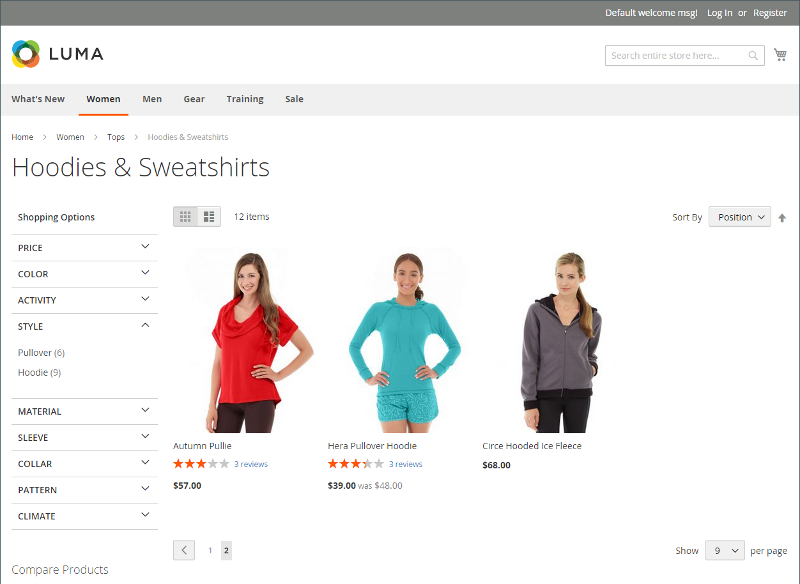
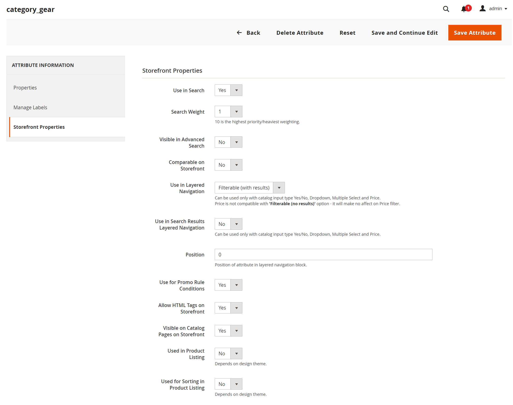
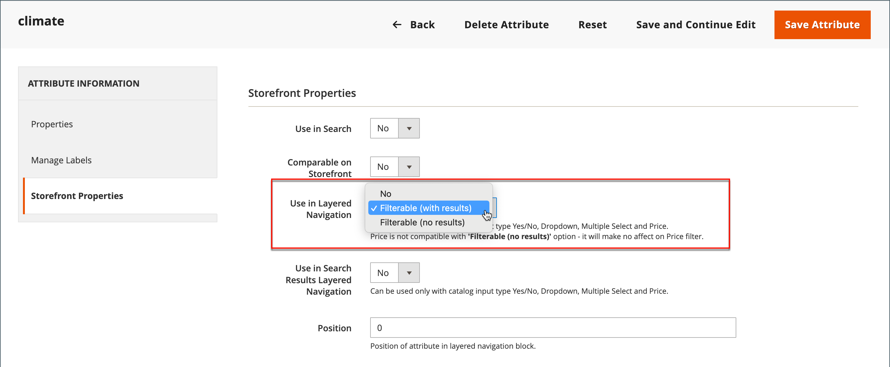

# 계층화된 탐색

>[!NOTE]
>
>이 섹션에 설명된 표준 계층 탐색은 라이브 검색 필터 탐색( 와 다름) [패싯](https://experienceleague.adobe.com/docs/commerce-merchant-services/live-search/live-search-admin/facets/facets.html).

레이어 탐색을 사용하면 카테고리, 가격 범위 또는 기타 사용 가능한 속성에 따라 제품을 쉽게 찾을 수 있습니다. 계층 탐색은 일반적으로 검색 결과 및 카테고리 페이지의 왼쪽 열에 표시되며, 경우에 따라 홈 페이지에도 표시됩니다. 표준 탐색에는 다음이 포함됩니다. _쇼핑 기준_ 카테고리 및 가격 범위 목록입니다. 제품 개수 및 가격 범위를 포함하여 계층화된 탐색 표시를 구성할 수 있습니다.

{width="700" zoomable="yes"}

## 필터링 가능한 속성

>[!NOTE]
>
>이 항목에서 설명하는 필터링 가능한 속성 요구 사항은 다음에 따라 다릅니다. [라이브 검색](https://experienceleague.adobe.com/docs/commerce-merchant-services/live-search/overview.html). 자세한 내용은 다음을 참조하십시오. [패싯](https://experienceleague.adobe.com/docs/commerce-merchant-services/live-search/live-search-admin/facets/facets.html).

계층화된 탐색을 사용하여 범주별 또는 속성별로 제품을 검색할 수 있습니다. 예를 들어, 쇼핑객이 위쪽 탐색에서 남성/단편 범주를 선택하면 초기 결과에 해당 범주의 모든 제품이 포함됩니다. 특정 스타일, 기후, 색상, 재료, 패턴, 가격 또는 값의 조합을 선택하여 목록을 추가로 필터링할 수 있습니다. 필터링 가능한 속성은 각 속성 값을 나열하는 확장 섹션에 나타납니다. 옵션으로 일치하는 결과가 있는 제품 목록을 구성하여 일치하는 제품이 있거나 없는 제품을 포함할 수 있습니다.

제품 입력 유형과 결합된 속성 속성은 계층화된 탐색에 사용할 수 있는 속성을 결정합니다. 계층화된 탐색은 다음에 대해서만 사용할 수 있습니다. [_앵커_](categories-display-settings.md) 카테고리(검색 결과 페이지에 추가할 수도 있음) 다음 **저장소 소유자에 대한 카탈로그 입력 유형** 각 특성의 속성을 다음으로 설정해야 합니다. `Yes/No`, `Dropdown`, `Multiple Select`, 또는 `Price`. 속성을 필터링할 수 있게 하려면 **레이어 탐색에서 사용** 각 의 속성은 다음 중 하나로 설정되어야 합니다. `Filterable (with results)` 또는 `Filterable (no results)`.

_예: 결과가 있는 필터링 가능한 속성_

{width="700" zoomable="yes"}

_예: 결과 없이 표시된 필터링 가능한 견본 값_

{width="700" zoomable="yes"}

다음 지침은 필터링 가능한 속성을 사용하여 기본 계층화된 탐색을 설정하는 방법을 보여 줍니다. 가격 단계를 포함한 고급 레이어 탐색에 대해서는 다음을 참조하십시오. [가격 탐색](navigation-layered.md#configure-price-navigation).

## 1단계: 속성 설정

1. 다음에서 _관리자_ 사이드바, 이동 **[!UICONTROL Stores]** > _[!UICONTROL Attributes]_>**[!UICONTROL Product]**.

1. 필터링된 검색을 찾아보거나 사용하여 목록에서 속성을 찾아 편집 모드로 엽니다.

   {width="700" zoomable="yes"}

1. 왼쪽 패널에서 을 선택합니다 **[!UICONTROL Storefront Properties]** 및 설정 **[!UICONTROL Use In Layered Navigation]** 다음 중 하나를 수행합니다.

   - `Filterable (with results)` - 레이어 탐색에는 일치하는 제품을 찾을 수 있는 필터만 포함됩니다. 목록에 표시된 모든 제품에 이미 적용되는 모든 속성 값은 여전히 사용 가능한 필터로 표시되어야 합니다. 제품 일치 개수가 0인 속성 값은 사용 가능한 필터 목록에서 생략됩니다. 필터링된 목록에는 필터와 일치하는 제품만 포함됩니다. 제품 목록은 선택한 필터가 표시된 것을 변경하는 경우에만 업데이트됩니다.

   - `Filterable (no results)` - 계층화된 탐색에는 제품 일치가 0인 제품을 포함하여 사용 가능한 모든 속성 값과 해당 제품 수에 대한 필터가 포함됩니다. 속성 값이 견본이면 값이 필터로 표시되지만 무시됩니다. 가격 계층 필터링은 이 옵션에서 지원되지 않으며 가격 필터에 영향을 주지 않습니다.

1. 설정 **[!UICONTROL Use In Search Results Layered Navigation]** 끝 `Yes`.

   {width="600" zoomable="yes"}

1. 레이어 탐색에 포함할 각 속성에 대해 이 단계를 반복합니다.

>[!NOTE]
>
>다음의 경우 _[!UICONTROL Use in Search]_설정이 로 설정되어 있습니다. `No`,_[!UICONTROL Use in Search Results Layered Navigation]_ 설정이 표시되지 않고 제품 속성이 다음으로 검색에 사용되지 않음 [!UICONTROL Use in Layered Navigation] 값을 설정하는 중입니다.

>[!NOTE]
>
>다음 [!UICONTROL Position] 필드는 기본적으로 흐리게 표시되므로 이 설정을 수정하려면 먼저 속성을 저장해야 합니다.

## 2단계: 범주를 앵커로 설정

1. 다음에서 _관리자_ 사이드바, 이동 **[!UICONTROL Catalog]** > **[!UICONTROL Categories]**.

1. 카테고리 트리에서 레이어 탐색을 사용할 카테고리를 선택합니다.

1. 확장  다음 **[!UICONTROL Display Settings]** 섹션 및 세트 **[!UICONTROL Anchor]** 끝 `Yes`.

   {width="600" zoomable="yes"}

1. 클릭 **[!UICONTROL Save]**.

## 3단계: 결과 테스트

설정을 테스트하려면 스토어를 방문하여 기본 메뉴에서 범주로 이동합니다. 필터링 가능한 속성의 선택은 범주 페이지의 계층화된 탐색에 나타납니다.

표시된 제품을 검색, 필터링 및 검토합니다.

## 계층화된 탐색에서 필터링 가능한 속성 값 제거

계층화된 탐색에는 다음 이미지에 표시된 대로 제품 일치가 0인 제품을 포함하여 사용 가능한 모든 속성 값과 해당 제품 수에 대한 필터가 포함됩니다.

{width="700" zoomable="yes"}

이 결과는 고객이 선호하는 제품을 선택하기 어렵게 할 수 있으며, 프런트 엔드에 속성 값을 &#x200B; 0개&#x200B;으로 표시할 필요가 없습니다.

다음 단계를 사용하여 계층화된 탐색에서 0개 제품이 있는 필터링 가능한 속성 값을 제거할 수 있습니다.

1. 다음에서 _관리자_ 사이드바, 이동 **[!UICONTROL Stores]** > _[!UICONTROL Attributes]_>**[!UICONTROL Product]**.

1. 필터링된 검색을 찾아보거나 사용하여 목록에서 속성을 찾아 편집 모드로 엽니다.

1. 아래 _[!UICONTROL Attribute Information]_, 클릭&#x200B;**[!UICONTROL Storefront Properties]**.

1. 대상 **[!UICONTROL Layered Navigation]**, 선택 `Filterable (with results)`.

   {width="600" zoomable="yes"}

1. 클릭 **[!UICONTROL Save Attribute]**.

## 가격 탐색

>[!NOTE]
>
>이 항목에 설명된 가격 탐색 구성은 다음에 따라 다릅니다. [라이브 검색](https://experienceleague.adobe.com/docs/commerce-merchant-services/live-search/overview.html).

가격 탐색을 사용하여 계층화된 탐색에서 가격 범위별로 제품을 배포할 수 있습니다. 각 범위를 간격으로 분할할 수도 있습니다. 가격 탐색을 계산하는 방법에는 몇 가지가 있습니다.

- 자동(가격 범위 균등화)
- 자동(제품 수 균등화)
- 수동

처음 두 가지 방법을 사용하면 탐색 단계가 자동으로 계산됩니다. 수동 방법을 사용하면 가격 간격에 대한 분할 한도를 지정할 수 있습니다. 다음 예는 가격 탐색 단계 10과 100의 차이를 보여줍니다.

반복적인 분할은 가격 범위 중에서 최상의 제품 분포를 제공합니다. 반복적인 분할을 통해 $0.00-$99 범위를 선택한 후 고객은 여러 하위 범위의 가격을 드릴다운할 수 있습니다. 제품 수가 간격 분할 한도에 의해 설정된 임계값에 도달하면 가격 범위 분할이 중지됩니다.

## 예: 가격 탐색 단계

| 단계별 가격 10 | 100씩 단계적으로 가격 |
|----------|--------|
| US$20.00 - US$29.99 (1) | US$0.00 - $99.99 (4) |
| US$30.00 - US$39.99 (2) | 100달러 - 199.99달러(5) |
| US$70.00 - US$79.99 (1) | US$400.00 - US$499.99 (2) |
| US$100.00 - US$109.99 (1) | 700.00달러 이상(1) |
| US$120.00 - US$129.99 (2) |   |
| US$150.00 - US$159.99 (1) |   |
| US$180.00 - US$189.99 (1) |   |
| US$420.00 - US$429.99 (1) |   |
| US$440.00 - US$449.99 (1) |   |
| 710.00달러 이상(1) |   |

{style="table-layout:auto"}

## 가격 탐색 구성

>[!IMPORTANT]
>
>다음 항목에 따라 제품 및 가격을 올바르게 표시 _가격 필터_ 계층화된 탐색에서 가격에 대한 설정이 [판매세 구성](../configuration-reference/sales/tax.md) 동일한 값(`Excluding Tax` **또는** `Including Tax`). 의 경우 _[!UICONTROL Calculation Settings]_을(를) 선택합니다.**[!UICONTROL Catalog Prices]**값. 및_[!UICONTROL Price Display Settings]_&#x200B;을(를) 선택합니다. **[!UICONTROL Display Product Prices in Catalog]** 값. 값이 다른 경우 계층화된 탐색의 가격 필터가 가격별로 제품을 제대로 필터링하고 정렬하지 못할 수 있습니다.

1. 다음에서 _관리자_ 사이드바, 이동 **[!UICONTROL Stores]** > _[!UICONTROL Settings]_>**[!UICONTROL Configuration]**.

1. 왼쪽 패널에서 를 확장합니다. **[!UICONTROL Catalog]** 및 선택 **[!UICONTROL Catalog]** 밑에.

1. 확장  다음 _계층화된 탐색_ 섹션.

   기본적으로, **[!UICONTROL Display Product Count]** 이(가) (으)로 설정됨 `Yes`. 필요한 경우 선택을 해제합니다. **[!UICONTROL Use system value]** 확인란을 선택하여 이 설정을 변경할 수 있습니다.

   {width="600" zoomable="yes"}

   이러한 구성 옵션에 대한 자세한 목록이 필요하면 를 참조하십시오. [계층화된 탐색](../configuration-reference/catalog/catalog.md#layered-navigation) 다음에서 _구성 참조_.

1. 설정 **[!UICONTROL Price Navigation Steps Calculation]** 다음 섹션의 방법 중 하나에 사용할 수 있습니다.

1. 완료되면 다음을 클릭하십시오. **[!UICONTROL Save Config]**.

### 방법 1: 자동(가격 범위 균등화)

나가기 **[!UICONTROL Price Navigation Steps Calculation]** 을 로 설정 `Automatic (Equalize Price Ranges)` (기본값). 이 설정은 가격 탐색에 표준 알고리즘을 사용합니다.

### 방법 2: 자동(제품 수 균등화)

>[!TIP]
>
>필요한 경우 먼저 을(를) 선택 해제합니다. **[!UICONTROL Use system value]** 확인란을 선택하여 이 설정을 변경할 수 있습니다.

1. 설정 **[!UICONTROL Price Navigation Steps Calculation]** 끝 `Automatic (equalize product counts)`.

1. 가격이 동일한 여러 제품이 있을 때 단일 가격을 표시하려면 을 설정합니다. **[!UICONTROL Display Price Interval as One Price]** 끝 `Yes`.

1. 대상 **[!UICONTROL Interval Division Limit]**, 가격 범위 내의 제품 수에 대한 임계값을 입력합니다.

   이 한도를 초과하여 범위를 더 분할할 수 없습니다. 기본값은 입니다. `9`.

   {width="600" zoomable="yes"}

### 방법 3: 수동

>[!NOTE]
>
>필요한 경우 먼저 을(를) 선택 해제합니다. **[!UICONTROL Use system value]** 확인란을 선택하여 이 설정을 변경할 수 있습니다.

1. 설정 **[!UICONTROL Price Navigation Steps Calculation]** 끝 `Manual`.

1. 다음을 결정하는 값 입력 **[!UICONTROL Default Price Navigation Step]**.

1. 다음을 입력합니다. **[!UICONTROL Maximum Number of Price Intervals]** 허용됨, 최대 `100`.

   {width="600" zoomable="yes"}

## 계층화된 탐색 구성

>[!NOTE]
>
>이 페이지에서 설명하는 표준 구성은 [라이브 검색](https://experienceleague.adobe.com/docs/commerce-merchant-services/live-search/overview.html).

계층화된 탐색 구성은 각 속성 뒤에 제품 카운트가 괄호로 묶여 표시되는지 여부와 가격 탐색에 사용되는 단계 계산의 크기를 결정합니다.

1. 다음에서 _관리자_ 사이드바, 이동 **[!UICONTROL Stores]** > _[!UICONTROL Settings]_>**[!UICONTROL Configuration]**.

1. 왼쪽 패널에서 를 확장합니다. _[!UICONTROL Catalog]_섹션 및 선택&#x200B;**[!UICONTROL Catalog]**밑에.

1. 확장 _[!UICONTROL Layered Navigation]_섹션.

   >[!NOTE]
   >
   >필요한 경우 먼저 을(를) 선택 해제합니다. **[!UICONTROL Use system value]** 확인란을 선택하여 이 설정을 변경할 수 있습니다.

1. 각 속성에 대해 찾은 제품 수를 표시하려면 을 설정합니다 **[!UICONTROL Display Product Count]** 끝 `Yes`.

1. 설정 **[!UICONTROL Price Navigation Step Calculation]** 끝 `Automatic (equalize price ranges)`.

1. 완료되면 다음을 클릭하십시오. **[!UICONTROL Save Config]**.
