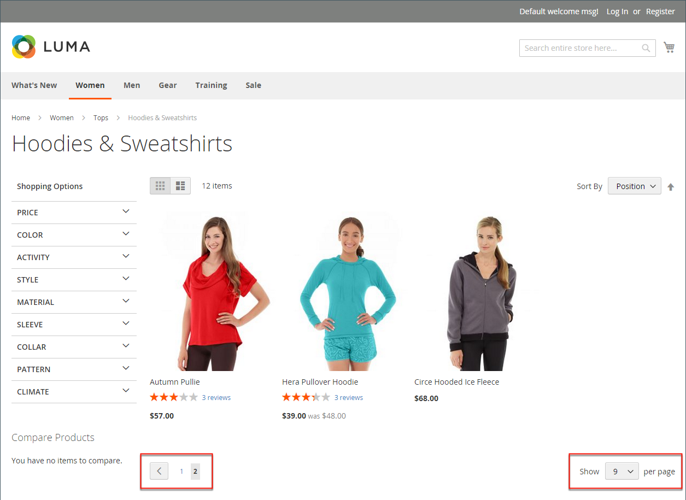
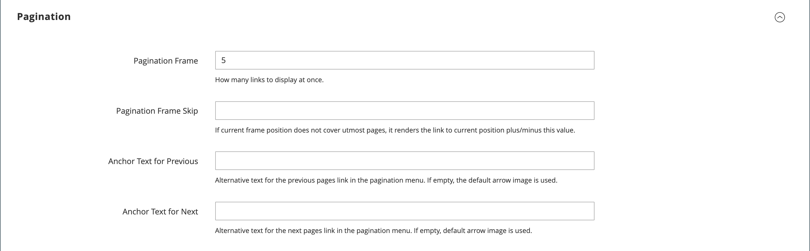

# 제품 목록

제품 목록은 기본적으로 목록 또는 격자로 나타나도록 설정할 수 있습니다. 또한 페이지당 표시되는 제품 수와 목록을 정렬하는 데 사용되는 속성을 결정할 수 있습니다. 제품 목록에는 제품을 정렬하고, 목록 형식을 변경하고, 속성별로 정렬하고, 한 페이지에서 다음 페이지로 이동하는 데 사용할 수 있는 컨트롤 집합이 포함되어 있습니다.

>[!NOTE]
>
>제품 특성별로 카테고리를 정렬하면 동일한 속성 값을 갖는 제품도 제품별로 정렬됩니다 _[!UICONTROL Product ID]_오름차순으로 정렬합니다.

{width="700" zoomable="yes"}

## 제품 목록 구성

1. 다음에서 _관리자_ 사이드바, 이동 **[!UICONTROL Stores]** > _[!UICONTROL Settings]_>**[!UICONTROL Configuration]**.

1. 왼쪽 패널에서 를 확장합니다. **[!UICONTROL Catalog]** 및 선택 **[!UICONTROL Catalog]** 밑에.

1. 확장  다음 **[!UICONTROL Storefront]** 섹션.

   {width="600" zoomable="yes"}

   이러한 옵션에 대한 자세한 목록은 다음을 참조하십시오. [상점 첫 화면](../configuration-reference/catalog/catalog.md#storefront) 다음에서 _구성 참조_.

   >[!NOTE]
   >
   >다음 항목에 따라 제품 및 가격을 올바르게 표시 _가격별 제품 정렬_, 가격에 대한 설정이 [판매세 구성](../configuration-reference/sales/tax.md) 동일한 값(`Excluding Tax` **또는** `Including Tax`). 의 경우 _[!UICONTROL Calculation Settings]_을(를) 선택합니다.**[!UICONTROL Catalog Prices]**값. 및_[!UICONTROL Price Display Settings]_&#x200B;을(를) 선택합니다. **[!UICONTROL Display Product Prices in Catalog]** 값. 값이 다른 경우 계층화된 탐색의 가격 필터가 가격별로 제품을 제대로 필터링하고 정렬하지 못할 수 있습니다.

1. 기본값 설정 **[!UICONTROL List Mode]** 다음 중 하나를 수행합니다.

   - `Grid Only`
   - `List Only`
   - `Grid (default) / List`
   - `List (default / Grid`

1. 대상 **[!UICONTROL Products per Page on Grid Allowed Values]**&#x200B;그리드 형식으로 표시할 때 페이지당 표시할 제품 수를 입력합니다.

   값을 입력하려면 각 숫자를 쉼표로 구분합니다.

1. 대상 **[!UICONTROL Products per Page on Grid Default Value]**&#x200B;을 클릭하고 페이지당 그리드에 표시할 기본 제품 수를 입력합니다.

1. 대상 **[!UICONTROL Products per Page on List Allowed Values]**&#x200B;목록 형식으로 표시할 때 페이지당 표시할 제품 수를 입력합니다.

   값을 입력하려면 각 숫자를 쉼표로 구분합니다.

1. 대상 **[!UICONTROL Products per page on List Default Value]**&#x200B;목록에 표시되는 페이지당 기본 제품 수를 입력합니다.

1. 설정 **[!UICONTROL Product Listing Sorted by]** 목록을 정렬하는 데 처음 사용되는 기본 속성에 매핑할 수도 있습니다.

1. 고객에게 모든 제품을 나열할 수 있는 옵션을 제공하려면 다음을 설정하십시오. **[!UICONTROL Allow All Products on Page]** 끝 `Yes`.

1. 고객이 카탈로그 목록을 검색할 때 모든 페이지 매김 설정을 유지하려면 을 설정합니다. **[!UICONTROL Remember Category Pagination]** 끝 `Yes`.

   이 설정을 활성화하면 쇼핑객이 한 카테고리에서 다른 카테고리로 탐색할 때 목록이나 격자에 표시된 제품 수를 유지할 수 있습니다. 기본적으로 이 필드는 로 설정됩니다. `No` 더 많은 캐시 저장소를 사용하며 검색 엔진이 페이지를 색인화하는 방식에 영향을 줄 수 있기 때문입니다.

1. 를 사용하는 경우 [단순 카탈로그](catalog-flat.md) (**권장되지 않음**) 다음을 수행합니다.

   - 제품의 단순 범주 목록을 표시하려면 다음을 설정합니다. **[!UICONTROL Use Flat Catalog Category]** 끝 `Yes`.

   - 플랫 제품 목록을 표시하려면 다음을 설정합니다 **[!UICONTROL Use Flat Catalog Product]** 끝 `Yes`.

1. 범주 및 제품 URL의 미디어 자산에 대해 동적 참조를 허용하려면 다음을 설정하십시오. **[!UICONTROL Allow Dynamic Media URLs in Products and Categories]** 끝 `Yes`.

1. 완료되면 다음을 클릭하십시오. **[!UICONTROL Save Config]**.

## 페이지 컨트롤

| 제어 | 설명 |
|--- |--- |
| [!UICONTROL View As] | 제품을 표 또는 목록 형식으로 표시합니다. |
| [!UICONTROL Sort By] | 목록의 정렬 순서를 변경합니다. |
| [!UICONTROL Show Per Page] | 페이지당 표시되는 제품 수를 결정합니다. |
| 페이지 매김 링크 | 다른 페이지로 이동하는 탐색 링크입니다. |

{style="table-layout:auto"}

## 페이지 매김 컨트롤

페이지 매김 설정은 목록의 맨 위와 맨 아래에 표시되며 제품 목록에 대한 페이지 매김 링크의 형식을 제어합니다. 컨트롤에 표시되는 링크의 수를 설정하고 다음 및 이전 링크를 구성할 수 있습니다. 페이지 매김 링크가 나타나게 하려면 제품 목록 구성의 페이지당 허용되는 것보다 더 많은 제품이 목록에 있어야 합니다.

{width="700" zoomable="yes"}

### Storefront 페이지 매김 컨트롤

| 제어 | 설명 |
|--- |--- |
|  | [!UICONTROL View As] - 목록을 그리드 또는 목록 형식으로 표시합니다. |
|  | [!UICONTROL Sort By] - 목록의 정렬 순서를 변경합니다. 다음 _[!UICONTROL Used for Sorting in Product Listing]_storefront 속성은 다음 항목을 결정합니다. [제품 속성](../catalog/product-attributes.md) 를 사용하여 목록을 정렬할 수 있습니다. |
|  | [!UICONTROL Show Per Page] - 페이지당 표시되는 제품 수를 결정합니다. |
|  | 페이지 매김 링크 - 다른 페이지에 대한 탐색 링크. |

{style="table-layout:auto"}

### 페이지 매김 컨트롤 구성

1. 다음에서 _관리자_ 사이드바, 이동 **[!UICONTROL Content]** > _[!UICONTROL Design]_>**[!UICONTROL Configuration]**.

1. 구성할 스토어 보기를 찾고 **[!UICONTROL Action]** 열, 클릭 **[!UICONTROL Edit]**.

1. 아래 **[!UICONTROL Other Settings]**, 확장  다음 **[!UICONTROL Pagination]** 섹션.

   {width="600" zoomable="yes"}

   이러한 설정에 대한 자세한 내용은 [디자인 구성](../content-design/configuration.md).

1. 대상 **[!UICONTROL Pagination Frame]**&#x200B;페이지 매김 컨트롤에 표시할 링크의 수를 입력합니다.

1. 대상 **[!UICONTROL Pagination Frame Skip]**&#x200B;페이지 매김 컨트롤에 다음 링크 집합을 표시하기 전에 건너뛸 링크의 수를 입력합니다.

   예를 들어 페이지 매김 프레임에 5개의 링크가 있고 다음 5개의 링크로 이동하려는 경우 몇 개의 링크를 건너뛰시겠습니까? 값을 4로 설정하면(`4`), 이전 세트의 마지막 링크는 다음 세트의 첫 번째 링크입니다.

1. 대상 **[!UICONTROL Anchor Text for Previous]**&#x200B;이전 링크에 표시할 텍스트를 입력합니다.

   기본 화살표를 사용하려면 비워 둡니다.

1. 대상 **[!UICONTROL Anchor Text for Next]**&#x200B;다음 링크에 표시할 텍스트를 입력합니다. 기본 화살표를 사용하려면 비워 둡니다.

1. 완료되면 다음을 클릭하십시오. **[!UICONTROL Save Configuration]**.
