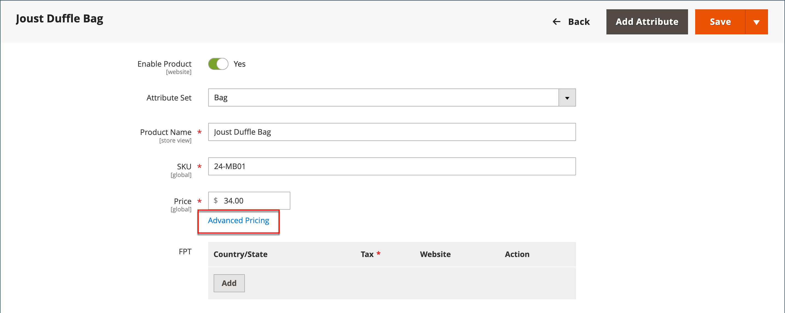
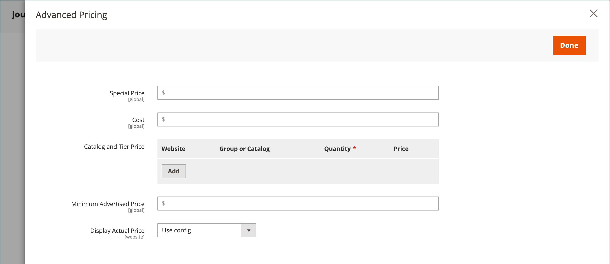

# 고급 가격 책정

Adobe Commerce 및 Magento Open Source은 프로모션이나 제조업체의 최소 광고 가격 요구 사항을 충족하기 위해 사용할 수 있는 다양한 가격 옵션을 지원합니다. 제품 가격 책정에 대한 변경은 일정에 따라, 또는 제품 수준 또는 장바구니에서 적용되는 가격 규칙에 따라 수행할 수 있습니다.

고급 가격으로 제품 가격을 관리하여 소비자가 더 많은 비용을 지출하고, 사이트 트래픽을 유도하며, 오래된 주식을 지우는 더 나은 가격을 고객에게 제공합니다.

다음 _[!UICONTROL Advanced Pricing]_설정은 특정 고객 그룹 또는 공유 카탈로그에서 사용할 수 있는 특별 가격에 필요한 조건을 정의합니다. 고급 가격은 단순, 가상, 다운로드 가능 및 번들 제품에 적용할 수 있습니다. 다른 제품 유형에 할인된 가격을 적용하려면 [카탈로그 가격 규칙](../merchandising-promotions/price-rules-catalog.md). 자세한 내용은 [가격 범위](catalog-price-scope.md).

고급 가격 데이터는 제품 페이지와 동기화됩니다. 예를 들어 계층 가격 수량을 업데이트하면 시스템이 제품 페이지의 값을 업데이트합니다.

 (사용 가능 대상 [Adobe Commerce용 B2B](./b2b/../introduction.md) 전용) 공유 카탈로그를 사용하는 경우 고급 가격 책정 데이터가 제품 페이지 및 공유 카탈로그 모두와 동기화됩니다. 예를 들어 계층 가격 수량을 업데이트하면 공유 카탈로그 및 제품 페이지의 값이 업데이트됩니다. 공유 카탈로그에 표시된 모든 사용자 지정 가격책정은 고객 그룹 가격책정보다 우선합니다. 도 참조하십시오. [공유 카탈로그 가격 및 구조 설정](https://experienceleague.adobe.com/docs/commerce-admin/b2b/shared-catalogs/define/catalog-shared-pricing-structure.html) 다음에서 _Adobe Commerce용 B2B 안내서_.

{width="600" zoomable="yes"}

## 고급 가격 옵션 액세스

1. 제품을 편집 모드로 엽니다.

1. 아래 **[!UICONTROL Price]**, 클릭 **[!UICONTROL Advanced Pricing]**.

1. 필요한 고급 가격 유형에 대한 지침을 따르십시오.

   - [그룹 가격](product-price-group.md)

   - [특별 가격](product-price-special.md)

   - [계층 가격](product-price-tier.md)

   - [최소 광고 가격](product-price-minimum-advertised.md)

## 페이지 참조

### [!UICONTROL Special Price]

지정된 기간 또는 예약된 캠페인 동안 할인된 가격을 제공하려면 특별 가격을 입력합니다. 특가를 사용할 수 있게 되면 소매가는 제외되고 특가는 크고 굵은 글씨로 아래와 같이 나타난다.

#### [!UICONTROL Special Price From] 날짜

{{ce-feature}}

| 필드 | 설명 |
| ---- | ----------- |
| [!UICONTROL From] | 특별 가격을 사용할 수 있는 첫 번째 날짜를 설정합니다. 날짜를 입력하거나 달력에서 선택할 수 있습니다. |
| [!UICONTROL To] | 특별 가격을 사용할 수 있는 마지막 날짜를 설정합니다. 날짜를 입력하거나 달력에서 선택할 수 있습니다. |

{style="table-layout:auto"}

### [!UICONTROL Cost]

품목의 실제 원가를 입력합니다.

### [!UICONTROL Customer Group Price]

{width="600" zoomable="yes"}

특정 고객 그룹에 대한 프로모션 및 계층 가격을 설정합니다.

| 항목 | 설명 |
| ---- | ----------- |
| [!UICONTROL Website] | 그룹 가격 규칙이 적용되는 웹 사이트를 식별합니다. 이 옵션은 설치에 여러 웹 사이트가 있는 경우에만 나타납니다. |
| [!UICONTROL Customer Group] | (필수) 할인 가격을 받을 수 있는 고객 그룹을 식별합니다. 그룹 또는 카탈로그 필드의 값이 변경되면 이전 설정과 일치하는 해당 사용자 지정 가격 행이 공유 카탈로그에서 삭제됩니다.  **[!UICONTROL ALL GROUPS]**- 모든 고객 그룹에 규칙을 적용합니다. **[!UICONTROL NOT LOGGED IN]** - 계정에 로그인하지 않은 고객 및 규칙 게스트가 적용됩니다. |
| [!UICONTROL Quantity] | 계층 가격을 받는 데 필요한 수량을 지정합니다. |
| [!UICONTROL Price] | (필수) 특정 웹 사이트 내에서 고객 그룹의 구성원에 대한 고정 또는 할인 제품 가격을 지정합니다. 옵션:  **[!UICONTROL Fixed]**- (기본값) 할인 가격이 고정 소수점 값으로 입력됩니다. 예를 들어, 을 입력합니다. `9.99` 할인 가격으로. **[!UICONTROL Discount]** - 할인 가격은 기본 제품 가격의 백분율(%)로 입력됩니다. 예를 들어, 을 입력합니다. `10` 10퍼센트 할인해 주세요. |
|  | 현재 규칙을 삭제합니다. |
| **[!UICONTROL Add]** | 새 규칙에 대해 다른 행을 삽입합니다. |

{style="table-layout:auto"}

### [!UICONTROL Catalog and Tier Price]

특정 공유 카탈로그 및 고객 그룹에 대한 프로모션 및 계층 가격을 설정합니다.

{{b2b-feature}}

{width="600" zoomable="yes"}

| 항목 | 설명 |
|----|-----------|
| [!UICONTROL Website] | 그룹 가격 규칙이 적용되는 웹 사이트를 식별합니다. 이 옵션은 설치에 여러 웹 사이트가 있는 경우에만 나타납니다.  **_중요 사항:_**모두 선택_웹 사이트&#x200B;_다음에서 [카탈로그 가격 범위](catalog-price-scope.md) 구성, 그렇지 않은 경우 다음에 대한 고급 가격 설정이 표시됨**모두&#x200B;**웹 사이트. |
| [!UICONTROL Group or Catalog] | (필수) 할인 가격을 받을 수 있는 고객 그룹 또는 공유 카탈로그를 식별합니다. 그룹 또는 카탈로그 필드의 값이 변경되면 이전 설정과 일치하는 해당 사용자 지정 가격 행이 공유 카탈로그에서 삭제됩니다.  **[!UICONTROL ALL GROUPS]**- 모든 고객 그룹에 규칙을 적용합니다. 이 값은 공유 카탈로그에 적용되지 않으며 Advanced Pricing 데이터의 변경 사항은 공유 카탈로그와 동기화되지 않습니다. **[!UICONTROL NOT LOGGED IN]** - 계정에 로그인하지 않은 고객 및 규칙 게스트가 적용됩니다. **[!UICONTROL Shared Catalogs]**- 특정 공유 카탈로그에 규칙을 적용합니다. |
| 수량 | 계층 가격을 받는 데 필요한 수량을 지정합니다. |
| [!UICONTROL Price] | (필수) 특정 웹 사이트 내에서 고객 그룹의 구성원에 대한 고정 또는 할인 제품 가격을 지정합니다. 옵션:  **[!UICONTROL Fixed]**- (기본값) 할인 가격이 고정 소수점 값으로 입력됩니다. 예를 들어, 을 입력합니다. `9.99` 할인 가격으로. **[!UICONTROL Discount]** - 할인 가격은 기본 제품 가격의 백분율(%)로 입력됩니다. 예를 들어, 을 입력합니다. `10` 10퍼센트 할인해 주세요. |
|  | 현재 규칙을 삭제합니다. |
| **[!UICONTROL Add]** | 새 규칙에 대해 다른 행을 삽입합니다. |

{style="table-layout:auto"}

### [!UICONTROL Minimum Advertised Price]

제품의 최소 광고 가격(MAP).

### [!UICONTROL Display Actual Price]

제품의 실제 가격이 고객에게 표시되는 위치를 결정합니다.

| 항목 | 설명 |
|----|-----------|
| [!UICONTROL Use Config] | 가격 표시에 현재 구성 설정을 사용합니다. |
| [!UICONTROL On Gesture] | 에 대한 응답으로 실제 제품 가격을 팝업으로 표시합니다. _가격을 보려면 클릭_ 또는 _이게 뭐야?_ 링크를 클릭합니다. |
| [!UICONTROL In Cart] | 장바구니에 실제 제품 가격을 표시합니다. |
| [!UICONTROL Before Order Confirmation] | 주문이 제출되기 바로 전 체크아웃 프로세스가 종료될 때 실제 제품 가격이 표시됩니다. |

{style="table-layout:auto"}
