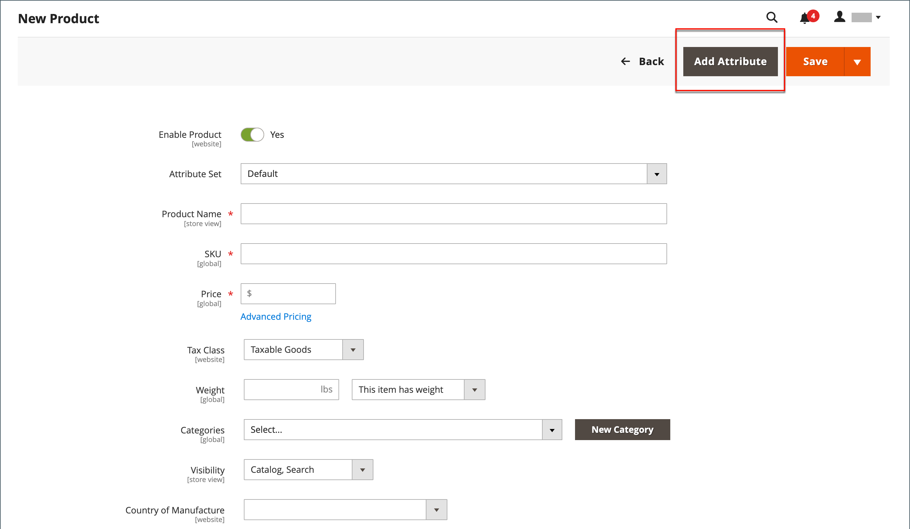

# 제품에 속성 추가

특성은 주로 [스토어](../stores-purchase/stores-menu.md) 메뉴에서 관리되지만, 제품 작업 중에 새 특성을 _바로_&#x200B;할 수도 있습니다. 기존 속성 목록에서 선택하거나 속성을 만들 수 있습니다. 새 특성이 제품의 기반이 되는 [특성 집합](../catalog/attribute-sets.md)에 추가됩니다.

## 1단계: 속성 추가

1. 제품을 편집 모드로 엽니다.

1. 오른쪽 상단에서 **[!UICONTROL Add Attribute]**&#x200B;을(를) 클릭합니다.

   {width="600" zoomable="yes"}

1. 제품에 기존 특성을 추가하려면 [필터 컨트롤](../getting-started/admin-grid-controls.md)을 사용하여 표에서 특성을 찾고 다음을 수행합니다.

   - 추가할 각 속성의 첫 번째 열에서 확인란을 선택합니다.

   - **[!UICONTROL Add Selected]**&#x200B;을(를) 클릭합니다.

   {width="600" zoomable="yes"}

1. 새 특성을 정의하려면 **[!UICONTROL Create New Attribute]**&#x200B;을(를) 클릭하고 2단계의 항목을 완료합니다.

## 2단계: 기본 속성 속성 설명

{width="600" zoomable="yes"}

1. _[!UICONTROL Attribute Properties]_&#x200B;에서 특성을 식별할&#x200B;**[!UICONTROL Attribute Label]**&#x200B;을(를) 입력하십시오.

1. 데이터 입력에 사용할 **[!UICONTROL Catalog Input Type for Store Owner]**&#x200B;을(를) [입력 컨트롤](attributes-input-types.md) 유형으로 설정하십시오.

   특성이 [구성 가능한 제품](product-create-configurable.md)에 사용되는 경우 `Dropdown`을(를) 선택하십시오. **[!UICONTROL Required]**&#x200B;을(를) `Yes`(으)로 설정합니다.

1. `Dropdown` 및 `Multiple Select` 입력 유형에 대해 다음을 수행합니다.

   - **[!UICONTROL Values]**&#x200B;에서 **[!UICONTROL Add Value]**&#x200B;을(를) 클릭합니다.

   - 목록에 표시할 첫 번째 값을 입력합니다.

     관리자용 값 하나를 입력하고 각 스토어 보기에 대한 값의 번역을 입력할 수 있습니다. 스토어 보기가 한 개만 있는 경우 관리 값만 입력할 수 있으며 이 값은 상점 간에도 사용됩니다.

   - **[!UICONTROL Add Value]**&#x200B;을(를) 클릭하고 목록에 포함할 각 옵션에 대해 이전 단계를 반복합니다.

   - 옵션을 기본값으로 사용하려면 **[!UICONTROL Is Default]**&#x200B;을(를) 선택하십시오.

   {width="600" zoomable="yes"}

1. 제품을 구매하기 전에 고객이 옵션을 선택하도록 하려면 **[!UICONTROL Required]**&#x200B;을(를) `Yes`(으)로 설정하십시오.

## 3단계: 고급 속성 설명(선택 사항)

{width="600" zoomable="yes"}

1. 고유한 **[!UICONTROL Attribute Code]**&#x200B;을(를) 소문자 및 공백 없이 입력하십시오.

1. 저장소 계층 구조에서 특성을 사용할 수 있는 위치를 나타내려면 **[!UICONTROL Scope]**&#x200B;을(를) 설정하십시오.

   특성이 [구성 가능한 제품](product-create-configurable.md)에 사용되는 경우 `Global`을(를) 선택하십시오.

1. 이 특성이 이 제품에만 적용되는 경우 **[!UICONTROL Unique Value]**&#x200B;을(를) `Yes`(으)로 설정하십시오.

1. 텍스트 필드에 입력한 데이터의 유효성 검사를 실행하려면 필드에 포함해야 하는 데이터 형식으로 **[!UICONTROL Input Validation for Store Owner]**&#x200B;을(를) 설정하십시오.

   값이 선택된 입력 유형에는 이 필드를 사용할 수 없습니다. 입력 유효성 검사는 다음 중 하나에 사용할 수 있습니다.

   - `Decimal Number`
   - `Integer Number`
   - `Email`
   - `URL`
   - `Letters`
   - `Letters (a-z, A-Z) or Numbers (0-9)`

   {width="500"}

1. 특성을 제품 표에 열로 포함하려면 **[!UICONTROL Add to Column Options]**&#x200B;을(를) `Yes`(으)로 설정합니다.

1. 이 열로 _[!UICONTROL Products]_&#x200B;그리드를 필터링하려면&#x200B;**[!UICONTROL Use in Filter Options]**&#x200B;을(를) `Yes`(으)로 설정하십시오.

## 4단계: 필드 레이블 입력

1. 확장 선택기&#x200B;**[!UICONTROL Manage titles]**&#x200B;를 확장합니다.

1. 필드의 레이블로 사용할 **[!UICONTROL Title]**&#x200B;을(를) 입력하십시오.

   스토어를 다른 언어로 사용할 수 있는 경우 각 보기에 대해 번역된 제목을 입력할 수 있습니다.

   {width="600" zoomable="yes"}

   >[!NOTE]
   >
   > 라이브 검색에서 이 속성을 패싯으로 사용하려면 저장소별 레이블을 지정해야 합니다. 없으면 Facet 구성 페이지에 속성 이름이 올바르게 표시되지 않을 수 있습니다. 구성을 업데이트하려면 [Live Search 안내서](https://experienceleague.adobe.com/en/docs/commerce/live-search/live-search-admin/facets/facets-add#step-2-edit-facet-properties-optional)의 Live Search 환경 설정 목록&#x200B;_에서_&#x200B;편집 옵션을 사용하여 레이블을 수동으로 편집하십시오.

## 5단계: 상점 속성 설명

1. 확장 선택기&#x200B;**[!UICONTROL Storefront Properties]**&#x200B;를 확장합니다.

   {width="600" zoomable="yes"}

1. 특성을 검색할 수 있도록 하려면 **[!UICONTROL Use in Search]**&#x200B;을(를) `Yes`(으)로 설정합니다.

1. 제품 비교에 특성을 포함하려면 **[!UICONTROL Comparable on Storefront]**&#x200B;을(를) `Yes`(으)로 설정하십시오.

1. 레이어 탐색에 드롭다운, 다중 선택 또는 가격 특성을 포함하려면 **[!UICONTROL Use in Search Results Layered Navigation]**&#x200B;을(를) 다음 중 하나로 설정합니다.

   - `Filterable (with results)` - 레이어 탐색에는 일치하는 제품을 찾을 수 있는 필터만 포함됩니다. 목록에 표시된 모든 제품에 이미 적용되는 속성 값은 사용 가능한 필터로 표시되지 않습니다. 제품 일치 개수가 0인 속성 값은 사용 가능한 필터 목록에서도 생략됩니다.  필터링된 제품 목록에는 필터와 일치하는 제품만 포함됩니다. 제품 목록은 선택한 필터가 표시된 것을 변경하는 경우에만 업데이트됩니다.

   - `Filterable (no results)` - 계층화된 탐색에는 제품 일치 항목이 0인 제품을 포함하여 사용 가능한 모든 특성 값 및 해당 제품 수에 대한 필터가 포함됩니다. 속성 값이 견본이면 값이 필터로 표시되지만 무시됩니다.

   >[!NOTE]
   >
   >_[!UICONTROL Use in Search]_&#x200B;설정이 `No`(으)로 설정되어 있으면&#x200B;_[!UICONTROL Use in Search Results Layered Navigation]_ 설정이 표시되지 않고 [!UICONTROL Use in Layered Navigation] 설정 값이 있는 검색에서 제품 특성이 사용되지 않습니다.

1. 검색 결과 페이지의 레이어 탐색에서 특성을 사용하려면 **[!UICONTROL Use in Search Results Layered Navigation]**&#x200B;을(를) `Yes`(으)로 설정하고 **[!UICONTROL Position]** 필드에 숫자를 입력하십시오.

   위치 번호는 계층화된 탐색 블록 내에서 속성의 상대적 위치를 나타낸다.

   >[!NOTE]
   >
   >_[!UICONTROL Position]_&#x200B;필드는 기본적으로 흐리게 표시되어 있으므로 이 설정을 수정하려면 먼저 특성을 저장해야 합니다.

1. 가격 규칙에서 특성을 사용하려면 **[!UICONTROL Use for Promo Rule Conditions]**&#x200B;을(를) `Yes`(으)로 설정하십시오.

1. 텍스트 서식을 HTML으로 지정하려면 **[!UICONTROL Allow HTML Tags on Storefront]**&#x200B;을(를) `Yes`(으)로 설정합니다.

   이 설정을 사용하면 필드를 편집할 때 WYSIWYG 편집기를 사용할 수 있습니다.

1. 제품 페이지에 특성을 포함하려면 **[!UICONTROL Visible on Catalog Pages on Storefront]**&#x200B;을(를) `Yes`(으)로 설정합니다.

1. 테마에서 지원하는 대로 다음 설정을 완료합니다.

   - 제품 목록에 특성을 포함하려면 **[!UICONTROL Used in Product Listing]**&#x200B;을(를) `Yes`(으)로 설정하십시오.

   - 특성을 제품 목록의 정렬 매개 변수로 사용하려면 **[!UICONTROL Used for Sorting in Product Listing]**&#x200B;을(를) `Yes`(으)로 설정하십시오.

1. 완료되면 **[!UICONTROL Save Attribute]**&#x200B;을(를) 클릭합니다.
