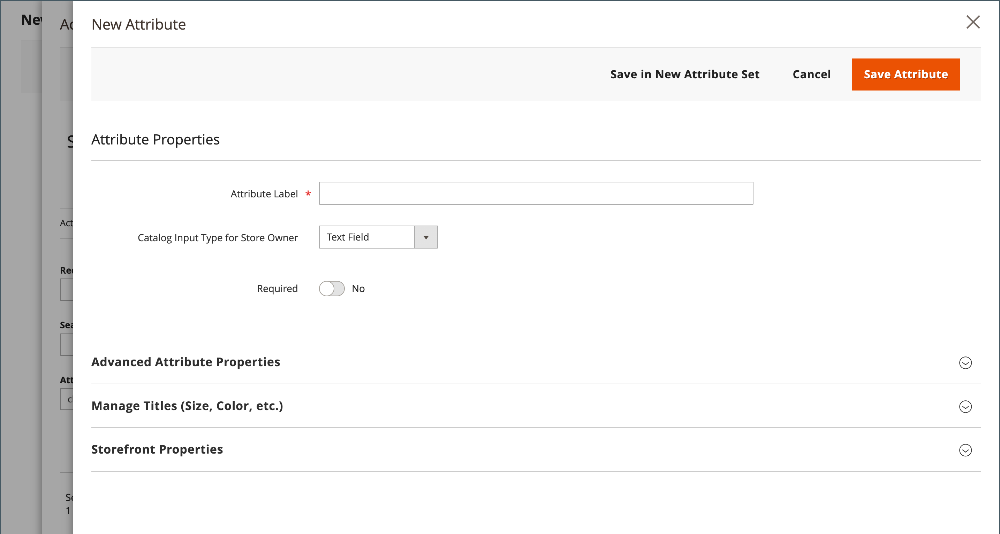

# 제품 속성 개요

속성은 제품 카탈로그의 기본 구성단위이며, 제품의 특정 특성을 설명합니다. 제품 속성을 다음으로 구성할 수 있음 [속성 집합](attribute-sets.md): 제품을 만드는 템플릿으로 사용됩니다.

속성은 제품 옵션에 사용되는 입력 제어 유형을 결정하고 제품 페이지에 대한 추가 정보를 제공합니다. 또한 계층화된 탐색, 제품 비교 보고서 및 프로모션에 대한 검색 매개 변수 및 기준으로 사용됩니다. 카탈로그의 제품을 설명하는 데 필요한 수만큼 속성 및 속성 세트를 만들 수 있습니다. 만들 수 있는 속성 외에도 가격과 같은 시스템 속성은 핵심 상거래 플랫폼에 구축되며 변경할 수 없습니다.

{width="600" zoomable="yes"}

제품 속성을 계획하고 작성할 때 다음 섹션에 설명된 모범 사례를 사용하십시오.

## 속성 이름

대/소문자 및 구두점을 포함하여 일관된 속성 이름 지정 규칙을 설정합니다. 예를 들어, `Color:Green` 및 `Color:green` 는 서로 다른 시스템에서 두 개의 서로 다른 속성 값으로 간주할 수 있습니다. 데이터의 이러한 노이즈는 비즈니스 규칙, 검색 결과 및 제품에 규칙과 일치하는 애플리케이션의 데이터 필터에 영향을 줄 수 있습니다.

## 속성 사용

속성 및 값을 할당할 때 특성을 사용하는 방법을 고려합니다. 제품 이름, 이미지, 가격 및 설명 등 프레젠테이션의 레이블로 사용되는 속성과 데이터 입력에 사용되는 속성을 식별합니다. 사이트 전체에서 속성이 다른 페이지에 표시되는 방식과 카테고리 페이지, 제품 세부 사항 페이지, 카테고리 그리드 및 썸네일 슬라이더에 표시되는 방식을 고려합니다.

## 색상

임시 색상 설명은 데이터베이스 작업 측면에서 문제가 될 수 있습니다. Azure Skies 또는 &quot;Robin Egg Blue&quot;와 같은 색상 이름은 매력이 크지만 검색 기준으로 사용하거나 머천다이징에서 지정해야 하는 경우 최상의 결과를 반환하지 않을 수 있습니다 `Color_Family:Blue`. 검색 결과 및 계층화된 탐색에서 색상이 표현되는 방식을 고려하고 비즈니스 요구 사항에 맞는 몇 가지 지침을 수립하십시오. 그런 다음 카탈로그 전체에서 색상 속성 값을 할당할 때 일관성을 유지하십시오.

## 변형 관리

제품 사용 [구성 옵션](product-configurations.md) 및 [구성 가능한 제품](product-create-configurable.md) 제품 오퍼링의 변형을 관리합니다. 이러한 기능을 사용하면 제품을 보다 쉽게 분류하고, 장바구니 가격 규칙 및 동적 범주 규칙을 만들고, 다양한 텍스트, 선택 사항 및 날짜 입력 유형을 사용하여 선택 사항을 제공할 수 있습니다.

## 가중 검색

에 대해 활성화된 제품 속성 [카탈로그 검색](search.md) 가중치가 할당되어 검색 결과에서 더 높은 값을 제공할 수 있습니다. 가중치가 큰 속성은 가중치가 낮은 속성보다 먼저 반환됩니다. 예를 들어 시스템에 있는 두 가지 속성을 고려합니다. _색상_ 검색 가중치가 3 및 _설명_ 검색 가중치가 1인. 단어 검색 _빨강_ 다음 색상 속성 값이 있는 제품 목록을 반환합니다. `red`를 반환하지만 가 포함된 설명이 있는 제품은 반환하지 않습니다 _빨강_. 이 예에서는 `color` 속성의 정의된 가중치가 다음보다 큼 `description` 특성.

## 사용하지 않는 속성

더 나은 구조화와 더 빠른 색인화를 위해 사용되지 않는 제품 속성을 제거합니다.
