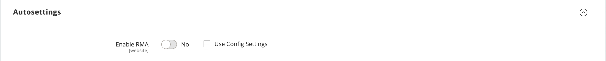

# 제품 설정 - [!UICONTROL Autosettings]

{{ee-feature}}

_[!UICONTROL Autosettings]_섹션에는 다른 작업에 종속된 모든 특성이 포함됩니다. 제품에 기본 [RMA 구성](../stores-purchase/rma-configure.md) 설정을 적용하거나 필요에 따라 재정의할 수 있습니다.

{width="600" zoomable="yes"}
