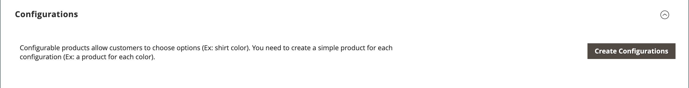

# 제품 설정 - [!UICONTROL Configurations]

_[!UICONTROL Configurations]_섹션은 제품의 기존 변형을 나열하며 구성 가능한 제품 형식과 함께 사용할 변형을 생성하는 데 사용할 수 있습니다. 자세한 내용은 [구성 가능한 제품](product-create-configurable.md)을 참조하세요.

{width="600" zoomable="yes"}

{width="600" zoomable="yes"}

## 필드 참조

| 필드 | 설명 |
|--- |--- |
| [!UICONTROL Image] | 제품 이미지 |
| [!UICONTROL Name] | 제품에 대한 고유 이름 |
| [!UICONTROL SKU] | 제품 이름 기반 |
| [!UICONTROL Price] | 제품 가격 |
| [!UICONTROL Quantity] | 각 제품에 대한 현재고 금액 |
| [!UICONTROL Weight] | 제품 무게 |
| [!UICONTROL Status] | 제품 상태 **[!UICONTROL Enabled]** / **[!UICONTROL Disabled]** |
| [!UICONTROL Attributes] | 제품을 설명하는 데 사용되는 속성 세트입니다 |
| [!UICONTROL Actions] | 선택한 제품에 적용할 수 있는 모든 작업을 나열합니다. 작업:  **[!UICONTROL Choose a different Product]** - 현재 제품을 제거하고 새 선택 항목으로 바꿉니다.  **[!UICONTROL Disable Product]** / **[!UICONTROL Enable Product]** - 선택한 제품을 사용하지 않거나 사용하도록 설정합니다.  **[!UICONTROL Remove Product]** - 현재 구성에서 선택한 제품을 제거합니다. |

{style="table-layout:auto"}
