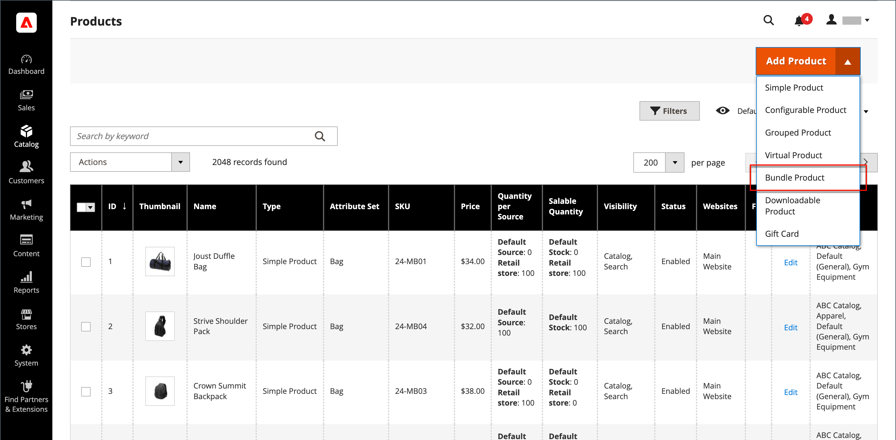
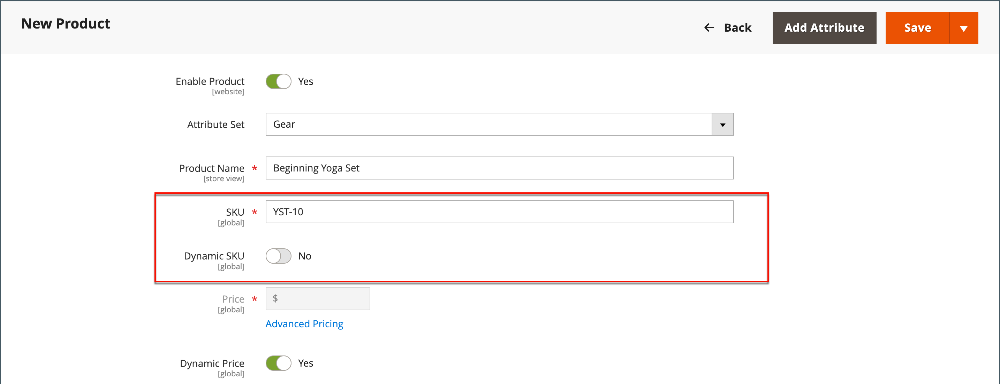
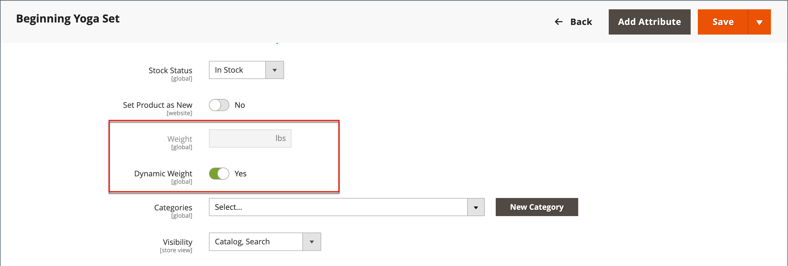
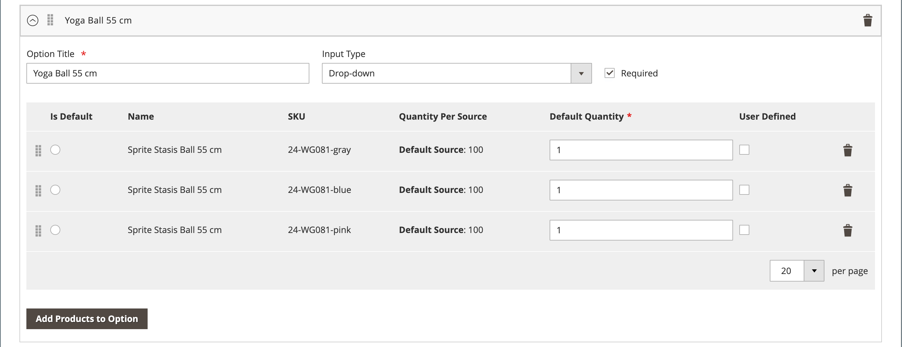

# 번들 제품

번들은 _나만의 콘텐츠 구축_, 사용자 정의 가능한 제품. 번들의 각 항목은 다음 제품 유형 중 하나를 기반으로 할 수 있습니다.

- [단순 제품](product-create-simple.md)
- [가상 제품](product-create-virtual.md)

{width="700" zoomable="yes"}

고객이 다음 중 하나를 클릭하면 옵션이 표시됩니다. **[!UICONTROL Customize]** 또는 **[!UICONTROL Add to Cart]**. 번들에 포함된 제품이 다르기 때문에 SKU, 가격 및 중량은 동적 또는 고정 값으로 설정할 수 있습니다.

>[!NOTE]
>
>동적 가격책정을 사용하는 번들 제품에는 MAP(최소 광고 가격)을 사용할 수 없습니다.

>[!NOTE]
>
>상위 번들 제품은 항상 모든 하위 제품에 대한 상향 판매 제품으로 표시됩니다.

If [즉시 구매](../stores-purchase/checkout-instant-purchase.md) 은(는) 사용할 수 있으며 _즉시 구매_ 아래에 단추가 표시됩니다. _장바구니에 추가_ 번들의 각 항목에 대한 단추입니다.

{width="600" zoomable="yes"}

다음은 를 사용하여 번들 제품을 만드는 과정을 보여 주는 지침입니다. [제품 템플릿](attribute-sets.md), 필수 필드 및 기본 설정. 각 필수 필드는 빨간색 별표(`*`). 기본 사항을 완료하면 필요에 따라 다른 제품 설정을 완료할 수 있습니다.

## 1단계: 제품 유형 선택

1. 다음에서 _관리자_ 사이드바, 이동 **[!UICONTROL Catalog]** > **[!UICONTROL Products]**.

1. 오른쪽 상단의 _[!UICONTROL Add Product]_( {width="25"} ) 메뉴, 선택&#x200B;**[!UICONTROL Bundle Product]**.

   {width="700" zoomable="yes"}

## 2단계: 속성 세트 선택

을(를) 선택하려면 [속성 집합](attribute-sets.md) 제품에 대한 템플릿으로 사용되는 템플릿은 다음 중 하나를 수행합니다.

- 대상 **[!UICONTROL Search]**&#x200B;속성 세트의 이름을 입력합니다.
- 목록에서 사용할 속성 세트를 선택합니다.

양식이 변경 사항을 반영하도록 업데이트됩니다.

{width="600" zoomable="yes"}

## 3단계: 필요한 설정 완료

1. 제품 입력 **[!UICONTROL Product Name]**.

1. 기본값을 그대로 사용합니다. **[!UICONTROL SKU]** 제품 이름을 기반으로 하거나 다른 값을 입력하십시오.

   각 번들 항목에 할당된 SKU 유형을 확인하려면 다음을 수행하십시오.

   - A **[!UICONTROL Dynamic SKU]** 기본 SKU에 접미사를 추가하여 각 번들 항목에 자동으로 할당할 수 있습니다. 기본적으로 로 설정됩니다. `Yes`.

   - 각 번들 항목에 대해 고유한 SKU를 할당하려면 을 설정합니다. **[!UICONTROL Dynamic SKU]** 끝 `No`.

   {width="600" zoomable="yes"}

1. 번들의 가격을 확인하려면 다음 중 하나를 수행하십시오.

   - 고객이 선택한 옵션을 가격에 반영하려면 다음을 설정하십시오. **[!UICONTROL Dynamic Price]** 끝 `Yes` 및 나가기 **[!UICONTROL Price]** 비어 있음. 이 경우 묶음 제품은 카탈로그에서 자체 가격이 없으며 제품 가격은 묶음에 포함된 개별 제품의 가격에서 파생됩니다.

   - 번들에 고정 가격을 부과하려면 다음을 설정하십시오. **[!UICONTROL Dynamic Price]** 끝 `No` 을(를) 입력한 후 **[!UICONTROL Price]** 번들에 대해 비용을 청구하려는 경우

   >[!NOTE]
   >
   >[!UICONTROL Special Price] 및 [!UICONTROL Customer Group Price] (계층 가격)은 항상 모든 번들 제품 유형에 대한 할인율로 설정됩니다.

1. 제품이 아직 게시할 준비가 되지 않았으므로 을(를) 설정합니다. **[!UICONTROL Enable Product]** 끝 `No`.

1. 클릭 **[!UICONTROL Save]** 계속합니다.

   제품이 저장되면 [스토어 뷰](introduction.md#product-scope) 선택기는 왼쪽 위 모서리에 나타납니다.

1. 다음을 선택합니다. **[!UICONTROL Store View]** 제품을 사용할 수 있는 위치.

   {width="600" zoomable="yes"}

## 4단계: 기본 설정 완료

1. 번들에 고정 가격이 있는 경우 다음을 설정합니다. **[!UICONTROL Tax Class]** 다음 중 하나를 수행합니다.

   - `None`
   - `Taxable Goods`

   번들에 동적 가격책정이 있는 경우 세금은 **_각각_** 번들 항목. 번들에 고정 가격이 있는 경우 세금은 **_전체_** 번들 제품.

1. 다음 사항에 주의하십시오.

   - 다음 **[!UICONTROL Quantity]** 값은 각 번들 항목에 대해 결정되므로 을(를) 사용할 수 없습니다.

   - 기본적으로 **[!UICONTROL Stock Status]** 이(가) (으)로 설정됨 `In Stock`.

1. 번들의 무게를 확인하려면 다음 중 하나를 수행하십시오.

   - 고객이 선택한 옵션을 가중치에 반영하려면 을 설정합니다. **[!UICONTROL Dynamic Weight]** set `Yes` 및 나가기 **[!UICONTROL Weight]** 비어 있음.

   - 번들에 고정 가중치를 할당하려면 을 설정합니다. **[!UICONTROL Dynamic Weight]** 끝 `No` 을(를) 입력한 후 **[!UICONTROL Weight]** 번들의

   {width="600" zoomable="yes"}

1. 제품을 다음 목록에 표시: [새로운 제품](../content-design/widget-new-products-list.md)를 선택하고 **[!UICONTROL Set Product as New]** 확인란.

1. 기본값 적용 **[!UICONTROL Visibility]** 설정 `Catalog, Search`.

1. 할당하려면 _[!UICONTROL Categories]_제품에 대해&#x200B;**[!UICONTROL Select…]**확인란을 선택하고 다음 중 하나를 수행합니다.

   **기존 범주 선택:**

   - 일치하는 항목을 찾을 때까지 상자에 입력을 시작합니다.

   - 할당할 각 범주의 확인란을 선택합니다.

   {width="600" zoomable="yes"}

   **카테고리 만들기:**

   - 클릭 **[!UICONTROL New Category]**.

   - 다음을 입력합니다. **[!UICONTROL Category Name]** 및 선택 **[!UICONTROL Parent Category]**&#x200B;를 설정하는 것이 좋습니다.

   - 클릭 **[!UICONTROL Create Category]**.

1. 다음을 선택합니다. **[!UICONTROL Country of Manufacture]**.

   제품을 설명하는 추가 속성이 있을 수 있습니다. 선택 내용은 속성 집합에 따라 달라지므로 나중에 완료할 수 있습니다.

## 5단계: 번들 항목 추가

다음 _[!UICONTROL Bundle Items]_섹션은 번들 제품 유형에 항목을 추가하고 현재 선택한 항목을 편집하는 데 사용됩니다.

{width="600" zoomable="yes"}

1. 아래로 스크롤하여 _번들 항목_ 섹션 및 세트 **[!UICONTROL Ship Bundle Items]** 다음 중 하나를 수행합니다.

   - `Separately`
   - `Together`

   다음을 선택하는 경우 `Together`, 모든 번들 항목에 동일한 항목을 할당해야 합니다. [소스](../inventory-management/sources-manage.md).

1. 클릭 **[!UICONTROL Add Option]** 다음을 수행합니다.

   - 다음을 입력하십시오. **[!UICONTROL Option Title]** 필드 레이블로 사용됩니다.

   - 설정 **[!UICONTROL Input Type]** 다음 중 하나를 수행합니다.

      - `Drop-down`
      - `Radio buttons`
      - `Checkbox`
      - `Multiple Select`

   - 필드를 필수 항목으로 만들려면 **[!UICONTROL Required]** 확인란.

   - 클릭 **[!UICONTROL Add Products to Option]** 이 옵션에 포함할 각 제품의 확인란을 선택합니다.

     제품이 많으면 목록 필터 및 페이지 매김 컨트롤을 사용하여 필요한 제품을 찾습니다.

   - 클릭 **[!UICONTROL Add Selected Products]**.

     {width="600" zoomable="yes"}

   - 항목이 다음에 표시된 후 _옵션_ 섹션에서 항목이 될 항목을 선택합니다. **[!UICONTROL Default]** 선택 항목.

   - 다음에서 _기본 수량_ 열에서 고객이 품목을 선택할 때 번들에 추가할 각 품목의 수량을 입력합니다.

   - 고객이 번들 항목의 수량을 변경할 수 있도록 하려면 다음을 선택합니다. **[!UICONTROL User Defined]**.

     >[!NOTE]
     >
     >수량은 사전 설정 또는 사용자 정의 값일 수 있습니다. 그러나 을(를) 할당하지 마십시오. _[!UICONTROL User Defined]_속성을 확인란 또는 다중 선택 입력 유형에 추가합니다.

     기본적으로 번들 항목에 포함된 기본 수량은 고객이 변경할 수 없습니다. 단, 번들에 포함될 품목의 수량을 고객이 입력할 수 있다.

     예를 들어 스프라이트 상태 볼의 기본 수량이 로 설정된 경우 `2` 및 고객 주문 `4` 해당 번들 옵션 중 총 구매한 볼 수는 다음과 같습니다. `8`.

     {width="600" zoomable="yes"}

1. 번들에 추가할 각 항목에 대해 이 단계를 반복합니다.

1. 번들 섹션의 항목 순서를 변경하려면 _이동_ (  ) 아이콘을 클릭하고 항목을 위치로 드래그합니다.

   {width="600" zoomable="yes"}

   항목 순서는 내보낸 번들 제품의 데이터에서 변경한 다음 카탈로그로 다시 가져올 수도 있습니다. 자세한 내용은 [번들 제품 가져오기](../systems/data-transfer-bundle-products.md).

   작업 영역을 더 잘 보려면 먼저 각 섹션을 축소한 다음 위치로 드래그합니다.

1. 번들에서 항목을 제거하려면 **[!UICONTROL Delete]** (  ) 아이콘.

1. 완료되면 다음을 클릭하십시오. **[!UICONTROL Save]**.

## 6단계: 제품 정보 작성

아래로 스크롤하여 필요에 따라 다음 섹션의 정보를 작성합니다.

- [콘텐츠](product-content.md)
- [이미지 및 비디오](product-images-and-video.md)
- [검색 엔진 최적화](product-search-engine-optimization.md)
- [관련 제품, 상향 판매 및 교차 판매](related-products-up-sells-cross-sells.md)
- [사용자 정의 가능한 옵션](settings-advanced-custom-options.md)
- [웹 사이트의 제품](settings-basic-websites.md)
- [디자인](settings-advanced-design.md)
- [선물 옵션](product-gift-options.md)

## 7단계: 제품 게시

1. 제품을 카탈로그에 게시할 준비가 되었으면 을 설정합니다. **[!UICONTROL Enable Product]** 끝 `Yes` (  ).

1. 다음 중 하나를 수행합니다.

   **방법 1:** 저장 및 미리 보기

   - 오른쪽 위 모서리에서 을(를) 클릭합니다. **[!UICONTROL Save]**.

   - 스토어에서 제품을 보려면 **[!UICONTROL Customer View]** 다음에 있음 _관리자_ (  ) 메뉴 아래의 제품에서 사용할 수 있습니다.

     저장소가 새 브라우저 탭에서 열립니다.

   {width="600" zoomable="yes"}

   **방법 2:** 저장 및 닫기

   다음에서 _[!UICONTROL Save]_( {width="25"} ) 메뉴, 선택&#x200B;**[!UICONTROL Save & Close]**.

## 입력 컨트롤

| 제어 | 설명 | 예 |
|--- |--- |--- |
| [!UICONTROL Drop-down] | 제품 이름과 가격이 포함된 옵션의 드롭다운 목록을 표시합니다. 항목은 하나만 선택할 수 있습니다. | {width="200"} |
| [!UICONTROL Radio Buttons] | 각 옵션에 대한 라디오 단추를 표시한 다음 제품 이름과 가격을 표시합니다. 항목은 하나만 선택할 수 있습니다. | {width="200"} |
| [!UICONTROL Checkbox] | 각 옵션에 대한 확인란과 함께 제품 이름과 가격을 표시합니다. 여러 항목을 선택할 수 있습니다. | {width="200"} |
| [!UICONTROL Multiple Select] | 제품 이름과 가격이 포함된 옵션 목록을 표시합니다. 여러 항목을 선택하려면 Ctrl 키(PC) 또는 Command 키(Mac)를 누른 채 각 항목을 클릭합니다. | {width="200"} |

{style="table-layout:auto"}

## 필드 설명

| 필드 | 설명 |
|--- |--- |
| [!UICONTROL SKU] | 각 항목에 변수 또는 동적 SKU가 할당되었는지 또는 번들에 고정 SKU가 사용되는지를 결정합니다. 옵션: `Fixed` / `Dynamic` |
| [!UICONTROL Weight] | 선택한 항목을 기반으로 가중치를 계산할지 또는 전체 번들에 대해 고정된 가중치인지 지정합니다. 옵션: `Fixed` / `Dynamic` |
| [!UICONTROL Price View] | 제품 가격이 최저 가격대에서 최고 가격대(가격 범위)까지 또는 최저 가격대(최저 가격)까지 범위로 표시되는지 여부를 결정합니다. 옵션: `Price Range` / `As Low As` |
| 번들 항목 배송 | 개별 품목을 별도로 출하할 수 있는지 여부를 지정합니다. |

{style="table-layout:auto"}

## 번들 제품 재고 상태

번들 제품 재고 상태: **_자동으로 품절로 변경됨_** 다음 시나리오 중 하나가 발생하는 경우:

- 모든 옵션은 선택 사항이며 모든 관련 제품은 다음과 같습니다. _품절_.

- 일부 옵션이 필요하며 필요한 옵션과 연결된 제품은 다음과 같습니다 _품절_.

번들 제품 재고 상태: **_자동으로 품절로 변경되지 않음_** 다음 시나리오 중 하나가 발생하는 경우:

- 모든 옵션은 선택 사항이며 하나 이상의 관련 제품은 다음과 같습니다. _재고 있음_.

- 일부 옵션이 필요하며 각 필수 옵션에서 하나 이상의 관련 제품이 필요합니다. _재고 있음_.

## 기억해야 할 사항

 고객은 다음을 수행할 수 있습니다. _직접 빌드_ 번들 제품.

 번들 항목은 사용자 지정 옵션이 없는 간단한 제품 또는 가상 제품일 수 있습니다.

 가격 보기는 다음 중 하나로 설정할 수 있습니다. `Price Range` 또는 `As Low As`.

 SKU 및 가중치는 다음 중 하나일 수 있습니다 `Fixed` 또는 `Dynamic`.

 수량은 사전 설정 또는 사용자 정의 값일 수 있습니다. 그러나 을(를) 할당하지 마십시오. _[!UICONTROL User Defined]_속성을 확인란 또는 다중 선택 입력 유형에 추가합니다.

 번들 제품은 함께 배송되거나 별도로 배송될 수 있습니다.

 상위 번들 제품은 항상 모든 하위 제품에 대한 상향 판매 제품으로 표시됩니다.

 [!UICONTROL Special Price] 및 [!UICONTROL Customer Group Price] (계층 가격)은 항상 모든 번들 제품 유형에 대한 할인율로 설정됩니다.
