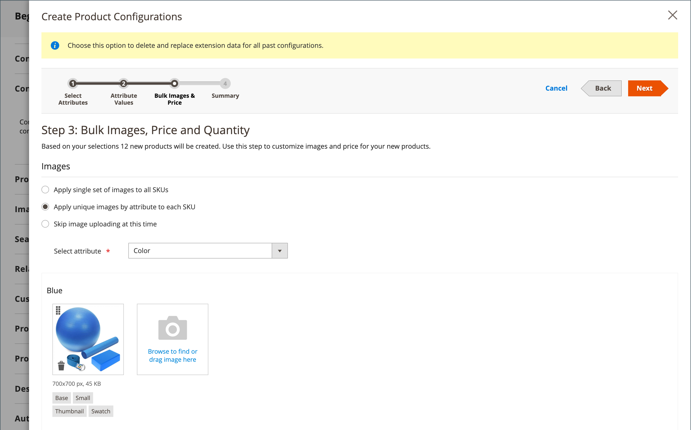
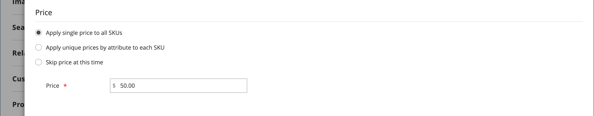
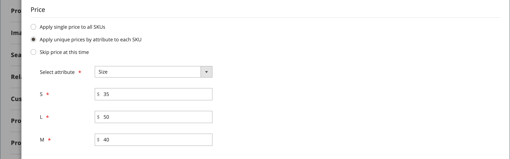
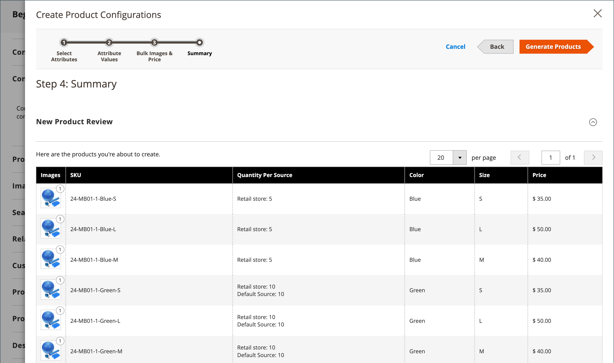

# 구성 가능한 제품

구성 가능한 제품은 각 변형의 드롭다운 목록이 있는 단일 제품처럼 보입니다. 각 목록 항목은 실제로 각 제품 변형에 대한 재고를 추적할 수 있도록 하는 고유한 SKU를 사용하는 별도의 간단한 제품입니다. 사용자 지정 옵션이 있는 간단한 제품을 사용해도 각 변형에 대한 인벤토리를 추적하는 기능이 없어도 유사한 효과를 얻을 수 있습니다.

다음 지침은 [제품 템플릿](attribute-sets.md), 필수 필드 및 기본 설정을 사용하여 구성 가능한 제품을 만드는 프로세스를 보여 줍니다. 각 필수 필드는 빨간색 별표(`*`)로 표시되어 있습니다. 기본 사항을 완료하면 필요에 따라 다른 제품 설정을 완료할 수 있습니다.

{width="700" zoomable="yes"}

## 1부: 구성 가능한 제품 만들기

구성 가능한 제품은 더 많은 SKU를 사용하며 처음에는 설정하는 데 시간이 조금 더 걸릴 수 있지만 결국 시간을 절약할 수 있습니다. 비즈니스를 확장하려는 경우 구성 가능한 제품 유형은 여러 옵션이 있는 제품에 적합합니다.

시작하기 전에 각 제품 변형에 대해 허용되는 입력 형식 중 하나로 설정된 특성을 포함하는 [특성 집합](attribute-sets.md)을 준비하십시오. 예를 들어, 속성 세트에는 색상 및 크기에 대한 드롭다운 속성이 포함될 수 있습니다.

구성 가능한 제품 변형에 사용되는 각 속성의 속성은 다음 설정을 가져야 합니다.

### 제품 변형 속성 요구 사항

| 속성 | 설정 |
|--- |--- |
| [!UICONTROL Scope] | `Global` |
| [!UICONTROL Catalog Input Type for Store Owner] | 제품 변형에 사용되는 특성의 입력 형식은 `Dropdown`, `Visual Swatch` 또는 `Text Swatch` 중 하나여야 합니다. |
| [!UICONTROL Values Required] | `Yes` |

{style="table-layout:auto"}

### 1단계: 제품 유형 선택

1. _관리자_ 사이드바에서 **[!UICONTROL Catalog]** > **[!UICONTROL Products]**(으)로 이동합니다.

1. 오른쪽 상단의 _[!UICONTROL Add Product]_( {width="25"}) 메뉴에서&#x200B;**[!UICONTROL Configurable Product]**&#x200B;을(를) 선택합니다.

   {width="700" zoomable="yes"}

### 2단계: 속성 세트 선택

[특성 집합](attribute-sets.md)은(는) 제품에 사용되는 필드 선택을 결정합니다. 다음 예에서 사용되는 속성 세트에는 색상 및 크기에 대한 속성이 있습니다. 특성 집합의 이름은 페이지 맨 위에 표시되며 처음에 `Default`(으)로 설정됩니다.

1. 제품에 대해 설정된 속성을 선택하려면 페이지 상단의 필드를 클릭하고 다음 중 하나를 수행합니다.

   - **[!UICONTROL Search]**&#x200B;의 경우 특성 집합의 이름을 입력하십시오.
   - 목록에서 사용할 속성 세트를 선택합니다.

   양식이 변경 사항을 반영하도록 업데이트됩니다.

1. 특성 집합에 다른 특성을 추가하려면 **[!UICONTROL Add Attribute]**&#x200B;을(를) 클릭하고 [특성 추가](product-attributes-add.md)의 지침을 따릅니다.

   {width="600" zoomable="yes"}

### 3단계: 필요한 설정 완료

1. 제품 **[!UICONTROL Product Name]**&#x200B;을(를) 입력하십시오.

1. 제품 이름을 기반으로 하는 기본 **[!UICONTROL SKU]**&#x200B;을(를) 사용하거나 다른 이름을 입력하십시오.

1. 제품 **[!UICONTROL Price]**&#x200B;을(를) 입력하십시오.

1. 제품을 아직 게시할 준비가 되지 않았으므로 **[!UICONTROL Enable Product]**&#x200B;을(를) `No`(으)로 설정하십시오.

1. **[!UICONTROL Save]**&#x200B;을(를) 클릭하고 계속합니다.

   제품을 저장하면 왼쪽 위 모서리에 [스토어 보기](introduction.md#product-scope) 선택기가 나타납니다.

1. 제품을 사용할 수 있는 **[!UICONTROL Store View]**&#x200B;을(를) 선택하십시오.

   {width="600" zoomable="yes"}

### 4단계: 기본 설정 완료

1. **[!UICONTROL Tax Class]**&#x200B;을(를) 다음 중 하나로 설정합니다.

   - `None`
   - `Taxable Goods`

1. **[!UICONTROL Quantity]**&#x200B;은(는) 제품 변형에 따라 결정되므로 비워 둘 수 있습니다.

1. **[!UICONTROL Stock Status]**&#x200B;을(를) 설정된 대로 둡니다.

   구성 가능한 제품의 재고 상태는 연관된 각 구성에 의해 결정됩니다. 수량을 입력하지 않고 제품이 저장되었으므로 **[!UICONTROL Stock Status]**&#x200B;이(가) `Out of Stock`(으)로 설정됩니다.

   >[!NOTE]
   >
   >구성 가능한 제품의 **재고 상태**&#x200B;는 **_반수동으로_** 제어된 설정입니다. 이는 자사의 하위 제품들의 재고 현황에 의해 부분적으로 통제된다. **_재고 상태 구성_** 섹션에 설명된 [여러 조건](#configure-the-stock-status) 재고 상태 계산의 일부입니다.

1. 제품 **[!UICONTROL Weight]**&#x200B;을(를) 입력하십시오.

>[!NOTE]
>
>구성 가능한 제품에는 항상 무게가 있어야 합니다. 드롭다운 목록에서 **[!UICONTROL This item has no weight]**&#x200B;을(를) 선택하면 제품을 저장한 후 자동으로 **[!UICONTROL This item has weight]**(으)로 변경됩니다.

1. **[!UICONTROL Visibility]**&#x200B;의 기본 `Catalog, Search` 설정을 사용합니다.

1. [새 제품](../content-design/widget-new-products-list.md) 목록에 제품을 포함하려면 **[!UICONTROL Set Product as New]** 확인란을 선택하십시오.

1. 제품에 범주를 할당하려면 **[!UICONTROL Select…]** 상자를 클릭하고 다음 중 하나를 수행합니다.

   **기존 범주 선택**:

   - 일치하는 항목을 찾을 때까지 상자에 입력을 시작합니다.

   - 할당할 카테고리의 확인란을 선택합니다.

   {width="600" zoomable="yes"}

   **범주 만들기**:

   - **[!UICONTROL New Category]**&#x200B;을(를) 클릭합니다.

   - **[!UICONTROL Category Name]**&#x200B;을(를) 입력하고 메뉴 구조에서 위치를 결정하는 **[!UICONTROL Parent Category]**&#x200B;을(를) 선택합니다.

   s- **[!UICONTROL Create Category]**&#x200B;을(를) 클릭합니다.

1. **[!UICONTROL Country of Manufacture]** 선택.

   제품을 설명하는 데 사용되는 추가 속성이 있을 수 있습니다. 선택 항목은 속성 세트에 따라 다르며 나중에 완료할 수 있습니다.

### 5단계: 저장 및 계속

지금이 작업을 저장하기에 좋은 때입니다. 오른쪽 상단에서 **[!UICONTROL Save]**&#x200B;을(를) 클릭합니다. 다음 일련의 단계에서는 제품의 각 변형에 대한 구성을 설정합니다.

## 2부: 구성 추가

다음 예에서는 세 가지 색상 및 세 가지 크기에 대한 구성을 추가하는 방법을 보여줍니다. 모두 9개의 간단한 제품이 가능한 모든 변형 조합을 포함하도록 고유한 SKU로 만들어집니다. 기본적으로 각 변형에 대한 제품 이름과 SKU는 속성 값과 상위 제품 이름 또는 SKU를 기반으로 합니다.

페이지 맨 위에 있는 진행률 표시줄은 진행 중인 위치를 보여주며 각 단계를 안내합니다.

### 1단계: 속성 선택

1. 위에서 계속 _[!UICONTROL Configurations]_&#x200B;섹션까지 아래로 스크롤한 다음&#x200B;**[!UICONTROL Create Configurations]**&#x200B;을(를) 클릭합니다.

   {width="600" zoomable="yes"}

1. 구성으로 포함할 각 속성의 확인란을 선택합니다.

   이 예제에서는 `color` 및 `size`을(를) 선택합니다.

   {width="600" zoomable="yes"}

   목록에는 구성 가능한 제품에서 사용할 수 있는 속성 세트의 모든 속성이 포함됩니다.

1. 특성을 추가하려면 **[!UICONTROL Create New Attribute]**&#x200B;을(를) 클릭하고 다음을 수행합니다.

   - 속성 속성을 완료합니다.

   - **[!UICONTROL Save Attribute]**&#x200B;을(를) 클릭합니다.

   - 속성에 대한 확인란을 선택합니다.

1. 오른쪽 상단에서 **[!UICONTROL Next]**&#x200B;을(를) 클릭합니다.

### 2단계: 속성 값 입력

1. 각 속성에 대해 제품에 적용되는 값의 확인란을 선택합니다.

   {width="600" zoomable="yes"}

1. 특성을 다시 정렬하려면 _순서 바꾸기_( ) 아이콘을 선택하고 섹션을 새 위치로 이동하십시오.

   이 순서는 제품 페이지에서 드롭다운 목록의 위치를 결정합니다.

1. 진행률 표시줄에서 **[!UICONTROL Next]**&#x200B;을(를) 클릭합니다.

### 3단계: 이미지, 가격 및 수량 구성

이 단계에서는 각 구성의 이미지, 가격 및 수량을 결정합니다. 사용 가능한 옵션은 각각에 대해 동일하며 하나만 선택할 수 있습니다. 모든 SKU에 동일한 설정을 적용하거나, 각 SKU에 고유한 설정을 적용하거나, 설정을 지금 건너뛸 수 있습니다.

적용되는 구성 옵션을 선택합니다.

다음 방법 중 하나를 사용하여 **[!UICONTROL images]**&#x200B;을(를) 구성하십시오.

**방법 1:** 모든 SKU에 단일 이미지 집합 적용

1. **[!UICONTROL Apply single set of images to all SKUs]**&#x200B;을(를) 선택합니다.

1. 제품 갤러리에 포함할 각 이미지를 찾아보거나 상자로 드래그합니다.

{width="600" zoomable="yes"}

**방법 2:** 각 SKU에 고유한 이미지를 적용합니다.

상위 제품의 이미지가 이미 업로드되었기 때문에 이 옵션을 사용하여 각 색상의 이미지를 업로드할 수 있습니다. 다른 사람이 특정 색상으로 제품을 구매할 때 장바구니에 표시되는 다른 이미지를 추가할 수 있습니다.

1. **[!UICONTROL Apply unique images by attribute to each SKU]**&#x200B;을(를) 선택합니다.

1. 이미지가 나타내는 **[!UICONTROL Attribute]**&#x200B;을(를) 선택합니다(예: `color`).

1. 각 속성 값에 대해 해당 구성에 사용할 이미지를 찾아보거나 상자로 드래그합니다.

   이미지를 값 상자로 드래그하면 다른 값의 섹션에도 표시됩니다. 이미지를 삭제하려면 _휴지통_() 아이콘을 클릭합니다.

   {width="600" zoomable="yes"}

다음 방법 중 하나를 사용하여 **[!UICONTROL prices]**&#x200B;을(를) 구성하십시오.

>[!NOTE]
>
>구성 가능한 제품은 카탈로그에 자체 가격이 없습니다. 구성 가능한 제품 가격은 해당 [!UICONTROL In Stock] 하위 제품에서 파생되었습니다.

**방법 1:** 모든 SKU에 동일한 가격 적용

1. 가격이 모든 변형에 대해 동일하면 **[!UICONTROL Apply single price to all SKUs]**&#x200B;을(를) 선택합니다.

1. **[!UICONTROL Price]** 입력.

   {width="600" zoomable="yes"}

**방법 2:** 각 SKU에 대해 다른 가격을 적용합니다.

1. 가격이 각각 다르거나 제품의 일부 변형에 대해 다른 경우 **[!UICONTROL Apply unique prices by attribute to each SKU]**&#x200B;을(를) 선택하십시오.

1. 가격 차이의 기준이 되는 **[!UICONTROL Attribute]**&#x200B;을(를) 선택하십시오.

1. 각 특성 값에 대해 **[!UICONTROL Price]**&#x200B;을(를) 입력하십시오.

   이 예에서는 XL 크기가 더 비쌉니다.

   {width="600" zoomable="yes"}

다음 방법 중 하나를 사용하여 **[!UICONTROL Quantity]**&#x200B;을(를) 구성하십시오.

**방법 1:** 모든 SKU에 동일한 수량을 적용합니다.

수량이 모든 SKU에 대해 동일하면 **[!UICONTROL Apply single quantity to each SKU]**&#x200B;을(를) 선택하고 수량을 지정하십시오.

_단일 원본 판매자_ - **[!UICONTROL Quantity]**&#x200B;을(를) 입력하십시오.

_여러 Source 판매자가 [Inventory management](../inventory-management/introduction.md)_&#x200B;을(를) 사용 - 생성된 모든 제품 변형에 대해 소스를 할당하고 수량을 추가합니다.

1. **[!UICONTROL Apply single quantity to each SKU]** 옵션을 선택하십시오.

1. 원본을 추가하려면 **[!UICONTROL Assign Sources]**&#x200B;을(를) 클릭하십시오.

1. 추가할 소스를 검색하거나 검색합니다. 제품에 추가할 소스 옆에 있는 확인란을 선택합니다.

1. 출처당 현재고 금액을 입력합니다.

   {width="600" zoomable="yes"}

**메서드 2:** 특성별로 다른 수량을 적용합니다.

_단일 원본 판매자_ - **[!UICONTROL Quantity]**&#x200B;을(를) 입력하십시오.

_여러 Source 판매자가 [Inventory management](../inventory-management/introduction.md)_&#x200B;을(를) 사용 - 생성된 모든 제품 변형에 대해 소스를 할당하고 수량을 추가합니다.

1. 각 SKU에 대해 수량이 다른 경우 **[!UICONTROL Apply unique quantity by attribute to each SKU]**&#x200B;을(를) 선택합니다.

1. 각각에 대한 **[!UICONTROL Quantity]**&#x200B;을(를) 입력하십시오.

   {width="600" zoomable="yes"}

이미지, 가격 및 수량 구성이 완료되면 오른쪽 상단의 **[!UICONTROL Next]**&#x200B;을(를) 클릭합니다.

### 4단계: 제품 구성 생성

제품 목록이 나타날 때까지 잠시 기다렸다가 다음 중 하나를 수행합니다.

- 구성에 만족하면 **[!UICONTROL Generate Products]**&#x200B;을(를) 클릭합니다.

- 수정하려면 **[!UICONTROL Back]**&#x200B;을(를) 클릭하십시오.

{width="600" zoomable="yes"}

현재 제품 변형이 _구성_ 섹션 하단에 나타납니다.

{width="600" zoomable="yes"}

### 5단계: 제품 이미지 추가

1. 아래로 스크롤하여 확장 선택기&#x200B;_[!UICONTROL Images and Videos]_&#x200B;를 확장합니다.

1. _카메라_ 타일을 클릭하고 구성 가능한 제품에 사용할 기본 이미지를 찾습니다.

자세한 내용은 [이미지 및 비디오](product-images-and-video.md)를 참조하세요.

### 6단계: 제품 정보 작성

아래로 스크롤하여 필요에 따라 다음 섹션의 정보를 작성합니다.

- [콘텐츠](product-content.md)

- [관련 제품, 상향 판매 및 교차 판매](related-products-up-sells-cross-sells.md)

- [검색 엔진 최적화](product-search-engine-optimization.md)

- [사용자 정의 가능한 옵션](settings-advanced-custom-options.md)

- [웹 사이트의 제품](settings-basic-websites.md)

- [디자인](settings-advanced-design.md)

- [선물 옵션](product-gift-options.md)

### 7단계: 제품 게시

1. 제품을 카탈로그에 게시할 준비가 되었으면 **[!UICONTROL Enable Product]**&#x200B;을(를) `Yes`(으)로 설정하고 다음 중 하나를 수행하십시오.

   - **메서드 1:** 저장 및 미리 보기

      - 오른쪽 상단에서 **[!UICONTROL Save]**&#x200B;을(를) 클릭합니다.

      - 스토어에서 제품을 보려면 **[!UICONTROL Customer View]**&#x200B;관리자&#x200B;_(_&#x200B;메뉴 화살표을(를) 선택하십시오.

     저장소가 새 브라우저 탭에서 열립니다.

     {width="600" zoomable="yes"}

   - **메서드 2:** 저장 및 닫기

     _[!UICONTROL Save]_( {width="25"}) 메뉴에서&#x200B;**[!UICONTROL Save & Close]**&#x200B;을(를) 선택합니다.

### 8단계: 장바구니 썸네일 구성

각 변형에 대해 다른 이미지가 있는 경우 장바구니 썸네일에 올바른 이미지를 사용하도록 구성을 설정할 수 있습니다.

1. _관리자_ 사이드바에서 **[!UICONTROL Stores]** > _[!UICONTROL Settings]_>**[!UICONTROL Configuration]**(으)로 이동합니다.

1. 왼쪽 패널에서 **[!UICONTROL Sales]**&#x200B;을(를) 확장하고 아래의 **[!UICONTROL Checkout]**&#x200B;을(를) 선택합니다.

1. 확장 선택기&#x200B;_[!UICONTROL Shopping Cart]_&#x200B;를 확장합니다.

1. **[!UICONTROL Configurable Product Image]**&#x200B;을(를) `Product Thumbnail Itself`(으)로 설정합니다.

1. 완료되면 **[!UICONTROL Save Config]**&#x200B;을(를) 클릭합니다.

   {width="600" zoomable="yes"}

## 재고 상태 구성

구성 가능한 제품 재고 상태는 제품 가용성을 직접 나타내는 단순 제품의 재고 상태와 다릅니다. 구성 가능한 제품의 경우 재고 상태는 **_다중 기준_** 재고 상태 계산의 일부입니다.

### 개요

재고 상태 관계의 주요 원칙은 다음과 같습니다.

- 구성 가능한 제품의 **[!UICONTROL Stock Status]**&#x200B;을(를) `Out of Stock`(으)로 변경하고 **[!UICONTROL Save]**&#x200B;을(를) 클릭하면 해당 하위 제품의 재고 상태에 의해 **_제어되지 않음_**&#x200B;됩니다. 항상 관리자 및 상점 첫 화면에 `Out of Stock`(으)로 표시됩니다.

- 구성 가능한 제품의 **[!UICONTROL Stock Status]**&#x200B;을(를) `In Stock`(으)로 설정하고 **[!UICONTROL Save]**&#x200B;을(를) 클릭하면, 하위 제품의 재고 상태에 의해 **_일부만 제어됩니다_**. 재고 상태는 관리자 및 상점 앞에 반영됩니다.

### 자세한 설명

구성 가능한 제품의 _재고 상태_&#x200B;는 하위 제품의 재고 상태와 다음 **_다중 기준_** 재고 상태 계산에 따라 부분적으로 제어됩니다.

#### 기본 소스/스톡만 해당:

- 관리 사용자, 파일 가져오기 또는 API 호출에 의해 구성 가능한 제품 재고 상태가 **_수동으로_**&#x200B;인 경우 `Out of Stock`수동으로`Out of Stock`이(가) 관리 사용자, 파일 가져오기 또는 API 호출에 의해 **_(으)로 변경될 때까지_**&#x200B;관리&#x200B;**_및_** Storefront **_에서_**(으)로 유지됩니다. `In stock` 그 하위 상품의 재고 현황에 의해 통제할 수 없다.

- 관리 사용자, 파일 가져오기 또는 API 호출이 구성 가능한 제품 재고 상태를 **_수동으로_**(으)로 설정한 경우 재고 상태는 `In Stock`관리자&#x200B;**_및_**&#x200B;상점&#x200B;**_에서 하위 제품의 재고 상태로 제어되는_**&#x200B;자동으로&#x200B;**_입니다._**

>[!NOTE]
>
>사용자 지정 재고 및 원본은 [Inventory management](../inventory-management/sources-stocks.md) 확장의 일부이므로 이 도구를 재고 및 원본 관리에만 사용하는 것이 좋습니다. 기본 원본 및 스톡 함수는 이제 더 이상 사용되지 않는 `CatalogInventory` 모듈의 일부입니다.

#### 하나 이상의 사용자 지정 소스/재고 포함:

- 관리 사용자, 파일 가져오기 또는 API 호출에 의해 구성 가능한 제품 재고 상태 값이 **_수동으로_** `Out of Stock`(으)로 설정된 경우 관리 사용자, 파일 가져오기 또는 API 호출에 의해 `Out of Stock`수동으로&#x200B;**_이(가)_**(으)로 변경될 때까지 **_관리_** 및 **_Storefront_**&#x200B;에서 `In Stock`(으)로 유지됩니다. 하위 제품의 재고 상태로 **_제어할 수 없습니다_**.

- 관리 사용자, 파일 가져오기 또는 API 호출이 구성 가능한 제품 재고 상태 값을 **_수동으로_** `In Stock`(으)로 설정한 경우 재고 상태는 **_Storefront_**&#x200B;에서만 하위 제품의 재고 상태로 제어되는 **_자동으로_**&#x200B;입니다.

- 관리 사용자, 파일 가져오기 또는 API 호출에 의해 구성 가능한 제품 재고 상태 값이 **_수동으로_**&#x200B;인 경우 `In Stock`관리`In Stock`에서 **_(으)로 유지됩니다._**&#x200B;수동으로&#x200B;**_이(가) 관리 사용자, 파일 가져오기 또는 API 호출에 의해_**(으)로 변경되었습니다. `Out of Stock` 하위 제품의 재고 상태로 **_제어할 수 없습니다_**.

## 기억해야 할 사항

- 구성 가능한 제품을 사용하면 구매자가 드롭다운, 다중 선택, 시각적 견본 및 텍스트 견본 입력 유형에서 옵션을 선택할 수 있습니다. 각 옵션은 별도의 간단한 제품입니다.

- 구성 가능한 제품에 대한 [재고 상태](../inventory-management/sources-stocks.md)는 반수동으로 제어되는 설정입니다. 제품 이용가능성을 직접 나타내는 단순한 제품의 재고 상태와는 다르다. 구성 가능한 제품의 경우 재고 상태는 다중 기준 재고 상태 계산의 일부입니다.

- 구성 가능한 하위 제품은 사용자 지정 옵션이 없는 **간단한 제품 또는 가상 제품일 수 있습니다**. 사용자 지정 하위 제품을 가상화하려면 각 제품에 대한 `Тhis item has no weight` 설정에 대해 **[!UICONTROL Weight]**&#x200B;을(를) 선택해야 합니다.

- 모든 하위 제품은 모든 웹 사이트, 스토어 및 스토어 보기에 대해 구성 가능한 제품 **_전역적으로_**&#x200B;에서 동시에 할당되고 할당이 해제됩니다.

- 구성 가능한 제품은 카탈로그에 자체 가격이 없습니다. 구성 가능한 제품 가격은 해당 [!UICONTROL In Stock] 하위 제품에서 파생되었습니다.

- 제품 변형에 사용되는 특성은 범위가 전역적이어야 하며 고객은 값을 선택해야 합니다. 제품 변형 속성은 구성 가능한 제품의 템플릿으로 사용되는 속성 세트에 포함되어야 합니다.

- 구성 가능한 제품에 대한 템플릿으로 사용되는 속성 세트에는 각 제품 변형에 필요한 값이 포함된 속성이 포함되어야 합니다.

- 장바구니의 썸네일 이미지는 구성 가능한 제품 레코드 또는 제품 변형의 이미지를 표시하도록 설정할 수 있습니다.

- 관리자의 특성 편집 페이지에서 [ 옵션 값을 ](swatches.md#create-swatches-for-products)(으)로 설정하여 견본을 선택할 때 **[!UICONTROL Update Product Preview Image]**&#x200B;견본 특성`No`이(가) 해당 단순 제품 이미지를 표시하지 않도록 구성할 수 있습니다.

- 테마는 사용자가 제품 구성 간을 전환할 때 이미지 갤러리가 작동하는 방식을 제어합니다. _Blank_ 테마의 기본 동작은 상위 구성 가능한 제품 이미지를 선택한 제품 변형으로 재정의하는 것입니다. Luma 테마의 경우 기본 동작은 선택한 제품 변형 이미지를 상위 구성 가능한 제품 이미지에 앞에 추가하는 것입니다.
