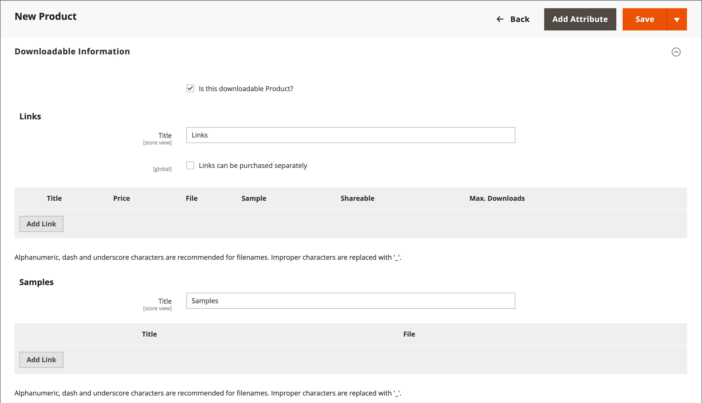
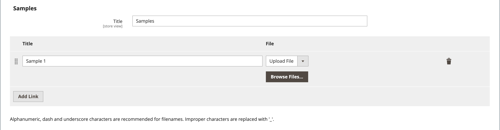

# 다운로드 가능한 제품

다운로드 가능한 제품은 eBook, 음악, 비디오, 소프트웨어 애플리케이션 또는 업데이트와 같이 파일로 제공할 수 있는 모든 제품이 될 수 있습니다. 판매용 앨범을 제공하고 각 곡을 개별적으로 판매할 수 있습니다. 다운로드 가능한 제품을 사용하여 제품 카탈로그의 전자 버전을 게재할 수도 있습니다.

구매 후까지 다운로드를 사용할 수 없으므로 책의 발췌, 오디오 파일의 클립 또는 비디오의 트레일러와 같은 샘플을 제공할 수 있습니다. 샘플은 고객이 제품을 구매하기 전에 시도할 수 있는 것입니다. 다운로드할 수 있는 파일은 서버 또는 다른 서버에서 업로드할 수 있습니다.

{width="700" zoomable="yes"}

다운로드 가능한 제품은 고객이 계정에 로그인하여 링크를 받거나 이메일로 전송하여 다른 사용자와 공유하도록 구성할 수 있습니다. 구성에 다운로드 사용 가능 전 주문 상태, 기본값 및 기타 전달 옵션이 설정되어 있습니다. 다운로드 가능한 카탈로그 추가를 계획할 때 다음 사항에 유의하십시오.

- 다운로드 가능한 제품은 서버에 업로드하거나 인터넷상의 다른 서버에서 연결할 수 있습니다.

- 고객이 제품을 다운로드할 수 있는 횟수를 결정할 수 있습니다.

- 다운로드 가능한 제품을 구입하는 고객은 체크아웃을 수행하기 전에 로그인해야 합니다.

- 다운로드 가능한 제품의 배달은 주문이 다음 중 하나에 속할 때 이루어질 수 있습니다. `Pending` 또는 `Invoiced` 상태.

- 다운로드 가능한 제품이 배송되지 않으므로 _배송_ 장바구니에 다운로드 가능한 제품만 포함되어 있는 경우 체크아웃 단계를 건너뜁니다.

## 다운로드 옵션 구성

다운로드 가능한 구성 설정은 다운로드 가능한 제품에 대한 기본값과 배달 옵션을 결정하고 게스트가 다운로드를 구매할 수 있는지 여부를 지정합니다.

1. 다음에서 _관리자_ 사이드바, 이동 **[!UICONTROL Stores]** > _[!UICONTROL Settings]_>**[!UICONTROL Configuration]**.

1. 왼쪽 패널에서 를 확장합니다. **[!UICONTROL Catalog]** 및 선택 **[!UICONTROL Catalog]** 밑에.

1. 확장  다음 _[!UICONTROL Downloadable Product Options]_섹션.

   {width="700" zoomable="yes"}

   이러한 구성 옵션에 대한 자세한 목록이 필요하면 를 참조하십시오. [_다운로드 가능한 제품 옵션_](../configuration-reference/catalog/catalog.md#downloadable-product-options) 다음에서 _구성 참조_.

1. 다운로드를 사용할 수 있을 때 주문 프로세스의 상태를 확인하려면 을(를) 설정합니다. **[!UICONTROL Order Item Status to Enable Downloads]** 다음 중 하나를 수행합니다.

   - `Pending`
   - `Invoiced`

1. 단일 고객이 다운로드할 수 있는 다운로드 수에 대한 기본 제한을 설정하려면 **[!UICONTROL Default Maximum Number of Downloads]**.

1. 설정 **[!UICONTROL Shareable]** 다음 중 하나를 수행합니다.

   - `Yes` - 고객이 다운로드 링크를 다른 사용자에게 이메일로 보낼 수 있습니다.
   - `No` - 고객이 자신의 계정에 로그인하여 다운로드 링크에 액세스하도록 함으로써 고객이 다른 사용자와 다운로드 링크를 공유하지 못하도록 합니다.

1. 대상 **[!UICONTROL Default Sample Title]**&#x200B;을 클릭하고 샘플 선택 항목 위에 표시할 제목을 입력합니다.

   {width="400"}

1. 대상 **[!UICONTROL Default Link Title]**&#x200B;다운로드 링크에 사용할 기본 텍스트를 입력합니다.

1. 다운로드 링크를 새 브라우저 창에서 열려면 를 설정합니다. **[!UICONTROL Opens Links in New Window]** 끝 `Yes`.

   이 설정은 스토어에 대한 브라우저 창을 열어 두는 데 사용됩니다.

1. 다운로드 가능한 콘텐츠가 전달되는 방법을 결정하려면 을 설정합니다. **[!UICONTROL Use Content Disposition]** 다음 중 하나를 수행합니다.

   - `Attachment` - 다운로드 링크를 첨부 파일로 이메일로 전달합니다.
   - `Inline` - 다운로드 링크를 웹 페이지의 링크로 전달합니다.

1. 구매자가 다운로드를 구매하기 전에 고객 계정을 등록하고 로그인하도록 하려면 를 설정합니다. **[!UICONTROL Disable Guest Checkout if Cart Contains Downloadable Items]** 끝 `Yes`.

1. 완료되면 다음을 클릭하십시오. **[!UICONTROL Save Config]**.

## 다운로드 가능한 제품 만들기

다음은 를 사용하여 다운로드 가능한 제품을 만드는 프로세스를 보여 주는 지침입니다 [제품 템플릿](attribute-sets.md), 필수 필드 및 기본 설정. 각 필수 필드는 빨간색 별표(`*`). 기본 사항을 완료하면 필요에 따라 다른 제품 설정을 완료할 수 있습니다.

>[!NOTE]
>
>다운로드 가능한 파일 이름에는 문자와 숫자가 포함될 수 있습니다. 단어 사이의 공백을 나타내는 데 대시 또는 밑줄 문자를 사용할 수 있습니다. 파일 이름에 잘못된 문자가 있으면 밑줄로 바꿉니다.

### 1단계: 제품 유형 선택

1. 다음에서 _관리자_ 사이드바, 이동 **[!UICONTROL Catalog]** > **[!UICONTROL Products]**.

1. 다음에서 _[!UICONTROL Add Product]_( {width="25"} ) 오른쪽 상단의 메뉴 아래에서 `Downloadable Product`.

   {width="700" zoomable="yes"}

### 2단계: 속성 세트 선택

샘플 데이터에는 [속성 집합](attribute-sets.md) 호출됨 _다운로드 가능_ 다운로드 가능한 제품에 대한 특수 필드가 있습니다. 제품을 저장하기 전에 기존 템플릿을 사용하거나 다른 템플릿을 만들 수 있습니다.

제품의 템플릿으로 사용되는 속성 세트를 선택하려면 다음 중 하나를 수행합니다.

- 대상 **[!UICONTROL Search]**&#x200B;속성 세트의 이름을 입력합니다.

- 목록에서 `Downloadable` 속성 집합입니다.

양식이 변경 사항을 반영하도록 업데이트됩니다.

{width="600" zoomable="yes"}

### 3단계: 필요한 설정 완료

1. 다음을 입력합니다. **[!UICONTROL Product Name]**.

1. 기본값 적용 **[!UICONTROL SKU]** 제품 이름을 기반으로 하거나 다른 이름을 입력합니다.

1. 제품 입력 **[!UICONTROL Price]**.

1. 제품이 아직 게시할 준비가 되지 않았으므로 을(를) 설정합니다. **[!UICONTROL Enable Product]** 끝 `No`.

1. 클릭 **[!UICONTROL Save]** 계속합니다.

   제품이 저장되면 [스토어 뷰](introduction.md#product-scope) 선택기는 왼쪽 위 모서리에 나타납니다.

1. 다음을 선택합니다. **[!UICONTROL Store View]** 제품을 사용할 수 있는 위치.

   {width="600" zoomable="yes"}

### 4단계: 기본 설정 완료

1. 설정 **[!UICONTROL Tax Class]** 다음 중 하나를 수행합니다.

   - `None`
   - `Taxable Goods`

1. 다음을 입력합니다. **[!UICONTROL Quantity]** 재고에 있는 제품의.

   다음 사항에 주의하십시오.

   - 기본적으로, **[!UICONTROL Stock Status]** 이(가) (으)로 설정됨 `Out of Stock`.

   - 다운로드 가능한 제품이 배송되지 않으므로 **[!UICONTROL Weight]** 필드는 사용되지 않습니다. 이 기능을 활성화하면 [단순 제품](product-create-simple.md) 및 _이 제품은 다운로드 가능한 제품인가요?_ 탭을 사용할 수 없습니다.

   >[!NOTE]
   >
   >을 활성화한 경우 [Inventory management](../inventory-management/introduction.md), 단일 소스 판매자가 이 섹션에서 수량을 설정합니다. 다중 소스 판매자는 소스 섹션에서 소스 및 수량을 추가합니다. 다음을 참조하십시오 _출처 및 수량 지정(Inventory management)_ 섹션.

1. 기본값 적용 **[!UICONTROL Visibility]** 설정 `Catalog, Search`.

1. 에서 제품을 피쳐링하려면 [신제품 목록](../content-design/widget-new-products-list.md)를 선택하고 **[!UICONTROL Set Product as New]** 확인란.

1. 할당하려면 _[!UICONTROL Categories]_제품에 대해&#x200B;**[!UICONTROL Select…]**확인란을 선택하고 다음 중 하나를 수행합니다.

   **기존 범주 선택**:

   - 일치하는 항목을 찾을 때까지 상자에 입력을 시작합니다.

   - 할당할 각 범주의 확인란을 선택합니다.

   **범주 만들기**:

   - 클릭 **[!UICONTROL New Category]**.

   - 다음을 입력합니다. **[!UICONTROL Category Name]** 및 선택 **[!UICONTROL Parent Category]**: 내에서 해당 위치를 결정합니다 [메뉴 구조](category-root.md).

   - 클릭 **[!UICONTROL Create Category]**.

1. 설정 **[!UICONTROL Format]** 다음 중 하나를 수행합니다.

   - `Download`
   - `DVD`

   필요한 경우 를 편집할 수 있습니다. [속성](attribute-product-create.md) 을 클릭하여 값을 더 추가합니다.

   제품을 설명하는 추가 속성이 있을 수 있습니다. 선택 항목은 속성 세트에 따라 다르며 나중에 완료할 수 있습니다.

#### 출처 및 수량 지정([!DNL Inventory Management])

{{$include /help/_includes/inventory-assign-sources.md}}

### 5단계: 다운로드 가능한 정보 완료

아래로 스크롤하고 확장합니다.  다음 _[!UICONTROL Downloadable Information]_섹션을 선택한 다음&#x200B;**[!UICONTROL Is this downloadable product?]**확인란.

활성화하면 _[!UICONTROL Downloadable Information]_섹션에는 두 개의 부품이 있습니다. 첫 번째 부분에서는 각 다운로드 링크에 대해 설명하고 두 번째 부분에서는 각 샘플 파일에 대해 설명합니다. 이러한 옵션 중 대부분에 대한 기본값은 [구성](#configure-the-download-options).

{width="600" zoomable="yes"}

#### 링크 완료

1. 다음에서 _[!UICONTROL Links]_섹션에서 다음을 입력합니다.**[!UICONTROL Title]**를 다운로드 링크의 제목으로 사용합니다.

1. 해당하는 경우 다음을 선택합니다. **[!UICONTROL Links can be purchased separately]** 확인란.

1. 클릭 **[!UICONTROL Add Link]** 다음을 수행합니다.

   - 다음을 입력합니다. **[!UICONTROL Title]** 및 **[!UICONTROL Price]** 다운로드.

   - 두 항목 모두 **[!UICONTROL File]** 및 **[!UICONTROL Sample]** 파일을 다운로드하려면 다음 배포 방법 중 하나를 선택하십시오.

      - `Upload File` - 이 방법을 선택하여 서버에 배포 파일을 업로드합니다. 파일을 찾아서 업로드하도록 선택합니다.
      - `URL` - URL에서 배포 파일에 액세스하려면 이 방법을 선택합니다. 다운로드 파일의 전체 URL을 입력합니다.

   >[!NOTE]
   >
   >외부 리소스에 대한 링크를 다운로드 가능한 제품으로 사용할 수 없습니다. 유효한 링크 도메인은 `env.php` 파일(참조) [env.php 참조](https://experienceleague.adobe.com/docs/commerce-operations/configuration-guide/files/config-reference-envphp.html) 다음에서 _구성 안내서_).

   - 설정 **[!UICONTROL Shareable]** 다음 중 하나를 수행합니다.

      - `No` - 고객이 계정에 로그인하여 다운로드 링크에 액세스해야 합니다.

      - `Yes` - 고객이 다른 사용자와 공유할 수 있는 링크를 이메일로 보냅니다.

      - `Use Config` - 다음에 지정된 메서드를 사용합니다. [다운로드 가능한 제품 옵션](../configuration-reference/catalog/catalog.md) 구성.

   - 다음 중 하나를 수행합니다.

      - 고객당 다운로드를 제한하려면 최대 다운로드 수를 입력합니다. **[!UICONTROL Max. Downloads]**.
      - 무제한 다운로드를 허용하려면 **[!UICONTROL Unlimited]** 확인란.

   {width="600" zoomable="yes"}

1. 다른 링크를 추가하려면 **[!UICONTROL Add Link]** 이 단계를 반복합니다.

#### 샘플 작성

1. 다음에서 _[!UICONTROL Samples]_섹션에서 다음을 입력합니다.**[!UICONTROL Title]**샘플 머리글로 사용하려는 경우

1. 각 샘플에 대한 정보를 완료하려면 **[!UICONTROL Add Link]**.

   {width="600" zoomable="yes"}

1. 다음과 같이 링크 세부 사항을 완료합니다.

   - 다음을 입력합니다. **[!UICONTROL Title]** 개별 샘플.

   - 다음 분배 방법 중 하나를 선택합니다.

      - `Upload File` - 이 방법을 선택하여 서버에 배포 파일을 업로드합니다. 파일을 찾아서 업로드하도록 선택합니다.
      - `URL` - URL에서 배포 파일에 액세스하려면 이 방법을 선택합니다. 다운로드 파일의 전체 URL을 입력합니다.

   - 다른 샘플을 추가하려면 **[!UICONTROL Add Link]** 이 단계를 반복합니다.

   - 샘플 순서를 변경하려면 _순서 변경_ (  ) 아이콘을 클릭하고 샘플을 새 위치로 드래그합니다.

### 6단계: 제품 정보 작성

아래로 스크롤하여 필요에 따라 다음 섹션의 정보를 작성합니다.

- [콘텐츠](product-content.md)
- [이미지 및 비디오](product-images-and-video.md)
- [검색 엔진 최적화](product-search-engine-optimization.md)
- [관련 제품, 상향 판매 및 교차 판매](related-products-up-sells-cross-sells.md)
- [사용자 정의 가능한 옵션](settings-advanced-custom-options.md)
- [웹 사이트의 제품](settings-basic-websites.md)
- [디자인](settings-advanced-design.md)
- [선물 옵션](product-gift-options.md)

### 7단계: 제품 게시

제품을 카탈로그에 게시할 준비가 되었으면 을 설정합니다. **[!UICONTROL Enable Product]** 끝 `Yes` 다음 중 하나를 수행합니다.

**방법 1:** 저장 및 미리 보기

- 오른쪽 위 모서리에서 을(를) 클릭합니다. **[!UICONTROL Save]**.

- 스토어에서 제품을 보려면 **[!UICONTROL Customer View]** 다음에 있음 _관리자_ (  ) 메뉴 아래의 제품에서 사용할 수 있습니다.

  저장소가 새 브라우저 탭에서 열립니다.

  {width="600" zoomable="yes"}

**방법 2:** 저장 및 닫기

다음에서 _[!UICONTROL Save]_( {width="25"} ) 메뉴, 선택&#x200B;**[!UICONTROL Save & Close]**.

## Storefront 경험

고객 계정 대시보드에서 _[!UICONTROL My Downloadable Products]_다운로드 가능한 제품의 각 순서에 대한 페이지 링크입니다. 주문이 완료되면 고객의 계정에서 다운로드를 사용할 수 있습니다.

{width="700" zoomable="yes"}

다음 표에서는 _내 다운로드 가능한 제품_ 값:

| 열 | 설명 |
|--- |--- |
| [!UICONTROL Order#] | 다음 [주문](../stores-purchase/orders.md) (다운로드 가능한 제품을 구입한 경우) 주문 세부 사항에 대한 링크를 제공합니다. |
| [!UICONTROL Date] | 주문 제작일. |
| [!UICONTROL Title] | 주문과 함께 구입한 다운로드 가능한 제품의 이름입니다. 다운로드 가능한 제품에 대한 링크를 제공합니다. |
| [!UICONTROL Status] | 주문 처리 상태. |
| [!UICONTROL Remaining Downloads] | 다운로드한 제품에 대해 사용 가능한 다운로드 수입니다. |

_**계정 대시보드에서 제품 파일을 다운로드하려면**_

1. 계정 대시보드에서 고객이 선택 **[!UICONTROL My Downloadable Products]**.

1. 목록에서 주문을 찾고 제목 뒤에 있는 링크를 클릭합니다.

1. 다운로드 창의 오른쪽 아래 모서리에서 _다운로드_ 아이콘.

1. 파일을 다운로드 위치에서 찾아 원하는 위치에 저장합니다.
