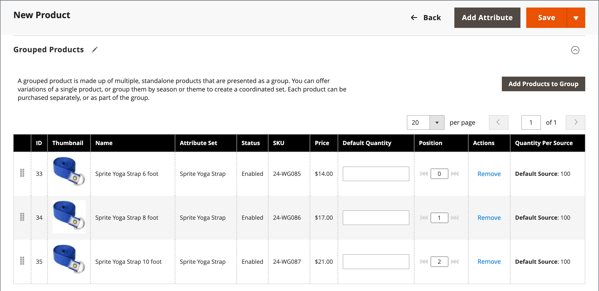

# 그룹화된 제품

그룹화된 제품은 그룹으로 표시되는 간단한 독립 실행형 제품으로 구성됩니다. 단일 제품의 변형을 제공하거나 계절 또는 테마별로 그룹화할 수 있습니다. 그룹화된 제품을 제시하면 고객이 추가 품목을 구매할 수 있는 인센티브를 창출할 수 있다. 그룹화된 제품은 제품의 변형을 제공하고 모두 동일한 페이지에 나열하는 쉬운 방법을 제공합니다.

예를 들어, 오픈 스톡 플랫웨어를 판매하고 정식 위치 설정에 사용되는 모든 유형의 기기를 나열할 수 있습니다. 일부는 여러 개의 샐러드 포크, 생선 포크, 디너 포크, 디너 나이프, 생선 칼, 버터 나이프, 수프 숟가락, 디저트 숟가락을 주문하기도 합니다. 다른 손님들은 간단한 포크와 나이프, 스푼 등을 주문하실 수도 있습니다. 고객은 각 품목을 원하는 수만큼 주문할 수 있습니다.

그룹으로 제시되지만 그룹의 각 제품은 별도의 품목으로 구매됩니다. 장바구니에서 각 품목과 구매 수량은 별도의 라인 품목으로 표시됩니다.

다음 지침은 [제품 템플릿](attribute-sets.md), 필수 필드 및 기본 설정을 사용하여 그룹화된 제품을 만드는 프로세스를 보여 줍니다. 각 필수 필드는 빨간색 별표(`*`)로 표시되어 있습니다. 기본 사항을 완료하면 필요에 따라 다른 제품 설정을 완료할 수 있습니다.

{width="700" zoomable="yes"}

## 1단계: 제품 유형 선택

1. _관리자_ 사이드바에서 **[!UICONTROL Catalog]** > **[!UICONTROL Products]**(으)로 이동합니다.

1. 오른쪽 상단의 _[!UICONTROL Add Product]_( {width="25"}) 메뉴에서&#x200B;**[!UICONTROL Grouped Product]**을(를) 선택합니다.

   {width="700" zoomable="yes"}

## 2단계: 속성 세트 선택

제품의 템플릿으로 사용되는 [특성 집합](attribute-sets.md)을 선택하려면 다음 중 하나를 실행하십시오.

- 검색하려면 **[!UICONTROL Attribute Set]**&#x200B;의 이름을 입력하십시오.
- 목록에서 사용할 속성 세트를 선택합니다.

양식이 변경 사항을 반영하도록 업데이트됩니다.

{width="600" zoomable="yes"}

필요한 속성이 없는 경우 제품을 만드는 동안 새 속성을 추가할 수 있습니다.

- 오른쪽 상단에서 **[!UICONTROL Add Attribute]**&#x200B;을(를) 클릭합니다.
- 새 특성을 정의합니다([제품에 특성 추가](product-attributes-add.md) 참조).

  {width="600" zoomable="yes"}

제품에 기존 특성을 추가하려면 [필터 컨트롤](../getting-started/admin-grid-controls.md)을 사용하여 표에서 특성을 찾고 다음을 수행합니다.

- 추가할 각 속성의 첫 번째 열에서 확인란을 선택합니다.
- **[!UICONTROL Add Selected]**&#x200B;을(를) 클릭합니다.

## 3단계: 필요한 설정 완료

1. **[!UICONTROL Product Name]** 입력.

1. 제품 이름을 기반으로 하는 기본 **[!UICONTROL SKU]**&#x200B;을(를) 사용하거나 다른 이름을 입력하십시오.

   값이 그룹을 구성하는 개별 제품에서 파생되었으므로 **[!UICONTROL Quantity]** 필드를 사용할 수 없습니다.

   그룹화된 제품은 카탈로그에 자체 가격이 없습니다. 그룹화된 제품 가격은 그룹에 포함된 개별 제품의 가격에서 파생됩니다.

1. 제품을 아직 게시할 준비가 되지 않았으므로 **[!UICONTROL Enable Product]**&#x200B;을(를) `No`(으)로 설정합니다().

1. **[!UICONTROL Save]**&#x200B;을(를) 클릭하고 계속합니다.

   제품을 저장하면 페이지 상단에 제품 이름이 표시되고 왼쪽 상단에 [보기 저장](introduction.md#product-scope) 선택기가 표시됩니다.

1. 제품을 사용할 수 있는 **[!UICONTROL Store View]**&#x200B;을(를) 선택하십시오.

   {width="600" zoomable="yes"}

## 4단계: 기본 설정 완료

1. `In Stock`의 **[!UICONTROL Stock Status]** 설정을 수락합니다.

1. 제품에 **[!UICONTROL Categories]**&#x200B;을(를) 할당하려면 **[!UICONTROL Select…]** 상자를 클릭하고 다음 중 하나를 수행합니다.

   **기존 범주 선택:**

   - 일치하는 항목을 찾을 때까지 상자에 입력을 시작합니다.

   - 할당할 카테고리의 확인란을 선택합니다.

   **범주 만들기:**

   - **[!UICONTROL New Category]**&#x200B;을(를) 클릭합니다.

   - **[!UICONTROL Category Name]**&#x200B;을(를) 입력하고 메뉴 구조에서 위치를 결정하는 **[!UICONTROL Parent Category]**&#x200B;을(를) 선택합니다.

   - **[!UICONTROL Create Category]**&#x200B;을(를) 클릭합니다.

1. `Catalog, Search`의 **[!UICONTROL Visibility]** 설정을 수락합니다.

1. [새 제품 목록](../content-design/widget-new-products-list.md)에 제품을 포함하려면 일정에서 **[!UICONTROL Set Product as New]** **[!UICONTROL from]** 및 **[!UICONTROL to]** 날짜를 선택하세요.

1. **[!UICONTROL Country of Manufacture]** 선택.

   제품을 설명하는 추가적인 개별 속성이 있을 수 있습니다. 선택 내용은 속성 집합에 따라 달라지므로 나중에 완료할 수 있습니다.

## 5단계: 그룹에 제품 추가

1. **[!UICONTROL Grouped Products]** 섹션까지 아래로 스크롤한 다음 **[!UICONTROL Add Products to Group]**&#x200B;을(를) 클릭합니다.

   {width="600" zoomable="yes"}

1. 필요한 경우 [필터](../getting-started/admin-grid-controls.md)를 사용하여 그룹에 포함할 제품을 찾으십시오.

1. 목록에서 그룹에 포함할 각 항목의 확인란을 선택합니다.

   >[!NOTE]
   >
   >구성 가능한 옵션이 없는 간단하고 다운로드 가능한 가상 제품만 하위 제품으로 그룹화할 수 있습니다. 다른 제품 유형은 선택 목록에 표시되지 않습니다.

   {width="600" zoomable="yes"}

1. 제품 그룹에 추가하려면 **[!UICONTROL Add Selected Products]**&#x200B;을(를) 클릭합니다.

   선택한 제품이 _[!UICONTROL Grouped Products]_섹션에 표시됩니다.

   [Inventory management](../inventory-management/sources-stocks.md)을(를) 가진 다중 Source 판매자의 경우, 그리드에는 각 할당된 원본 및 재고 금액이 있는 **[!UICONTROL Quantity per Source]** 열이 포함되어 있습니다.

   {width="600" zoomable="yes"}

1. 모든 항목에 대해 **[!UICONTROL Default Quantity]**&#x200B;을(를) 입력하십시오.

1. 제품 순서를 변경하려면 첫 번째 열에서 _순서 변경_ 아이콘()을 선택하고 제품을 목록의 새 위치로 끕니다.

1. 그룹에서 제품을 제거하려면 **[!UICONTROL Remove]**&#x200B;을(를) 클릭합니다.

## 5단계: 제품 정보 작성

필요에 따라 다음 섹션의 정보를 작성합니다.

- [콘텐츠](product-content.md)
- [이미지 및 비디오](product-images-and-video.md)
- [검색 엔진 최적화](product-search-engine-optimization.md)
- [관련 제품, 상향 판매 및 교차 판매](related-products-up-sells-cross-sells.md)
- [사용자 정의 가능한 옵션](settings-advanced-custom-options.md)
- [웹 사이트의 제품](settings-basic-websites.md)
- [디자인](settings-advanced-design.md)
- [선물 옵션](product-gift-options.md)

## 6단계: 제품 Publish

1. 제품을 카탈로그에 게시할 준비가 되면 **[!UICONTROL Enable Product]**&#x200B;을(를) `Yes`(으)로 설정하십시오.

1. 다음 중 하나를 수행합니다.

   **메서드 1:** 저장 및 미리 보기

   - 오른쪽 상단에서 **[!UICONTROL Save]**&#x200B;을(를) 클릭합니다.

   - 스토어에서 제품을 보려면 _관리자_( ) 메뉴에서 **[!UICONTROL Customer View]**&#x200B;을(를) 선택하십시오.

     저장소가 새 브라우저 탭에서 열립니다.

     {width="700" zoomable="yes"}

   **메서드 2:** 저장 및 닫기

   - _[!UICONTROL Save]_( {width="25"}) 메뉴에서&#x200B;**[!UICONTROL Save & Close]**을(를) 선택합니다.

## 7단계: 장바구니 썸네일 구성(선택 사항)

그룹의 각 제품에 대해 다른 이미지가 있는 경우 장바구니 썸네일에 올바른 이미지를 사용하도록 구성을 설정할 수 있습니다.

1. _관리자_ 사이드바에서 **[!UICONTROL Stores]** > _[!UICONTROL Settings]_>**[!UICONTROL Configuration]**(으)로 이동합니다.

1. 왼쪽 패널에서 **[!UICONTROL Sales]**&#x200B;을(를) 확장하고 **[!UICONTROL Checkout]**&#x200B;을(를) 선택합니다.

1. **[!UICONTROL Shopping Cart]**&#x200B;에서 을 확장합니다.

   이러한 구성 옵션의 자세한 목록을 보려면 _구성 참조_&#x200B;에서 [장바구니](../configuration-reference/sales/checkout.md#shopping-cart)를 참조하십시오.

1. **[!UICONTROL Grouped Product Image]**&#x200B;을(를) `Product Thumbnail Itself`(으)로 설정합니다.

   {width="600" zoomable="yes"}

   필요한 경우 **[!UICONTROL Use system value]** 확인란의 선택을 취소하여 이 옵션을 설정합니다.

1. **[!UICONTROL Save Config]**&#x200B;을(를) 클릭합니다.

## 기억해야 할 사항

- 그룹화된 제품은 기본적으로 간단한 관련 제품의 컬렉션입니다.

- 그룹화된 하위 제품은 간단하거나 다운로드할 수 있거나 가상 제품 **[!UICONTROL without custom options]**&#x200B;일 수 있습니다.

- 구매한 각 항목은 그룹의 일부가 아니라 장바구니에 개별적으로 표시됩니다.

- 그룹화된 제품은 카탈로그에 자체 가격이 없습니다. 그룹화된 제품 가격은 그룹에 포함된 개별 제품의 가격에서 파생됩니다.

- 장바구니의 썸네일 이미지는 그룹화된 상위 제품 또는 관련 제품의 이미지를 표시하도록 설정할 수 있습니다.
