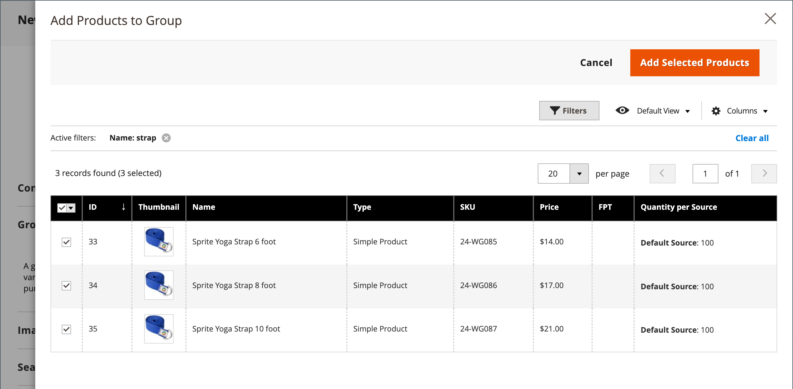

# 그룹화된 제품

그룹화된 제품은 그룹으로 표시되는 간단한 독립 실행형 제품으로 구성됩니다. 단일 제품의 변형을 제공하거나 계절 또는 테마별로 그룹화할 수 있습니다. 그룹화된 제품을 제시하면 고객이 추가 품목을 구매할 수 있는 인센티브를 창출할 수 있다. 그룹화된 제품은 제품의 변형을 제공하고 모두 동일한 페이지에 나열하는 쉬운 방법을 제공합니다.

예를 들어, 오픈 스톡 플랫웨어를 판매하고 정식 위치 설정에 사용되는 모든 유형의 기기를 나열할 수 있습니다. 일부는 여러 개의 샐러드 포크, 생선 포크, 디너 포크, 디너 나이프, 생선 칼, 버터 나이프, 수프 숟가락, 디저트 숟가락을 주문하기도 합니다. 다른 손님들은 간단한 포크와 나이프, 스푼 등을 주문하실 수도 있습니다. 고객은 각 품목을 원하는 수만큼 주문할 수 있습니다.

그룹으로 제시되지만 그룹의 각 제품은 별도의 품목으로 구매됩니다. 장바구니에서 각 품목과 구매 수량은 별도의 라인 품목으로 표시됩니다.

다음 지침은 [제품 템플릿](attribute-sets.md), 필수 필드 및 기본 설정. 각 필수 필드는 빨간색 별표(`*`). 기본 사항을 완료하면 필요에 따라 다른 제품 설정을 완료할 수 있습니다.

{width="700" zoomable="yes"}

## 1단계: 제품 유형 선택

1. 다음에서 _관리자_ 사이드바, 이동 **[!UICONTROL Catalog]** > **[!UICONTROL Products]**.

1. 다음에서 _[!UICONTROL Add Product]_( {width="25"} ) 오른쪽 상단의 메뉴 아래에서&#x200B;**[!UICONTROL Grouped Product]**.

   {width="700" zoomable="yes"}

## 2단계: 속성 세트 선택

을(를) 선택하려면 [속성 집합](attribute-sets.md) 제품에 대한 템플릿으로 사용되는 템플릿은 다음 중 하나를 수행합니다.

- 검색하려면 **[!UICONTROL Attribute Set]**.
- 목록에서 사용할 속성 세트를 선택합니다.

양식이 변경 사항을 반영하도록 업데이트됩니다.

{width="600" zoomable="yes"}

필요한 속성이 없는 경우 제품을 만드는 동안 새 속성을 추가할 수 있습니다.

- 오른쪽 위 모서리에서 을(를) 클릭합니다. **[!UICONTROL Add Attribute]**.
- 새 속성 정의(참조) [제품에 속성 추가](product-attributes-add.md)).

  {width="600" zoomable="yes"}

기존 속성을 제품에 추가하려면 [필터 컨트롤](../getting-started/admin-grid-controls.md) 그리드에서 속성을 찾아 다음을 수행합니다.

- 추가할 각 속성의 첫 번째 열에서 확인란을 선택합니다.
- 클릭 **[!UICONTROL Add Selected]**.

## 3단계: 필요한 설정 완료

1. 다음을 입력합니다. **[!UICONTROL Product Name]**.

1. 기본값 적용 **[!UICONTROL SKU]** 제품 이름을 기반으로 하거나 다른 이름을 입력합니다.

   다음 사항에 유의하십시오. **[!UICONTROL Quantity]** 값이 그룹을 구성하는 개별 제품에서 파생되었으므로 필드를 사용할 수 없습니다.

   그룹화된 제품은 카탈로그에 자체 가격이 없습니다. 그룹화된 제품 가격은 그룹에 포함된 개별 제품의 가격에서 파생됩니다.

1. 제품이 아직 게시할 준비가 되지 않았으므로 을(를) 설정합니다. **[!UICONTROL Enable Product]** 끝 `No` (  ).

1. 클릭 **[!UICONTROL Save]** 계속합니다.

   제품이 저장되면 페이지 상단에 제품 이름이 나타나고 [스토어 뷰](introduction.md#product-scope) 선택기는 왼쪽 위 모서리에 나타납니다.

1. 다음을 선택합니다. **[!UICONTROL Store View]** 제품을 사용할 수 있는 위치.

   {width="600" zoomable="yes"}

## 4단계: 기본 설정 완료

1. 수락 **[!UICONTROL Stock Status]** 설정 `In Stock`.

1. 할당하려면 **[!UICONTROL Categories]** 제품에 대해 **[!UICONTROL Select…]** 확인란을 선택하고 다음 중 하나를 수행합니다.

   **기존 범주 선택:**

   - 일치하는 항목을 찾을 때까지 상자에 입력을 시작합니다.

   - 할당할 카테고리의 확인란을 선택합니다.

   **카테고리 만들기:**

   - 클릭 **[!UICONTROL New Category]**.

   - 다음을 입력합니다. **[!UICONTROL Category Name]** 및 선택 **[!UICONTROL Parent Category]**&#x200B;를 설정하는 것이 좋습니다.

   - 클릭 **[!UICONTROL Create Category]**.

1. 수락 **[!UICONTROL Visibility]** 설정 `Catalog, Search`.

1. 에서 제품을 피쳐링하려면 [신제품 목록](../content-design/widget-new-products-list.md), 을(를) 선택합니다. **[!UICONTROL Set Product as New]** **[!UICONTROL from]** 및 **[!UICONTROL to]** 날짜입니다.

1. 다음을 선택합니다. **[!UICONTROL Country of Manufacture]**.

   제품을 설명하는 추가적인 개별 속성이 있을 수 있습니다. 선택 내용은 속성 집합에 따라 달라지므로 나중에 완료할 수 있습니다.

## 5단계: 그룹에 제품 추가

1. 아래로 스크롤하여 **[!UICONTROL Grouped Products]** 섹션 및 클릭 **[!UICONTROL Add Products to Group]**.

   {width="600" zoomable="yes"}

1. 필요한 경우 [필터](../getting-started/admin-grid-controls.md) 그룹에 포함할 제품을 찾습니다.

1. 목록에서 그룹에 포함할 각 항목의 확인란을 선택합니다.

   >[!NOTE]
   >
   >구성 가능한 옵션이 없는 간단하고 다운로드 가능한 가상 제품만 하위 제품으로 그룹화할 수 있습니다. 다른 제품 유형은 선택 목록에 표시되지 않습니다.

   {width="600" zoomable="yes"}

1. 제품 그룹에 추가하려면 **[!UICONTROL Add Selected Products]**.

   선택한 제품이 _[!UICONTROL Grouped Products]_섹션.

   다원 판매자용 [Inventory management](../inventory-management/sources-stocks.md), 격자에 다음이 포함됩니다. **[!UICONTROL Quantity per Source]** 각 지정된 출처 및 재고 재고 금액이 있는 열입니다.

   {width="600" zoomable="yes"}

1. 입력 **[!UICONTROL Default Quantity]** 모든 항목에 사용됩니다.

1. 제품의 순서를 변경하려면 _순서 변경_ 아이콘(  )을 클릭하여 제품을 목록의 새 위치로 끕니다.

1. 그룹에서 제품을 제거하려면 **[!UICONTROL Remove]**.

## 5단계: 제품 정보 작성

필요에 따라 다음 섹션의 정보를 작성합니다.

- [콘텐츠](product-content.md)
- [이미지 및 비디오](product-images-and-video.md)
- [검색 엔진 최적화](product-search-engine-optimization.md)
- [관련 제품, 상향 판매 및 교차 판매](related-products-up-sells-cross-sells.md)
- [사용자 정의 가능한 옵션](settings-advanced-custom-options.md)
- [웹 사이트의 제품](settings-basic-websites.md)
- [디자인](settings-advanced-design.md)
- [선물 옵션](product-gift-options.md)

## 6단계: 제품 게시

1. 제품을 카탈로그에 게시할 준비가 되었으면 을 설정합니다. **[!UICONTROL Enable Product]** 끝 `Yes`.

1. 다음 중 하나를 수행합니다.

   **방법 1:** 저장 및 미리 보기

   - 오른쪽 위 모서리에서 을(를) 클릭합니다. **[!UICONTROL Save]**.

   - 스토어에서 제품을 보려면 **[!UICONTROL Customer View]** 다음에 있음 _관리자_ (  ) 메뉴 아래의 제품에서 사용할 수 있습니다.

     저장소가 새 브라우저 탭에서 열립니다.

     {width="700" zoomable="yes"}

   **방법 2:** 저장 및 닫기

   - 다음에서 _[!UICONTROL Save]_( {width="25"} ) 메뉴, 선택&#x200B;**[!UICONTROL Save & Close]**.

## 7단계: 장바구니 썸네일 구성(선택 사항)

그룹의 각 제품에 대해 다른 이미지가 있는 경우 장바구니 썸네일에 올바른 이미지를 사용하도록 구성을 설정할 수 있습니다.

1. 다음에서 _관리자_ 사이드바, 이동 **[!UICONTROL Stores]** > _[!UICONTROL Settings]_>**[!UICONTROL Configuration]**.

1. 왼쪽 패널에서 를 확장합니다. **[!UICONTROL Sales]** 및 선택 **[!UICONTROL Checkout]**.

1. 확장  다음 **[!UICONTROL Shopping Cart]**.

   이러한 구성 옵션에 대한 자세한 목록이 필요하면 를 참조하십시오. [장바구니](../configuration-reference/sales/checkout.md#shopping-cart) 다음에서 _구성 참조_.

1. 설정 **[!UICONTROL Grouped Product Image]** 끝 `Product Thumbnail Itself`.

   {width="600" zoomable="yes"}

   필요한 경우 선택을 해제합니다. **[!UICONTROL Use system value]** 확인란을 선택하여 이 옵션을 설정합니다.

1. 클릭 **[!UICONTROL Save Config]**.

## 기억해야 할 사항

- 그룹화된 제품은 기본적으로 간단한 관련 제품의 컬렉션입니다.

- 그룹화된 하위 제품은 간단하거나, 다운로드할 수 있거나, 가상 제품일 수 있습니다 **[!UICONTROL without custom options]**.

- 구매한 각 항목은 그룹의 일부가 아니라 장바구니에 개별적으로 표시됩니다.

- 그룹화된 제품은 카탈로그에 자체 가격이 없습니다. 그룹화된 제품 가격은 그룹에 포함된 개별 제품의 가격에서 파생됩니다.

- 장바구니의 썸네일 이미지는 그룹화된 상위 제품 또는 관련 제품의 이미지를 표시하도록 설정할 수 있습니다.
