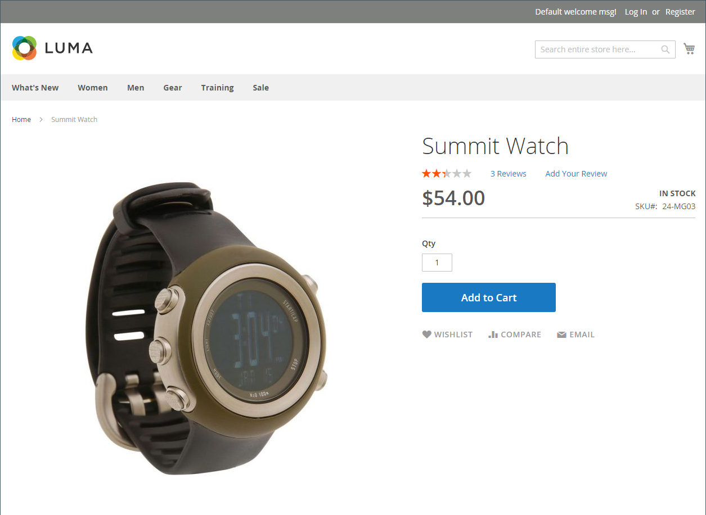
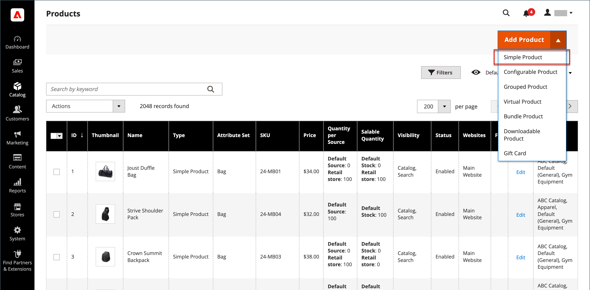

# 단순 제품

제품 유형의 강력한 기능을 활용하기 위한 핵심 중 하나는 간단한 독립형 제품을 사용할 시기를 학습하는 것입니다. 간단한 제품은 개별적으로 또는 그룹화되거나, 구성 가능하거나, 번들 제품의 일부로 판매할 수 있습니다. 사용자 지정 옵션이 있는 간단한 제품을 _복합 제품_&#x200B;이라고도 합니다.

다음 지침은 [제품 템플릿](attribute-sets.md), 필수 필드 및 기본 설정을 사용하여 간단한 제품을 만드는 프로세스를 보여 줍니다. 각 필수 필드는 빨간색 별표(`*`)로 표시되어 있습니다. 기본 사항을 완료하면 필요에 따라 다른 제품 설정을 완료할 수 있습니다.

{width="700" zoomable="yes"}

## 1단계: 제품 유형 선택

1. _관리자_ 사이드바에서 **[!UICONTROL Catalog]** > **[!UICONTROL Products]**(으)로 이동합니다.

1. 오른쪽 상단의 _[!UICONTROL Add Product]_( {width="25"}) 메뉴에서&#x200B;**[!UICONTROL Simple Product]**&#x200B;을(를) 선택합니다.

   {width="700" zoomable="yes"}

## 2단계: 속성 세트 선택

제품의 템플릿으로 사용되는 [특성 집합](attribute-sets.md)을 선택하려면 다음을 수행하십시오.

- **[!UICONTROL Attribute Set]** 필드를 클릭하고 특성 집합의 이름의 전체 또는 일부를 입력합니다.

- 표시된 목록에서 사용할 속성 세트를 선택합니다.

양식이 변경 사항을 반영하도록 업데이트됩니다.

{width="600" zoomable="yes"}

## 3단계: 필요한 설정 완료

1. **[!UICONTROL Product Name]** 입력.

1. 제품 이름을 기반으로 하는 기본 **[!UICONTROL SKU]**&#x200B;을(를) 사용하거나 다른 이름을 입력하십시오.

1. 제품 **[!UICONTROL Price]**&#x200B;을(를) 입력하십시오.

1. 제품을 아직 게시할 준비가 되지 않았으므로 **[!UICONTROL Enable Product]** 옵션을 `No`(으)로 설정하십시오.

1. **[!UICONTROL Save]**&#x200B;을(를) 클릭하고 계속합니다.

   제품을 저장하면 왼쪽 위 모서리에 [스토어 보기](introduction.md#product-scope) 선택기가 나타납니다.

1. 제품을 사용할 수 있는 **[!UICONTROL Store View]**&#x200B;을(를) 선택하십시오.

   {width="600" zoomable="yes"}

## 4단계: 기본 설정 완료

1. **[!UICONTROL Tax Class]**&#x200B;을(를) 다음 중 하나로 설정합니다.

   - `None`
   - `Taxable Goods`
   - `Refund Adjustments`
   - `Gift Options`
   - `Order Gift Wrapping`
   - `Item Gift Wrapping`
   - `Printed Gift Card`
   - `Reward Points`
   - `VAT Reduced`
   - `VAT Standard`

1. 재고가 있는 제품의 **[!UICONTROL Quantity]**&#x200B;을(를) 입력하십시오.

   기본적으로 **[!UICONTROL Stock Status]**&#x200B;은(는) `In Stock`(으)로 설정됩니다.

   >[!NOTE]
   >
   >[Inventory management](../inventory-management/introduction.md)을(를) 사용하도록 설정하면 단일 Source 판매자가 이 섹션에서 수량을 설정합니다. 다중 Source 판매자는 소스 섹션에서 소스 및 수량을 추가합니다. 다음 _소스 및 수량 할당(Inventory management)_ 섹션을 참조하십시오.

1. 제품의 **[!UICONTROL Weight]**&#x200B;을(를) 입력하십시오.

1. `Catalog, Search`의 기본 **[!UICONTROL Visibility]** 설정을 사용합니다.

1. 제품에 _[!UICONTROL Categories]_&#x200B;을(를) 할당하려면&#x200B;**[!UICONTROL Select…]**&#x200B;상자를 클릭하고 다음 중 하나를 수행합니다.

   **기존 범주 선택**:

   - 일치하는 항목을 찾을 때까지 상자에 입력을 시작합니다.

   - 할당할 각 범주의 확인란을 선택합니다.

   **범주 만들기**:

   - **[!UICONTROL New Category]**&#x200B;을(를) 클릭합니다.

   - **[!UICONTROL Category Name]**&#x200B;을(를) 입력하고 메뉴 구조에서 위치를 결정하는 **[!UICONTROL Parent Category]**&#x200B;을(를) 선택합니다.

   - **[!UICONTROL Create Category]**&#x200B;을(를) 클릭합니다.

1. [새 제품](../content-design/widget-new-products-list.md) 목록에 제품을 포함하려면 **[!UICONTROL Set Product as New]** 확인란을 선택하십시오.

1. **[!UICONTROL Country of Manufacture]** 선택.

제품을 설명하는 추가적인 개별 속성이 있을 수 있습니다. 선택 항목은 속성 세트에 따라 다르며 나중에 완료할 수 있습니다.

### 원본 및 수량 할당([!DNL Inventory Management])

{{$include /help/_includes/inventory-assign-sources.md}}

## 5단계: 제품 정보 작성

아래로 스크롤하여 필요에 따라 다음 섹션의 정보를 작성합니다.

- [콘텐츠](product-content.md)
- [이미지 및 비디오](product-images-and-video.md)
- [관련 제품, 상향 판매 및 교차 판매](related-products-up-sells-cross-sells.md)
- [검색 엔진 최적화](product-search-engine-optimization.md)
- [사용자 정의 가능한 옵션](settings-advanced-custom-options.md)
- [웹 사이트의 제품](settings-basic-websites.md)
- [디자인](settings-advanced-design.md)
- [선물 옵션](product-gift-options.md)

## 6단계: 제품 Publish

1. 제품을 카탈로그에 게시할 준비가 되면 **[!UICONTROL Enable Product]** 스위치를 `Yes`(으)로 설정하십시오.

1. 다음 중 하나를 수행합니다.

   - **메서드 1:** 저장 및 미리 보기

      - 오른쪽 상단에서 **[!UICONTROL Save]**&#x200B;을(를) 클릭합니다.

      - 스토어에서 제품을 보려면 _관리자_() 메뉴에서 **[!UICONTROL Customer View]**&#x200B;을(를) 선택하세요.

     저장소가 새 브라우저 탭에서 열립니다.

     {width="600" zoomable="yes"}

   - **메서드 2:** 저장 및 닫기

     _[!UICONTROL Save]_( {width="25"}) 메뉴에서&#x200B;**[!UICONTROL Save & Close]**&#x200B;을(를) 선택합니다.

## 기억해야 할 사항

- 간단한 제품은 구성 가능한 제품 유형, 번들 제품 유형 및 그룹화된 제품 유형에 포함될 수 있습니다.

- 단순 제품 구성은 특정 제품에 대해 구성 가능한 제품 구성을 무시합니다.

- 간단한 제품에는 다양한 유형의 입력이 있는 사용자 정의 옵션이 있을 수 있으므로 단일 SKU에서 다양한 제품 변형을 판매할 수 있습니다.
